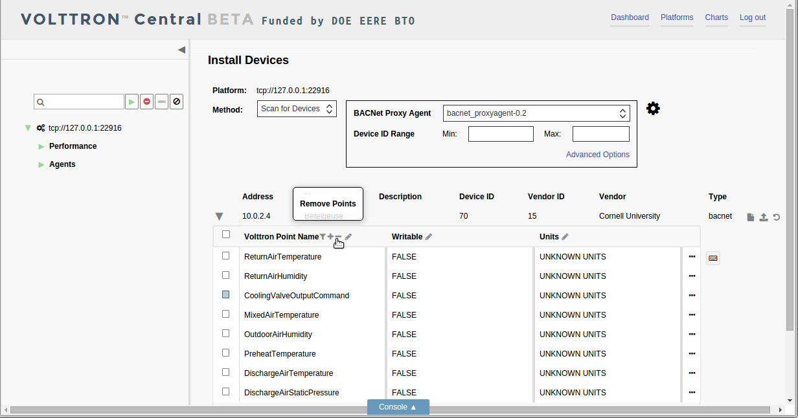

.. _Device-Configuration-in-VOLTTRON-Central:

========================================
Device Configuration in VOLTTRON Central
========================================

Devices in your network can be detected and configured through the VOLTTRON Central UI.  The current version of VOLTTRON
enables device detection and configuration for BACnet devices.  The following sections describe the processes involved
with performing scans to detect physical devices and get their points, and configuring them as virtual devices installed
on VOLTTRON instances.

-  `Launching Device Configuration <launching-device-configuration>`__
-  `Scanning for Devices <scanning-for-devices>`__
-  `Scanning for Points <scanning-for-points>`__
-  `Registry Configuration File <registry-configuration-file>`__
-  `Additional Attributes <additional-attributes>`__
-  `Quick Edit Features <quick-edit-features>`__
-  `Keyboard Commands <keyboard-commands>`__
-  `Registry Preview <registry-preview>`__
-  `Registry Configuration Options <registry-configuration-options>`__
-  `Reloading Device Points <reloading-device-points>`__
-  `Device Configuration Form <device-configuration-form>`__
-  `Configuring Sub-devices <configuring-sub-devices>`__
-  `Reconfiguring Devices <reconfiguring-devices>`__
-  `Exporting Registry Configuration Files <exporting-registry-configuration-files>`__

Launching Device Configuration
------------------------------

To begin device configuration in VOLTTRON Central, extend the side panel on the left and find the cogs button next to
the platform instance you want to add a device to.  Click the cogs button to launch the device configuration feature.

|Add Devices|

|Install Devices|

Currently the only method of adding devices is to conduct a scan to detect BACnet devices. A BACnet Proxy Agent must be
running in order to do the scan.  If more than one BACnet Proxy is installed on the platform, choose the one that will
be used for the scan.

The scan can be conducted using default settings that will search for all physical devices on the network.  However,
optional settings can be used to focus on specific devices or change the duration of the scan.  Entering a range of
device IDs will limit the scan to return only devices with IDs in that range.  Advanced options include the ability to
specify the IP address of a device to detect as well as the ability to change the duration of the scan from the default
of five seconds.

Scanning for Devices
--------------------

To start the scan, click the large cog button to the right of the scan settings.

|Start Scan|

Devices that are detected will appear in the space below the scan settings.  Scanning can be repeated at any time by
clicking the large cog button again.

|Devices Found|

Scanning for Points
-------------------

Another scan can be performed on each physical device to retrieve its available points.  This scan is initiated by
clicking the triangle next to the device in the list.  The first time the arrow is clicked, it initiates the scan.
After the points are retrieved, the arrow becomes a hide-and-show toggle button and won't re-initiate scanning the
device.

|Get Device Points|

After the points have been retrieved once, the only way to scan the same device for points again is to relaunch the
device configuration process from the start by clicking on the small cogs button next to the platform instance in the
panel tree.

Registry Configuration File
^^^^^^^^^^^^^^^^^^^^^^^^^^^

The registry configuration determines which points on the physical device will be associated with the virtual device
that uses that particular registry configuration.  The registry configuration determines which points' data will be
published to the message bus and recorded by the historian, and it determines how the data will be presented.

When all the points on the device have been retrieved, the points are loaded into the registry configuration editor.
There, the points can be modified and selected to go into the registry configuration file for a device.

Each row in the registry configuration editor represents a point, and each cell in the row represents an attribute of
the point.

Only points that have been selected will be included in the registry configuration file.  To select a point, check the
box next to the point in the editor.

|Select Point Before|

|Select Point During|

|Select Point After|

Type directly in a cell to change an attribute value for a point.

|Edit Points|

Additional Attributes
---------------------

The editor's default view shows the attributes that are most likely to be changed during configuration: the VOLTTRON
point name, the writable setting, and the units.  Other attributes are present but not shown in the default view.  To
see the entire set of attributes for a point, click the `Edit Point` button (the three dots) at the end of the point
row.

|Edit Point Button|

In the window that opens, point attributes can be changed by typing in the fields and clicking the Apply button. 

|Edit Point Dialog|

Checking or unchecking the `Show in Table` box for an attribute will add or remove it as a column in the registry
configuration editor.

Quick Edit Features
-------------------

Several quick-edit features are available in the registry configuration editor.

The list of points can be filtered based on values in the first column by clicking the filter button in the first
column's header and entering a filter term.

|Filter Points Button|

|Filter Set|

The filter feature allows points to be edited, selected, or deselected more quickly by narrowing down potentially large
lists of points.  However, the filter doesn't select points, and if the registry configuration is saved while a filter
is applied, any selected points not included in the filter will still be included in the registry file.

To clear the filter, click on the `Clear Filter` button in the filter popup.

|Clear Filter|

To add a new point to the points listed in the registry configuration editor, click on the `Add Point` button in the
header of the first column.

|Add New Point|

|Add Point Dialog|

Provide attribute values, and click the `Apply` button to add the new point, which will be appended to the bottom of the
list.

To remove points from the list, select the points and click the `Remove Points` button in the header of the first
column.

|Remove Points|

|Confirm Remove Points|

Each column has an `Edit Column` button in its header.

|Edit Columns|

Click on the button to display a popup menu of operations to perform on the column.  The options include inserting a
blank new column, duplicating an existing column, removing a column, or searching for a value within a column.

|Edit Column Menu|

A duplicate or new column has to be given a unique name. 

|Name Column|

|Duplicated Column|

To search for values in a column, choose the `Find and Replace` option in the popup menu.

|Find in Column|

Type the term to search for, and click the `Find Next` button to highlight all the matched fields in the column.

|Find Next|

Click the `Find Next` button again to advance the focus down the list of matched terms.

To quickly replace the matched term in the cell with focus, type a replacement term, and click on the `Replace` button.

|Replace in Column|

To replace all the matched terms in the column, click on the `Replace All` button. Click the `Clear Search` button to
end the search.

Keyboard Commands
-----------------

Some keyboard commands are available to expedite the selection or de-selection of points.  To initiate use of the
keyboard commands, strike the `Control` key on the keyboard. For keyboard commands to be activated, the registry
configuration editor has to have focus, which comes from interacting with it.  But the commands won't be activated if
the cursor is in a type-able field.

If the keyboard commands have been successfully activated, a faint highlight will appear over the first row in the
registry configuration editor.

|Start Keyboard Commands|

Keyboard commands are deactivated when the mouse cursor moves over the configuration editor.  If unintentional
deactivation occurs, strike the `Control` key again to reactivate the commands.

With keyboard commands activated, the highlighted row can be advanced up or down by striking the `up` or `down arrow` on
the keyboard.  A group of rows can be highlighted by striking the up or down arrow while holding down the `Shift` key.

|Keyboard Highlight|

To select the highlighted rows, strike the `Enter` key.

|Keyboard Select|

Striking the `Enter` key with rows highlighted will also deselect any rows that were already selected.

Click on the `Keyboard Shortcuts` button to show a popup list of the available keyboard commands.

|Keyboard Shortcuts Button|

|Keyboard Shortcuts|

Registry Preview
----------------

To save the registry configuration, click the `Save` button at the bottom of the registry configuration editor.

|Save Registry Button|

A preview will appear to let you confirm that the configuration is what you intended.

|Registry Preview Table|

The configuration also can be inspected in the comma-separated format of the actual registry configuration file. 

|Registry Preview CSV|

Provide a name for the registry configuration file, and click the `Save` button to save the file.

|Name Registry File|

|Registry Saved|

Registry Configuration Options
------------------------------

Different subsets of configured points can be saved from the same physical device and used to create separate registry
files for multiple virtual devices and sub-devices.  Likewise, a single registry file can be reused by multiple virtual
devices and sub-devices.

To reuse a previously saved registry file, click on the `Select Registry File (CSV)` button at the end of the physical
device's listing.

|Select Saved Registry File|

The `Previously Configured Registry Files` window will appear, and a file can be selected to load it into the registry
configuration editor.

|Saved Registry Selector|

Another option is to import a registry configuration file from the computer running the VOLTTRON Central web
application, if one has been saved to local storage connected to the computer.  To import a registry configuration file
from local storage, click on the `Import Registry File (CSV)` button at the end of the physical device's listing, and
use the file selector window to locate and load the file.

|File Import Button|

Reloading Device Points
-----------------------

Once a physical device has been scanned, the original points from the scan can be reloaded at any point during device
configuration by clicking on the `Reload Points From Device` button at the end of the device's listing.

|Reload Points|

Device Configuration Form
^^^^^^^^^^^^^^^^^^^^^^^^^

After the registry configuration file has been saved, the device configuration form appears.  Creating the device
configuration results in the virtual device being installed in the platform and determines the device's position in the
side panel tree.  It also contains some settings that determine how data is collected from the device.

|Configure Device Dialog|

After the device configuration settings have been entered, click the `Save` button to save the configuration and add the
device to the platform.

|Save Device Config|

|Device Added|

Configuring Sub-devices
-----------------------

After a device has been configured, sub-devices can be configured by pointing to their position in the ``Path``
attribute of the device configuration form.  But a sub-device can't be configured until its parent device has been
configured first.

|Subdevice Path|

|Subdevice 2|

As devices are configured, they're inserted into position in the side panel tree, along with their configured points.

|Device Added to Tree|

Reconfiguring Devices 
^^^^^^^^^^^^^^^^^^^^^

A device that's been added to a VOLTTRON instance can be reconfigured by changing its registry configuration or its
device configuration. To launch reconfiguration, click on the wrench button next to the device in the side panel tree.

|Reconfigure Device Button|

Reconfiguration reloads the registry configuration editor and the device configuration form for the virtual device.  The
editor and the form work the same way in reconfiguration as during initial device configuration.

|Reconfiguring Device|

The reconfiguration view shows the name, address, and ID of the physical device that the virtual device was configured
from.  It also shows the name of the registry configuration file associated with the virtual device as well as its
configured path.

A different registry configuration file can be associated with the device by clicking on the `Select Registry File
(CSV)` button or the `Import Registry File (CSV)` button.

The registry configuration can be edited by making changes to the configuration in the editor and clicking the `Save`
button.

To make changes to the device configuration form, click on the `File to Edit` selector and choose `Device Config`.

|Reconfigure Option Selector|

|Reconfigure Device Config|

Exporting Registry Configuration Files
--------------------------------------

The registry configuration file associated with a virtual device can be exported from the web browser to the computer's
local storage by clicking on the `File Export` Button in the device reconfiguration view.

|File Export Button|

.. |Add Devices| image:: files/01-add-devices.png

.. |Devices Found| image:: files/04-devices-found.png
.. |Get Device Points| image:: files/05-get-device-points.png

.. |Edit Point Button| image:: files/21-edit-point-button.png
.. |Edit Point Dialog| image:: files/22-edit-point-dialog.png
.. |Filter Points Button| image:: files/08-filter-points-button.png

