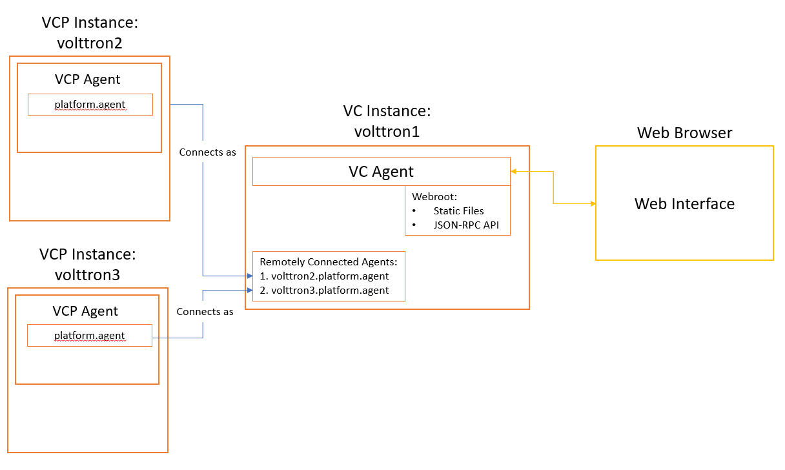

.. _VOLTTRON-Central:

====================================
VOLTTRON Central Management Overview
====================================

VOLTTRON Central is responsible for controlling multiple VOLTTRON instances with a single management instance.
The mnanaged VOLTTRON instances can be either local or remote. Each managed instance will have a VOLTTRON Central
Platform agent installed and running to interface with the primary VOLTTRON Central agent.

|VC-VCP Overview|

There is a :ref:`VOLTTRON Central Deployment Demo <VOLTTRON-Central-Deployment>` that will allow you to quickly setup
and see the current offerings of the interface.

VOLTTRON Central will allow you to:

-  See a list of platforms being managed.
-  Add and remove platforms.
-  Install, start and stop agents on the managed platforms.
-  Create dynamic graphs from the historians based upon data points.
-  Execute functions on remote platforms.

Volttron Central Agent
======================

The VOLTTRON Central (VC) agent serves a web-based management UI that interfaces with the
VOLTTRON Central web API.

VOLTTRON Central Platform Agent
===============================

The VOLTTRON Central Platform (VCP) Agent allows communication with a VOLTTRON Central instance.
Each VOLTTRON instance managed by VOLTTRON Central should have only one Platform Agent.
The Platform Agent must have the VIP identity of `platform.agent` which is specified as default by VOLTTRON
:ref:`known identities <VIP-Known-Identities>`.

.. toctree::

   volttron-central-agent
   volttron-central-platform
   vc-device-configuration-demo
   webservice-api

