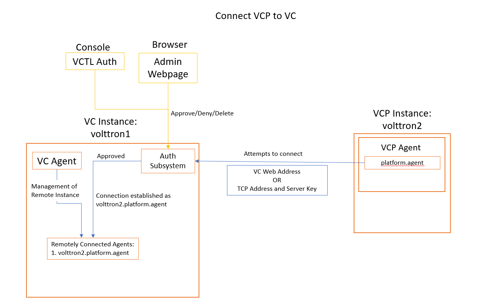

.. _VOLTTRON-Central-Platform-Agent:

===============================
Volttron Central Platform (VCP)
===============================

The VCP agent exposes a VOLTTRON instance to a Volttron Central (VC) agent. The VC
agent can either be on the same or a remote VOLTTRON instance. The VCP agent will,
once authenticated with the VC agent's instance, auto connect to the VC
agent's instance and register itself on startup. The VCP instance will attempt
to reconnect to the VC agent's instance if connection is disrupted.VCP has
many configuration options available that can be set via the configuration store.
An example config is provided below with information on these options.

Publish Specifications
----------------------

During connection to the VC agent's instance the instance-name from the VCP
will be used to connect to the VC agent's instance.  It will have the form
vcp-instancename with all invalid characters replaced with an underscore. See
:py:meth:`volttron.platform.agent.util.normalize_identity` for how the instance
name is normalized into a identity.

FAQ / Notes
-----------

* VCP agent has an identity of 'platform.agent'. This cannot be changed.
* There may only be a single agent connected to a VOLTTRON instance with the identiy of 'platform.agent'
* VCP will publish to VC under the topic platforms/vcp-(normalized instance name)/
* VC communicates through the :py:class:`vcplatform.vcconnection.VCConnection` rpc methods.
* VCP uses the  :py:class:`vcplatform.vcconnection.VCConnection` to connect with the VC agent's instance.

|VCP-VC Connection|

Configuration Options
---------------------

The following JSON configuration file shows all the options currently supported
by the VCP agent.  By default an empty config file is used.

.. code-block:: python

    {
        # The volttron-central-address, volttron-central-serverkey and
        # instance-name may be set in the VCP instance configuration file or
        # or as command line parameters to the VOLTTRON instance.
        #
        # The volttron-central-address is either an http address or a tcp
        # address.  If it is an http address vc must be running at the resolution
        # of http://ip:port/discovery/.  VCP will use the tcp address and
        # serverkey in the response payload to connect to the VC agent instance.
        #
        # If the specified address is a tcp address then the configuration
        # must also contain a volttron-central-serverkey.
        "volttron-central-address": "http://ip<host>:port" or "tcp://ip:port",

        # The serverkey of the VC agent's instance.
        "volttron-central-serverkey" "VC agent's instance serverkey",

        # interval at which VCP will attempt to connect to the VC agent's
        # instance when a disconnection occurs.
        "volttron-central-reconnect-interval": 5,

        # The name of instance to be sent to volttron central for displaying
        # on the interface.
        "instance-name": "name of instances (VC agent's instance ip address as default)",

        # VCP will publish health statistics of the instance at a specified
        # interval.
        "stats-publish-interval": 30,

        # The VCP provides a topic/replace mapping for the platform.  It is
        # available via rpc function so that sensitive information won't be
        # published through forwarding.
        #
        # The topic-replace-map is used to search/replace all of the topics
        # published from ForwardHistorians and other agents that connect with
        # external instances.
        "topic-replace-map": {
            "from": "to",
            "from1": "to1"
        }
    }

