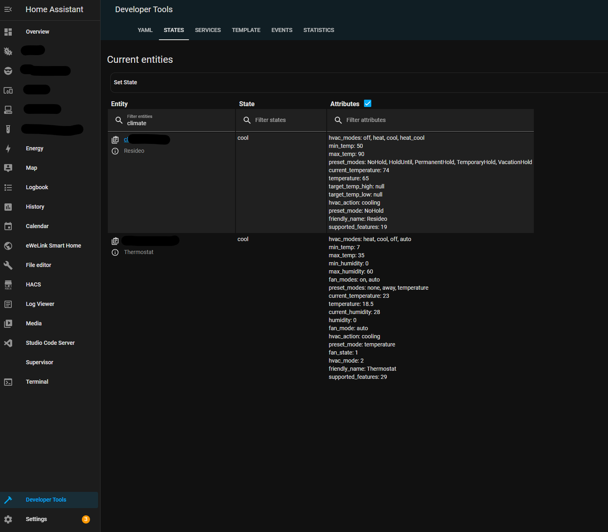

.. _HomeAssistant-Driver:

Home Assistant Driver
=====================

The Home Assistant driver enables VOLTTRON to read any data point from any Home Assistant controlled device.
Currently control(write access) is supported only for lights and thermostats.

The following diagram shows interaction between platform driver agent and home assistant driver.

.. mermaid::

   sequenceDiagram
       HomeAssistant Driver->>HomeAssistant: Retrieve Entity Data (REST API)
       HomeAssistant-->>HomeAssistant Driver: Entity Data (Status Code: 200)
       HomeAssistant Driver->>PlatformDriverAgent: Publish Entity Data
       PlatformDriverAgent->>Controller Agent: Publish Entity Data

       Controller Agent->>HomeAssistant Driver: Instruct to Turn Off Light
       HomeAssistant Driver->>HomeAssistant: Send Turn Off Light Command (REST API)
       HomeAssistant-->>HomeAssistant Driver: Command Acknowledgement (Status Code: 200)

Pre-requisites
--------------
Before proceeding, find your Home Assistant IP address and long-lived access token from `here <https://developers.home-assistant.io/docs/auth_api/#long-lived-access-token>`_.

Clone the repository, start volttron, install the listener agent, and the platform driver agent.

- `Listener agent <https://volttron.readthedocs.io/en/main/introduction/platform-install.html#installing-and-running-agents>`_
- `Platform driver agent <https://volttron.readthedocs.io/en/main/agent-framework/core-service-agents/platform-driver/platform-driver-agent.html?highlight=platform%20driver%20isntall#configuring-the-platform-driver>`_

Configuration
--------------

After cloning, generate configuration files. Each device requires one device configuration file and one registry file.
Ensure your registry_config parameter in your device configuration file, links to correct registry config name in the
config store. For more details on how volttron platform driver agent works with volttron configuration store see,
`Platform driver configuration <https://volttron.readthedocs.io/en/main/agent-framework/driver-framework/platform-driver/platform-driver.html#configuration-and-installation>`_
Examples for lights and thermostats are provided below.

Device configuration
++++++++++++++++++++

Device configuration file contains the connection details to you home assistant instance and driver_type as "home_assistant"

.. code-block:: json

   {
       "driver_config": {
           "ip_address": "Your Home Assistant IP",
           "access_token": "Your Home Assistant Access Token",
           "port": "Your Port"
       },
       "driver_type": "home_assistant",
       "registry_config": "config://light.example.json",
       "interval": 30,
       "timezone": "UTC"
   }

Registry Configuration
+++++++++++++++++++++++

Registry file can contain one single device and its attributes or collection logical group of devices and its
attributes. Each entry should include the full entity id of the device, including but not limited to "light."
and "climate.", in the registry configuration. The driver uses these prefixes to convert states into integers.
Like mentioned before, the driver can only control lights and thermostats but can get data from all devices
controlled by home assistant

Each entry in a registry file should also have a unique value for 'Volttron Point Name'. The Entity ID extracts data
from Home Assistant, and Volttron Point Name retrieves the state or attributes defined.

Attributes can be located in the developer tools in the Home Assistant GUI.

Below is an example file named light.example.json which has attributes of a single light instance with entity
id 'light.example':

.. code-block:: json

   [
       {
           "Entity ID": "light.example",
           "Volttron Point Name": "state",
           "Units": "On / Off",
           "Units Details": "on/off",
           "Writable": true,
           "Starting Value": true,
           "Type": "boolean",
           "Notes": "lights hallway"
       },
       {
           "Entity ID": "light.example",
           "Volttron Point Name": "brightness",
           "Units": "int",
           "Units Details": "light level",
           "Writable": true,
           "Starting Value": 0,
           "Type": "int",
           "Notes": "brightness control, 0 - 255"
       }
   ]

.. note::

When using a single registry file to represent a logical group of multiple physical entities, make sure the
"Volttron Point Name" is unique within a single registry file. For example, if a registry file contains entities with
id  'light.instance1' and 'light.instance2' the entry for the attribute brightness for these two light instances could
have "Volttron Point Name" as 'light1/brightness' and 'light2/brightness' respectively. This would ensure that data
is posted to unique topic names and brightness data from light1 is not overwritten by light2 or vice-versa.

Example Thermostat Registry
***************************

For thermostats, the state is converted into numbers as follows: "0: Off, 2: heat, 3: Cool, 4: Auto",

.. code-block:: json

   [
       {
           "Entity ID": "climate.my_thermostat",
           "Volttron Point Name": "state",
           "Units": "Enumeration",
           "Units Details": "0: Off, 2: heat, 3: Cool, 4: Auto",
           "Writable": true,
           "Starting Value": 1,
           "Type": "int",
           "Notes": "Mode of the thermostat"
       },
       {
           "Entity ID": "climate.my_thermostat",
           "Volttron Point Name": "current_temperature",
           "Units": "F",
           "Units Details": "Current Ambient Temperature",
           "Writable": true,
           "Starting Value": 72,
           "Type": "float",
           "Notes": "Current temperature reading"
       },
       {
           "Entity ID": "climate.my_thermostat",
           "Volttron Point Name": "temperature",
           "Units": "F",
           "Units Details": "Desired Temperature",
           "Writable": true,
           "Starting Value": 75,
           "Type": "float",
           "Notes": "Target Temp"
       }
   ]

Transfer the registers files and the config files into the VOLTTRON config store using the commands below:

.. code-block:: bash

   vctl config store platform.driver light.example.json HomeAssistant_Driver/light.example.json
   vctl config store platform.driver devices/BUILDING/ROOM/light.example HomeAssistant_Driver/light.example.config

Upon completion, initiate the platform driver. Utilize the listener agent to verify the driver output:

.. code-block:: bash

   2023-09-12 11:37:00,226 (listeneragent-3.3 211531) __main__ INFO: Peer: pubsub, Sender: platform.driver:, Bus: , Topic: devices/BUILDING/ROOM/light.example/all, Headers: {'Date': '2023-09-12T18:37:00.224648+00:00', 'TimeStamp': '2023-09-12T18:37:00.224648+00:00', 'SynchronizedTimeStamp': '2023-09-12T18:37:00.000000+00:00', 'min_compatible_version': '3.0', 'max_compatible_version': ''}, Message:
   [{'brightness': 254, 'state': 'on'},
    {'brightness': {'type': 'integer', 'tz': 'UTC', 'units': 'int'},
     'state': {'type': 'integer', 'tz': 'UTC', 'units': 'On / Off'}}]
