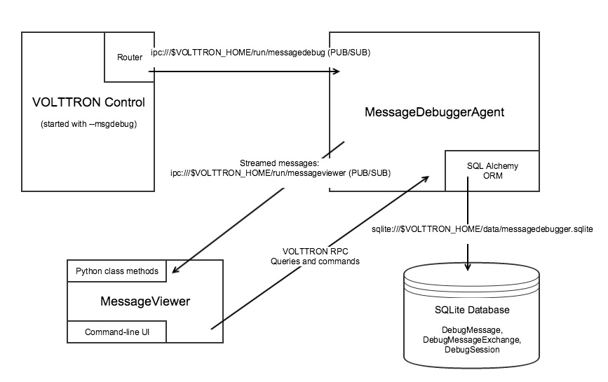

.. _Message-Debugging:

=================
Message Debugging
=================

VOLTTRON agent messages are routed over the VOLTTRON message bus.  The Message Debugger Agent provides enhanced
examination of this message stream's contents as an aid to debugging and troubleshooting agents and drivers.

This feature is implemented to provide visibility into the ZeroMQ message bus.  The RabbitMQ message bus includes
methods for message debugging by default in the `RabbitMQ management UI <https://www.rabbitmq.com/management.html>`_.

When enabled, the Message Debugger Agent captures and records each message as it is routed.
A second process, Message Viewer, provides a user interface that optimizes and filters the
resulting data stream, either in real time or retrospectively, and displays its contents.

The Message Viewer can convey information about high-level interactions among VOLTTRON agents,
representing the message data as conversations that can be filtered and/or expanded.
A simple RPC call involving 4 individual message send/receive segments can be displayed as a
single row, which can then be expanded to drill down into the message details.
This results in a higher-level, easier-to-obtain view of message bus activity
than might be gleaned by using grep on verbose log files.

Pub/Sub interactions can be summarized by topic, including counts of messages published during
a given capture period by sender, receiver and topic.

Another view displays the most-recently-published message, or message exchange, that
satisfies the current filter criteria, continuously updated as new messages are routed.

Enabling the Message Debugger
=============================

In order to use the Message Debugger, two steps are required:

-   VOLTTRON must have been started with a ``--msgdebug`` command line option.
-   The Message Debugger Agent must be running.

When VOLTTRON has been started with ``--msgdebug``, its Router publishes each message
to an IPC socket for which the Message Debugger Agent is a subscriber. This is kept disabled
by default because it consumes a significant quantity of CPU and memory resources, potentially
affecting VOLTTRON timing and performance. So as a general rule, the ``--msgdebug`` option
should be employed during development/debugging only, and should not be left enabled in
a production environment.

Example of starting VOLTTRON with the ``--msgdebug`` command line option:

::

    (volttron) ./start-volttron ``--msgdebug``

If VOLTTRON is running in this mode, the stream of routed messages is available to
a subscribing Message Debugger Agent. It can be started from volttron-ctl in the same
fashion as other agents, for example:

::

    (volttron) $ vctl status
       AGENT                      IDENTITY                 TAG                      STATUS
    fd listeneragent-3.2          listener                 listener
    08 messagedebuggeragent-0.1   platform.messagedebugger platform.messagedebugger
    e1 vcplatformagent-3.5.4      platform.agent           vcp
    47 volttroncentralagent-3.5.5 volttron.central         vc

    (volttron) $ vctl start 08
    Starting 089c53f0-f225-4608-aecb-3e86e0df30eb messagedebuggeragent-0.1

    (volttron) $ vctl status
       AGENT                      IDENTITY                 TAG                      STATUS
    fd listeneragent-3.2          listener                 listener
    08 messagedebuggeragent-0.1   platform.messagedebugger platform.messagedebugger running [43498]
    e1 vcplatformagent-3.5.4      platform.agent           vcp
    47 volttroncentralagent-3.5.5 volttron.central         vc

See :ref:`Agent Creation Walk-through <Agent-Development>` for further details on
installing and starting agents from `vctl`.

Once the Message Debugger Agent is running, it begins capturing message data and
writing it to a SQLite database.

Message Viewer
==============

The Message Viewer is a separate process that interacts with the Message Debugger Agent
primarily via VOLTTRON RPC calls. These calls allow it to request and report on filtered sets
of message data.

Since the Agent's RPC methods are available for use by any VOLTTRON agent, the Message Viewer
is really just one example of a Message Debugger information consumer. Other viewers could be
created to satisfy a variety of specific debugging needs. For example, a viewer could support
browser-based message debugging with a graphical user interface, or a viewer could transform
message data into PCAP format for consumption by WireShark.

The Message Viewer in `services/ops/MessageDebuggerAgent/messageviewer/viewer.py` implements a
command-line UI, subclassing Python's ``Cmd`` class. Most of the command-line options that it
displays result in a MessageDebuggerAgent RPC request. The Message Viewer formats and displays
the results.

In Linux, the Message Viewer can be started as follows, and displays the following menu:

::

    (volttron) $ cd services/ops/MessageDebuggerAgent/messageviewer
    (volttron) $ python viewer.py
    Welcome to the MessageViewer command line. Supported commands include:
         display_message_stream
         display_messages
         display_exchanges
         display_exchange_details
         display_session_details_by_agent <session_id>
         display_session_details_by_topic <session_id>

         list_sessions
         set_verbosity <level>
         list_filters
         set_filter <filter_name> <value>
         clear_filters
         clear_filter <filter_name>

         start_streaming
         stop_streaming
         start_session
         stop_session
         delete_session <session_id>
         delete_database

         help
         quit
    Please enter a command.
    Viewer>

Command-Line Help
-----------------

The Message Viewer offers two help levels. Simply typing ``help`` gives a list of available
commands. If a command name is provided as an argument, advice is offered on how to use
that command:

::

    Viewer> help

    Documented commands (type help <topic>):
    ========================================
    clear_filter              display_messages                  set_filter
    clear_filters             display_session_details_by_agent  set_verbosity
    delete_database           display_session_details_by_topic  start_session
    delete_session            help                              start_streaming
    display_exchange_details  list_filters                      stop_session
    display_exchanges         list_sessions                     stop_streaming
    display_message_stream    quit

    Viewer> help set_filter

                Set a filter to a value; syntax is: set_filter <filter_name> <value>

                Some recognized filters include:
                . freq <n>: Use a single-line display, refreshing every <n> seconds (<n> can be floating point)
                . session_id <n>: Display Messages and Exchanges for the indicated debugging session ID only
                . results_only <n>: Display Messages and Exchanges only if they have a result
                . sender <agent_name>
                . recipient <agent_name>
                . device <device_name>
                . point <point_name>
                . topic <topic_name>: Matches all topics that start with the supplied <topic_name>
                . starttime <YYYY-MM-DD HH:MM:SS>: Matches rows with timestamps after the supplied time
                . endtime <YYYY-MM-DD HH:MM:SS>: Matches rows with timestamps before the supplied time
                . (etc. -- see the structures of DebugMessage and DebugMessageExchange)

Debug Sessions
==============

The Message Debugger Agent tags each message with a debug session ID (a serial number),
which groups a set of messages that are bounded by a start time and an end time. The ``list_sessions``
command describes each session in the database:

::

    Viewer> list_sessions
      rowid        start_time                  end_time                    num_messages
      1            2017-03-20 17:07:13.867951  -                           2243
      2            2017-03-20 17:17:35.725224  -                           1320
      3            2017-03-20 17:33:35.103204  2017-03-20 17:46:15.657487  12388

A new session is started by default when the Agent is started. After that, the ``stop_session``
and ``start_session`` commands can be used to create new session boundaries. If the Agent is running
but no session is active (i.e., because ``stop_session`` was used to stop it), messages are
still written to the database, but they have no session ID.

Filtered Display
----------------

The ``set_filter <property> <value>`` command enables filtered display of messages. A variety
of properties can be filtered.

In the following example, message filters are defined by session_id and sender, and the ``display_messages``
command displays the results:

::

    Viewer> set_filter session_id 4
    Set filters to {'session_id': '4'}
    Viewer> set_filter sender testagent
    Set filters to {'sender': 'testagent', 'session_id': '4'}
    Viewer> display_messages
      timestamp    direction    sender       recipient                 request_id                     subsystem    method          topic                     device        point        result
      11:51:00     incoming     testagent    messageviewer.connection  -                              RPC          pubsub.sync     -                         -             -            -
      11:51:00     outgoing     testagent    pubsub                    -                              RPC          pubsub.push     -                         -             -            -
      11:51:00     incoming     testagent    platform.driver           1197886248649056372.284581685  RPC          get_point       -                         chargepoint1  Status       -
      11:51:01     outgoing     testagent    platform.driver           1197886248649056372.284581685  RPC          -               -                         -             -            AVAILABLE
      11:51:01     incoming     testagent    pubsub                    1197886248649056373.284581649  RPC          pubsub.publish  test_topic/test_subtopic  -             -            -
      11:51:01     outgoing     testagent    pubsub                    1197886248649056373.284581649  RPC          -               -                         -             -            None

Debug Message Exchanges
=======================

A VOLTTRON message's request ID is not unique to a single message. A group of messages in an "exchange"
(essentially a small conversation among agents) will often share a common request ID, for instance during RPC
request/response exchanges.

The following example uses the same filters as above, and then uses ``display_exchanges``
to display a single line for each message exchange, reducing the number of displayed rows from 6 to 2.
Note that not all messages have a request ID; messages with no ID are absent from the responses to
exchange queries.
::

    Viewer> list_filters
    {'sender': 'testagent', 'session_id': '4'}
    Viewer> display_exchanges
      sender       recipient        sender_time  topic                     device        point        result
      testagent    platform.driver  11:51:00     -                         chargepoint1  Status       AVAILABLE
      testagent    pubsub           11:51:01     test_topic/test_subtopic  -             -            None

Special Filters
---------------

Most filters that can be set with the ``set_filter`` command are simple string matches on
one or another property of a message. Some filters have special characteristics, though.
The ``set_filter starttime <timestamp>`` and ``set_filter endtime <timestamp>`` filters are
inequalities that test for messages after a start time or before an end time.

In the following example, note the use of quotes in the endtime value supplied to
set_filter. Any filter value can be delimited with quotes. Quotes must be
used when a value contains embedded spaces, as is the case here:

::

    Viewer> list_sessions
      rowid        start_time                  end_time                    num_messages
      1            2017-03-20 17:07:13.867951  -                           -
      2            2017-03-20 17:17:35.725224  -                           -
      3            2017-03-21 11:48:33.803288  2017-03-21 11:50:57.181136  6436
      4            2017-03-21 11:50:59.656693  2017-03-21 11:51:05.934895  450
      5            2017-03-21 11:51:08.431871  -                           74872
      6            2017-03-21 12:17:30.568260  -                           2331
    Viewer> set_filter session_id 5
    Set filters to {'session_id': '5'}
    Viewer> set_filter sender testagent
    Set filters to {'sender': 'testagent', 'session_id': '5'}
    Viewer> set_filter endtime '2017-03-21 11:51:30'
    Set filters to {'endtime': '2017-03-21 11:51:30', 'sender': 'testagent', 'session_id': '5'}
    Viewer> display_exchanges
      sender       recipient        sender_time  topic                     device        point        result
      testagent    platform.driver  11:51:11     -                         chargepoint1  Status       AVAILABLE
      testagent    pubsub           11:51:11     test_topic/test_subtopic  -             -            None
      testagent    platform.driver  11:51:25     -                         chargepoint1  Status       AVAILABLE
      testagent    pubsub           11:51:25     test_topic/test_subtopic  -             -            None
      testagent    platform.driver  11:51:26     -                         chargepoint1  Status       AVAILABLE
      testagent    pubsub           11:51:26     test_topic/test_subtopic  -             -            None

Another filter type with special behavior is ``set_filter topic <name>``. Ordinarily, filters do an exact
match on a message property. Since message topics are often expressed as hierarchical substrings,
though, the ``topic`` filter does a substring match on the left edge of a message's topic,
as in the following example:

::

    Viewer> set_filter topic test_topic
    Set filters to {'topic': 'test_topic', 'endtime': '2017-03-21 11:51:30', 'sender': 'testagent', 'session_id': '5'}
    Viewer> display_exchanges
      sender       recipient    sender_time  topic                     device       point        result
      testagent    pubsub       11:51:11     test_topic/test_subtopic  -            -            None
      testagent    pubsub       11:51:25     test_topic/test_subtopic  -            -            None
      testagent    pubsub       11:51:26     test_topic/test_subtopic  -            -            None
    Viewer>

Another filter type with special behavior is ``set_filter results_only 1``. In the JSON representation of a
response to an RPC call, for example an RPC call to a Platform Driver interface, the response to the
RPC request typically appears as the value of a 'result' tag. The ``results_only`` filter matches
only those messages that have a non-empty value for this tag.

In the following example, note that when the ``results_only`` filter is set, it is given a value
of '1'. This is actually a meaningless value that gets ignored. It must be supplied because the
set_filter command syntax requires that a value be supplied as a parameter.

In the following example, note the use of ``clear_filter <property>`` to remove a single
named filter from the list of filters that are currently in effect. There is also a ``clear_filters``
command, which clears all current filters.

::

    Viewer> clear_filter topic
    Set filters to {'endtime': '2017-03-21 11:51:30', 'sender': 'testagent', 'session_id': '5'}
    Viewer> set_filter results_only 1
    Set filters to {'endtime': '2017-03-21 11:51:30', 'sender': 'testagent', 'session_id': '5', 'results_only': '1'}
    Viewer> display_exchanges
      sender       recipient        sender_time  topic        device        point        result
      testagent    platform.driver  11:51:11     -            chargepoint1  Status       AVAILABLE
      testagent    platform.driver  11:51:25     -            chargepoint1  Status       AVAILABLE
      testagent    platform.driver  11:51:26     -            chargepoint1  Status       AVAILABLE

Streamed Display
----------------

In addition to exposing a set of RPC calls that allow other agents (like the Message Viewer)
to query the Message Debugger Agent's SQLite database of recent messages, the Agent can also
publish messages in real time as it receives them.

This feature is disabled by default due to the large quantity of data that it might need to
handle. When it is enabled, the Agent applies the filters currently in effect to each message as
it is received, and re-publishes the transformed, ready-for-debugging message to a socket
if it meets the filter criteria. The Message Viewer can listen on that socket and display
the message stream as it arrives.

In the following ``display_message_stream`` example, the Message Viewer displays all messages
sent by the agent named 'testagent', as they arrive. It continues to display messages until
execution is interrupted with ctrl-C:

::

    Viewer> clear_filters
    Set filters to {}
    Viewer> set_filter sender testagent
    Set filters to {'sender': 'testagent'}
    Viewer> display_message_stream
    Streaming debug messages
      timestamp    direction    sender       recipient    request_id   subsystem    method       topic        device       point        result
      12:28:58     outgoing     testagent    pubsub       -            RPC          pubsub.push  -            -            -            -
      12:28:58     incoming     testagent    platform.dr  11978862486  RPC          get_point    -            chargepoint  Status       -
                                             iver         49056826.28                                         1
                                                          4581713
      12:28:58     outgoing     testagent    platform.dr  11978862486  RPC          -            -            -            -            AVAILABLE
                                             iver         49056826.28
                                                          4581713
      12:28:58     incoming     testagent    pubsub       11978862486  RPC          pubsub.publ  test_topic/  -            -            -
                                                          49056827.28               ish          test_subtop
                                                          4581685                                ic
      12:28:58     outgoing     testagent    pubsub       11978862486  RPC          -            -            -            -            None
                                                          49056827.28
                                                          4581685
      12:28:58     outgoing     testagent    pubsub       -            RPC          pubsub.push  -            -            -            -
    ^CViewer> stop_streaming
    Stopped streaming debug messages

(Note the use of wrapping in the column formatting. Since these messages aren't known in advance, the
Message Viewer has incomplete information about how wide to make each column. Instead, it must
make guesses based on header widths, data widths in the first row received, and min/max values,
and then wrap the data when it overflows the column boundaries.)

Single-Line Display
-------------------

Another filter with special behavior is ``set_filter freq <seconds>``. This filter, which takes a number N
as its value, displays only one row, the most recently captured row that satisfies the filter criteria.
(Like other filters, this filter can be used with either ``display_messages`` or ``display_exchanges``.)
It then waits N seconds, reissues the query, and overwrites the old row with the new one.
It continues this periodic single-line overwritten display until it is interrupted with ctrl-C:

::

    Viewer> list_filters
    {'sender': 'testagent'}
    Viewer> set_filter freq 10
    Set filters to {'freq': '10', 'sender': 'testagent'}
    Viewer> display_exchanges
      sender       recipient    sender_time  topic                     device       point        result
      testagent    pubsub       12:31:28     test_topic/test_subtopic  -            -            None

(Again, the data isn't known in advance, so the Message Viewer has to guess the best
width of each column. In this single-line display format, data gets truncated if it doesn't fit,
because no wrapping can be performed -- only one display line is available.)

Displaying Exchange Details
---------------------------

The ``display_exchange_details <request_id>`` command provides a way to get more specific details
about an exchange, i.e. about all messages that share a common request ID. At low or medium
verbosity, when this command is used (supplying the relevant request ID, which can be obtained
from the output of other commands), it displays one row for each message:

::

    Viewer> set_filter sender testagent
    Set filters to {'sender': 'testagent', 'session_id': '4'}
    Viewer> display_messages
      timestamp    direction    sender       recipient                 request_id                     subsystem    method          topic                     device        point        result
      11:51:00     incoming     testagent    messageviewer.connection  -                              RPC          pubsub.sync     -                         -             -            -
      11:51:00     outgoing     testagent    pubsub                    -                              RPC          pubsub.push     -                         -             -            -
      11:51:00     incoming     testagent    platform.driver           1197886248649056372.284581685  RPC          get_point       -                         chargepoint1  Status       -
      11:51:01     outgoing     testagent    platform.driver           1197886248649056372.284581685  RPC          -               -                         -             -            AVAILABLE
      11:51:01     incoming     testagent    pubsub                    1197886248649056373.284581649  RPC          pubsub.publish  test_topic/test_subtopic  -             -            -
      11:51:01     outgoing     testagent    pubsub                    1197886248649056373.284581649  RPC          -               -                         -             -            None
    Viewer> display_exchange_details 1197886248649056373.284581649
      timestamp    direction    sender       recipient    request_id                     subsystem    method          topic                     device       point        result
      11:51:01     incoming     testagent    pubsub       1197886248649056373.284581649  RPC          pubsub.publish  test_topic/test_subtopic  -            -            -
      11:51:01     outgoing     testagent    pubsub       1197886248649056373.284581649  RPC          -               -                         -            -            None

At high verbosity, ``display_exchange_details`` switches display formats, showing all properties for
each message in a json-like dictionary format:

::

    Viewer> set_verbosity high
    Set verbosity to high
    Viewer> display_exchange_details 1197886248649056373.284581649

    {
        "data": "{\"params\":{\"topic\":\"test_topic/test_subtopic\",\"headers\":{\"Date\":\"2017-03-21T11:50:56.293830\",\"max_compatible_version\":\"\",\"min_compatible_version\":\"3.0\"},\"message\":[{\"property_1\":1,\"property_2\":2},{\"property_3\":3,\"property_4\":4}],\"bus\":\"\"},\"jsonrpc\":\"2.0\",\"method\":\"pubsub.publish\",\"id\":\"15828311332408898779.284581649\"}",
        "device": "",
        "direction": "incoming",
        "frame7": "",
        "frame8": "",
        "frame9": "",
        "headers": "{u'Date': u'2017-03-21T11:50:56.293830', u'max_compatible_version': u'', u'min_compatible_version': u'3.0'}",
        "message": "[{u'property_1': 1, u'property_2': 2}, {u'property_3': 3, u'property_4': 4}]",
        "message_size": 374,
        "message_value": "{u'property_1': 1, u'property_2': 2}",
        "method": "pubsub.publish",
        "params": "{u'topic': u'test_topic/test_subtopic', u'headers': {u'Date': u'2017-03-21T11:50:56.293830', u'max_compatible_version': u'', u'min_compatible_version': u'3.0'}, u'message': [{u'property_1': 1, u'property_2': 2}, {u'property_3': 3, u'property_4': 4}], u'bus': u''}",
        "point": "",
        "point_value": "",
        "recipient": "pubsub",
        "request_id": "1197886248649056373.284581649",
        "result": "",
        "sender": "testagent",
        "session_id": 4,
        "subsystem": "RPC",
        "timestamp": "2017-03-21 11:51:01.027623",
        "topic": "test_topic/test_subtopic",
        "user_id": "",
        "vip_signature": "VIP1"
    }

    {
        "data": "{\"params\":{\"topic\":\"test_topic/test_subtopic\",\"headers\":{\"Date\":\"2017-03-21T11:50:56.293830\",\"max_compatible_version\":\"\",\"min_compatible_version\":\"3.0\"},\"message\":[{\"property_1\":1,\"property_2\":2},{\"property_3\":3,\"property_4\":4}],\"bus\":\"\"},\"jsonrpc\":\"2.0\",\"method\":\"pubsub.publish\",\"id\":\"15828311332408898779.284581649\"}",
        "device": "",
        "direction": "outgoing",
        "frame7": "",
        "frame8": "",
        "frame9": "",
        "headers": "{u'Date': u'2017-03-21T11:50:56.293830', u'max_compatible_version': u'', u'min_compatible_version': u'3.0'}",
        "message": "[{u'property_1': 1, u'property_2': 2}, {u'property_3': 3, u'property_4': 4}]",
        "message_size": 383,
        "message_value": "{u'property_1': 1, u'property_2': 2}",
        "method": "pubsub.publish",
        "params": "{u'topic': u'test_topic/test_subtopic', u'headers': {u'Date': u'2017-03-21T11:50:56.293830', u'max_compatible_version': u'', u'min_compatible_version': u'3.0'}, u'message': [{u'property_1': 1, u'property_2': 2}, {u'property_3': 3, u'property_4': 4}], u'bus': u''}",
        "point": "",
        "point_value": "",
        "recipient": "testagent",
        "request_id": "1197886248649056373.284581649",
        "result": "",
        "sender": "pubsub",
        "session_id": 4,
        "subsystem": "RPC",
        "timestamp": "2017-03-21 11:51:01.031183",
        "topic": "test_topic/test_subtopic",
        "user_id": "testagent",
        "vip_signature": "VIP1"
    }

Verbosity
=========

As mentioned in the previous section, Agent and Viewer behavior can be adjusted by changing
the current verbosity with the ``set_verbosity <level>`` command. The default verbosity is low.
low, medium and high levels are available:

::

    Viewer> set_verbosity high
    Set verbosity to high
    Viewer> set_verbosity none
    Invalid verbosity choice none; valid choices are ['low', 'medium', 'high']

At high verbosity, the following query formatting rules are in effect:

-   When displaying timestamps, display the full date and time (including microseconds), not just HH:MM:SS.
-   In responses to display_message_exchanges, use dictionary format (see example in previous section).
-   Display all columns, not just "interesting" columns (see the list below).
-   Don't exclude messages/exchanges based on excluded senders/receivers (see the list below).

At medium or low verbosity:

-   When displaying timestamps, display HH:MM:SS only.
-   In responses to display_message_exchanges, use table format.
-   Display "interesting" columns only (see the list below).
-   Exclude messages/exchanges for certain senders/receivers (see the list below).

At low verbosity:

-   If > 1000 objects are returned by a query, display the count only.

The following "interesting" columns are displayed at low and medium verbosity levels
(at high verbosity levels, all properties are displayed):

::

    Debug Message       Debug Message Exchange      Debug Session

    timestamp           sender_time                 rowid
    direction                                       start_time
    sender              sender                      end_time
    recipient           recipient                   num_messages
    request_id
    subsystem
    method
    topic               topic
    device              device
    point               point
    result              result

Messages from the following senders, or to the following receivers, are excluded at
low and medium verbosity levels:

::

    Sender                                  Receiver

    (empty)                                 (empty)
    None
    control                                 control
    config.store                            config.store
    pubsub
    control.connection
    messageviewer.connection
    platform.messagedebugger
    platform.messagedebugger.loopback_rpc

These choices about which columns are "interesting" and which senders/receivers are excluded
are defined as parameters in Message Viewer, and can be adjusted as necessary by changing
global value lists in viewer.py.

Session Statistics
==================

One useful tactic for starting at a summary level and drilling down is to capture a set
of messages for a session and then examine the counts of sending and receiving agents,
or sending agents and topics. This gives hints on which values might serve as useful filters
for more specific queries.

The ``display_session_details_by_agent <session_id>`` command displays statistics by sending and
receiving agent. Sending agents are table columns, and receiving agents are table rows.
This query also applies whatever filters are currently in effect; the filters can reduce
the counts and can also reduce the number of columns and rows.

The following example shows the command being used to list all senders and receivers for
messages sent during debug session 7:

::

    Viewer> list_sessions
      rowid        start_time                  end_time                    num_messages
      1            2017-03-20 17:07:13.867951  -                           -
      2            2017-03-20 17:17:35.725224  -                           -
      3            2017-03-21 11:48:33.803288  2017-03-21 11:50:57.181136  6436
      4            2017-03-21 11:50:59.656693  2017-03-21 11:51:05.934895  450
      5            2017-03-21 11:51:08.431871  -                           74872
      6            2017-03-21 12:17:30.568260  2017-03-21 12:38:29.070000  60384
      7            2017-03-21 12:38:31.617099  2017-03-21 12:39:53.174712  3966
    Viewer> clear_filters
    Set filters to {}
    Viewer> display_session_details_by_agent 7
      Receiving Agent               control     listener  messageviewer.connection  platform.driver  platform.messagedebugger       pubsub    testagent
      (No Receiving Agent)                -            -                         2                -                         -            -            -
      control                             -            -                         -                -                         -            2            -
      listener                            -            -                         -                -                         -          679            -
      messageviewer.connection            -            -                         -                -                         3            -            -
      platform.driver                     -            -                         -                -                         -         1249           16
      platform.messagedebugger            -            -                         3                -                         -            -            -
      pubsub                              2          679                         -             1249                         -            4           31
      testagent                           -            -                         -               16                         -           31            -

The ``display_session_details_by_topic <session_id>`` command is similar to ``display_session_details_by_agent``,
but each row contains statistics for a topic instead of for a receiving agent:

::

    Viewer> display_session_details_by_topic 7
      Topic                                    control     listener  messageviewer.connection  platform.driver  platform.messagedebugger       pubsub    testagent
      (No Topic)                                     1          664                         5              640                         3         1314           39
      devices/chargepoint1/Address                   -            -                         -                6                         -            6            -
      devices/chargepoint1/City                      -            -                         -                6                         -            6            -
      devices/chargepoint1/Connector                 -            -                         -                5                         -            5            -
      devices/chargepoint1/Country                   -            -                         -                5                         -            5            -
      devices/chargepoint1/Current                   -            -                         -                6                         -            6            -
      devices/chargepoint1/Description               -            -                         -                6                         -            6            -
      devices/chargepoint1/Energy                    -            -                         -                5                         -            5            -
      devices/chargepoint1/Lat                       -            -                         -                6                         -            6            -
      devices/chargepoint1/Level                     -            -                         -                5                         -            5            -
      devices/chargepoint1/Long                      -            -                         -                6                         -            6            -
      devices/chargepoint1/Mode                      -            -                         -                5                         -            5            -
      devices/chargepoint1/Power                     -            -                         -                6                         -            6            -
      devices/chargepoint1/Reservable                -            -                         -                5                         -            5            -
      devices/chargepoint1/State                     -            -                         -                6                         -            6            -
      devices/chargepoint1/Status                    -            -                         -                5                         -            5            -
      devices/chargepoint1/Status.TimeSta            -            -                         -                6                         -            6            -
      mp
      devices/chargepoint1/Type                      -            -                         -                6                         -            6            -
      devices/chargepoint1/Voltage                   -            -                         -                5                         -            5            -
      devices/chargepoint1/alarmTime                 -            -                         -                6                         -            6            -
      devices/chargepoint1/alarmType                 -            -                         -                6                         -            6            -
      devices/chargepoint1/all                       -            -                         -                5                         -            5            -
      devices/chargepoint1/allowedLoad               -            -                         -                6                         -            6            -
      devices/chargepoint1/clearAlarms               -            -                         -                6                         -            6            -
      devices/chargepoint1/currencyCode              -            -                         -                6                         -            6            -
      devices/chargepoint1/driverAccountN            -            -                         -                5                         -            5            -
      umber
      devices/chargepoint1/driverName                -            -                         -                5                         -            5            -
      devices/chargepoint1/endTime                   -            -                         -                5                         -            5            -
      devices/chargepoint1/mainPhone                 -            -                         -                6                         -            6            -
      devices/chargepoint1/maxPrice                  -            -                         -                5                         -            5            -
      devices/chargepoint1/minPrice                  -            -                         -                5                         -            5            -
      devices/chargepoint1/numPorts                  -            -                         -                6                         -            6            -
      devices/chargepoint1/orgID                     -            -                         -                5                         -            5            -
      devices/chargepoint1/organizationNa            -            -                         -                5                         -            5            -
      me
      devices/chargepoint1/percentShed               -            -                         -                6                         -            6            -
      devices/chargepoint1/portLoad                  -            -                         -                6                         -            6            -
      devices/chargepoint1/portNumber                -            -                         -                6                         -            6            -
      devices/chargepoint1/sessionID                 -            -                         -                5                         -            5            -
      devices/chargepoint1/sessionTime               -            -                         -                6                         -            6            -
      devices/chargepoint1/sgID                      -            -                         -                6                         -            6            -
      devices/chargepoint1/sgName                    -            -                         -                6                         -            6            -
      devices/chargepoint1/shedState                 -            -                         -                5                         -            5            -
      devices/chargepoint1/startTime                 -            -                         -                6                         -            6            -
      devices/chargepoint1/stationID                 -            -                         -                5                         -            5            -
      devices/chargepoint1/stationMacAddr            -            -                         -                6                         -            6            -
      devices/chargepoint1/stationManufac            -            -                         -                5                         -            5            -
      turer
      devices/chargepoint1/stationModel              -            -                         -                6                         -            6            -
      devices/chargepoint1/stationName               -            -                         -                5                         -            5            -
      devices/chargepoint1/stationRightsP            -            -                         -                6                         -            6            -
      rofile
      devices/chargepoint1/stationSerialN            -            -                         -                6                         -            6            -
      um
      heartbeat/control                              1            -                         -                -                         -            1            -
      heartbeat/listener                             -           15                         -                -                         -           15            -
      heartbeat/platform.driver                      -            -                         -                1                         -            1            -
      heartbeat/pubsub                               -            -                         -                -                         -            2            -
      test_topic/test_subtopic                       -            -                         -                -                         -            8            8

Database Administration
=======================

The Message Debugger Agent stores message data in a SQLite database's DebugMessage,
DebugMessageExchange and DebugSession tables. If the database isn't present already
when the Agent is started, it is created automatically.

The SQLite database can consume a lot of disk space in a relatively short time,
so the Message Viewer has command-line options that recover that space by
deleting the database or by deleting all messages belonging to a given debug session.

The ``delete_session <session_id>`` command deletes the database's DebugSession row
with the indicated ID, and also deletes all DebugMessage and DebugMessageExchange rows
with that session ID. In the following example, ``delete_session`` deletes the 60,000
DebugMessages that were captured during a 20-minute period as session 6:

::

    Viewer> list_sessions
      rowid        start_time                  end_time                    num_messages
      1            2017-03-20 17:07:13.867951  -                           -
      2            2017-03-20 17:17:35.725224  -                           -
      3            2017-03-21 11:48:33.803288  2017-03-21 11:50:57.181136  6436
      4            2017-03-21 11:50:59.656693  2017-03-21 11:51:05.934895  450
      5            2017-03-21 11:51:08.431871  -                           74872
      6            2017-03-21 12:17:30.568260  2017-03-21 12:38:29.070000  60384
      7            2017-03-21 12:38:31.617099  2017-03-21 12:39:53.174712  3966
      8            2017-03-21 12:42:08.482936  -                           3427
    Viewer> delete_session 6
    Deleted debug session 6
    Viewer> list_sessions
      rowid        start_time                  end_time                    num_messages
      1            2017-03-20 17:07:13.867951  -                           -
      2            2017-03-20 17:17:35.725224  -                           -
      3            2017-03-21 11:48:33.803288  2017-03-21 11:50:57.181136  6436
      4            2017-03-21 11:50:59.656693  2017-03-21 11:51:05.934895  450
      5            2017-03-21 11:51:08.431871  -                           74872
      7            2017-03-21 12:38:31.617099  2017-03-21 12:39:53.174712  3966
      8            2017-03-21 12:42:08.482936  -                           4370

The ``delete_database`` command deletes the entire SQLite database, removing all records
of previously-captured DebugMessages, DebugMessageExchanges and DebugSessions.
The database will be re-created the next time a debug session is started.

::

    Viewer> delete_database
    Database deleted
    Viewer> list_sessions
    No query results
    Viewer> start_session
    Message debugger session 1 started
    Viewer> list_sessions
      rowid        start_time                  end_time     num_messages
      1            2017-03-22 12:39:40.320252  -            180

It's recommended that the database be deleted if changes are made to the DebugMessage,
DebugMessageExchange or DebugSession object structures that are defined in agent.py.
A skew between these data structures in Python code vs. the ones in the database can
cause instability in the Message Debugger Agent, perhaps causing it to fail. If a failure
of this kind prevents use of the Message Viewer's ``delete_database`` command, the
database can be deleted directly from the filesystem. By default, it is located
in $VOLTTRON_HOME's ``run`` directory.

Implementation Details
======================

**Router changes**: MessageDebuggerAgent reads and stores all messages that pass through the VIP router.
This is accomplished by subscribing to the messages on a new socket published by the platform's
``Router.issue()`` method.

**The ``direction`` property**: Most agent interactions result in at least two messages, an incoming
request and an outgoing response. ``Router.issue()`` has a ``topic`` parameter with values INCOMING,
OUTGOING, ERROR and UNROUTABLE. The publication on the socket that happens in issue() includes this
"issue topic" (not to be confused with a message's ``topic``) along with each message.
MessageDebuggerAgent records it as a DebugMessage property called ``direction``, since its
value for almost all messages is either INCOMING or OUTGOING.

**SQLite Database and SQL Alchemy**: MessageDebuggerAgent records each messsage as a DebugMessage row
in a relational database. SQLite is used since it's packaged with Python and is already being used
by other VOLTTRON agents. Database semantics are kept simple through the use of a SQL Alchemy
object-relational mapping framework. Python's "SQLAlchemy" plug-in must be loaded in order for
MessageDebuggerAgent to run.

**Calling MessageViewer Directly**: The viewer.py module that starts the Message Viewer command line
also contains a MessageViewer class. It exposes class methods which can be used to make direct
Python calls that, in turn, make Message Debugger Agent's RPC calls. The MessageViewer
class-method API includes the following calls:

-   delete_debugging_db()
-   delete_debugging_session(session_id)
-   disable_message_debugging()
-   display_db_objects(db_object_name, filters=None)
-   display_message_stream()
-   enable_message_debugging()
-   message_exchange_details(message_id)
-   session_details_by_agent(session_id)
-   session_details_by_topic(session_id)
-   set_filters(filters)
-   set_verbosity(verbosity_level)
-   start_streaming(filters=None)
-   stop_streaming()

The command-line UI's ``display_messages`` and ``display_exchanges`` commands are implemented here
as ``display_db_objects('DebugMessage')`` and ``display_db_objects(DebugMessageExchange)``.
These calls return json-encoded representations of DebugMessages and DebugMessageExchanges,
which are formatted for display by MessageViewerCmd.

**MessageViewer connection**: MessageViewer is not actually a VOLTTRON agent. In order for it make
MessageDebuggerAgent RPC calls, which are agent-agent interactions, it builds a "connection"
that manages a temporary agent. This is a standard VOLTTRON pattern that is also used, for
instance, by Volttron Central.

View the :ref:`message debugging specification <Message-Debugging-Specification>` for more information on the message
debugging implementation for ZeroMQ.

.. toctree::

   message-debugging-specification

