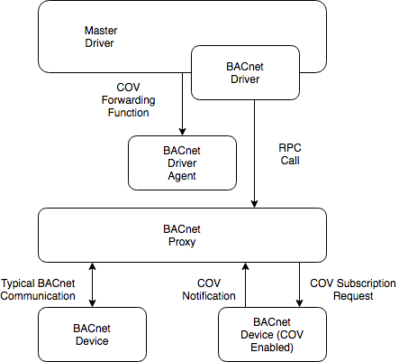

.. _BACnet-Proxy-Agent:

==================
BACnet Proxy Agent
==================

Introduction
------------

Communication with BACnet device on a network happens via a single
virtual BACnet device. Previous versions of Volttron used one virtual
device per device on the network. This only worked in a limited number
of circumstances. (This problem is fixed in the legacy sMap drivers in
Volttron 3.0 only) In the new driver architecture, we have a separate
agent specifically for communicating with BACnet devices and managing
the virtual BACnet device.

Configuration
-------------

The agent configuration sets up the virtual BACnet device.

.. code-block:: json

    {
        "device_address": "10.0.2.15",
        "max_apdu_length": 1024,
        "object_id": 599,
        "object_name": "Volttron BACnet driver",
        "vendor_id": 15,
        "segmentation_supported": "segmentedBoth"
    }

BACnet device settings
**********************

-  **device_address** - Address bound to the network port over which
   BACnet communication will happen on the computer running VOLTTRON.
   This is **NOT** the address of any target device. See `Device Addressing`_.   
-  **object_id** - ID of the Device object of the virtual BACnet
   device. Defaults to 599. Only needs to be changed if there is
   a conflicting BACnet device ID on your network.

These settings determine the capabilities of the virtual BACnet device.
BACnet communication happens at the lowest common denominator between
two devices. For instance, if the BACnet proxy supports segmentation and
the target device does not communication will happen without
segmentation support and will be subject to those limitations.
Consequently, there is little reason to change the default settings
outside of the **max_apdu_length** (the default is not the largest
possible value).

-  **max_apdu_length** - (From bacpypes documentation) BACnet works on
   lots of different types of networks, from high-speed Ethernet to
   “slower” and “cheaper” ARCNET or MS/TP (a serial bus protocol used
   for a field bus defined by BACnet). For devices to exchange messages
   they have to know the maximum size message the device can handle.
   (End BACpypes docs)

   This setting determines the largest APDU accepted by the BACnet
   virtual device. Valid options are 50, 128, 206, 480, 1024, and 1476. 
   Defaults to 1024.(Optional)

-  **object_name** - Name of the object. Defaults to "Volttron BACnet
   driver". (Optional)
-  **vendor_id** - Vendor ID of the virtual BACnet device. Defaults to
   15. (Optional)
-  **segmentation_supported** - (From bacpypes documentation) A vast
   majority of BACnet communications traffic fits into one message, but
   there can be times when larger messages are convenient and more
   efficient. Segmentation allows larger messages to be broken up into
   segments and spliced back together. It is not unusual for “low power”
   field equipment to not support segmentation. (End BACpypes docs)

   Possible setting are "segmentedBoth" (default), "segmentedTransmit",
   "segmentedReceive", or "noSegmentation" (Optional)

Device Addressing
-----------------

In some cases, it will be needed to specify the subnet mask of the
virtual device or a different port number to listen on. The full format
of the BACnet device address is 

    ``<ADDRESS>/<NETMASK>:<PORT>``
    
where ``<PORT>`` is the port to use and ``<NETMASK>`` is the netmask length. 
The most common value is 24. See http://www.computerhope.com/jargon/n/netmask.htm

For instance, if you need to specify a subnet mask of 255.255.255.0
and the IP address bound to the network port is 192.168.1.2 you 
would use the address

::

    192.168.1.2/24

If your BACnet network is on a different port (47809) besides the
default (47808) you would use the address

::

    192.168.1.2:47809

If you need to do both

::

    192.168.1.2/24:47809

.. _bacnet-proxy-multiple-networks:

Communicating With Multiple BACnet Networks
-------------------------------------------

If two BACnet devices are connected to different ports they are
considered to be on different BACnet networks. In order to communicate
with both devices, you will need to run one BACnet Proxy Agent per
network.

Each proxy will need to be bound to different ports appropriate for
each BACnet network and will need a different VIP identity specified.
When configuring drivers you will need to specify which proxy to use by
:ref:`specifying the VIP identity <vip-identity-assignment>`.

TODO: Add link to docs showing how to specify the VIP IDENTITY when installing an agent.

For example, a proxy connected to the default BACnet network

.. code-block:: json

    {
        "device_address": "192.168.1.2/24"
    }

and another on port 47809

.. code-block:: json

    {
        "device_address": "192.168.1.2/24:47809"
    }

a device on the first network

.. code-block:: json

    {
        "driver_config": {"device_address": "1002:12",
                          "proxy_address": "platform.bacnet_proxy_47808",
                          "timeout": 10},
        "driver_type": "bacnet",
        "registry_config":"config://registry_configs/bacnet.csv",
        "interval": 60,
        "timezone": "UTC",
        "heart_beat_point": "Heartbeat"
    }

and a device on the second network

.. code-block:: json

    {
        "driver_config": {"device_address": "12000:5",
                          "proxy_address": "platform.bacnet_proxy_47809",
                          "timeout": 10},
        "driver_type": "bacnet",
        "registry_config":"config://registry_configs/bacnet.csv",
        "interval": 60,
        "timezone": "UTC",
        "heart_beat_point": "Heartbeat"
    }

Notice that both configs use the same registry configuration
(config://registry_configs/bacnet.csv). This is perfectly fine as long as the
registry configuration is appropriate for both devices.
For scraping large numbers of points from a single BACnet device, 
there is an optional timeout parameter provided, to prevent the master driver 
timing out while the BACnet Proxy Agent is collecting points.

BACnet Change of Value Services
-------------------------------

|BACnet Change of Value Communications|

Change of Value Services added in version 0.5 of the BACnet Proxy and version
3.2 of the Master Driver.

There are a variety of scenarios in which a BACnet device may want to publish
values independently of the regular scrape interval. Bacpypes provides a
"ChangeOfValueServices" (further referred to as 'COV') module, which will
enable a device to push values up the Volttron stack.

The BACnet COV requires that the device include the ChangeOfValueServices module
from Bacpypes. A BACnet object on the device can be instantiated with the
'covIncrement' value set, which determines the threshold for a COV notification.
Based on configuration options for BACnet drivers, the driver will instruct the
BACnet Proxy to establish a COV subscription with the device. The subscription
will last for an amount of time specified in the driver configuration, and will
auto-renew the subscription. If the proxy loses communication with the device or
the device driver is stopped the subscription will be removed when the lifetime
expires. While the subscription exists, the device will send notifications to the
BACnet proxy, which will forward them through the Master Driver to the
appropriate Driver Agent.

https://bacpypes.readthedocs.io/en/latest/modules/service/cov.html

