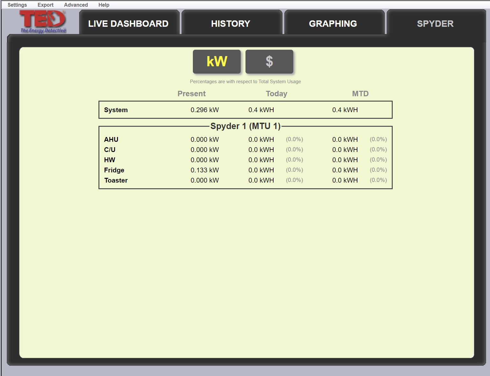

.. _The-Energy-Detective-Driver:

The Energy Detective Meter Driver
------------------------------------

Introduction
------------

The TED-Pro is an energy monitoring system that can measure energy consumption
of multiple mains and supports submetering of individual circuits. 
This driver connects to a TED Pro Energy Control Center (ECC) and can collect
information from multiple Measuring Transmiting Units (MTUs) and Spyder submetering
devices connected to the ECC.

configuration
-------------

The TED Pro device interface is configured as follows. You'll need the ip address
or hostname of the ECC on a network segment accessible from the Volttron instance, 
if configured to use a port other than 80, you can provide it as shown below,
following a colon after the host address. 

.. code-block:: json

    {
        "driver_type": "ted_meter", 
        "driver_config": {
            "device_address": "192.168.1.100:8080", 
            "username": "username", 
            "password": "password", 
            "scrape_spyder": true, 
            "track_totalizers": true
        }
    }

Parameters
**********

    - **username** - Username if the TED Pro is configured with Basic Authentication
    - **password** - Password if the TED Pro is configured with Basic Authentication
    - **device_address** - Hostname or IP address of the TED Pro ECC, a non-standard port can be included if needed
    - **scrape_spyder** - Default true, enables or disables collection of the submetering data from spyder devices 
    connected to the TED Pro
    - **track_totalizers** - Default true, enables or disables tracking of lifetime totals in the VOLTTRON Driver

.. note::

    The TED Pro does not expose its internal lifetime totalized metering, instead offering month to date (MTD)
    and daily totals (TDY). Using the "track_totalizers" setting, the ted-meter driver will attempt to maintain
    monotonically increasing lifetime totalizers. To do so, it must retain state regarding the running total and
    the last read value. The driver makes use of the VOLTTRON Config subsystem to store this state.
    To reset these totals, delete the state/ted_meter config from the master driver config store and restart the 
    master driver.

.. note::

    This driver does not make use of the registry config. Because it is able to determine the configuration
    of the TED Pro Device via the API, it simply creates registers for each data source on the TED Pro

Examples
********

|TED Pro showing spyder outputs|

The above configuration in the TED will result in the following scrape from the ted-meter driver on the message bus:

.. code-block:: text

    2019-11-29 18:47:00,512 (listeneragent-3.2 25534) listener.agent INFO: Peer: pubsub, Sender: platform.driver:, Bus: ,
     Topic: devices/andrew-house/all, Headers: {'Date': '2019-11-29T18:47:00.488685+00:00',
     'TimeStamp': '2019-11-29T18:47:00.488685+00:00', 'min_compatible_version': '3.0', 'max_compatible_version': u'',
     'SynchronizedTimeStamp': '2019-11-29T18:47:00.000000+00:00'}, Message: 
    [{'mtu-1/load_kva': 0.368,
    'mtu-1/load_kw': 0.296,
    'mtu-1/phase_angle': 195,
    'mtu-1/phase_current-a': '0',
    'mtu-1/phase_current-b': '0',
    'mtu-1/phase_current-c': '0',
    'mtu-1/phase_voltage-a': '0',
    'mtu-1/phase_voltage-b': '0',
    'mtu-1/phase_voltage-c': '0',
    'mtu-1/power_factor': 0.804,
    'mtu-1/voltage': 121.30000000000001,
    'spyder-1/AHU/consumption': 0.0,
    'spyder-1/AHU/load': 0.0,
    'spyder-1/C/U/consumption': 0.0,
    'spyder-1/C/U/load': 0.0,
    'spyder-1/Fridge/consumption': 0.39300000000000007,
    'spyder-1/Fridge/load': 0.133,
    'spyder-1/HW/consumption': 1.186,
    'spyder-1/HW/load': 0.0,
    'spyder-1/Toaster/consumption': 0.241,
    'spyder-1/Toaster/load': 0.0,
    'system/consumption': 3.192000000000001},
    {'mtu-1/load_kva': {'type': 'integer', 'tz': u'', 'units': 'kVA'},
    'mtu-1/load_kw': {'type': 'integer', 'tz': u'', 'units': 'kW'},
    'mtu-1/phase_angle': {'type': 'integer', 'tz': u'', 'units': 'degrees'},
    'mtu-1/phase_current-a': {'type': 'integer', 'tz': u'', 'units': 'Amps'},
    'mtu-1/phase_current-b': {'type': 'integer', 'tz': u'', 'units': 'Amps'},
    'mtu-1/phase_current-c': {'type': 'integer', 'tz': u'', 'units': 'Amps'},
    'mtu-1/phase_voltage-a': {'type': 'integer', 'tz': u'', 'units': 'Volts'},
    'mtu-1/phase_voltage-b': {'type': 'integer', 'tz': u'', 'units': 'Volts'},
    'mtu-1/phase_voltage-c': {'type': 'integer', 'tz': u'', 'units': 'Volts'},
    'mtu-1/power_factor': {'type': 'integer', 'tz': u'', 'units': 'ratio'},
    'mtu-1/voltage': {'type': 'integer', 'tz': u'', 'units': 'Volts'},
    'spyder-1/AHU/consumption': {'type': 'integer', 'tz': u'', 'units': 'kWh'},
    'spyder-1/AHU/load': {'type': 'integer', 'tz': u'', 'units': 'kW'},
    'spyder-1/C/U/consumption': {'type': 'integer', 'tz': u'', 'units': 'kWh'},
    'spyder-1/C/U/load': {'type': 'integer', 'tz': u'', 'units': 'kW'},
    'spyder-1/Fridge/consumption': {'type': 'integer',
                                    'tz': u'',
                                    'units': 'kWh'},
    'spyder-1/Fridge/load': {'type': 'integer', 'tz': u'', 'units': 'kW'},
    'spyder-1/HW/consumption': {'type': 'integer', 'tz': u'', 'units': 'kWh'},
    'spyder-1/HW/load': {'type': 'integer', 'tz': u'', 'units': 'kW'},
    'spyder-1/Toaster/consumption': {'type': 'integer',
                                    'tz': u'',
                                    'units': 'kWh'},
    'spyder-1/Toaster/load': {'type': 'integer', 'tz': u'', 'units': 'kW'},
    'system/consumption': {'type': 'integer', 'tz': u'', 'units': 'kWh'}}]

