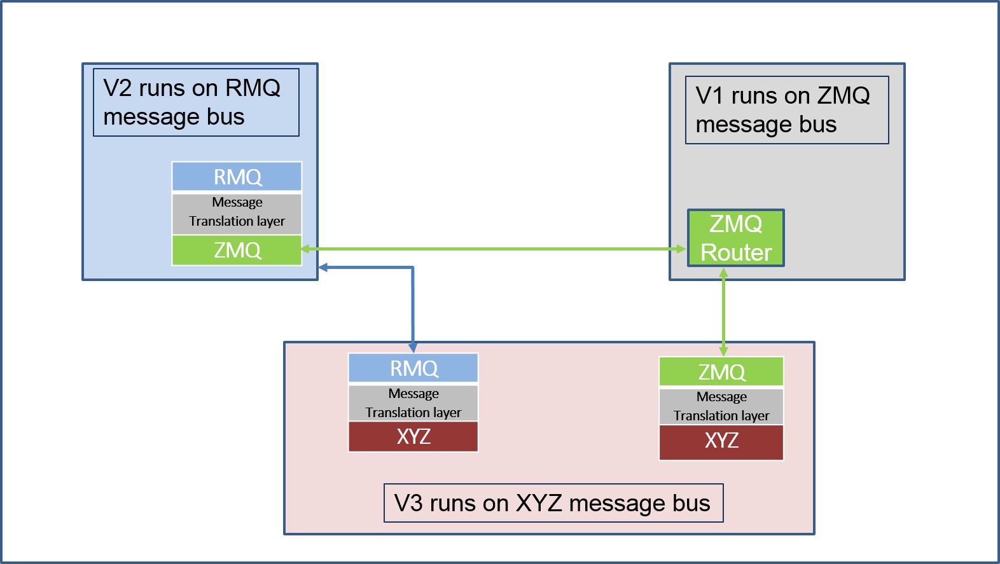

 .. _Messagebus-Plugin:

============================
Message Bus Plugin Framework
============================
The message bus plugin framework aims to decouple the VOLTTRON specific code from
the message bus implementation without compromising the existing features of the
platform. The concept of the plugin framework is similar to that used in historian
or driver framework i.e, we should be easily able to support multiple message buses
and be able to use any of them by following few installation and setup steps.

Message Bus Refactor
====================
It consists of five components
  1. New connection class per message bus
  2. Extensions to platform router functionality
  3. Extensions to core agent functionality
  4. A proxy agent for each message bus to support backward compatibility
  5. Authentication related changes

Connection class
================
A connection class that has methods to handle
  1. Connection to new message bus.
  2. Set properties such as message transmission rate, send/receive buffer sizes, open socket limits etc.
  3. Send/receive messages from the underlying layer.
  4. Error handling functionality.
  5. Disconnect from the message bus

Platform Level Changes
======================
A new message bus flag is introduced to indicate the type of message bus used by the
platform. If no message bus flag is added in the platform config file, the platform
uses default ZeroMQ based message bus.

Path of the config: $VOLTTRON_HOME/config

.. code-block:: console

    [volttron]
    vip-address = tcp://127.0.0.1:22916
    instance-name = volttron1
    message-bus = rmq

Please note, the valid message types are 'zmq' and 'rmq'.

On startup, platform checks for the type of message bus and creates appropriate router module.
Please note, ZeroMQ router functionality remains unchanged. However, a new router module
with limited functionality is added for RabbitMQ message bus. The actual routing of
messages is handed over to the RabbitMQ broker and router module will only handle some of the
necessary subsystem messages such as "hello", "peerlist", "query" etc. If a new message bus needs
to be added then the complexity of the router module depends on whether the messaging library uses
a broker based or broker less (as in case of ZeroMQ) protocol.

Agent Core Changes
==================
The application specific code of the agent remains unchanged. The agent core functionality is
modified to check the type of message bus and connect to and use the appropriate message bus.
On startup, the agent Core checks the type of message bus, connects to appropriate message bus
and routes messages to appropriate subsystem. All subsystem messages are encapsulated inside a
message bus agnostic VIP message object. If a new message bus needs to be added, then we would
have to extend the Agent Core to connect to new message bus.

Compatibility Between VOLTTRON Instances Running On Different Message Buses
===========================================================================
All the agents connected to local platform uses the same message bus that the platform is
connected to. But if we need agents running on different platforms with different message
buses to communicate with each other then we need some kind of proxy entity or bridge that
establishes the connection, handles the message routing and performs the message translation
between the different message formats. To achieve that, we have a proxy agent that acts as a
bridge between the local message bus and remote message bus. The role of the proxy agent is to

* Maintain connections to internal and external message bus.
* Route messages from internal to external platform.
* Route messages from external to internal platform.

The above figure shows three VOLTTRON instances with V1 connected to ZMQ message bus, V2 connected
to RMQ message bus and V3 connected to XYZ (some message bus of the future) and all three want to
connect to each other. Then V2 and V3 will have proxy agents that get connected to the local bus
and to the remote bus and forward messages from one to another.
