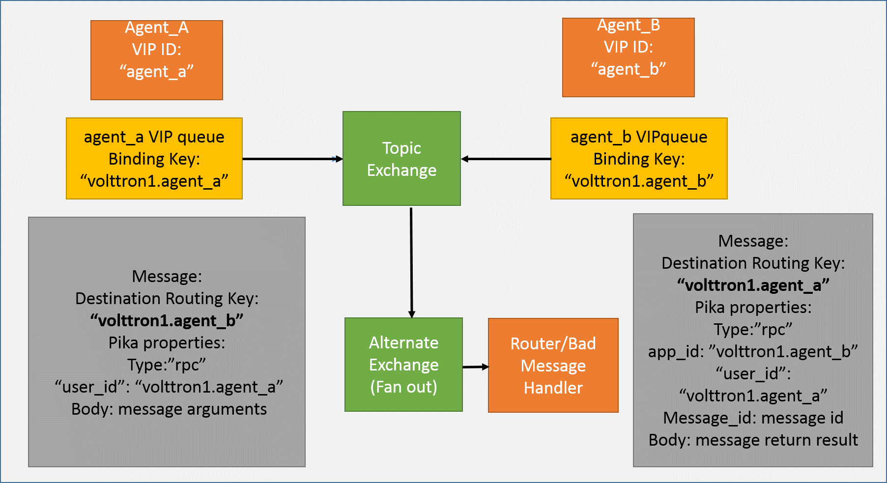

.. _RabbitMQ-VOLTTRON:

=======================
RabbitMQ Based VOLTTRON
=======================
RabbitMQ VOLTTRON uses Pika library for RabbitMQ message bus implementation. To setup VOLTTRON
instance to use RabbitMQ message bus, we need to first configure VOLTTRON to use RabbitMQ message
library. The contents of the RabbitMQ configuration file looks like below.

Path: $VOLTTRON_HOME/rabbitmq_config.yml

.. code-block:: yaml

    #host parameter is mandatory parameter. fully qualified domain name
    host: mymachine.pnl.gov

    # mandatory. certificate data used to create root ca certificate. Each volttron
    # instance must have unique common-name for root ca certificate
    certificate-data:
      country: 'US'
      state: 'Washington'
      location: 'Richland'
      organization: 'PNNL'
      organization-unit: 'VOLTTRON Team'
      # volttron1 has to be replaced with actual instance name of the VOLTTRON
      common-name: 'volttron1_root_ca'
    #
    # optional parameters for single instance setup
    #
    virtual-host: 'volttron' # defaults to volttron

    # use the below four port variables if using custom rabbitmq ports
    # defaults to 5672
    amqp-port: '5672'

    # defaults to 5671
    amqp-port-ssl: '5671'

    # defaults to 15672
    mgmt-port: '15672'

    # defaults to 15671
    mgmt-port-ssl: '15671'

    # defaults to true
    ssl: 'true'

    # defaults to ~/rabbitmq_server/rabbbitmq_server-3.7.7
    rmq-home: "~/rabbitmq_server/rabbitmq_server-3.7.7"

Each VOLTTRON instance resides within a RabbitMQ virtual host. The name of the virtual
host needs to be unique per VOLTTRON instance if there are multiple virtual instances
within a single host/machine. The hostname needs to be able to resolve to a valid IP.
The default port of AMQP port without authentication is 5672 and with authentication
is 5671. The default management HTTP port without authentication is 15672 and
with authentication is 15671. These needs to be set appropriately if default ports are
not used. The 'ssl' flag indicates if SSL based authentication is required or not.
If set to True, information regarding SSL certificates needs to be also provided.
SSL based authentication is described in detail in `Authentication And Authorization With RabbitMQ Message Bus <RabbitMQ-Auth>`_.

To configure the VOLTTRON instance to use RabbitMQ message bus, run the following command.

    vcfg --rabbitmq single [optional path to rabbitmq_config.yml]

At the end of the setup process, RabbitMQ broker is setup to use the configuration provided.
A new topic exchange for the VOLTTRON instance is created within the configured virtual host.

On platform startup, VOLTTRON checks for the type of message bus to be used. If using RabbitMQ
message bus, the RabbitMQ platform router is instantiated. The RabbitMQ platform router,

* Connects to RabbitMQ broker (with or without authentication)
* Creates a VIP queue and binds itself to the "VOLTTRON" exchange with binding key "<instance-name>.router". This binding key makes it unique across multiple VOLTTRON instances in a single machine as long as each instance has a unique instance name.
* Handles messages intended for router module such as "hello", "peerlist", "query" etc.
* Handles unrouteable messages - Messages which cannot be routed to any destination agent are captured and an error message indicating "Host Unreachable" error is sent back to the caller.
* Disconnects from the broker when the platform shuts down.

When any agent is installed and started, the Agent Core checks for the type of message bus used.
If it is RabbitMQ message bus then

* It creates a RabbitMQ user for the agent.
* If SSL based authentication is enabled, client certificates for the agent is created.
* Connect to the RabbitQM broker with appropriate connection parameters
* Creates a VIP queue and binds itself to the "VOLTTRON" exchange with binding key "<instance-name>.<agent identity>".
* Sends and receives messages using Pika library methods.
* Checks for the type of subsystem in the message packet that it receives and calls the appropriate subsystem message handler.
* Disconnects from the broker when the agent stops or platform shuts down.

RPC In RabbitMQ VOLTTRON
========================
The agent functionality remain unchanged irrespective of the underlying message bus used.
That means they can continue to use the same RPC interfaces without any change.

Consider two agents with VIP identities "agent_a" and "agent_b" connected to VOLTTRON platform
with instance name "volttron1". Agent A and B each have a VIP queue with binding key "volttron1.agent_a"
and "volttron1.agent_b". Following is the sequence of operation when Agent A wants to make RPC
call to Agent B.

1. Agent A make RPC call to Agent B.
   agent_a.vip.rpc.call("agent_b", set_point, "point_name", 2.5)

2. RPC subsystem wraps this call into a VIP message object and sends it to Agent B.
3. The VOLTTRON exchange routes the message to Agent B as the destination routing in the VIP message object matches with the binding key of Agent B.
4. Agent Core on Agent B receives the message, unwraps the message to find the subsystem type and calls the RPC subsystem handler.
5. RPC subsystem makes the actual RPC call "set_point()" and gets the result. It then wraps into VIP message object and sends it back to the caller.
6. The VOLTTRON exchange routes it to back to Agent A.
7. Agent Core on Agent A calls the RPC subsystem handler which in turn hands over the RPC result to Agent A application.

PUBSUB In RabbitMQ VOLTTRON
===========================
The agent functionality remains unchanged irrespective of the platform using ZeroMQ based pubsub or
RabbitMQ based pubsub i,e, agents continue to use the same PubSub interfaces and use the same topic
format delimited by “/”. Since RabbitMQ expects binding key to be delimited by '.', RabbitMQ PUBSUB
internally replaces '/' with ".". Additionally, all agent topics converted to
“__pubsub__.<instance_name>.<remainder of topic>” to differentiate from main Agent VIP queue binding.

Consider two agents with VIP identities "agent_a" and "agent_b" connected to VOLTTRON platform
with instance name "volttron1". Agent A and B each have a VIP queue with binding key "volttron1.agent_a"
and "volttron1.agent_b". Following is the sequence of operation when Agent A subscribes to a topic and Agent B
publishes to same the topic.

1. Agent B makes subscribe call for topic "devices".
      agent_b.vip.pubsub.subscribe("pubsub", prefix="devices", callback=self.onmessage)

2. Pubsub subsystem creates binding key from the topic “__pubsub__.volttron1.devices.#”

3. It creates a queue internally and binds the queue to the VOLTTRON exchange with the above binding key.

4. Agent B is publishing messages with topic: "devices/hvac1".
   agent_b.vip.pubsub.publish("pubsub", topic="devices/hvac1", headers={}, message="foo").

5. PubSub subsystem internally creates a VIP message object and publishes on the VOLTTRON exchange.

6. RabbitMQ broker routes the message to Agent B as routing key in the message matches with the binding key of the topic subscription.

7. The pubsub subsystem unwraps the message and calls the appropriate callback method of Agent A.

If agent wants to subscribe to topic from remote instances, it uses
agent.vip.subscribe(“pubsub”, “devices.hvac1”, all_platforms=True”)
It is internally set to “__pubsub__.*.<remainder of topic>”

Pubsub subsystem for ZeroMQ message bus performs O(N) comparisons where N is the number of unique
subscriptions. RabbitMQ Topic Exchange was enhanced in version 2.6.0 to reduce the overhead of
additional unique subscriptions to almost nothing in most cases. We speculate they are using a tree
structure to store the binding keys which would reduce the search time to O(1) in most cases
and O(ln) in the worst case. VOLTTRON PUBSUB with ZeroMQ could be updated to match this performance
scalability with some effort.

Multi-Platform Communication In RabbitMQ VOLTTRON
=================================================
With ZeroMQ based VOLTTRON, multi-platform communication was accomplished in three different ways.

1. Direct connection to remote instance - Write an agent that would connect to remote instance directly.

2. Special agents - Use special agents such as forward historian/data puller agents that would
forward/receive messages to/from remote instances.
In RabbitMQ-VOLTTRON, we make use of shovel plugin to achieve this behavior. Please refer to
:ref:`Shovel Plugin <Shovel>` to get an overview of shovels.

3. Multi-Platform RPC and PubSub - Configure VIP address of all remote instances that an instance has
to connect to in it's $VOLTTRON_HOME/external_discovery.json and let the router module in each
instance manage the connection and take care of the message routing for us. In RabbitMQ-VOLTTRON, we
make use of federation plugin to achieve this behavior. Please refer to
:ref:`Federation Plugin <Federation>` get an overview of federation.

Using Federation Plugin
-----------------------
We can connect multiple VOLTTRON instances using the federation plugin. Before setting up federation
links, we need to first identify upstream server and downstream server. Upstream Server is the node
that is publishing some message of interest and downStream server is the node that wants to receive
messages from the upstream server. A federation link needs to be established from a downstream VOLTTRON
instance to upstream VOLTTRON instance. To setup  a federation link, we will need to add upstream server
information in a RabbitMQ federation configuration file

Path: $VOLTTRON_HOME/rabbitmq_federation_config.yml

.. code-block:: yaml

    # Mandatory parameters for federation setup
    federation-upstream:
      rabbit-4:
        port: '5671'
        virtual-host: volttron4
      rabbit-5:
        port: '5671'
        virtual-host: volttron5

To configure the VOLTTRON instance to setup federation, run the following command.

    vcfg --rabbitmq federation [optional path to rabbitmq_federation_config.yml]

This will setup federation links to upstream servers and sets policy to make the VOLTTRON
exchange *federated*. Once a federation link is established to remote instance, the messages
published on the remote instance become available to local instance as if it were published on
the local instance.

For detailed instructions to setup federation, please refer to README section <>.

Multi-Platform RPC With Federation
----------------------------------
For multi-platform RPC communication, federation links need to be established on both the VOLTTRON
nodes. Once the federation links are established, RPC communication becomes fairly simple.

.. image:: files/multiplatform_rpc.png

Consider Agent A on volttron instance "volttron1" on host "host_A" wants to make RPC call on Agent B
on VOLTTRON instance "volttron2" on host "host_B".

1. Agent A makes RPC call.

.. code-block:: Python

    kwargs = {"external_platform": self.destination_instance_name}
    agent_a.vip.rpc.call("agent_b", set_point, "point_name", 2.5, \**kwargs)

2. The message is transferred over federation link to VOLTTRON instance "volttron2" as both the exchanges are made *federated*.

3. RPC subsystem of Agent B calls the actual RPC method and gets the result. It encapsulates the message result into VIP message object and sends it back to Agent A on VOLTTRON instance "volttron1".

4. The RPC subsystem on Agent A receives the message result and gives it to Agent A application.

Multi-Platform PubSub With Federation
-------------------------------------
For multi-platform PubSub communication, it is sufficient to have federation link from downstream server
to upstream server. In case of bi-directional data flow, links have to established in both the directions.

Consider Agent B on volttron instance "volttron2" on host "host_B" wants to subscribe to messages from
VOLTTRON instance "volttron2" on host "host_B". Firstly, federation link needs to be established from
"volttron2" to "volttron1".

1. Agent B makes a subscribe call.

    agent_b.vip.subscribe.call("pubsub", prefix="devices", all_platforms=True)

2. The PubSub subsystem converts the prefix to "__pubsub__.*.devices.#". Here, "*" indicates that agent is subscribing to "devices" topic from all the VOLTTRON platforms.

3. A new queue is created and bound to VOLTTRON exchange with above binding key. Since the VOLTTRON exchange is a *federated exchange*, any subscribed message on the upstream server becomes available on the federated exchange and Agent B will be able to receive it.

4. Agent A publishes message to topic "devices/pnnl/isb1/hvac1"

5. PubSub subsystem publishes this messgae on it's VOLTTRON exchange.

6. Due to the federation link, message is received by the Pubsub subsytem of Agent A.

Using Shovel Plugin
-------------------
Shovels act as well written client application which moves messages from source to destination broker.
Below configuration shows how to setup a shovel to forward PubSub messages or perform
multi-platform RPC communication from local to a remote instance. It expects hostname,
port and virtual host of remote instance.

Path: $VOLTTRON_HOME/rabbitmq_shovel_config.yml

.. code-block:: yaml

    # Mandatory parameters for shovel setup
    shovel:
      rabbit-2:
        port: '5671'
        virtual-host: volttron
        # Configuration to forward pubsub topics
        pubsub:
          # Identity of agent that is publishing the topic
          platform.driver:
            - devices
        # Configuration to make remote RPC calls
        rpc:
          # Remote instance name
          volttron2:
            # List of pair of agent identities (local caller, remote callee)
            - [scheduler, platform.actuator]

To forward PubSub messages, the topic and agent identity of the publisher agent is needed.
To perform RPC, instance name of the remote instance and agent identities of the local agent
and remote agent are needed.

To configure the VOLTTRON instance to setup shovel, run the following command.

    vcfg --rabbitmq shovel [optional path to rabbitmq_shovel_config.yml]

This setups up a shovel that forwards messages (either PubSub or RPC) from local exchange
to remote exchange.

Multi-Platform PubSub With Shovel
---------------------------------
After the shovel link is established for Pubsub, the below figure shows how the communication happens.
Please note, for bi-directional pubsub communication, shovel links need to be created on
both the nodes. The "blue" arrows show the shovel binding key. The pubsub topic configuration
in `$VOLTTRON_HOME/rabbitmq_shovel_config.yml` get internally converted to shovel binding key,
`"__pubsub__.<local instance name>.<actual topic>"`.

.. image:: files/multiplatform_shovel_pubsub.png

Now consider a case where shovels are setup in both the directions for forwarding "devices"
topic.

1. Agent B makes a subscribe call to receive messages with topic "devices" from all connected platforms.

    agent_b.vip.subscribe.call("pubsub", prefix="devices", all_platforms=True)

2. The PubSub subsystem converts the prefix to "__pubsub__.*.devices.#"
"*" indicates that agent is subscribing to "devices" topic from all the VOLTTRON platforms.

3. A new queue is created and bound to VOLTTRON exchange with above binding key.

4. Agent A publishes message to topic "devices/pnnl/isb1/hvac1"

5. PubSub subsystem publishes this message on it's VOLTTRON exchange.

6. Due to a shovel link from VOLTTRON instance "volttron1" to "volttron2", the message is forwarded from volttron exchange "volttron1" to "volttron2" and picked up by Agent A on "volttron2".

Multi-Platform RPC With Shovel
------------------------------
After the shovel link is established for multi-platform RPC, the below figure shows how the
RPC communication happens. Please note it is mandatory to have shovel links on both directions
as it is request-response type of communication. We will need to set the agent identities for
caller and callee in the `$VOLTTRON_HOME/rabbitmq_shovel_config.yml`. The "blue" arrows show
the resulting the shovel binding key.

.. image:: files/multiplatform_shovel_rpc.png

Consider Agent A on volttron instance "volttron1" on host "host_A" wants to make RPC call on Agent B
on VOLTTRON instance "volttron2" on host "host_B".

1. Agent A makes RPC call.

.. code-block:: Python

    kwargs = {"external_platform": self.destination_instance_name}
    agent_a.vip.rpc.call("agent_b", set_point, "point_name", 2.5, \**kwargs)

2. The message is transferred over shovel link to VOLTTRON instance "volttron2".

3. RPC subsystem of Agent B calls the actual RPC method and gets the result. It encapsulates the message result into VIP message object and sends it back to Agent A on VOLTTRON instance "volttron1".

4. The RPC subsystem on Agent A receives the message result and gives it to Agent A application.

RabbitMQ Management Tool Integrated Into VOLTTRON
=================================================
Some of the important native RabbitMQ control and management commands are now integrated with
"volttron-ctl" (vctl) utility. Using volttron-ctl RabbitMQ management utility, we can control and
monitor the status of RabbitMQ message bus.

::

    vctl rabbitmq --help
    usage: vctl command [OPTIONS] ... rabbitmq [-h] [-c FILE] [--debug]
                                                       [-t SECS]
                                                       [--msgdebug MSGDEBUG]
                                                       [--vip-address ZMQADDR]
                                                       ...
    subcommands:

        add-vhost           add a new virtual host
        add-user            Add a new user. User will have admin privileges
                            i.e,configure, read and write
        add-exchange        add a new exchange
        add-queue           add a new queue
        list-vhosts         List virtual hosts
        list-users          List users
        list-user-properties
                            List users
        list-exchanges      add a new user
        list-exchange-properties
                            list exchanges with properties
        list-queues         list all queues
        list-queue-properties
                            list queues with properties
        list-bindings       list all bindings with exchange
        list-federation-parameters
                            list all federation parameters
        list-shovel-parameters
                            list all shovel parameters
        list-policies       list all policies
        remove-vhosts       Remove virtual host/s
        remove-users        Remove virtual user/s
        remove-exchanges    Remove exchange/s
        remove-queues       Remove queue/s
        remove-federation-parameters
                            Remove federation parameter
        remove-shovel-parameters
                            Remove shovel parameter
        remove-policies     Remove policy
