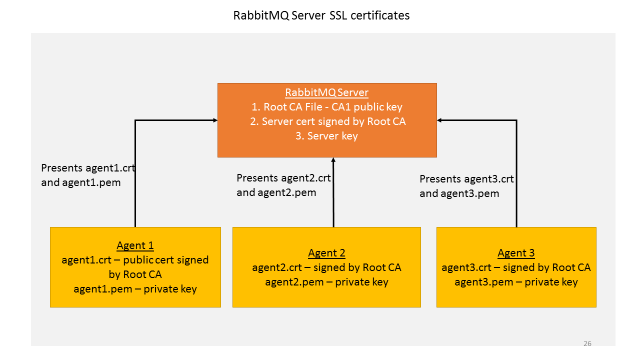

.. _RabbitMQ-Auth:
==========================================================
Authentication And Authorization With RabbitMQ Message Bus
==========================================================

Authentication In RabbitMQ VOLTTRON
***********************************
RabbitMQ VOLTTRON uses SSL based authentication, rather than the default username and password authentication. The necessary SSL configurations can be seen by running the following command:

``cat ~/rabbitmq_server/rabbitmq_server-3.7.7/etc/rabbitmq/rabbitmq.conf``

The configurations required to enable SSL:

.. code-block:: shell

    listeners.ssl.default = 5671 (port for listening for SSL connections)
    ssl_options.cacertfile = VOLTTRON_HOME/certificates/certs/volttron1-trusted-cas.crt Certificate Authority (CA) 
    ssl_options.certfile = VOLTTRON_HOME/certificates/certs/volttron1-server.crt
    ssl_options.keyfile = VOLTTRON_HOME/certificates/private/volttron1-server.pem
    ssl_options.verify = verify_peer
    ssl_options.fail_if_no_peer_cert = true (if client fails to provide certificate: true = SSL connection rejected, false = accepted)
    auth_mechanisms.1 = EXTERNAL

**Parameter explanations**

- listeners.ssl.default: port for listening for SSL connections  
- ssl_options.cacertfile: path to trusted Certificate Authorities (CA)  
- ssl_options.certfile: path to server public certificate  
- ssl_options.keyfile: path to server's private key
- ssl_options.verify: whether verification is enabled
- ssl_options.fail_if_no_peer_cert: upon client's failure to provide certificate, SSL connection either rejected (true) or accepted (false)
- auth_mechanisms.1: type of authentication mechanism. EXTERNAL means SSL authentication is used

SSL uses the `Public Key Infrastructure <https://en.wikipedia.org/wiki/Public_key_infrastructure>`_ where public and
private certificates are used to construct / verify ones digital identity.

SSL in RabbitMQ VOLTTRON
------------------------
To configure RabbitMQ-VOLTTRON to use SSL based authentication, we need to add SSL configuration in rabbitmq_config.yml. Below is an example of the manditory inputs

.. code-block:: yaml

    #host parameter is mandatory parameter. fully qualified domain name
    host: mymachine.pnl.gov

    # mandatory. certificate data used to create root ca certificate. Each volttron
    # instance must have unique common-name for root ca certificate
    certificate-data:
      country: 'US'
      state: 'Washington'
      location: 'Richland'
      organization: 'PNNL'
      organization-unit: 'VOLTTRON Team'
      # volttron1 has to be replaced with actual instance name of the VOLTTRON
      common-name: 'volttron1_root_ca'

While the remainder of the default config file is optional requirements, The ssl flag in rabbitmq_config.yml must be set to true to configure a single RabbitMQ instance with SSL authentication. This is currently the default setting.

.. code-block:: yaml
    # defaults to true
    ssl: 'true'

For additional information, refer to the “RabbitMQ Based VOLTTRON” section in
https://github.com/volttron/volttron/blob/rabbitmq-volttron/docs/source/core_services/messagebus_refactor/RabbitMQ-Refactor-VOLTTRON.rst

When one creates a single instance of RabbitMQ using the command, the following is created / re-created as per the configuration in rabbitmq_config file.

``vcfg --rabbitmq single <path to config file>``

When one creates a single instance of RabbitMQ, the following is created / re-created from rabbitmq.conf:

- Public and private CA files

- Public (automatically signed by the CA) and private server certificates

- Admin certificate for the RabbitMQ instance

The public files can be found at ``VOLTTRON_HOME/certificates/certs`` and the private files can be found
at ``/VOLTTRON_HOME/certificates/private``
It is used to store the root cas of all the instances that the RabbitMQ Server has to connect to.
There is also a trusted-cas.crt file, which is used to store the root cas of all VOLTTRON instances that the RabbitMQ has connected to. The trusted ca is only created once, but can be updated.
Initially, the trusted ca is a copy of the the ROOT CA file <rmq-instance-name>-root-ca.crt, but as more agents and more instances of the RabbitMQServer are added to the trusted certificate, this changes.

When each agent is started for the first time with the RMQ message bus, the agent will have a new public - private key
pair created for them, where the certificate is the public key. This certificate will be signed by the volttron
instance's ROOTCA.

Every RABBITMQ has a single self signed root ca and server certificate signed by the ROOT CA. This is created during VOLTTRON setup and the RABBITMQ server is configured and started with these two certificates.  Every time an agent is started, the platform automatically creates an agent certificate that signed by the same ROOT CA. When an agent communicates with the rabbitmq message bus it presents it agent certificate and private key to the server and the server validates  if it is signed by a ROOT CA it trusts – ie. the root certificate it was started with.  Since there is only a single ROOT CA for one VOLTTRON instance, all the agents in this instance can communicate with the message bus over SSL.

In order to interact with the RabbitMQ server, each agent must present its certificate and private key (since this is in one instance of the VOLTTRON platform). Since the agents public certificate has been signed by the ROOT CA, it is trusted and can interact with the RABBITMQ server.

Multi-Platform Communication With RabbitMQ SSL
==============================================
The SSL authentication is useful in scenarios such as interacting with agents on another RabbitMQ server via federation or shovel. 

.. image:: files/multiplatform_ssl.png

Suppose there are two VMs (VOLTTRON1 and VOLTTRON2) running single instances of RabbitMQ, and VOLTTRON1 and VOLTTRON2 want to talk to each other via either the federation or shovel plugins. In order for VOLTTRON1 to talk to VOLTTRON2, VOLTTRON1 must present it's root certificate, and have it appended to VOLTTRON2's trusted ca. VOLTTRON2 must in turn present its root certificate to VOLTTRON1's trusted ca, so that VOLTTRON1 will know it is safe to talk to VOLTTRON2. 

For more detailed information about SSL based authentication control, please refer to
RabbitMQ documentation `TLS Support <https://www.rabbitmq.com/ssl.html>`_.

Authorization in RabbitMQ VOLTTRON
==================================
To be implemented in VOLTTRON

For more detailed information about access control, please refer to RabbitMQ documentation
`Access Control <https://www.rabbitmq.com/access-control.html>`_.
