.. _VtnServerGuide:

OpenADR VTN Server: User Guide
==============================

This guide assumes that you have a valid user account to access and log in to the VTN application website.

Login Screen
------------

In order to begin using the VTN application, navigate to \http://yourhostname*<or>*ip:8000/vtn.

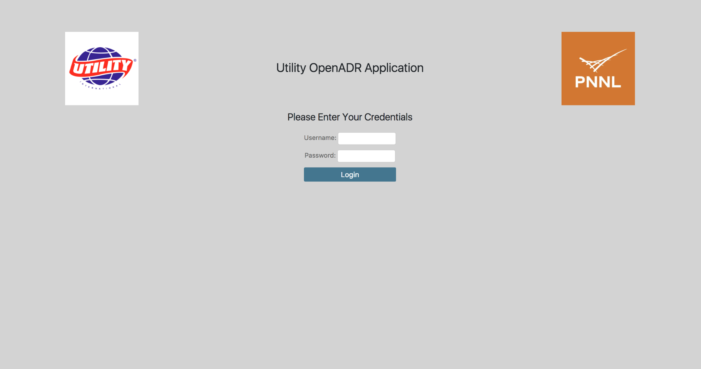

Overview Screen
---------------

Once logged in for the first time, this is the ‘Overview’ screen.

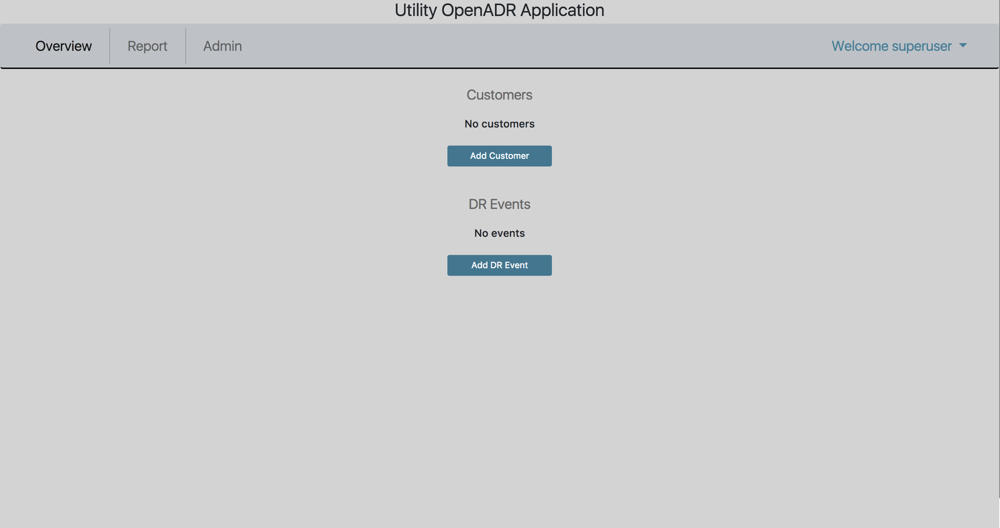

In order to begin scheduling DR events, one must first create at least one customer,
with at least one associated site/VEN, and at least one sort of demand response (DR) program.
A VTN will not be able to tell a VEN about DR Events if the VTN doesn’t know about the VEN.
A VTN knows about a VEN after a Site for the VEN has been created in the VTN application,
and the VEN has contacted the VTN.

The rest of this document describes how to set up Customers, Sites, DR Programs,
and DR Events, as well as how to export event data.

Create a Customer
-----------------

Creating a Customer can be done by clicking on ‘Add Customer’ on the **Overview** screen.

The standard interface for adding a Customer:

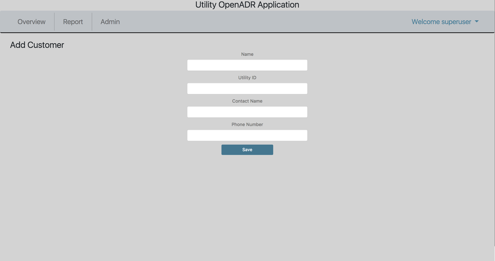

Customers will appear on the **Overview** screen after they have been added.

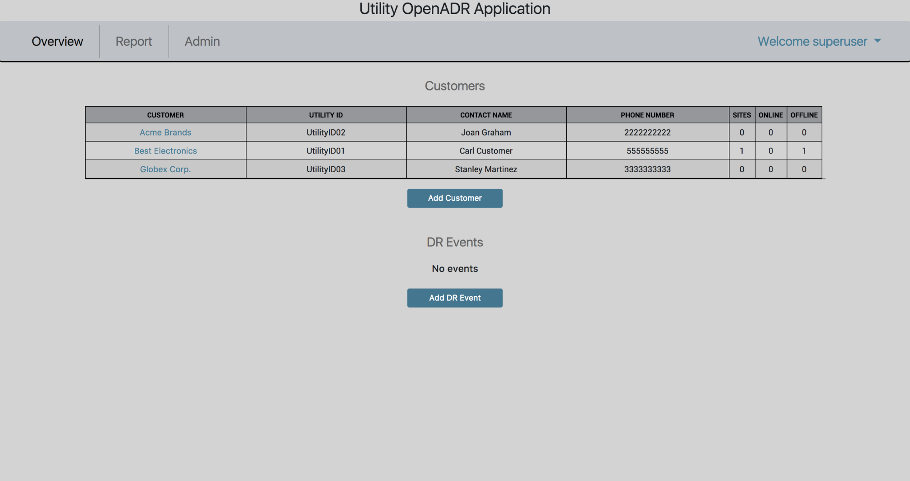

Create a Site
-------------

At first, Customers will not have any Sites. To add a Site for a Customer,
click on the Customer’s name from the **Overview** screen, and then click ‘Create New Site’.

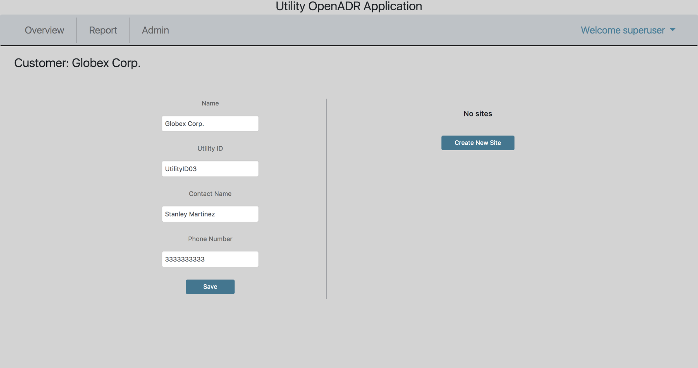

On the **Create Site** screen, DR Programs will appear in the ‘DR Programs’
multiple-select box if they have been added. This will be discussed soon.
Selecting one or more DR Programs here means, when creating a DR Event with a
specified DR Program, the site will be an available option for the given DR Event.

*A site’s ‘VEN Name’ is permanent. In order to change a Site’s VEN Name, the Site must be deleted and re-added.*

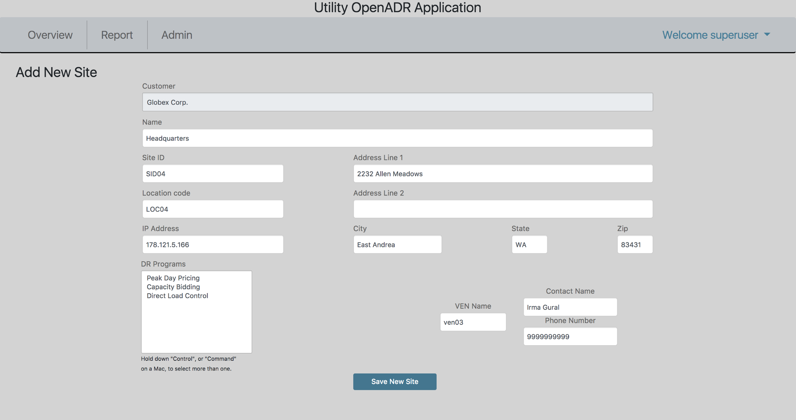

After creating a Site for a given customer, the Site will appear offline until
communication has been established with the Site’s VEN within a configurable
interval (default is 15 minutes).

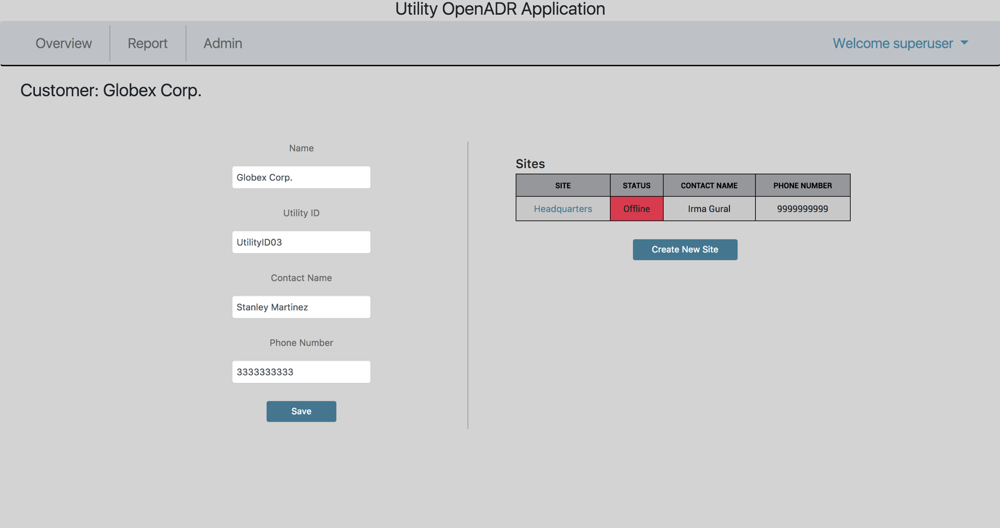

Note: When editing a Site, you will notice an extra field on the Screen labeled ‘VEN ID’.
This field is assigned automatically upon creation of a Site and is used by the VTN
to communicate with and identify the VEN.

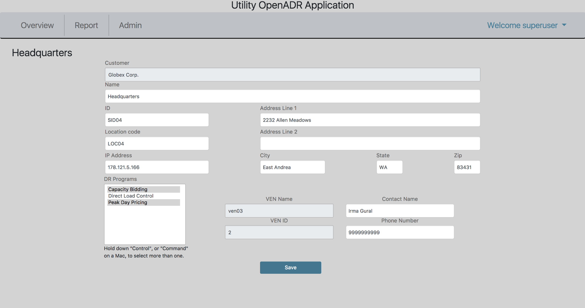

Create a DR Program
-------------------

DR Programs must be added via the Admin interface. DR Programs can be added with
or without associated sites. In other words, a DR Program can be created with no sites,
and sites can be added later, either by Creating/Editing a Site and selecting
the DR Program, or by Creating/Editing the DR Program and adding the Site.

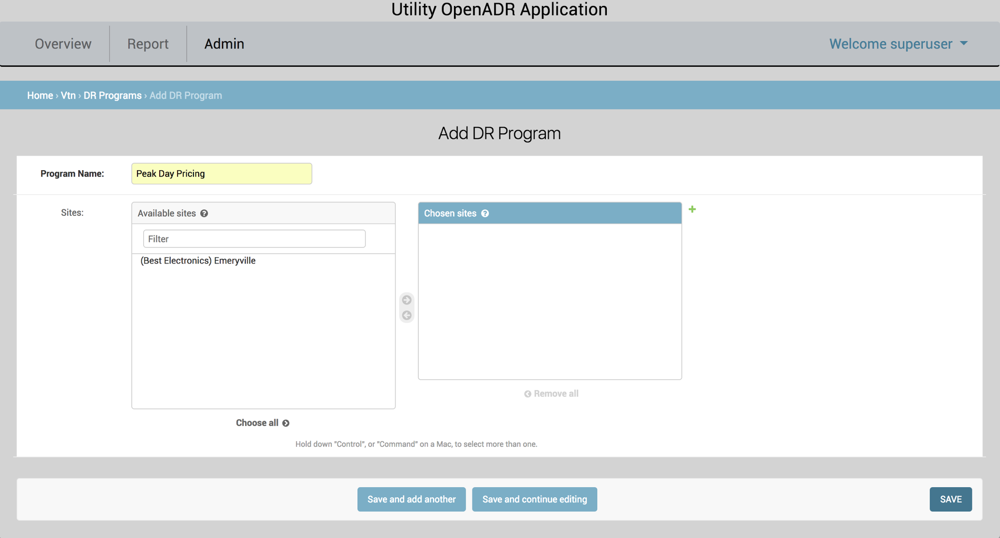

Create a DR Event
-----------------

Once a Customer (with at least one site) and a DR Program have been added, a DR Event
can be created. This is done by navigating to the **Overview** screen and clicking ‘Add DR Event’.

On the **Add DR Event** screen, the first step is to select a DR Program from the drop-down menu.
Once a DR Program is selected, the ‘Sites’ multi-select box will auto-populate with
the Sites that are associated with that DR Program.

*Note that the Notification Time is the absolute soonest time that a VEN will be*
*notified of a DR Event.  VENs will not ‘know’ about DR Events that apply to them*
*until they have ‘polled’ the VTN after the Notification Time.*

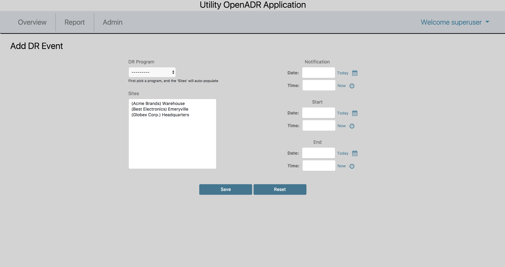

Active DR events are displayed on the **Overview** screen.  DR Events are considered active
if they have not been cancelled and if they have not been completed.

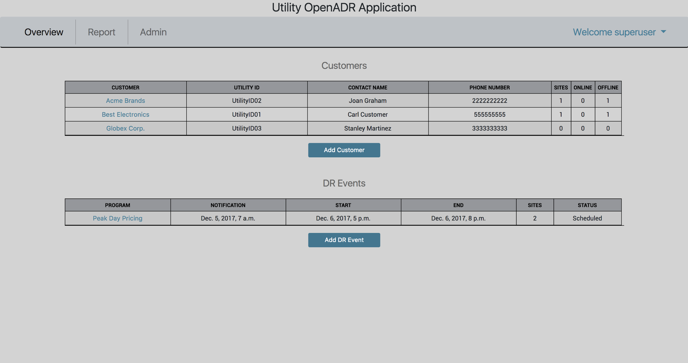

Exporting event telemetry to a .csv is available on the **Report** tab. In the case of
this VTN and its associated VENs, the telemetry that will be reported include
**baseline power (kw)** and **measured power (kw)**.

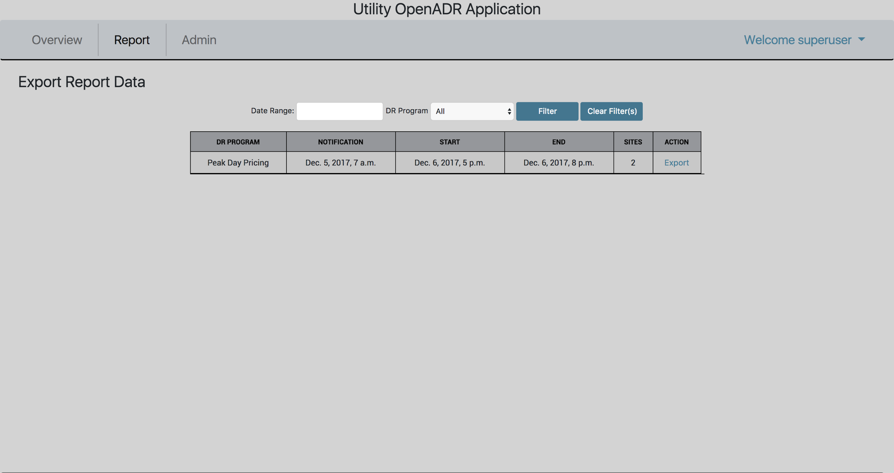
