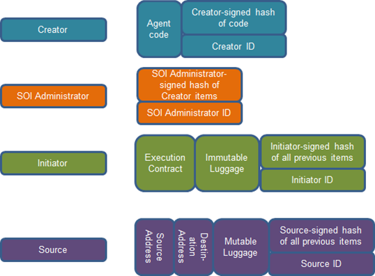

.. _Agent-Signing:

Agent Package Signing
========================

The creation of a signed agent package requires four certificates. The
developer (creator) certificate is used to sign the agent code and
allows the platform to verify that the agent code has not been modified
since being distributed. The admin certificate is used for allowing the
agent into a scope of influence. The initiator certificate is used when
the agent is ready to be deployed into a specific platform. The platform
certificate is used to sign the possibly modified data that an agent
would like to carry with it during moving from platform to platform. All
of these certificates must be signed by a "known" Certificate Authority
(CA).

In order to facilitate the development of agents Volttron Resticted
includes packaging commands for creating the platform CA as well as the
CA signed certificates for use in the agent signing process.

When the Volttron Restricted package is installed on a platform the
volttron-pkg command will be expanded to

    | usage: volttron-pkg [-h] [-l FILE] [-L FILE] [-q] [-v]
    [--verboseness LEVEL]
    |  {package,repackage,configure,create\_ca,create\_cert,sign,verify}

The additional (sub)commands:

-  create\_ca - Creates a platform specific root CA. When this command
   is executed the user will be required to respond to prompts in order
   to fill out the certificate's data.
-  create\_cert - Allows the creation of a ca signed certificate. A type
   of certificate must be specified as (--creator \| --admin \|
   --initiator \| --platform) and the name(--name) of the certificate
   may be specified. The name will be used as the filename for the
   certificate on the platform.
-  sign - Signs the agent package at the specified level.
-  (ALWAYS REQUIRED) Agent package to be signed.
-  (ALWAYS REQUIRED) Signing level must be specified as one of
   (--creator \| --admin \| --initiator \| --platform) and must be
   presented in the correct order. In other words an admin cannot sign
   the package until the creator has signed it.
-  --contract (resource contract) a file containing the definition of
   the necessary agent resources needed to execute properly. This option
   is only available to the creator.
-  --config-file a file used to define custom configuration for the
   starting of agent on the platform. This option is available to the
   initiator.
-  --certs\_dir Allows the specification of where the certificate store
   is located. If this is not specified the default certificate store
   will be used.
-  verify Allows the user to verify a package is valid.
-  package - The agent package to validate against.

Agent Signing Example Using the Listener Agent
~~~~~~~~~~~~~~~~~~~~~~~~~~~~~~~~~~~~~~~~~~~~~~

If VOLTTRON Restricted is installed and the security features are
enabled, all agents must be signed prior to launching them. The
following steps will describe how to sign an agent and will use the
Listener agent as an example. From a terminal, in the volttron directory
(~/volttron), enter the following commands:

#. Package the agent:

   ``volttron-pkg package examples/ListenerAgent``

#. Sign the agent as creator:

   ``volttron-pkg sign --creator --contract resource_contract ~/.volttron/packaged/listeneragent-3.0-py2-none-any.whl``

#. Sign the agent as admin:

   ``volttron-pkg sign --admin ~/.volttron/packaged/listeneragent-3.0-py2-none-any.whl``

#. Sign the agent as initiator:

   ``volttron-pkg sign --initiator --config-file examples/ListenerAgent/config ~/.volttron/packaged/listeneragent-3.0-py2-none-any.whl``

#. Set the configuration file:

   ``volttron-pkg configure ~/.volttron/packaged/listeneragent-3.0-py2-none-any.whl examples/ListenerAgent /config``

#. Install agent into platform (with the platform running):

   ``volttron-ctl install ~/.volttron/packaged/listeneragent-3.0-py2-none-any.whl``

Upon successful completion of this command the terminal output will
inform one of the install directory, the agent UUID (unique identifier
for an agent, each instance of an agent will have a different UUID) and
the agent name:

``Installed ~/.volttron/packaged/weatheragent-3.0-py2-none-any.whl as  a9d67c55-7f58-4591-80af-3c1ff8a81740 listeneragent-3.0``

Now the agent can be started, enter the following command to start the
agent:

``volttron-ctl start --name listeneragent-3.0``

    or

``volttron-ctl start --uuid <UUID>``

The previous steps document the signing of an agent using the Listener
agent as an example. When deploying other agents the following
parameters, used in the example, will need to be modified according to
which agent you are signing and starting. The following is a brief
description of the components of the commands in the signing example
above:

-  examples/ListenerAgent - Path to agents top-level directory.

-  ~/.volttron/packaged/listeneragent-3.0-py2-none-any.whl - Path to the
   agent wheel (check the ~/.volttron/packaged directory after step 1 in
   this example to view the name of the wheel).

-  examples/ListenerAgent/config - Path to the agents json style
   configuration file (note this configuration file is named config).

