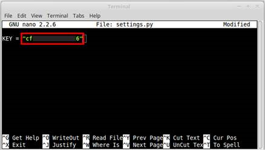
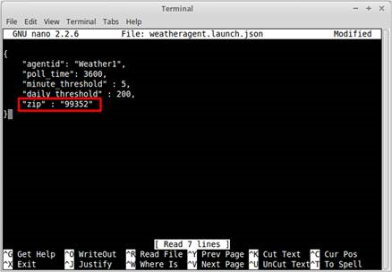
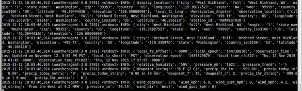

.. _WeatherAgentInstallation:

Weather Agent Installation
============================

Configuring and Launching the Weather Agent
---------------------------------------------

The Weather agent, another VOLTTRON service agent, retrieves weather information from the Weather Underground site and
shares it with agents running on the platform. The first step to launching the Weather agent is to obtain a developer
key from Weather Underground.

.. note::

    Free API is no longer provided by Weather Underground since the beginning of 2019.

Configuring Weather Agent with API Key and Location
~~~~~~~~~~~~~~~~~~~~~~~~~~~~~~~~~~~~~~~~~~~~~~~~~~~~~

The following steps will show how to configure the Weather agent with the developer key from Weather Underground
and how to enter a zip code to get weather data from that zip code.
Edit (<project directory>/services/core/WeatherAgent/weather/settings.py) with your Weather Underground key.
From the base VOLTTRON directory, enter the following terminal commands:

- Open settings.py at with a text editor or nano:

.. code-block:: bash

    $ nano services/core/WeatherAgent/weather/settings.py

- Enter a Weather Underground Developer key, as shown in Figure 1:

Figure 1: Entering the Weather Underground Developer Key

- Open the Weather agent’s configuration file and edit the “zip” field, as shown in Figure 2:
.. code-block:: bash

    $ nano config/weatheragent.config

Figure 2: Entering Zip Code for Location

Launching the Weather Agent
~~~~~~~~~~~~~~~~~~~~~~~~~~~~~

Create a script modeled on scripts/core/make-listener called make-weather:

.. code-block:: bash

    export SOURCE=services/core/WeatherAgent
    export CONFIG=config/weatheragent.config
    export TAG=weather
    ./scripts/core/make-agent.sh

    # To set the agent to autostart with the platform, pass "enable"
    # to make-agent.sh: ./scripts/core/make-agent.sh enable

Then:

.. code-block:: bash

    chmod +x make-weather

Now you can run ./make-weather to stop, remove, build, and reinstall in one script. To start the agent, run:
volttron-ctl start –tag weather

Figure 3: Example Output from the Weather Agent

