.. _Multi-Platform-Multi-Bus:

========================
Multi-Platform Multi-Bus
========================

This guide describes the setup process for a multi-platform connection that has a combination of :term:`ZeroMQ` and
:term:`RabbitMQ` instances.  For this example, we want to use the Forwarder to pass device data from two VOLTTRON
instance to a single "central" instance for storage.  It will also have a Volttron Central agent running on the
"central" instance and Volttron Central Platform agents on all 3 instances and connected to "central" instance to
provide operational status of it's instance to the "central" instance. For this document "node" will be used
interchangeably with VOLTTRON instance.

Node Setup
----------

For this example we will have two types of nodes; a data collector and a central node.  Each of the data collectors will
have different message buses (VOLTTRON supports both RabbitMQ and ZeroMQ). The nodes will be configured as in the
following table.

.. csv-table:: Node Configuration
   :header: "", "Central", "Node-ZMQ", "Node-RMQ"
   :widths: 20, 15, 10, 10

   "Node Type", "Central", "Data Collector", "Data Collector"
   "Master Driver", "", "yes", "yes"
   "Forwarder", "", "yes", "yes"
   "SQL Historian", "yes", "", ""
   "Volttron Central", "yes", "", ""
   "Volttron Central Platform", "yes", "yes", "yes"
   "Exposes RMQ Port", "yes", "", ""
   "Exposes ZMQ Port", "yes", "", ""
   "Exposes HTTPS Port", "yes", "", ""

The goal of this is to be able to see the data from Node-ZMQ and Node-RMQ in the Central SQL Historian and on
the trending charts of Volttron Central.

Virtual Machine Setup
---------------------

The first step in creating a VOLTTRON instance is to make sure the machine is ready for VOLTTRON.  Each machine
should have its hostname setup.  For this walk-through, the hostnames "central", "node-zmq" and "node-rmq" will be used.

For Central and Node-RMQ follow the instructions :ref:`platform installation steps for RMQ <RabbitMQ-Install>`.  For
Node-ZMQ use :ref:`Platform Installation steps for ZeroMQ <ZeroMQ-Install>`.

Instance Setup
--------------

The following conventions/assumptions are made for the rest of this document:

  - Commands should be run from the VOLTTRON root
  - Default values are used for VOLTTRON_HOME($HOME/.volttron), :term:`VIP` port (22916), HTTPS port (8443), RabbitMQ
    ports (5671 for AMQPs and 15671 for RabbitMQ management interface).  If using different :term:`VOLTTRON_HOME` or
    ports, please replace accordingly.
  - Replace central, node-zmq and node-rmq with your own hostnames.
  - user will represent your current user.

The following will use `vcfg` (volttron-cfg) to configure the individual platforms.

Central Instance Setup
----------------------

.. note::

  This instance must have been bootstrapped using ``--rabbitmq`` see
  :ref:`RabbitMq installation instructions <RabbitMQ-Install>`.

Next step would be to configure the instance to have a web interface to accept/deny incoming certificate signing
requests from other instances. Additionally, we will need to install a Volttron Central agent, Volttron Central
Platform agent, SQL historian agent and a Listener agent. The following shows an example command output for this setup.

.. code-block:: console

    (volttron)user@central:~/volttron$ vcfg

    Your VOLTTRON_HOME currently set to: /home/user/.volttron

    Is this the volttron you are attempting to setup? [Y]:
    What type of message bus (rmq/zmq)? [zmq]: rmq
    Name of this volttron instance: [volttron1]: central
    RabbitMQ server home: [/home/user/rabbitmq_server/rabbitmq_server-3.7.7]:
    Fully qualified domain name of the system: [central]:
    Would you like to create a new self signed root CAcertificate for this instance: [Y]:

    Please enter the following details for root CA certificate
        Country: [US]:
        State: WA
        Location: Richland
        Organization: PNNL
        Organization Unit: volttron
    Do you want to use default values for RabbitMQ home, ports, and virtual host: [Y]:
    2020-04-13 13:29:36,347 rmq_setup.py INFO: Starting RabbitMQ server
    2020-04-13 13:29:46,528 rmq_setup.py INFO: Rmq server at /home/user/rabbitmq_server/rabbitmq_server-3.7.7 is running at
    2020-04-13 13:29:46,554 volttron.utils.rmq_mgmt DEBUG: Creating new VIRTUAL HOST: volttron
    2020-04-13 13:29:46,582 volttron.utils.rmq_mgmt DEBUG: Create READ, WRITE and CONFIGURE permissions for the user: central-admin
    Create new exchange: volttron, {'durable': True, 'type': 'topic', 'arguments': {'alternate-exchange': 'undeliverable'}}
    Create new exchange: undeliverable, {'durable': True, 'type': 'fanout'}
    2020-04-13 13:29:46,600 rmq_setup.py INFO:
    Checking for CA certificate

    2020-04-13 13:29:46,601 rmq_setup.py INFO:
     Creating root ca for volttron instance: /home/user/.volttron/certificates/certs/central-root-ca.crt
    2020-04-13 13:29:46,601 rmq_setup.py INFO: Creating root ca with the following info: {'C': 'US', 'ST': 'WA', 'L': 'Richland', 'O': 'PNNL', 'OU': 'VOLTTRON', 'CN': 'central-root-ca'}
    Created CA cert
    2020-04-13 13:29:49,668 rmq_setup.py INFO: **Stopped rmq server
    2020-04-13 13:30:00,556 rmq_setup.py INFO: Rmq server at /home/user/rabbitmq_server/rabbitmq_server-3.7.7 is running at
    2020-04-13 13:30:00,557 rmq_setup.py INFO:

    #######################

    Setup complete for volttron home /home/user/.volttron with instance name=central
    Notes:
     - On production environments, restrict write access to /home/user/.volttron/certificates/certs/central-root-ca.crt to only admin user. For example: sudo chown root /home/user/.volttron/certificates/certs/central-root-ca.crt and /home/user/.volttron/certificates/certs/central-trusted-cas.crt
     - A new admin user was created with user name: central-admin and password=default_passwd.
       You could change this user's password by logging into https://central:15671/ Please update /home/user/.volttron/rabbitmq_config.yml if you change password

    #######################

    The rmq message bus has a backward compatibility
    layer with current zmq instances. What is the
    zmq bus's vip address? [tcp://127.0.0.1]: tcp://192.168.56.101
    What is the port for the vip address? [22916]:
    Is this instance web enabled? [N]: y
    Web address set to: https://central
    What is the port for this instance? [8443]:
    Is this an instance of volttron central? [N]: y
    Configuring /home/user/volttron/services/core/VolttronCentral.
    Installing volttron central.
    ['volttron', '-vv', '-l', '/home/user/.volttron/volttron.cfg.log']
    Should the agent autostart? [N]: y
    VC admin and password are set up using the admin web interface.
    After starting VOLTTRON, please go to https://central:8443/admin/login.html to complete the setup.
    Will this instance be controlled by volttron central? [Y]:
    Configuring /home/user/volttron/services/core/VolttronCentralPlatform.
    What is the name of this instance? [central]:
    Volttron central address set to https://central:8443
    ['volttron', '-vv', '-l', '/home/user/.volttron/volttron.cfg.log']
    Should the agent autostart? [N]:
    Would you like to install a platform historian? [N]: y
    Configuring /home/user/volttron/services/core/SQLHistorian.
    ['volttron', '-vv', '-l', '/home/user/.volttron/volttron.cfg.log']
    Should the agent autostart? [N]: y
    Would you like to install a master driver? [N]:
    Would you like to install a listener agent? [N]: y
    Configuring examples/ListenerAgent.
    ['volttron', '-vv', '-l', '/home/user/.volttron/volttron.cfg.log']
    Should the agent autostart? [N]: y
    Finished configuration!

    You can now start the volttron instance.

    If you need to change the instance configuration you can edit
    the config file is at /home/user/.volttron/config

Start VOLTTRON instance and check if the agents are installed.

.. code-block:: console

  ./start-volttron
  vctl status

Open browser and go to master admin authentication page `https://central:8443/index.html` to accept/reject incoming certificate signing request (CSR) from other platforms. 

.. note::

  Replace "central" with the proper hostname of VC instance in the admin page URL. If opening the admin page from a
  different system, then please make that the hostname is resolvable in that machine.

Click on "Login To Admistration Area".

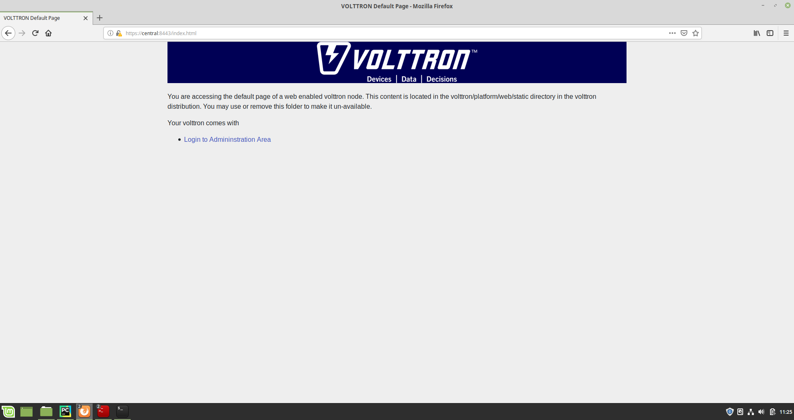

Set the master admin username and password. This can be later used to login into master admin authentication page.
This username and password will also be used to log in to Volttron Central.

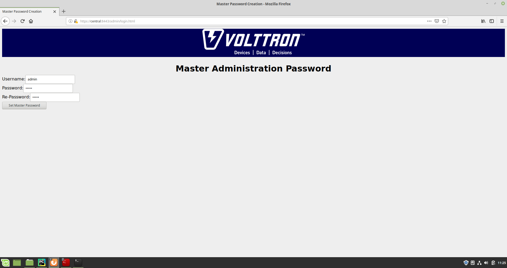

Login into the Master Admin page.

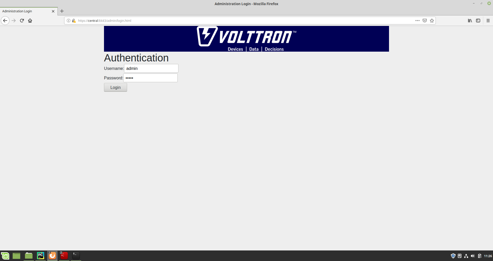

After logging in, you will see no CSR requests initially.

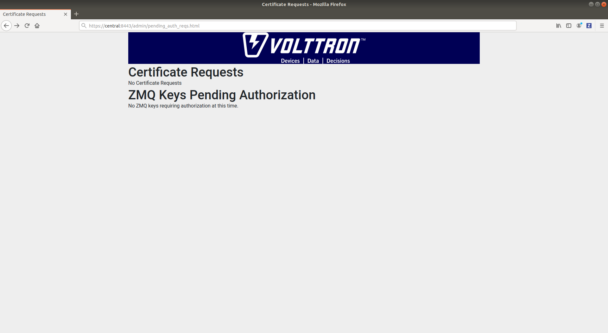

Go back to the terminal and start Volttron Central Platform agent on the "central" instance. The agent will send a CSR
request to the web interface.

.. code-block:: console

  vctl start --tag vcp

Now go to master admin page to check if there is a new pending CSR request. You will see a "PENDING" request from
"central.central.platform.agent"

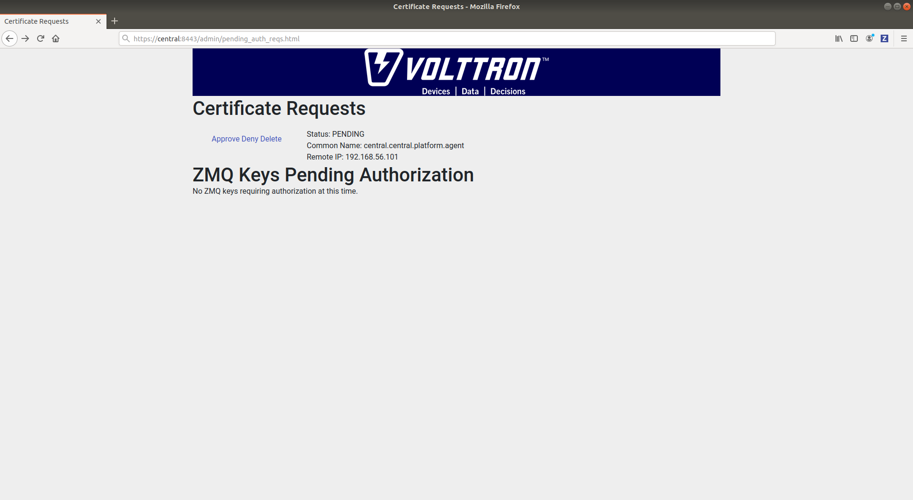

Approve the CSR request to allow authenticated SSL based connection to the "central" instance.

Go back to the terminal and check the status of Volttron Central Platform agent. It should be set to "GOOD".

Node-ZMQ Instance Setup
-----------------------
On the "node-zmq" VM, setup a ZeroMQ based VOLTTRON instance. Using "vcfg" command, install Volttron Central Platform agent,
a master driver agent with a fake driver.

.. note::

  This instance will use old ZeroMQ based authentication mechanism using CURVE keys.

.. code:: console

    (volttron)user@node-zmq:~/volttron$ vcfg

    Your VOLTTRON_HOME currently set to: /home/user/.volttron

    Is this the volttron you are attempting to setup? [Y]:
    What type of message bus (rmq/zmq)? [zmq]:
    What is the vip address? [tcp://127.0.0.1]:
    What is the port for the vip address? [22916]:
    Is this instance web enabled? [N]:
    Will this instance be controlled by volttron central? [Y]:
    Configuring /home/user/volttron/services/core/VolttronCentralPlatform.
    What is the name of this instance? [volttron1]: collector1
    What is the hostname for volttron central? [http://node-zmq]: https://central
    What is the port for volttron central? [8080]: 8443
    ['volttron', '-vv', '-l', '/home/user/.volttron/volttron.cfg.log']
    Should the agent autostart? [N]:
    Would you like to install a platform historian? [N]:
    Would you like to install a master driver? [N]: y
    Configuring /home/user/volttron/services/core/MasterDriverAgent.
    ['volttron', '-vv', '-l', '/home/user/.volttron/volttron.cfg.log']
    Would you like to install a fake device on the master driver? [N]: y
    Should the agent autostart? [N]: y
    Would you like to install a listener agent? [N]:
    Finished configuration!

    You can now start the volttron instance.

    If you need to change the instance configuration you can edit
    the config file is at /home/user/.volttron/config

Please note the Volttron Central web-address should point to that of the "central" instance.

Start VOLTTRON instance and check if the agents are installed.

.. code-block:: console

  ./start-volttron
  vctl status

Start Volttron Central Platform on this platform manually.

.. code-block:: console

  vctl start --tag vcp

Check the VOLTTRON log in the "central" instance, you will see "authentication failure" entry from the incoming
connection. You will need to add the public key of VCP agent on the "central" instance.

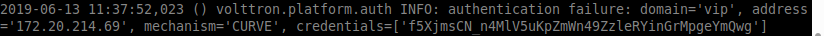

At this point, you can either accept the connection through the admin page or the command line.

Using the admin page:

Navigate back to the master admin authentication page. You should see a pending request under the ZMQ Keys Pending Authorization header.

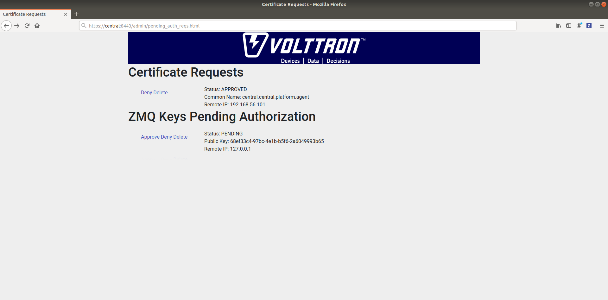

Accept the credential in the same method as a CSR.

Using the command line:

On the "node-zmq" box execute this command and grab the public key of the VCP agent.

.. code-block:: console

  vctl auth publickey

Add auth entry corresponding to VCP agent on "central" instance using the below command. Replace the user id value and credentials value appropriately before running

.. code-block:: console

  vctl auth add --user_id <any unique user id. for example zmq_node_vcp> --credentials <public key of vcp on zmq node>

Complete similar steps to start a forwarder agent that connects to "central" instance. Modify the configuration in
`services/core/ForwardHistorian/rmq_config.yml` to have a destination VIP address pointing to VIP address of the
"central" instance and server key of the "central" instance.

.. code-block:: yaml

  ---
  destination-vip: tcp://<ip>:22916
  destination-serverkey: <serverkey>

.. note::

  Replace <ip> with public facing IP-address of "central" instance and <serverkey> with serverkey of "central"
  instance.
  Use the command **vctl auth serverkey** on the "central" instance to get the server key of the instance

Install and start forwarder agent.

.. code-block:: console

  python scripts/install-agent.py -s services/core/ForwardHistorian -c services/core/ForwardHistorian/rmq_config.yml --start

To accept the credential using the admin page:

Navigate back to the master admin authentication page. You should see another pending request under the ZMQ Keys Pending Authorization header.

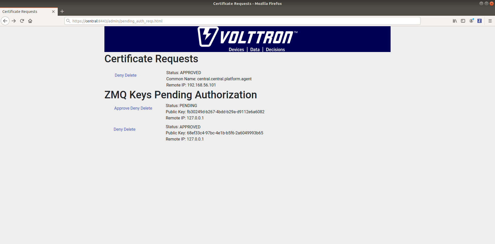

Accept this credential in the same method as before.

To accept the credential using the command line:

Grab the public key of the forwarder agent.

.. code-block:: console

  vctl auth publickey

Add auth entry corresponding to VCP agent on **central** instance.

.. code-block:: console

  vctl auth add --user_id <any unique user id. for example zmq_node_forwarder> --credentials <public key of forwarder on zmq node>

In either case, you should start seeing messages from "collector1" instance on the "central" instance's VOLTTRON log now.

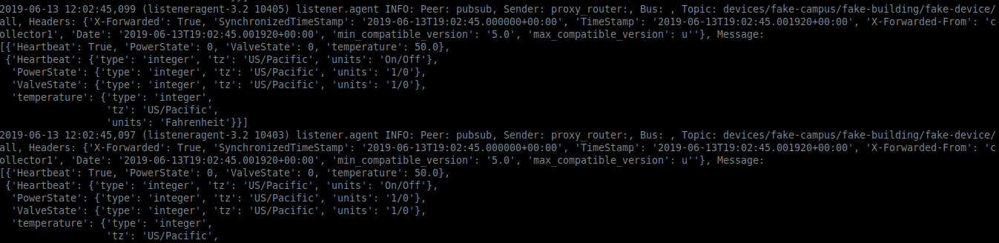

Node-RMQ Instance Setup
-----------------------

.. note::

  This instance must have been bootstrapped using --rabbitmq see
  :ref:`RabbitMq installation instructions <RabbitMQ-Install>`.

Using "vcfg" command, install Volttron Central Platform agent, a master driver agent with fake driver. The instance
name is set to "collector2".

.. code-block:: console

    (volttron)user@node-rmq:~/volttron$ vcfg

    Your VOLTTRON_HOME currently set to: /home/user/.volttron

    Is this the volttron you are attempting to setup? [Y]:
    What type of message bus (rmq/zmq)? [zmq]: rmq
    Name of this volttron instance: [volttron1]: collector2
    RabbitMQ server home: [/home/user/rabbitmq_server/rabbitmq_server-3.7.7]:
    Fully qualified domain name of the system: [node-rmq]:
    Would you like to create a new self signed root CA certificate for this instance: [Y]:

    Please enter the following details for root CA certificate
        Country: [US]:
        State: WA
        Location: Richland
        Organization: PNNL
        Organization Unit: volttron
    Do you want to use default values for RabbitMQ home, ports, and virtual host: [Y]:
    2020-04-13 13:29:36,347 rmq_setup.py INFO: Starting RabbitMQ server
    2020-04-13 13:29:46,528 rmq_setup.py INFO: Rmq server at /home/user/rabbitmq_server/rabbitmq_server-3.7.7 is running at
    2020-04-13 13:29:46,554 volttron.utils.rmq_mgmt DEBUG: Creating new VIRTUAL HOST: volttron
    2020-04-13 13:29:46,582 volttron.utils.rmq_mgmt DEBUG: Create READ, WRITE and CONFIGURE permissions for the user: collector2-admin
    Create new exchange: volttron, {'durable': True, 'type': 'topic', 'arguments': {'alternate-exchange': 'undeliverable'}}
    Create new exchange: undeliverable, {'durable': True, 'type': 'fanout'}
    2020-04-13 13:29:46,600 rmq_setup.py INFO:
    Checking for CA certificate

    2020-04-13 13:29:46,601 rmq_setup.py INFO:
     Creating root ca for volttron instance: /home/user/.volttron/certificates/certs/collector2-root-ca.crt
    2020-04-13 13:29:46,601 rmq_setup.py INFO: Creating root ca with the following info: {'C': 'US', 'ST': 'WA', 'L': 'Richland', 'O': 'PNNL', 'OU': 'VOLTTRON', 'CN': 'collector2-root-ca'}
    Created CA cert
    2020-04-13 13:29:49,668 rmq_setup.py INFO: **Stopped rmq server
    2020-04-13 13:30:00,556 rmq_setup.py INFO: Rmq server at /home/user/rabbitmq_server/rabbitmq_server-3.7.7 is running at
    2020-04-13 13:30:00,557 rmq_setup.py INFO:

    #######################

    Setup complete for volttron home /home/user/.volttron with instance name=collector2
    Notes:
     - On production environments, restrict write access to /home/user/.volttron/certificates/certs/collector2-root-ca.crt to only admin user. For example: sudo chown root /home/user/.volttron/certificates/certs/collector2-root-ca.crt and /home/user/.volttron/certificates/certs/collector2-trusted-cas.crt
     - A new admin user was created with user name: collector2-admin and password=default_passwd.
       You could change this user's password by logging into https://node-rmq:15671/ Please update /home/user/.volttron/rabbitmq_config.yml if you change password

    #######################

    The rmq message bus has a backward compatibility
    layer with current zmq instances. What is the
    zmq bus's vip address? [tcp://127.0.0.1]:
    What is the port for the vip address? [22916]:
    Is this instance web enabled? [N]:
    Will this instance be controlled by volttron central? [Y]:
    Configuring /home/user/volttron/services/core/VolttronCentralPlatform.
    What is the name of this instance? [collector2]:
    What is the hostname for volttron central? [http://node-rmq]: https://central
    What is the port for volttron central? [8443]:
    ['volttron', '-vv', '-l', '/home/user/.volttron/volttron.cfg.log']
    Should the agent autostart? [N]:
    Would you like to install a platform historian? [N]:
    Would you like to install a master driver? [N]: y
    Configuring /home/user/volttron/services/core/MasterDriverAgent.
    ['volttron', '-vv', '-l', '/home/user/.volttron/volttron.cfg.log']
    Would you like to install a fake device on the master driver? [N]: y
    Should the agent autostart? [N]: y
    Would you like to install a listener agent? [N]:
    Finished configuration!

    You can now start the volttron instance.

    If you need to change the instance configuration you can edit
    the config file is at /home/user/.volttron/config

.. note::

 The Volttron Central web-address should point to that of the "central" instance.

Start VOLTTRON instance and check if the agents are installed.

.. code-block:: console

  ./start-volttron
  vctl status

Start Volttron Central Platform on this platform manually.

.. code-block:: console

  vctl start --tag vcp

Go the master admin authentication page and check if there is a new pending CSR request from VCP agent of "collector2"
instance.

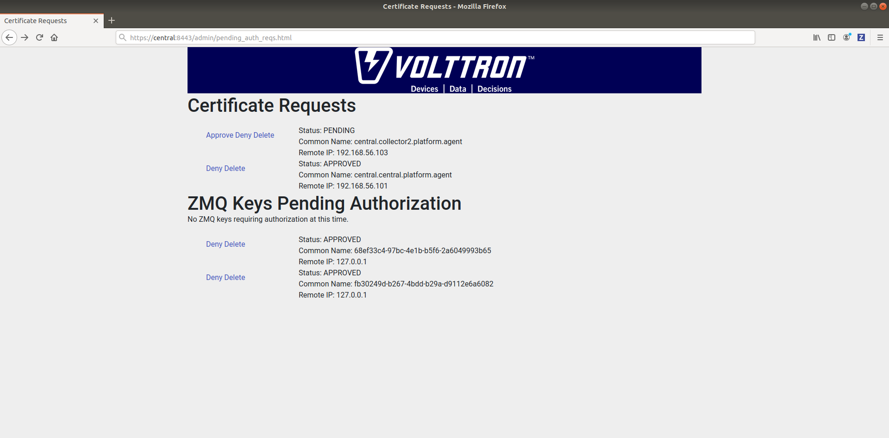

Approve the CSR request to allow authenticated SSL based connection to the "central" instance.

Now go back to the terminal and check the status of Volttron Central Platform agent. It should be set to "GOOD".

Let's now install a forwarder agent on this instance to forward local messages matching "devices" topic to external
"central" instance. Modify the configuration in `services/core/ForwardHistorian/rmq_config.yml` to have a destination
address pointing to web address of the "central" instance.

.. code-block:: yaml

  ---
  destination-address: https://central:8443

Start forwarder agent.

.. code-block:: console

  python scripts/install-agent.py -s services/core/ForwardHistorian -c services/core/ForwardHistorian/rmq_config.yml --start

Go the master admin authentication page and check if there is a new pending CSR request from forwarder agent of "collector2"
instance.

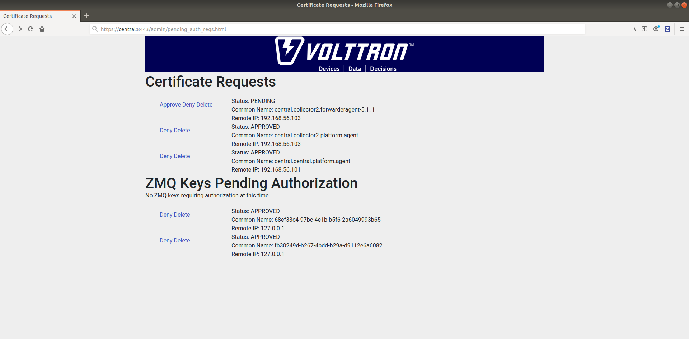

Approve the CSR request to allow authenticated SSL based connection to the "central" instance.

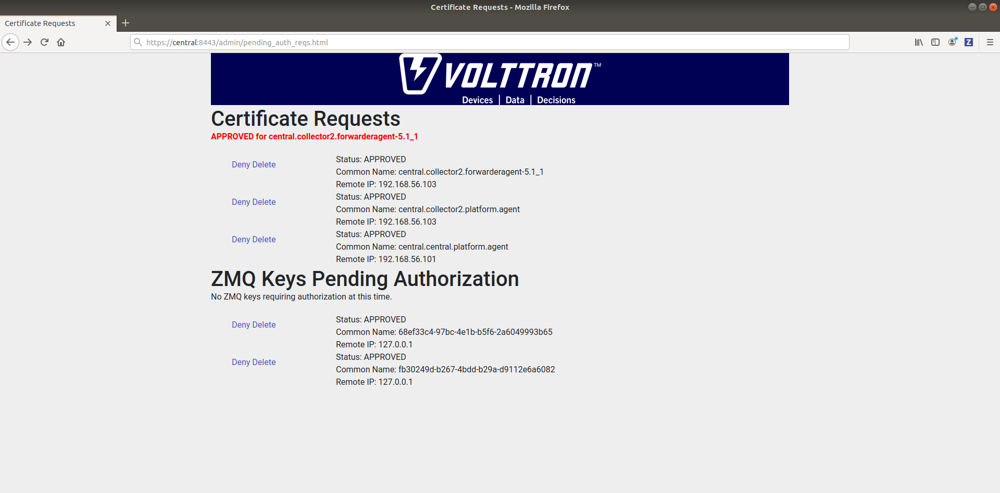

Now go back to the terminal and check the status of forwarder agent. It should be set to "GOOD".

Check the VOLTTRON log of "central" instance. You should see messages with "devices" topic coming from "collector2"
instance.

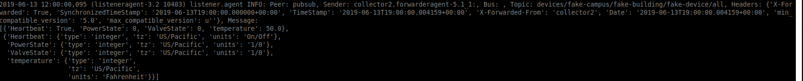

To confirm that VolttronCentral is monitoring the status of all the 3 platforms, open a browser and type this URL
`https://central:8443/vc/index.html`. Login using credentials (username and password) earlier set during the VC
configuration step (using vcfg command in "central" instance). Click on "platforms" tab in the far right corner. You
should see all three platforms listed in that page. Click on each of the platforms and check the status of the agents.

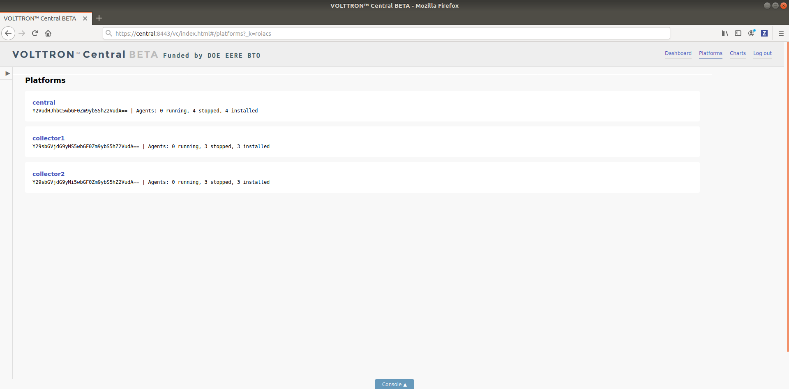
