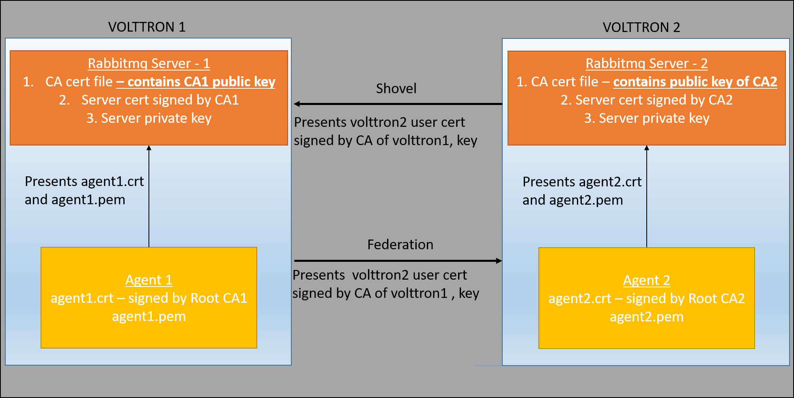

.. _Multi-platform-RabbitMQ-Deployment:

==================================
Multi-platform RabbitMQ Deployment
==================================

With ZeroMQ based VOLTTRON, multi-platform communication was accomplished in three different ways:

#. Direct connection to remote instance - Write an agent that would connect to a remote instance directly.

#. Special agents - Use special agents such as forward historian/data puller agents that would forward/receive messages
   to/from remote instances.  In RabbitMQ-VOLTTRON, we make use of the :ref:`Shovel Plugin <RabbitMQ-Shovel>` to achieve
   this behavior.

#. Multi-Platform RPC and PubSub - Configure :term:`VIP` address of all remote instances that an instance has to connect
   to it's `$VOLTTRON_HOME/external_discovery.json` and let the router module in each instance manage the connection
   and take care of the message routing for us.  In RabbitMQ-VOLTTRON, we make use of the
   :ref:`Federation Plugin <RabbitMQ-Federation>` to achieve this behavior.

Using the Federation Plugin
---------------------------

We can connect multiple VOLTTRON instances using the federation plugin. Before setting up federation links, we need to
first identify the  upstream server and downstream server.  The upstream server is the node that is publishing some
message of interest and downstream server is the node that wants to receive messages from the upstream server.  A
federation link needs to be established from the downstream VOLTTRON instance to the upstream VOLTTRON instance.  To
setup a federation link, we will need to add upstream server information in a RabbitMQ federation configuration file:

Path: `$VOLTTRON_HOME/rabbitmq_federation_config.yml`

.. code-block:: yaml

    # Mandatory parameters for federation setup
    federation-upstream:
      rabbit-4:
        port: '5671'
        virtual-host: volttron4
      rabbit-5:
        port: '5671'
        virtual-host: volttron5

To configure the VOLTTRON instance to setup federation, run the following command:

.. code-block:: bash

    vcfg --rabbitmq federation [optional path to rabbitmq_federation_config.yml]

This will setup federation links to upstream servers and sets policy to make the VOLTTRON exchange *federated*.  Once a
federation link is established to remote instance, the messages published on the remote instance become available to
local instance as if it were published on the local instance.

Multi-Platform RPC With Federation
----------------------------------

For multi-platform RPC communication, federation links need to be established on both the VOLTTRON
nodes.  Once the federation links are established, RPC communication becomes fairly simple.

Consider Agent A on VOLTTRON instance "volttron1" on host "host_A" wants to make RPC call to Agent B
on VOLTTRON instance "volttron2" on host "host_B".

1. Agent A makes RPC call.

.. code-block:: Python

    kwargs = {"external_platform": self.destination_instance_name}
    agent_a.vip.rpc.call("agent_b", set_point, "point_name", 2.5, \**kwargs)

2. The message is transferred over federation link to VOLTTRON instance "volttron2" as both the exchanges are made
   *federated*.

3. The RPC subsystem of Agent B calls the actual RPC method and gets the result.  It encapsulates the message result
   into a VIP message object and sends it back to Agent A on VOLTTRON instance "volttron1".

4. The RPC subsystem on Agent A receives the message result and gives it to the Agent A application.

Multi-Platform PubSub With Federation
-------------------------------------

For multi-platform PubSub communication, it is sufficient to have federation link from the downstream server
to the upstream server.  In case of bi-directional data flow, links have to established in both the directions.

.. image:: files/multiplatform_pubsub.png

Consider Agent B on VOLTTRON instance "volttron2" on host "host_B" which wants to subscribe to messages from
VOLTTRON instance "volttron2" on host "host_B".  First, a federation link needs to be established from
"volttron2" to "volttron1".

1. Agent B makes a subscribe call:

.. code-block:: python

    agent_b.vip.subscribe.call("pubsub", prefix="devices", all_platforms=True)

2. The PubSub subsystem converts the prefix to ``__pubsub__.*.devices.#``. Here, "*" indicates that agent is subscribing
   to the "devices" topic from all VOLTTRON platforms.

3. A new queue is created and bound to VOLTTRON exchange with the above binding key.  Since the VOLTTRON exchange is a
   *federated exchange*, any subscribed message on the upstream server becomes available on the federated exchange and
   Agent B will be able to receive it.

4. Agent A publishes message to topic `devices/pnnl/isb1/hvac1`

5. The PubSub subsystem publishes this message on it's VOLTTRON exchange.

6. Due to the federation link, message is received by the Pubsub subsystem of Agent A.

.. _RabbitMQ-Multi-platform-SSL:

Multi-Platform Federation Communication With RabbitMQ SSL
=========================================================

For multi-platform communication over federation, we need the connecting instances to trust each other.

Suppose there are two VMs (VOLTTRON1 and VOLTTRON2) running single instances of RabbitMQ, and VOLTTRON1 and VOLTTRON2
want to talk to each other via either the federation or shovel plugins.  In order for VOLTTRON1 to talk to VOLTTRON2,
VOLTTRON1's root certificate must be appended to VOLTTRON's trusted CA certificate, so that when VOLTTRON1 presents it's
root certificate during connection, VOLTTRON2's RabbitMQ server can trust the connection.  VOLTTRON2's root CA must be
appended to VOLTTRON1's root CA and it must in turn present its root certificate during connection, so that VOLTTRON1
will know it is safe to talk to VOLTTRON2.

Agents trying to connect to remote instance directly need to have a public certificate signed by the remote instance for
authenticated SSL based connection.  To facilitate this process, the VOLTTRON platform exposes a web based server API
for requesting, listing, approving and denying certificate requests.  For more detailed description, refer to
:ref:`Agent communication to Remote RabbitMQ instance <Agent-Communication-to-Remote-RabbitMQ>`

Installation Steps
------------------

1. Setup two VOLTTRON instances using the instructions at :ref:`platform installation steps for RMQ <RabbitMQ-Install>`.
**Please note that each instance should have a unique instance name and should be running on machine/VM that has a unique host name.**

2. In a multi platform setup that need to communicate with each other with RabbitMQ over SSL, each VOLTTRON instance should should trust the ROOT CA of the other instance(RabbitMQ root ca)

   a. Transfer (scp/sftp/similar) voltttron_home/certificates/certs/<instance_name>-root-ca.crt to a temporary
      location on the other volttron instance machine. For example, if you have two instance v1 and v2,
      scp v1's v1-root-ca.crt to v2 and v2-root-ca.crt to v1.

       Note: If using VMs, in order to scp files between VM openssh should be installed and running.

   b. Append the contents of the transferred root ca to the instance's trusted-cas.crt file. Do this on both the instances. Now both
      the instances <instance_name>-trusted-cas.crt will have two certificates.

      For example:

      On v1:
      cat /tmp/v2-root-ca.crt >> VOLTTRON_HOME/certificates/certs/v1-trusted-cas.crt

      On v2:
      cat /tmp/v1-root-ca.crt >> VOLTTRON_HOME/certificates/certs/v2-trusted-cas.crt

3. Stop volttron, stop rabbitmq server and start volttron on both the
instances. This is required only when you update the root certificate and not
required when you add a new shovel/federation between the same hosts

.. code-block:: bash

    ./stop-volttron
    ./stop-rabbitmq
    ./start-volttron

4. Identify upstream servers (publisher nodes) and downstream servers
(collector nodes). To create a RabbitMQ federation, we have to configure
upstream servers on the downstream server and make the VOLTTRON exchange
"federated".

    a.  On the downstream server (collector node)

        .. code-block:: bash

            vcfg --rabbitmq federation [optional path to rabbitmq_federation_config.yml
            containing the details of the upstream hostname, port and vhost.

        Example configuration for federation is available
        in examples/configurations/rabbitmq/rabbitmq_federation_config.yml]

        If no config file is provided, the script will prompt for
        hostname (or IP address), port, and vhost of each upstream node you
        would like to add. Hostname provided should match the hostname in the
        SSL certificate of the upstream server. For bi-directional data flow,
        we will have to run the same script on both the nodes.

    b.  Create a user in the upstream server(publisher) with
        username=<downstream admin user name> (i.e. (instance-name)-admin) and
        provide it access to the  virtual host of the upstream RabbitMQ server. Run
        the below command in the upstream server

        .. code-block:: bash

             vctl rabbitmq add-user <username> <password>
             Do you want to set READ permission  [Y/n]
             Do you want to set WRITE permission  [Y/n]
             Do you want to set CONFIGURE permission  [Y/n]

5.  Test the federation setup.

   a. On the downstream server run a listener agent which subscribes to messages from all platforms

     - Open the file examples/ListenerAgent/listener/agent.py. Search for @PubSub.subscribe('pubsub', '') and replace that         line with @PubSub.subscribe('pubsub', 'devices', all_platforms=True)
     - updgrade the listener

         .. code-block:: bash

            scripts/core/upgrade-listener

   b. Install master driver, configure fake device on upstream server and start volttron and master driver. vcfg --agent master_driver command can install master driver and setup a fake device.

       .. code-block:: bash

           ./stop-volttron
           vcfg --agent master_driver
           ./start-volttron
           vctl start --tag master_driver

   c. Verify listener agent in downstream VOLTTRON instance is able to receive the messages. downstream volttron instance's volttron.log should display device data scrapped by master driver agent in upstream volttron instance

6. Open ports and https service if needed
   On Redhat based systems ports used by RabbitMQ (defaults to 5671, 15671 for
   SSL, 5672 and 15672 otherwise) might not be open by default. Please
   contact system administrator to get ports opened on the downstream server.

   Following are commands used on centos 7.

   .. code-block:: bash

       sudo firewall-cmd --zone=public --add-port=15671/tcp --permanent
       sudo firewall-cmd --zone=public --add-port=5671/tcp --permanent
       sudo firewall-cmd --reload

7. How to remove federation link

   a. Using the management web interface

      Log into management web interface using downstream server's admin username.
      Navigate to admin tab and then to federation management page. The status of the
      upstream link will be displayed on the page. Click on the upstream link name and
      delete it.

   b. Using "vctl" command on the upstream server.

       .. code-block:: bash

           vctl rabbitmq list-federation-parameters
           NAME                         URI
           upstream-volttron2-rabbit-2  amqps://rabbit-2:5671/volttron2?cacertfile=/home/nidd494/.volttron1/certificates/certs/volttron1-root-ca.crt&certfile=/home/nidd494/.volttron1/certificates/certs/volttron1-admin.crt&keyfile=/home/nidd494/.volttron1/certificates/private/volttron1-admin.pem&verify=verify_peer&fail_if_no_peer_cert=true&auth_mechanism=external&server_name_indication=rabbit-2

     Grab the upstream link name and run the below command to remove it.

       .. code-block:: bash

         vctl rabbitmq remove-federation-parameters upstream-volttron2-rabbit-2

Using the Shovel Plugin
-----------------------

Shovels act as well written client applications which move messages from a source to a destination broker.
The below configuration shows how to setup a shovel to forward PubSub messages or perform multi-platform RPC
communication from local to a remote instance.  It expects `hostname`, `port` and `virtual host` of configuration values
for the remote instance. In addition it needs certificates (private certs, public certificate signed by remote instance
and remote CA certificate)

Path: `$VOLTTRON_HOME/rabbitmq_shovel_config.yml`

.. code-block:: yaml

    # Mandatory parameters for shovel setup
    shovel:
      rabbit-2:
        port: '5671'
        virtual-host: volttron
        certificates:
          csr: true
          private_cert: "path to private cert" # For example, /home/volttron/vhome/test_shovel/certificates/private/volttron1.shovelvolttron2.pem
          public_cert: "path to public cert" # For example, /home/volttron/vhome/test_shovel/certificates/shovels/volttron2.volttron1.shovelvolttron2.crt
          remote_ca: "path to CA cert" # For example, /home/volttron/vhome/test_shovel/certificates/shovels/volttron2_ca.crt

        # Configuration to forward pubsub topics
        pubsub:
          # Identity of agent that is publishing the topic
          platform.driver:
            - devices
        # Configuration to make remote RPC calls
        rpc:
          # Remote instance name
          volttron2:
            # List of pair of agent identities (local caller, remote callee)
            - [scheduler, platform.actuator]

To forward PubSub messages, the topic and agent identity of the publisher agent is needed.  To perform RPC, the instance
name of the remote instance and agent identities of the local agent and remote agent are needed.

To configure the VOLTTRON instance to setup shovel, run the following command.

.. code-block:: bash

    vcfg --rabbitmq shovel [optional path to rabbitmq_shovel_config.yml]

This setups up a shovel that forwards messages (either PubSub or RPC) from local exchange to remote exchange.

Multi-Platform PubSub With Shovel
---------------------------------

After the shovel link is established for Pubsub, the below figure shows how the communication happens.

.. note::

   For bi-directional pubsub communication, shovel links need to be created on both the nodes.  The "blue" arrows show
   the shovel binding key.  The pubsub topic configuration in `$VOLTTRON_HOME/rabbitmq_shovel_config.yml` gets
   internally converted to the shovel binding key: `"__pubsub__.<local instance name>.<actual topic>"`.

Now consider a case where shovels are setup in both the directions for forwarding "devices" topic.

1. Agent B makes a subscribe call to receive messages with topic "devices" from all connected platforms.

.. code-block:: python

    agent_b.vip.subscribe.call("pubsub", prefix="devices", all_platforms=True)

2. The PubSub subsystem converts the prefix to ``__pubsub__.*.devices.#``  "*" indicates that agent is subscribing to
   the "devices" topic from all the VOLTTRON platforms.

3. A new queue is created and bound to VOLTTRON exchange with above binding key.

4. Agent A publishes message to topic `devices/pnnl/isb1/hvac1`

5. PubSub subsystem publishes this message on it's VOLTTRON exchange.

6. Due to a shovel link from VOLTTRON instance "volttron1" to "volttron2", the message is forwarded from VOLTTRON
   exchange "volttron1" to "volttron2" and is picked up by Agent A on "volttron2".

Multi-Platform RPC With Shovel
------------------------------

After the shovel link is established for multi-platform RPC, the below figure shows how the RPC communication happens.

.. note::

    It is mandatory to have shovel links on both directions as it is request-response type of communication.  We will
    need to set the agent identities for caller and callee in the `$VOLTTRON_HOME/rabbitmq_shovel_config.yml`.  The
    "blue" arrows show the resulting the shovel binding key.

Consider Agent A on VOLTTRON instance "volttron1" on host "host_A" wants to make RPC call on Agent B
on VOLTTRON instance "volttron2" on host "host_B".

1. Agent A makes RPC call:

.. code-block:: Python

    kwargs = {"external_platform": self.destination_instance_name}
    agent_a.vip.rpc.call("agent_b", set_point, "point_name", 2.5, \**kwargs)

2. The message is transferred over shovel link to VOLTTRON instance "volttron2".

3. The RPC subsystem of Agent B calls the actual RPC method and gets the result.  It encapsulates the message result
   into a VIP message object and sends it back to Agent A on VOLTTRON instance "volttron1".

4. The RPC subsystem on Agent A receives the message result and gives it to Agent A's application.

Installation Steps for Pubsub Communication
-------------------------------------------
For multi-platform communication over shovel, we need the connecting instances to trust each other. As part of the shovel
creation process, a certificate signing request is made to the remote instance. The admin of the remote instance has to
accept or reject such a request through VOLTTRON admin web interface. If accepted, a bundle containing certificate
signed by remote CA, remote CA is sent as a response back to the local instance. Subsequently, shovel connection is
established with these certificates. If user already has certificates signed by remote CA, then that be used for
connection. Else 'vcfg rabbitmq shovel' command prompt will guide the user to make a csr request as part of shovel setup.

1. Setup two VOLTTRON instances using the steps described in installation section.
Please note that each instance should have a unique instance name.

2. Identify the instance that is going to act as the "publisher" instance. Suppose
   "volttron1" instance is the "publisher" instance and "volttron2" instance is the "subscriber"
   instance. Then we need to create a shovel on "volttron1" to forward messages matching
   certain topics to remote instance "volttron2".

    a.  On the publisher node,

        .. code-block:: bash

            vcfg --rabbitmq shovel [optional path to rabbitmq_shovel_config.yml]

        rabbitmq_shovel_config.yml should contain the details of the remote hostname, port, vhost,
        certificates for connecting to remote instance and list of topics to forward.
        Example configuration for shovel is available in examples/configurations/rabbitmq/rabbitmq_shovel_config.yml

        For this example, let's set the topic to "devices"

        If no config file is provided, the script will prompt for
        hostname (or IP address), port, vhost, certificates for connecting to remote instance and
        list of topics for each remote instance you would like to add. For bi-directional data flow, we will have to
        run the same script on both the nodes.

    b. If no config file is provided and certificates for connecting to remote instance have to be generated afresh,
    then the remote instance should be web enabled and admin should be ready to accept/reject incoming requests. Please
    refer to :ref:`Multiple Platform Multiple Bus connection < Multi-Platform-Multi-Bus>` on how to enable web feature and accept/reject incoming authentication requests.
    Below image shows steps to follow to create a shovel to connect from "volttron1" to "volttron2" to
    publish "devices" topic from "volttron1" to "volttron2".

    On publisher node,

    .. image:: files/cmd_line.png

    On subscriber node, Login to "https://volttron2:8443/index.html" in a web browser. You will see incoming
    CSR request from "volttron1" instance.

    .. image:: files/admin_request.png

    Accept the incoming CSR request from "volttron1" instance.

    .. image:: files/csr_accepted.png

    c.  Create a user in the subscriber node with username set to publisher instance's
        agent name ( (instance-name)-PublisherAgent ) and allow the shovel access to
        the virtual host of the subscriber node.

        .. code-block:: bash

            cd $RABBITMQ_HOME
            vctl add-user <username> <password>

4. Test the shovel setup.

   a. Start VOLTTRON on publisher and subscriber nodes.

   b. On the publisher node, start a master driver agent that publishes messages related to
   a fake device. ( Easiest way is to run volttron-cfg command and follow the steps )

   c. On the subscriber node, run a listener agent which subscribes to messages
   from all platforms (set @PubSub.subscribe('pubsub', 'devices', all_platforms=True)
   instead of @PubSub.subscribe('pubsub', '') )

   d. Verify listener agent in subscriber node is able to receive the messages
   matching "devices" topic.

5. How to remove the shovel setup.

   a. Using the management web interface

      Log into management web interface using publisher instance's admin username.
      Navigate to admin tab and then to shovel management page. The status of the
      shovel will be displayed on the page. Click on the shovel name and delete the shovel.

   b. Using "volttron-ctl" command on the publisher node.

    .. code-block:: bash

     vctl rabbitmq list-shovel-parameters
     NAME                     SOURCE ADDRESS                                                 DESTINATION ADDRESS                                            BINDING KEY
     shovel-rabbit-3-devices  amqps://rabbit-1:5671/volttron1?cacertfile=/home/nidd494/.volttron1/certificates/certs/volttron1-root-ca.crt&certfile=/home/nidd494/.volttron1/certificates/certs/volttron1-admin.crt&keyfile=/home/nidd494/.volttron1/certificates/private/volttron1-admin.pem&verify=verify_peer&fail_if_no_peer_cert=true&auth_mechanism=external&server_name_indication=rabbit-1  amqps://rabbit-3:5671/volttron3?cacertfile=/home/nidd494/.volttron1/certificates/certs/volttron1-root-ca.crt&certfile=/home/nidd494/.volttron1/certificates/certs/volttron1-admin.crt&keyfile=/home/nidd494/.volttron1/certificates/private/volttron1-admin.pem&verify=verify_peer&fail_if_no_peer_cert=true&auth_mechanism=external&server_name_indication=rabbit-3  __pubsub__.volttron1.devices.#

    Grab the shovel name and run the below command to remove it.

    .. code-block:: bash

        vctl rabbitmq remove-shovel-parameters shovel-rabbit-3-devices

    Please note, this remove shovel parameter from RabbitMQ and also certificate entries from rabbitmq_shovel_config.yml.
    If you need to rerun the shovel command again for the same setup and need to create fresh certificates, then you will
    need to manually remove public and private certificates. Private certificates will be in
    $VOLTTRON_HOME/certificates/private and rest of the shovel certificates will be in
    $VOLTTRON_HOME/certificates/shovel directory. Other thing, that you need to delete the authentication entry from
    the remote instance. You can do that from the admin web interface by the clicking the delete
    option.

DataMover Communication
-----------------------

The DataMover historian running on one instance makes RPC call to platform historian running on remote
instance to store data on remote instance. Platform historian agent returns response back to DataMover
agent. For such a request-response behavior, shovels need to be created on both instances.

1. Please ensure that preliminary steps for multi-platform communication are completed (namely,
   steps 1-3 described above) .

2. To setup a data mover to send messages from local instance (say v1) to remote instance (say v2)
   and back, we would need to setup shovels on both instances.

   Example of RabbitMQ shovel configuration on v1

   .. code-block:: json

      shovel:
      # hostname of remote machine
       rabbit-2:
        port: 5671
        certificates:
          csr: true
          private_cert: "path to private cert" # For example, /home/volttron/vhome/test_shovel/certificates/private/volttron1.shovelvolttron2.pem
          public_cert: "path to public cert" # For example, /home/volttron/vhome/test_shovel/certificates/shovels/volttron2.volttron1.shovelvolttron2.crt
          remote_ca: "path to CA cert" # For example, /home/volttron/vhome/test_shovel/certificates/shovels/volttron2_ca.crt
        rpc:
          # Remote instance name
          v2:
          # List of pair of agent identities (local caller, remote callee)
          - [data.mover, platform.historian]
        virtual-host: v1

   This says that DataMover agent on v1 wants to make RPC call to platform historian on v2.

  .. code-block:: bash

    vcfg --rabbitmq shovel [optional path to rabbitmq_shovel_config.yml

   Example of RabbitMQ shovel configuration on v2

  .. code-block:: json

   shovel:
    # hostname of remote machine
    rabbit-1:
      port: 5671
      rpc:
      # Remote instance name
      v1:
      # List of pair of agent identities (local caller, remote callee)
      - [platform.historian, data.mover]
    virtual-host: v2

   This says that Hplatform historian on v2 wants to make RPC call to DataMover agent on v1.

   a. On v1, run below command to setup a shovel from v1 to v2.

  .. code-block:: bash

     vcfg --rabbitmq shovel [optional path to rabbitmq_shovel_config.yml

   b. Create a user on v2 with username set to remote agent's username
      ( for example, v1.data.mover i.e., <instance_name>.<agent_identity>) and allow
      the shovel access to the virtual host of v2.

  .. code-block:: bash

      cd $RABBITMQ_HOME
      vctl add-user <username> <password>

   c. On v2, run below command to setup a shovel from v2 to v1

  .. code-block:: bash

      vcfg --rabbitmq shovel [optional path to rabbitmq_shovel_config.yml

   d. Create a user on v1 with username set to remote agent's username
     ( for example, v2.patform.historian i.e., <instance_name>.<agent_identity>) and allow
     the shovel access to the virtual host of the v1.

  .. code-block:: bash

      cd $RABBITMQ_HOME
      vctl add-user <username> <password>

3. Start Master driver agent on v1

   .. code-block:: bash

       ./stop-volttron
       vcfg --agent master_driver
       ./start-volttron
       vctl start --tag master_driver

4. Install DataMover agent on v1. Contents of the install script can look like below.

   .. code-block:: bash

       #!/bin/bash
       export CONFIG=$(mktemp /tmp/abc-script.XXXXXX)
       cat > $CONFIG <<EOL
       {
           "destination-vip": "",
           "destination-serverkey": "",
           "destination-instance-name": "volttron2",
           "destination-message-bus": "rmq"
       }
       EOL
       python scripts/install-agent.py -s services/core/DataMover -c $CONFIG --start --force -i data.mover

    Execute the install script.

5. Start platform historian of your choice on v2. Example shows starting SQLiteHistorian

   .. code-block:: bash

       ./stop-volttron
       vcfg --agent platform_historian
       ./start-volttron
       vctl start --tag platform_historian

6. Observe data getting stored in sqlite historian on v2.
