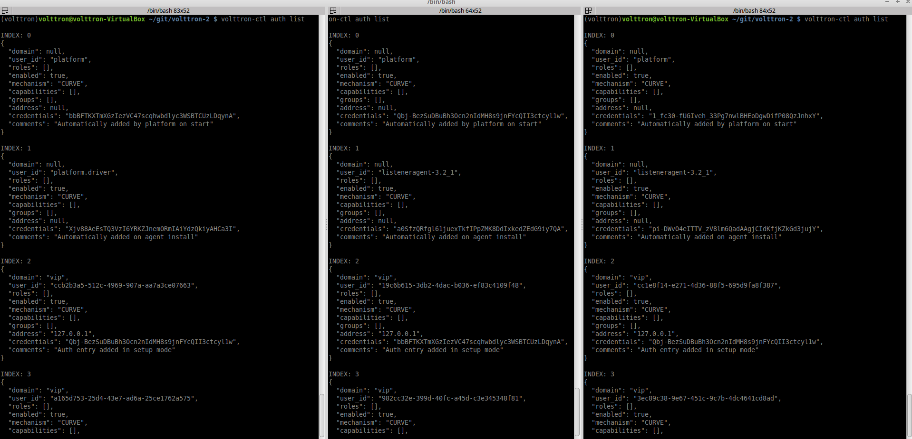

.. _Multi-Platform-Router-Deployment:

==============================
Multi-Platform Between Routers
==============================

Multi-Platform between routers alleviates the need for an agent in one platform to connect to another platform
directly in order for it to send/receive messages from the other platform. Instead with this new type of connection,
connections to external platforms will be maintained by the platforms itself and agents do not have the burden to manage
the connections directly.  This guide will show how to connect three VOLTTRON instances with a fake driver running on
VOLTTRON instance 1 publishing to topic with prefix="devices" and listener agents running on other 2 VOLTTRON instances
subscribed to topic "devices".

-  :ref:`Getting Started <Platform-Installation>`
-  `Multi-Platform Configuration <#multi-platform-configuration>`__
-  `Configuration and Authentication in Setup Mode <#configuration-and-authentication-in-setup-mode>`__
-  `Setup Configuration and Authentication Manually <#setup-configuration-and-authentication-manually>`__
-  `Start Master driver on VOLTTRON instance 1 <#start-master-driver-on-volttron-instance-1>`__
-  `Start Listener agents on VOLTTRON instance 2 and 3 <#start-listener-agents-on-volttron-instance-2-and-3>`__
-  `Stopping All the Platforms <#stopping-all-the-platforms>`__

Getting Started
---------------
Modify the subscribe annotate method parameters in the listener agent (examples/ListenerAgent/listener/agent.py in
the VOLTTRON root directory) to include ``all_platforms=True`` parameter
to receive messages from external platforms.

.. code-block:: python

    @PubSub.subscribe('pubsub', '')

to

.. code-block:: python

    @PubSub.subscribe('pubsub', 'devices', all_platforms=True)

or add below line in the `onstart` method

.. code-block:: python

    self.vip.pubsub.subscribe('pubsub', 'devices', self.on_match, all_platforms=True)
    
.. note:: If using the onstart method remove the @PubSub.subscribe('pubsub', '') from the top of the method.

After :ref:`installing VOLTTRON <Platform-Installation>`, open three shells with the current directory the root of the
VOLTTRON repository.  Then activate the VOLTTRON environment and export the :term:`VOLTTRON_HOME` variable. The home
variable needs to be different for each instance.

.. code-block:: console

    $ source env/bin/activate
    $ export VOLTTRON_HOME=~/.volttron1

Run `vcfg` in all the three shells. This command will ask how the instance
should be set up. Many of the options have defaults and that will be sufficient.  Enter a different VIP address for each
platform.  Configure fake master driver in the first shell and listener agent in second and third shell.

|Terminator Setup|

Multi-Platform Configuration
----------------------------
For each instance, specify the instance name in platform config file under it's `VOLTTRON_HOME` directory.
If the platform supports web server, add the ``bind-web-address`` as well.

Here is an example,

Path of the config: `$VOLTTRON_HOME/config`

.. code-block:: console

    [volttron]
    vip-address = tcp://127.0.0.1:22916
    instance-name = "platform1"
    bind-web-address = http://127.0.0.1:8080

Instance name and bind web address entries added into each VOLTTRON platform's config file is shown below.

|Multi-Platform Config|

Next, each instance needs to know the VIP address, platform name and server keys of the remote platforms that it is
connecting to.  In addition, each platform has to authenticate or accept the connecting instances' public keys.  We can
do this step either by running VOLTTRON in setup mode or configure the information manually.

Configuration and Authentication in Setup Mode
----------------------------------------------

.. note::

   It is necessary for **each** platform to have a web server if running in setup mode

Add list of web addresses of remote platforms in ``$VOLTTRON_HOME/external_address.json``

|External Address Config|

Start VOLTTRON instances in setup mode in the three terminal windows. The "-l" option in the following command tells
VOLTTRON to log to a file. The file name should be different for each instance.

.. code-block:: console

    $ ./start-volttron --setup-mode

A new auth entry is added for each new platform connection. This can be checked with below command in each terminal
window.

.. code-block:: console

    $ vctl auth list

|Auth Entry|

After all the connections are authenticated, we can start the instances in normal mode.

.. code-block:: console

    $ ./stop-volttron
    $ ./start-volttron

Setup Configuration and Authentication Manually
-----------------------------------------------

If you do not need web servers in your setup, then you will need to build the platform discovery config file manually.
The config file should contain an entry containing VIP address, instance name and serverkey of each remote platform
connection.

Name of the file: `external_platform_discovery.json`

Directory path:   Each platform’s VOLTTRON_HOME directory.

For example, since VOLTTRON instance 1 is connecting to VOLTTRON instance 2 and 3, contents of
``external_platform_discovery.json`` will be

.. code-block:: json

    {
        "platform2": {"vip-address":"tcp://127.0.0.2:22916",
                      "instance-name":"platform2",
                      "serverkey":"YFyIgXy2H7gIKC1x6uPMdDOB_i9lzfAPB1IgbxfXLGc"},
        "platform3": {"vip-address":"tcp://127.0.0.3:22916",
                      "instance-name":"platform3",
                      "serverkey":"hzU2bnlacAhZSaI0rI8a6XK_bqLSpA0JRK4jq8ttZxw"}
    }

We can obtain the serverkey of each platform using below command in each terminal window:

.. code-block:: console

    $ vctl auth serverkey

Contents of ``external_platform_discovery.json`` of VOLTTRON instance 1, 2, 3 is shown below.

|Multi-Platform Discovery Config|

After this, you will need to add the server keys of the connecting platforms using the ``vctl`` utility.  Type
**vctl auth add** command on the command prompt and simply hit Enter to select defaults on all fields
except **credentials**.  Here, we can either add serverkey of connecting platform or type `/.*/` to allow ALL
connections.

.. warning:: `/.*/` allows ALL agent and platform connections without authentication.

.. code-block:: console

   $ vctl auth add
   domain []:
   address []:
   user_id []:
   capabilities (delimit multiple entries with comma) []:
   roles (delimit multiple entries with comma) []:
   groups (delimit multiple entries with comma) []:
   mechanism [CURVE]:
   credentials []: /.*/
   comments []:
   enabled [True]:
   added entry domain=None, address=None, mechanism='CURVE', credentials=u'/.*/', user_id=None

For more information on authentication see :ref:`authentication<VIP-Authentication>`.

Once the initial configuration are setup, you can start all the VOLTTRON instances in normal mode.

.. code-block:: console

    $ ./start-volttron

Next step is to start agents in each platform to observe the multi-platform PubSub communication behavior.

Start Master driver on VOLTTRON instance 1
------------------------------------------

If master driver is not configured to auto start when the instance starts up, we can start it explicitly with this
command.

.. code-block:: console

    $ vctl start --tag master_driver

Start Listener agents on VOLTTRON instance 2 and 3
--------------------------------------------------

If the listener agent is not configured to auto start when the instance starts up, we can start it explicitly with this
command.

.. code-block:: console

    $ vctl start --tag listener

We should start seeing messages with prefix="devices" in the logs of VOLTTRON instances 2 and 3.

|Multi-Platform PubSub|

Stopping All the Platforms
--------------------------

We can stop all the VOLTTRON instances by executing below command in each terminal window.

.. code-block:: console

    $ vctl shutdown --platform

.. |Multi-Platform Config| image:: files/multiplatform-config.png
                      :target: ../../_images/multiplatform-config.png
.. |External Address Config| image:: files/multiplatform-external-address.png
                      :target: ../../_images/multiplatform-external-address.png

.. |Multi-Platform Discovery Config| image:: files/multiplatform-discovery-config.png
                      :target: ../../_images/multiplatform-discovery-config.png
.. |Multi-Platform PubSub| image:: files/multiplatform-pubsub.png
                      :target: ../../_images/multiplatform-pubsub.png

.. _External-Address-Configuration:

Platform External Address Configuration
=======================================

In the configuration file located in `$VOLTTRON_HOME/config` add ``vip-address=tcp://ip:port`` for each address you want
to listen on:

::

    Example
    vip-address=tcp://127.0.0.102:8182
    vip-address=tcp://127.0.0.103:8083
    vip-address=tcp://127.0.0.103:8183

.. note::

    The config file is generated after running the `vcfg` command.  The VIP-address is for the local platform, NOT the
    remote platform.

