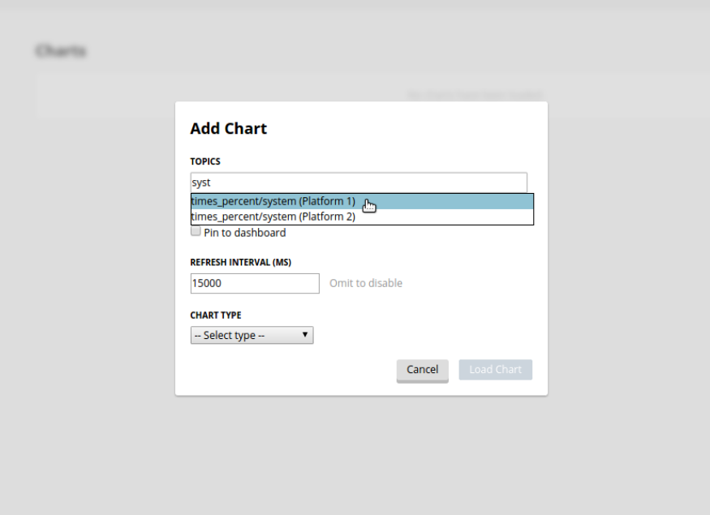

.. _VOLTTRON-Central-Deployment:

===========================
VOLTTRON Central Deployment
===========================

VOLTTRON Central is a platform management web application that allows
platforms to communicate and to be managed from a centralized server.
This agent alleviates the need to ssh into independent nodes in order
to manage them. The demo will start up three different instances of
VOLTTRON with three historians and different agents on each host. The
following entries will help to navigate around the VOLTTRON Central
interface.

-  `Getting Started <#getting-started>`__
-  `Remote Platform Configuration <#remote-platform-configuration>`__
-  `Starting the Demo <#starting-the-demo>`__
-  `Stopping the Demo <#stopping-the-demo>`__
-  `Log In <#log-in>`__
-  `Log Out <#log-out>`__
-  `Platforms Tree <#platforms-tree>`__
-  `Loading the Tree <#loading-the-tree>`__
-  `Health Status <#health-status>`__
-  `Filter the Tree <#filter-the-tree>`__
-  `Platforms Screen <#platforms-screen>`__
-  `Register New Platform <#register-new-platform>`__
-  `Deregister Platform <#deregister-platform>`__
-  `Platform View <#platform-view>`__
-  `Add Charts <#add-charts>`__
-  `Dashboard Charts <#dashboard-charts>`__
-  `Remove Charts <#remove-charts>`__

Getting Started
---------------

After :ref:`installing VOLTTRON <Platform-Installation>`, open three shells
with the current directory the root of the VOLTTRON repository. Then activate
the VOLTTRON environment and export the :term:`VOLTTRON_HOME` variable. The home
variable needs to be different for each instance.

If you are using Terminator you can right click and select "Split Vertically".
This helps us keep from losing terminal windows or duplicating work.

.. code-block:: console

    $ source env/bin/activate
    $ export VOLTTRON_HOME=~/.volttron1

|Terminator Setup|

One of our instances will have a VOLTTRON Central agent. We will install a
platform agent and a historian on all three platforms. Please note, for this demo
all the instances run on the ZeroMQ message bus. For multi-platform, multi-bus deployment
setup please follow the steps described in :ref:`Multi Platform Multi-Bus Deployment <Multi-Platform-Multi-Bus>`.

Run `vcfg` in the first shell. This command will ask how the instance
should be set up. Many of the options have defaults that will be sufficient.
When asked if this instance is a VOLTTRON Central enter `y`. Read through the
options and use the enter key to accept default options. There are no default
credentials for VOLTTRON Central. You can have it install the agents 
at this time. Below is an example configuration. In this case, username is user
and localhost is volttron-pc.

 .. code-block:: console

        (volttron)user@volttron-pc:~/volttron$ vcfg

        Your VOLTTRON_HOME currently set to: /home/user/.volttron1

        Is this the volttron you are attempting to setup? [Y]: 
        What type of message bus (rmq/zmq)? [zmq]: 
        What is the vip address? [tcp://127.0.0.1]: 
        What is the port for the vip address? [22916]: 
        Is this instance web enabled? [N]: y
        What is the protocol for this instance? [https]: 
        Web address set to: https://volttron-pc
        What is the port for this instance? [8443]: 
        Would you like to generate a new web certificate? [Y]: 
        WARNING! CA certificate does not exist.
        Create new root CA? [Y]: 

        Please enter the following details for web server certificate:
                Country: [US]: 
                State: WA
                Location: Richland
                Organization: PNNL
                Organization Unit: VOLTTRON
        Created CA cert
        Creating new web server certificate.
        Is this an instance of volttron central? [N]: y
        Configuring /home/user/volttron/services/core/VolttronCentral.
        Installing volttron central.
        Should the agent autostart? [N]: y
        VC admin and password are set up using the admin web interface.
        After starting VOLTTRON, please go to https://volttron-pc:8443/admin/login.html to complete the setup.
        Will this instance be controlled by volttron central? [Y]: y
        Configuring /home/user/volttron/services/core/VolttronCentralPlatform.
        What is the name of this instance? [volttron1]: 
        Volttron central address set to https://volttron-pc:8443 
        Should the agent autostart? [N]: y
        Would you like to install a platform historian? [N]: y
        Configuring /home/user/volttron/services/core/SQLHistorian.
        Should the agent autostart? [N]: y
        Would you like to install a master driver? [N]: y
        Configuring /home/user/volttron/services/core/MasterDriverAgent.
        Would you like to install a fake device on the master driver? [N]: y
        Should the agent autostart? [N]: y
        Would you like to install a listener agent? [N]: y
        Configuring examples/ListenerAgent.
        Should the agent autostart? [N]: y
        Finished configuration!

        You can now start the volttron instance.

        If you need to change the instance configuration you can edit
        the config file is at /home/user/.volttron1/config

        (volttron)user@volttron-pc:~/volttron$ 

VOLTTRON Central needs to accept the connecting instances'
public keys. For this example we'll allow any CURVE credentials to be accepted.
After `starting <#starting-the-demo>`__, the command **vctl auth add** will prompt the user for
information about how the credentials should be used. We can simply hit Enter
to select defaults on all fields except **credentials**, where we will type
`/.*/`

.. code-block:: console

   $ vctl auth add --credentials "/.*/"
   added entry domain=None, address=None, mechanism='CURVE', credentials=u'/.*/', user_id='63b126a7-2941-4ebe-8588-711d1e6c70d1'

For more information on authorization see :ref:`authentication<VIP-Authentication>`.

Remote Platform Configuration
-----------------------------

The next step is to configure the instances that will connect to VOLTTRON
Central. In the second and third terminal windows run `vcfg`. Like
the `VOLTTRON_HOME` variable, these instances need to have a unique :term:`VIP address` and a unique instance name.

Install a platform agent and a historian as before. Since we used the default
options when configuring VOLTTRON Central, we can use the default options when
configuring these platform agents as well. The configuration will be a little
different. The example below is for the second volttron instance. Note the unique VIP address and instance name.
Please ensure the web-address of the volttron central is configured correctly.

 .. code-block:: console

         (volttron)user@volttron-pc:~/volttron$ vcfg
         
         Your VOLTTRON_HOME currently set to: /home/user/.volttron2 
         
         Is this the volttron you are attempting to setup? [Y]:
         What type of message bus (rmq/zmq)? [zmq]: 
         What is the vip address? [tcp://127.0.0.1]: tcp://127.0.0.2
         What is the port for the vip address? [22916]: 
         Is this instance web enabled? [N]:
         Will this instance be controlled by volttron central? [Y]:
         Configuring /home/user/volttron/services/core/VolttronCentralPlatform.
         What is the name of this instance? [volttron1]: volttron2
         What is the hostname for volttron central? [https://volttron-pc]: 
         What is the port for volttron central? [8443]: 
         Should the agent autostart? [N]: y
         Would you like to install a platform historian? [N]: y
         Configuring /home/user/volttron/services/core/SQLHistorian.
         Should the agent autostart? [N]: y
         Would you like to install a master driver? [N]: 
         Would you like to install a listener agent? [N]: 
         Finished configuration!

         You can now start the volttron instance.

         If you need to change the instance configuration you can edit
         the config file is at /home/user/.volttron2/config

         (volttron)user@volttron-pc:~/volttron$ 

Starting the Demo
-----------------

Start each Volttron instance after configuration. You have two options.

Option 1: The following command starts the volttron process in the background. The "-l" option tells volttron to log
to a file. The file name should be different for each instance.

.. code-block:: console

    $ volttron -vv -l volttron.log&

Option 2: Use the utility script start-volttron. This will override the default log file each time the script is ran
unless the script is modified with a different filename for each instance.

.. code-block:: console

    $ ./start-volttron

.. note:: If you chose to not start your agents with their platforms they will need to be started by hand.

List the installed agents with

.. code-block:: console

    $ vctl status

A portion of each agent's uuid makes up the leftmost column of the status
output. This is all that is needed to start or stop the agent. If any
installed agents share a common prefix then more of the uuid will be needed
to identify it.

.. code-block:: console

    $ vctl start uuid

or

.. code-block:: console

    $ vctl start --tag tag

.. note:: 

        In each of the above examples one could use * suffix to match more 
        than one agent.

VOLTTRON Admin
--------------

The admin page is used to set the master username and password for both admin page and VOLTTRON Central page. Admin page
can then be used to manage RMQ and ZMQ certificates and credentials.

Open a web browser and navigate to https://volttron-pc:8443/admin/login.html

There may be a message warning about a potential security risk. Check to see if the certificate
that was created in vcfg is being used. The process below is for firefox.

|vc-cert-warning-1|

|vc-cert-warning-2|

.. |vc-cert-warning-2| image:: files/vc-cert-warning-2.png

|vc-cert-warning-3|

.. |vc-cert-warning-3| image:: files/vc-cert-warning-3.png

|vc-cert-warning-4|

When the admin page is accessed for the first time, the user will be prompted to set up a master
username and password.

|admin-page-login|

Open your browser to the web address that you specified for the VOLTTRON Central agent that you configured for the
first instance. In the above examples, the configuration file would be located at `~/.volttron1/config` and the
VOLTTRON Central address would be defined in the "volttron-central-address" field. The VOLTTRON Central address takes the
pattern: `https://<localhost>:8443/vc/index.html`, where localhost is the hostname of your machine.
In the above examples, our hostname is `volttron-pc`; thus our VC interface would be
`https://volttron-pc:8443/vc/index.html`.

You will need to provide the username and password set earlier through admin web page.

Stopping the Demo
-----------------

Once you have completed your walk through of the different elements of
the VOLTTRON Central demo you can stop the demos by executing the following
command in each terminal window.

.. code-block:: console

    $ ./stop-volttron

Once the demo is complete you may wish to see the
:ref:`VOLTTRON Central Management Agent <VOLTTRON-Central>` page for more
details on how to configure the agent for your specific use case.

Log In
------

To log in to VOLTTRON Central, open a browser and login to the Volttron web interface, which takes the form
`https://localhost:8443/vc/index.html` where localhost is the hostname of your machine. In the above example, we open
the following URL in which our localhost is "volttron-pc": https://volttron-pc:8443/vc/index.html and enter the user
name and password on the login screen.

|Login Screen|

Log Out
-------

To log out of VOLTTRON Central, click the link at the top right
of the screen.

|Logout Button|

Platforms Tree
^^^^^^^^^^^^^^

The side panel on the left of the screen can be extended to
reveal the tree view of registered platforms.

|Platforms Panel|

|Platforms Tree|

Top-level nodes in the tree are platforms. Platforms can be expanded
in the tree to reveal installed agents, devices on buildings, and
performance statistics about the platform instances.

Loading the Tree
----------------

The initial state of the tree is not loaded. The first time a top-level
node is expanded is when the items for that platform are loaded.

|Load Tree|

After a platform has been loaded in the tree, all the items under a node
can be quickly expanded by double-clicking on the node.

Health Status
-------------

The health status of an item in the tree is indicated by the color
and shape next to it. A green triangle means healthy, a red circle
means there's a problem, and a gray rectangle means the status can't
be determined.

Information about the health status also may be found by hovering the
cursor over the item.

|Status Tooltips|

Filter the Tree
---------------

The tree can be filtered by typing in the search field at the top or
clicking on a status button next to the search field.

|Filter Name|

|Filter Button|

Meta terms such as "status" can also be used as filter keys. Type the
keyword "status" followed by a colon, and then the word "good," "bad,"
or "unknown."

|Filter Status|

Platforms Screen
^^^^^^^^^^^^^^^^

This screen lists the registered VOLTTRON platforms and allows new
platforms to be registered by clicking the Register Platform button.
Each platform is listed with its unique ID and the number and status
of its agents. The platform's name is a link that can be clicked on
to go to the platform management view.

|Platforms|

Platform View
^^^^^^^^^^^^^

From the platforms screen, click on the name link of a platform to
manage it. Managing a platform includes installing, starting, stopping,
and removing its agents.

|Platform Screen|

To install a new agent, all you need is the agent’s wheel file. Click on
the button and choose the file to upload it and install the agent.

To start, stop, or remove an agent, click on the button next to the agent
in the list. Buttons may be disabled if the user lacks the correct
permission to perform the action or if the action can't be performed
on a specific type of agent. For instance, platform agents and VOLTTRON
Central agents can't be removed or stopped, but they can be restarted
if they've been interrupted.

Add Charts
^^^^^^^^^^

Performance statistics and device points can be added to charts either
from the Charts page or from the platforms tree in the side panel.

Click the Charts link at the top-right corner of the screen to go to
the Charts page.

|Charts Page|

From the Charts page, click the Add Chart button to open the Add Chart
window.

|Charts Button|

|Charts Window|

Click in the topics input field to make the list of available chart
topics appear.

|Chart Topics|

Scroll and select from the list, or type in the field to filter the
list, and then select.

|Filter Select|

Select a chart type and click the Load Chart button to close the
window and load the chart.

|Load Chart|

To add charts from the side panel, check boxes next to items in the
tree.

|Tree Charts|

Choose points with the same name from multiple platforms or devices
to plot more than one line in a chart.

|Multiple Lines|

Move the cursor arrow over the chart to inspect the graphs.

|Inspect Chart|

To change the chart's type, click on the Chart Type button and choose
a different option.

|Chart Type|

Dashboard Charts
----------------

To pin a chart to the Dashboard, click the Pin Chart button to toggle
it. When the pin image is black and upright, the chart is pinned; when
the pin image is gray and diagonal, the chart is not pinned and won't
appear on the Dashboard.

|Pin Chart|

Charts that have been pinned to the Dashboard are saved to the database
and will automatically load when the user logs in to VOLTTRON Central.
Different users can save their own configurations of dashboard charts.

Remove Charts
-------------

To remove a chart, uncheck the box next to the item in the tree or click
the X button next to the chart on the Charts page. Removing a chart
removes it from the Charts page and the Dashboard.

.. |Login Screen| image:: files/login-screen.png
.. |Logout Button| image:: files/logout-button.png
.. |Platforms| image:: files/platforms.png
.. |Platform Screen| image:: files/manage-platforms.png
.. |Platforms Tree| image:: files/side-panel-open.png

.. |Status Tooltips| image:: files/problems-found.png
.. |Load Tree| image:: files/load-tree-item.png
.. |Filter Button| image:: files/filter-button.png
.. |Filter Name| image:: files/filter-name.png
.. |Filter Status| image:: files/filter-status.png

.. |Charts Page| image:: files/go-to-charts.png
.. |Charts Button| image:: files/add-charts-button.png
.. |Charts Window| image:: files/charts-window.png
.. |Chart Topics| image:: files/load-topics.png

.. |Chart Type| image:: files/chart-type.png

VOLTTRON Central
^^^^^^^^^^^^^^^^

Navigate to https://volttron-pc:8443/vc/index.html

Log in using the username and password you set up on the admin web page.

|vc-login|

Once you have logged in, click on the Platforms tab in the upper right corner of the window.

|vc-dashboard|

.. |vc-dashboard| image:: files/vc-dashboard.png

Once in the Platforms screen, click on the name of the platform.

|vc-platform|

You will now see a list of agents. They should all be running.

|vc-agents|

For more information on VOLTTRON Central, please see:

* :ref:`VOLTTRON Central Management <VOLTTRON-Central>`
* :ref:`VOLTTRON Central Demo <Device-Configuration-in-VOLTTRON-Central>`
