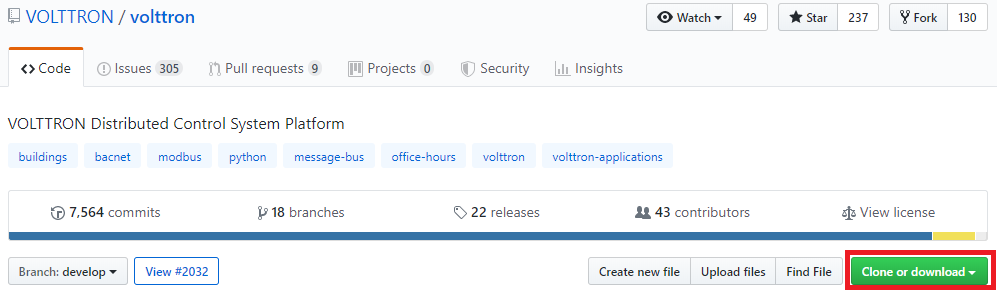
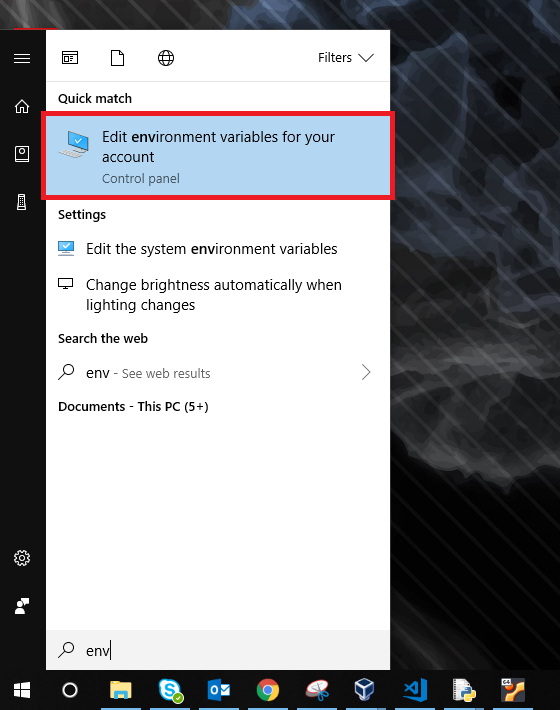
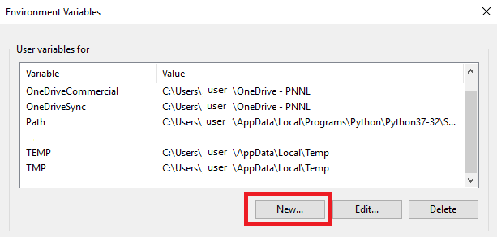
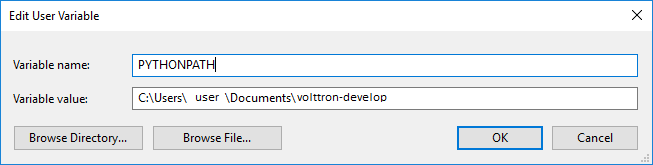
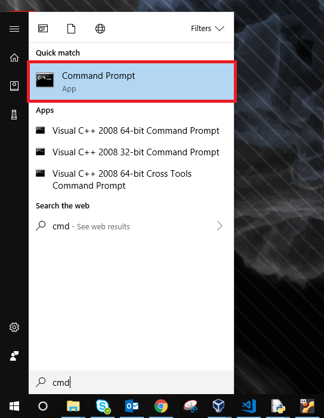
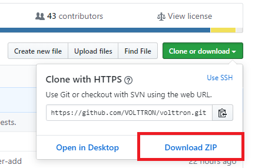
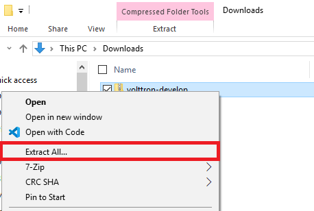
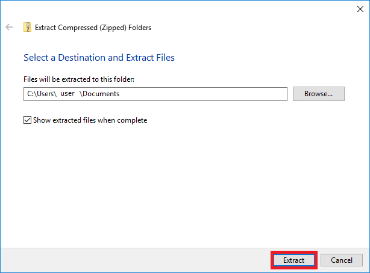
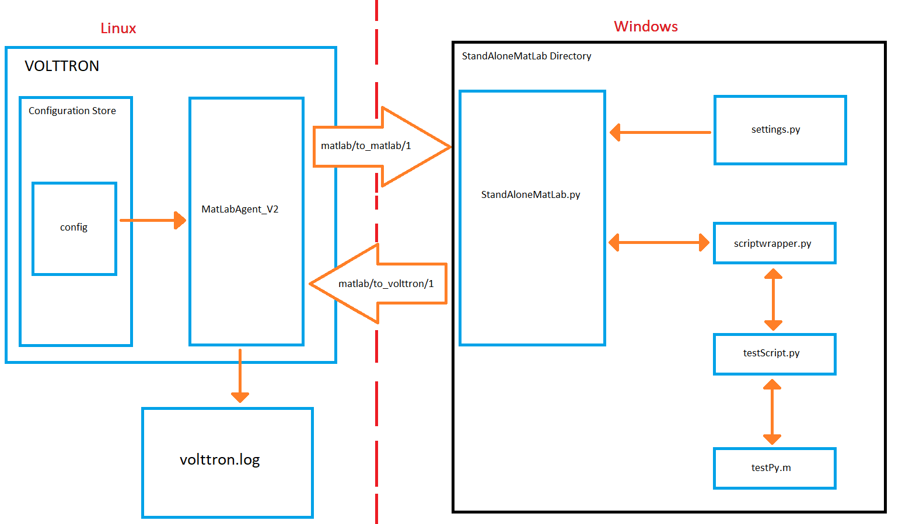

.. _Matlab-Agent:

============
MatLab Agent
============

The MatLab agent and Matlab Standalone Agent together are example agents that allow for MatLab scripts to be run in a
Windows environment and interact with the VOLTTRON platform running in a Linux environment. 

The MatLab agent takes advantage of the config store to dynamically send scripts and commandline arguments across the
message bus to one or more Standalone Agents in Windows.  The Standalone Agent then executes the requested script and
arguments, and sends back the results to the MatLab agent.

Overview of Matlab Agents
=========================

There are multiple components that are used for the MatLab agent.  This diagram is to represent the components that are
connected to the MatLab Agents.  In this example, the scripts involved are based on the default settings in the MatLab
Agent.

|matlab-agent-diagram|

MatLabAgentV2
-------------

MatLabAgentV2 publishes the name of a python script along with any command line arguments that are needed for the script
to the appropriate topic.  The agent then listens on another topic, and whenever anything is published on this topic, it
stores the message in the log file chosen when the VOLTTRON instance is started.  If there are multiple standalone
agents, the agent can send a a script to each of them, along with their own set of command line arguments.  In this
case, each script name and set of command line arguments should be sent to separate subtopics.  This is done so that no
matter how many standalone agents are in use, MatLabAgentV2 will record all of their responses.

.. code::

    class MatlabAgentV2(Agent):

        def __init__(self,script_names=[], script_args=[], topics_to_matlab=[],
                topics_to_volttron=None,**kwargs):

            super(MatlabAgentV2, self).__init__(**kwargs)
            _log.debug("vip_identity: " + self.core.identity)

            self.script_names = script_names
            self.script_args = script_args
            self.topics_to_matlab = topics_to_matlab
            self.topics_to_volttron = topics_to_volttron
            self.default_config = {"script_names": script_names,
                                   "script_args": script_args,
                                   "topics_to_matlab": topics_to_matlab,
                                   "topics_to_volttron": topics_to_volttron}

            #Set a default configuration to ensure that self.configure is called immediately to setup
            #the agent.
            self.vip.config.set_default("config", self.default_config)
            #Hook self.configure up to changes to the configuration file "config".
            self.vip.config.subscribe(self.configure, actions=["NEW", "UPDATE"], pattern="config")

        def configure(self, config_name, action, contents):
            """
            Called after the Agent has connected to the message bus.
            If a configuration exists at startup this will be
            called before onstart.
            Is called every time the configuration in the store changes.
            """
            config = self.default_config.copy()
            config.update(contents)

            _log.debug("Configuring Agent")

            try:
                script_names = config["script_names"]
                script_args = config["script_args"]
                topics_to_matlab = config["topics_to_matlab"]
                topics_to_volttron = config["topics_to_volttron"]

            except ValueError as e:
                _log.error("ERROR PROCESSING CONFIGURATION: {}".format(e))
                return

            self.script_names = script_names
            self.script_args = script_args
            self.topics_to_matlab = topics_to_matlab
            self.topics_to_volttron = topics_to_volttron
            self._create_subscriptions(self.topics_to_volttron)

            for script in range(len(self.script_names)):
                cmd_args = ""
                for x in range(len(self.script_args[script])):
                    cmd_args += ",{}".format(self.script_args[script][x])
                _log.debug("Publishing on: {}".format(self.topics_to_matlab[script]))
                self.vip.pubsub.publish('pubsub', topic=self.topics_to_matlab[script],
                        message="{}{}".format(self.script_names[script],cmd_args))
                _log.debug("Sending message: {}{}".format(self.script_names[script],cmd_args))

            _log.debug("Agent Configured!")

For this example, the agent is publishing to the `matlab/to_matlab/1` topic, and is listening to the
`matlab/to_volttron` topic.  It is sending the script name `testScript.py` with the argument 20.  These are the default
values found in the agent, if no configuration is loaded.

.. code::

    script_names = config.get('script_names', ["testScript.py"])
    script_args = config.get('script_args', [["20"]])
    topics_to_matlab = config.get('topics_to_matlab', ["matlab/to_matlab/1"])
    topics_to_volttron = config.get('topics_to_volttron', "matlab/to_volttron/")

StandAloneMatLab.py
-------------------

The `StandAloneMatLab.py` script is a standalone agent designed to be able to run in a Windows environment.  Its purpose
is to listen to a topic, and when something is published to this topic, it takes the message, and sends it to the
``script_runner`` function in `scriptwrapper.py`.  This function processes the inputs, and then the output is published
to another topic.

.. code::

    class StandAloneMatLab(Agent):
        '''The standalone version of the MatLab Agent'''

        @PubSub.subscribe('pubsub', _topics['volttron_to_matlab'])
        def print_message(self, peer, sender, bus, topic, headers, message):
            print('The Message is: ' + str(message))
            messageOut = script_runner(message)
            self.vip.pubsub.publish('pubsub', _topics['matlab_to_volttron'], message=messageOut)

settings.py
-----------

The topic to listen to and the topic to publish to are defined in `settings.py`, along with the information needed to
connect the Standalone Agent to the primary VOLTTRON instance.  These should be the same topics that the MatLabAgentV2
is publishing and listening to, so that the communication can be successful.  To connect the Standalone Agent to the
primary VOLTTRON instance, the IP address and port of the instance are needed, along with the server key.

.. code::

    _topics = {
            'volttron_to_matlab': 'matlab/to_matlab/1',
            'matlab_to_volttron': 'matlab/to_volttron/1'
            }

    # The parameters dictionary is used to populate the agent's
    # remote vip address.
    _params = {
            # The root of the address.
            # Note:
            # 1. volttron instance should be configured to use tcp. use command vcfg
            # to configure
            'vip_address': 'tcp://192.168.56.101',
            'port': 22916,

            # public and secret key for the standalone_matlab agent.
            # These can be created using the command:  volttron-ctl auth keypair
            # public key should also be added to the volttron instance auth
            # configuration to enable standalone agent access to volttron instance. Use
            # command 'vctl auth add' Provide this agent's public key when prompted
            # for credential.

            'agent_public': 'dpu13XKPvGB3XJNVUusCNn2U0kIWcuyDIP5J8mAgBQ0',
            'agent_secret': 'Hlya-6BvfUot5USdeDHZ8eksDkWgEEHABs1SELmQhMs',

            # Public server key from the remote platform.  This can be
            # obtained using the command:
            # volttron-ctl auth serverkey
            'server_key': 'QTIzrRGQ0-b-37AbEYDuMA0l2ETrythM2V1ac0v9CTA'

    }

    def remote_url():
            return "{vip_address}:{port}?serverkey={server_key}" \
                    "&publickey={agent_public}&" \
                    "secretkey={agent_secret}".format(**_params)

The primary VOLTTRON instance will then need to add the public key from the Standalone Agent.  In this example, the
topic that the Standalone Agent is listening to is `matlab/to_matlab/1`, and the topic it is publishing to is
`matlab/to_volttron/1`.

scriptwrapper.py
----------------

`Scriptwrapper.py` contains the script_runner function.  The purpose of this function is to take in a string that
contains a Python script and command line arguments separated by commas.  This string is parsed and passed to the system
arguments, which allows the script sent to the function to use the command line arguments.  The function then redirects
standard output to a `StringIO` file object, and then attempts to execute the script.  If there are any errors with the
script, the error that is generated is returned to the standalone agent.  Otherwise, the file object stores the output
from the script, is converted to a string, and is sent to the standalone agent.  In this example, the script that is to
be run is `testScript.py`.

.. code::

    #Script to take in a string, run the program,
    #and output the results of the command as a string.

    import time
    import sys
    from io import StringIO

    def script_runner(message):
        original = sys.stdout
    #    print(message)
    #    print(sys.argv)
        sys.argv = message.split(',')
    #    print(sys.argv)

        try:
            out = StringIO()
            sys.stdout = out
            exec(open(sys.argv[0]).read())
            sys.stdout = original
            return out.getvalue()
        except Exception as ex:
            out = str(ex)
            sys.stdout = original
            return out

.. note::

    The script that is to be run needs to be in the same folder as the agent and the `scriptwrapper.py` script.  The
    `script_runner` function needs to be edited if it is going to call a script at a different location.

testScript.py
-------------

This is a very simple test script designed to demonstrate the calling of a MatLab function from within Python.  First it
initializes the MatLab engine for Python.  It then takes in a single command line argument, and passes it to the MatLab
function `testPy.m`.  If no arguments are sent, it will send 0 to the `testPy.m` function.  It then prints the result of
the `testPy.m` function.  In this case, since standard output is being redirected to a file object, this is how the
result is passed from this function to the Standalone Agent.

.. code-block:: python

        import matlab.engine
        import sys

        eng = matlab.engine.start_matlab()

        if len(sys.argv) == 2:
            result = eng.testPy(float(sys.argv[1]))
        else:
            result = eng.testPy(0.0)

        print(result)

testPy.m
--------

This MatLab function is a very simple example, designed to show a function that takes an argument, and produces an array
as the output.  The input argument is added to each element in the array, and the entire array is then returned.

.. code::

    function out = testPy(z)
    x = 1:100
    out = x + z
    end

Setup on Linux
--------------

1. Setup and run VOLTTRON from develop branch using instructions :ref:`here <Platform-Installation>`.

2. Configure volttron instance using the ``vcfg`` command. When prompted for the vip address use
   ``tcp://<ip address of the linux machine>``.  This is necessary to enable volttron communication with external
   processes.

   .. note::

        If you are running VOLTTRON from within VirtualBox, jit would be good to set one of your adapters as a
        `Host-only` adapter.  This can be done within the VM's settings, under the `Network` section.  Once this is
        done, use this IP for the VIP address.

.. _Matlab-Agent-Config:

3. Update the configuration for MatLabAgent_v2 at `<volttron source dir>/example/MatLabAgent_v2/config`.

    The configuration file for the MatLab agent has four variables.

        1. script_names

        2. script_args

        3. topics_to_matlab

        4. topics_to_volttron

    An example config file included with the folder.

    .. code::

            {
              # VOLTTRON config files are JSON with support for python style comments.
              "script_names": ["testScript.py"],
              "script_args": [["20"]],
              "topics_to_matlab": ["matlab/to_matlab/1"],
              "topics_to_volttron": "matlab/to_volttron/"
            }

    To edit the configuration, the format should be as follows:

    .. code-block:: json

            {
              "script_names": ["script1.py", "script2.py", "..."],
              "script_args": [["arg1","arg2"], ["arg1"], ["..."]],
              "topics_to_matlab": ["matlab/to_matlab/1", "matlab/to_matlab/2", "..."],
              "topics_to_volttron": "matlab/to_volttron/"
            }

    The config requires that each script name lines up with a set of commandline arguments and a topic.  A
    commandline argument must be included, even if it is not used.  The placement of brackets are important, even when
    only communicating with one standalone agent.

    For example, if only one standalone agent is used, and no command line arguments are in place, the config file may
    look like this.

    .. code-block:: json

            {
              "script_names": ["testScript.py"],
              "script_args": [["0"]],
              "topics_to_matlab": ["matlab/to_matlab/1"],
              "topics_to_volttron": "matlab/to_volttron/"
            }

4. Install MatLabAgent_v2 and start agent (from volttron root directory)

    .. code-block:: bash

        python ./scripts/install-agent.py -s examples/MatLabAgent_v2 --start

    .. note::

        The MatLabAgent_v2 publishes the command to be run to the message bus only on start or on a configuration
        update.  Once we configure the `standalone_matlab` agent on the Windows machine, we will send a configuration
        update to the running MatLabAgent_v2.  The configuration would contain the topics to which the Standalone Agent
        is listening to and will be publishing result to.

    .. seealso::

        The MatLab agent uses the configuration store to dynamically change inputs.  More information on the config
        store and how it used can be found here.

         * :ref:`VOLTTRON Configuration Store <Configuration-Store>`

         * :ref:`Agent Configuration Store <Agent-Configuration-Store>`

         * :ref:`Agent Configuration Store Interface <Agent-Configuration-Store-Interface>`

5. Run the below command and make a note of the server key. This is required for configuring the stand alone agent
   on Windows. (This is run on the linux machine)

   .. code-block:: bash

       vctl auth serverkey

Setup on Windows
----------------

Install pre-requisites
^^^^^^^^^^^^^^^^^^^^^^

1. Install Python3.6 64-bit from the `Python website <https://www.python.org/downloads/windows/>`_.

2. Install the MatLab engine from
   `MathWorks <https://www.mathworks.com/help/matlab/matlab_external/install-the-matlab-engine-for-python.html>`_.

   .. warning::

      The MatLab engine for Python only supports certain version of Python depending on the version of MatLab used.
      Please check `here <https://www.mathworks.com/help/matlab/matlab-engine-for-python.html>`__ to see if the current
      version of MatLab supports your version of Python.

.. note::

    At this time, you may want to verify that you are able to communicate with your Linux machine across your network.
    The simplest method would be to open up the command terminal and use ``ping <ip of Linux machine>``, and ``telnet
    <ip of Linux machine> <port of volttron instance, default port is 22916>``.  Please make sure that the port is
    opened for outside access.

Install Standalone MatLab Agent
^^^^^^^^^^^^^^^^^^^^^^^^^^^^^^^

The standalone MatLab agent is designed to be usable in a Windows environment.

.. warning:: 

   VOLTTRON is not designed to run in a Windows environment.  Outside of cases where it is stated to be usable in a
   Windows environment, it should be assumed that it will **NOT** function as expected.

#. Download VOLTTRON

    Download the VOLTTRON develop repository from Github. Download the zip from
    `GitHub <https://github.com/VOLTTRON/volttron/tree/develop>`_.

    |github-image|

    |github-zip-image|

    Once the zipped file has been downloaded, go to your `Downloads` folder, right-click on the file, and select
    `Extract All...`

    |extract-image_1|

    Choose a location for the extracted folder, and select "Extract"

    |extract-image_2|

#. Setup the `PYTHONPATH`

    Open the Windows explorer, and navigate to `Edit environment variables for your account`.

    |cmd-image|

    Select "New"

    |env-vars-image_1|

    For "Variable name" enter: ``PYTHONPATH``
    For "Variable value" either browse to your VOLTTRON installation, or enter in the path to your VOLTTRON
    installation.

    |env-vars-image_2|

    Select `OK` twice.

#. Set Python version in MatLab

    Open your MatLab application.  Run the command:

    .. code-block:: bash

        pyversion

    This should print the path to Python2.7.  If you have multiple versions of python on your machine and `pyversion`
    points to a different version of Python, use:

    .. code-block:: bash

        pyversion /path/to/python.exe

    to set the appropriate version of python for your system.

    For example, to use python 3.6 with MatLab:

    .. code-block:: console

        pyversion C:\Python36\python.exe

#. Set up the environment.

    Open up the command prompt

    |cmd-image_2|

    Navigate to your VOLTTRON installation

    ``cd \Your\directory\path\to\volttron-develop``

    Use pip to install and setup dependencies.

    ``pip install -r examples\StandAloneMatLab\requirements.txt``

    ``pip install -e .``

    .. note::

        If you get the error doing the second step because of an already installed volttron from a different directory,
        manually delete the `volttron-egg.` link file from your `<python path>\\Lib\\site-packages` directory (for
        example:

        .. code-block:: bash

            del C:\\Python27\\lib\\site-packages\\volttron-egg.link

        and re-run the second command

#. Configure the agent

    The configuration settings for the standalone agent are in setting.py (located in
    `volttron-develop\\examples\\StandAloneMatLab\\`)

    **settings.py**

    * `volttron_to_matlab` needs to be set to the topic that will send your script and command line arguments to your
      stand alone agent. This was defined in the :ref:`config. <Matlab-Agent-Config>`

    * `matlab_to_volttron` needs to be set to the topic that will send your script's
      output back to your volttron platform. This was defined in :ref:`config. <Matlab-Agent-Config>`

    * `vip_address` needs to be set to the address of your volttron instance

    * `port` needs to be set to the port of your volttron instance

    * `server_key` needs to be set to the public server key of your primary volttron platform.  This can be obtained
      from the primary volttron platform  using ``vctl auth serverkey`` (VOLTTRON must be running to use this command.)

    It is possible to have multiple standalone agents running.  In this case, copy the `StandAloneMatLab` folder, and
    make the necessary changes to the new `settings.py` file.  Unless it is connecting to a separate VOLTTRON instance,
    you should only need to change the `volttron_to_matlab` setting.

    .. note::

        It is recommended that you generate a new "agent_public" and "agent_private" key for your standalone agent.
        This can be done using the ``vctl auth keypair`` command on your primary VOLTTRON platform on Linux.  If you
        plan to use multiple standalone agents, they will each need their own keypair.

6. Add standalone agent key to VOLTTRON platform
   
    * Copy the public key from `settings.py` in the StandAloneMatLab folder.

    * While the primary VOLTTRON platform is running on the linux machine, add the agent public key using the ``vctl
      auth`` command on the Linux machine.  This will make VOLTTRON platform allow connections from the standalone agent

    .. code-block:: bash

        vctl auth add --credentials <standalone agent public key>

7. Run standalone agent

    At this point, the agent is ready to run.  To use the agent, navigate to the example folder and use python to start
    the agent.  The agent will then wait for a message to be published to the selected topic by the MatLab agent.

    .. code-block:: bash

        cd examples\StandAloneMatLab\

        python standalone_matlab.py

    The output should be similar to this:

    .. code-block:: console

        2019-08-01 10:42:47,592 volttron.platform.vip.agent.core DEBUG: identity: standalone_matlab
        2019-08-01 10:42:47,592 volttron.platform.vip.agent.core DEBUG: agent_uuid: None
        2019-08-01 10:42:47,594 volttron.platform.vip.agent.core DEBUG: serverkey: None
        2019-08-01 10:42:47,596 volttron.platform.vip.agent.core DEBUG: AGENT RUNNING on ZMQ Core standalone_matlab
        2019-08-01 10:42:47,598 volttron.platform.vip.zmq_connection DEBUG: ZMQ connection standalone_matlab
        2019-08-01 10:42:47,634 volttron.platform.vip.agent.core INFO: Connected to platform: router: ebae9efa-5e8f-49e3-95a0-2020ddff9e8a version: 1.0 identity: standalone_matlab
        2019-08-01 10:42:47,634 volttron.platform.vip.agent.core DEBUG: Running onstart methods.

    .. note::

            If you have Python3 as your default Python run the command ``python -2 standalone_matlab.py``

8. On the Linux machine configure the Matlab Agent to publish commands to the topic standalone agent is listening to.
To load a new configuration or to change the current configuration enter

   .. code-block:: bash

       vctl config store <agent vip identity> config <path\to\configfile>

   Whenever there is a change in the configuration in the config store, or whenever the agent starts, the MatLab Agent
   sends the configured command to the topic configured.  As long as the standalone agent has been started and is
   listening to the appropriate topic, the output in the log should look similar to this:

   .. code::

      2019-08-01 10:43:18,925 (matlab_agentV2agent-0.3 3539) matlab_agentV2.agent DEBUG: Configuring Agent
      2019-08-01 10:43:18,926 (matlab_agentV2agent-0.3 3539) matlab_agentV2.agent DEBUG: Publishing on: matlab/to_matlab/1
      2019-08-01 10:43:18,926 (matlab_agentV2agent-0.3 3539) matlab_agentV2.agent DEBUG: Sending message: testScript2.py,20
      2019-08-01 10:43:18,926 (matlab_agentV2agent-0.3 3539) matlab_agentV2.agent DEBUG: Agent Configured!
      2019-08-01 10:43:18,979 (matlab_agentV2agent-0.3 3539) matlab_agentV2.agent INFO: Agent: matlab/to_volttron/1
      Message:
      '20'

   Once the matlab agent publishes the message (in the above case, "testScript2.py,20") on the windows command prompt
   running the standalone agent, you should see the message that was received by the standalone agent.

   .. code::

       2019-08-01 10:42:47,671 volttron.platform.vip.agent.subsystems.configstore DEBUG: Processing callbacks for affected files: {}
       The Message is: testScript2.py,20

   .. note::

       If MatLabAgent_v2 has been installed and started, and you have not started the `standalone_matlab agent`, you
       will need to either restart the matlab_agentV2, or make a change to the configuration in the config store to
       send command to the topic standalone agent is actively listening to.

