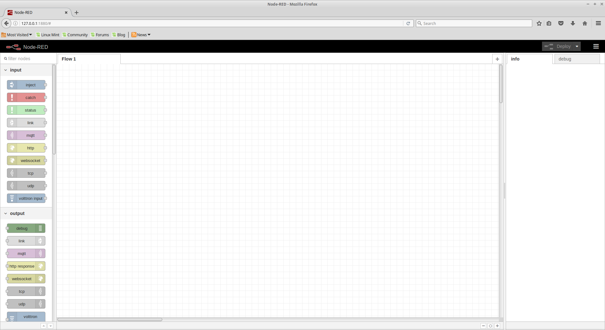
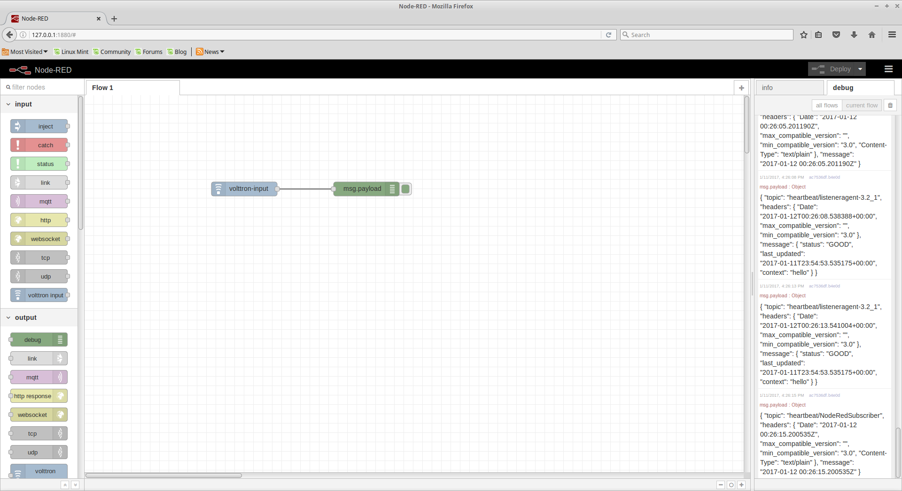

.. _Node-Red:

================
Node Red Example
================

Node Red is a visual programming language wherein users connect small units of functionality "nodes" to create "flows".

There are two example nodes that allow communication between Node-Red and VOLTTRON.  One node reads subscribes to
messages on the VOLTTRON message bus and the other publishes to it.

Dependencies
------------

The example nodes depend on `python-shell` to be installed and available to the Node Red environment.

Installation
------------

Copy all files from `volttron/examples/NodeRed` to your `~/.node-red/nodes` directory.  `~/.node-red` is the default
directory for Node Red files.  If you have set a different directory use that instead.

Set the variables at the beginning of the `volttron.js` file to be a valid VOLTTRON environment, VOLTTRON home, and
Python PATH.

Valid CURVE keys need to be added to the `settings.py` file.  If they are generated with the `vctl auth keypair` command
then the public key should be added to VOLTTRON's authorization file with the following:

.. code-block:: console

    $ vctl auth add

The serverkey can be found with:

.. code-block:: console

    $ vctl auth serverkey

Usage
-----

Start VOLTTRON and Node Red.

.. code-block:: console

   $ node-red

   Welcome to Node-RED
   ===================

   11 Jan 15:26:49 - [info] Node-RED version: v0.14.4
   11 Jan 15:26:49 - [info] Node.js  version: v0.10.25
   11 Jan 15:26:49 - [info] Linux 3.16.0-38-generic x64 LE
   11 Jan 15:26:49 - [info] Loading palette nodes
   11 Jan 15:26:49 - [warn] ------------------------------------------------------
   11 Jan 15:26:49 - [warn] [rpi-gpio] Info : Ignoring Raspberry Pi specific node
   11 Jan 15:26:49 - [warn] ------------------------------------------------------
   11 Jan 15:26:49 - [info] Settings file  : /home/volttron/.node-red/settings.js
   11 Jan 15:26:49 - [info] User directory : /home/volttron/.node-red
   11 Jan 15:26:49 - [info] Flows file     : /home/volttron/.node-red/flows_volttron.json
   11 Jan 15:26:49 - [info] Server now running at http://127.0.0.1:1880/
   11 Jan 15:26:49 - [info] Starting flows
   11 Jan 15:26:49 - [info] Started flows

The output from the Node Red command indicates the address of its web interface.  Nodes available for use are in the
left sidebar.

|Node Red|

We can now use the VOLTTRON nodes to read from and write to VOLTTRON.

|Flow|

