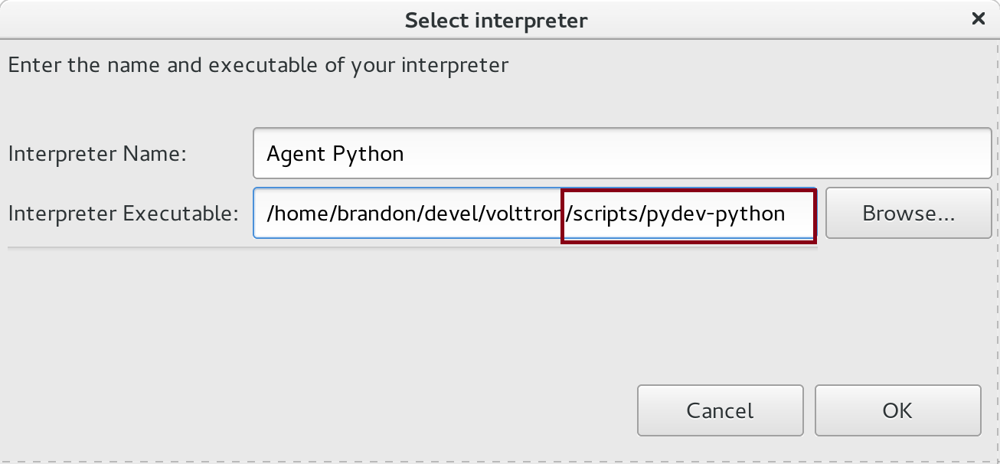
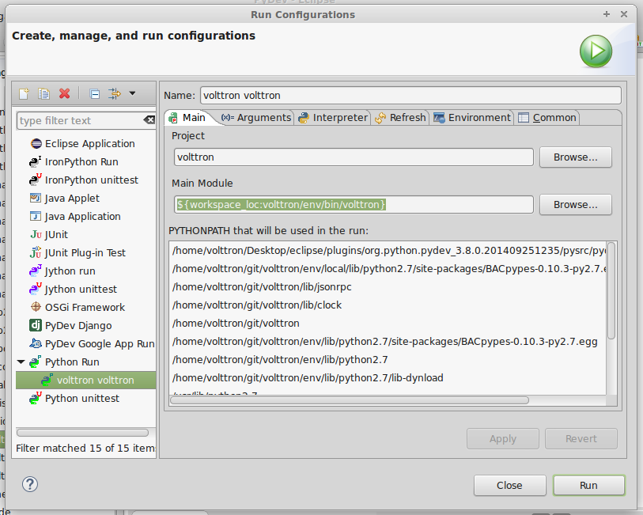
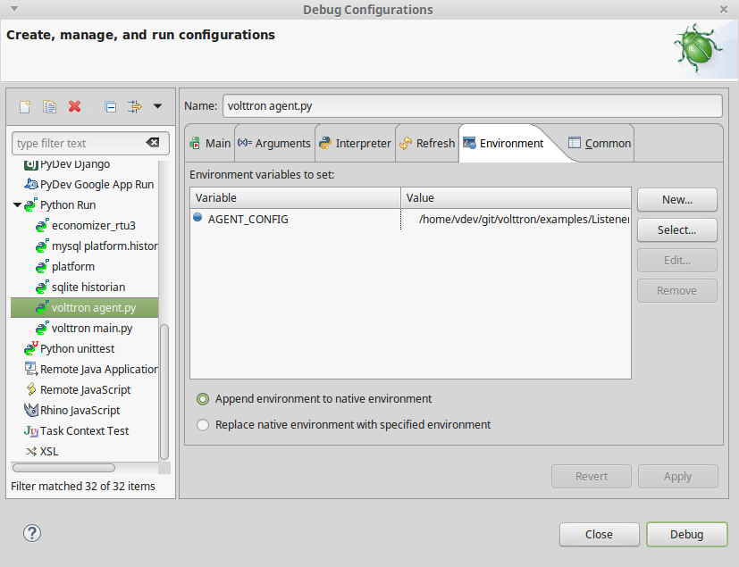

.. _Eclipse-IDE-Setup:

=================
Eclipse IDE Setup
=================

The only thing that is necessary to create a VOLTTRON agent is a text editor and the shell.  However, we have found the
Eclipse Development Environment (IDE) to be a valuable tool for helping to develop VOLTTRON agents.  You can obtain the
latest from http://www.eclipse.org/.

PyDev Plugin
------------

The PyDev plugin available from the Eclipse Marketplace is a Python IDE plugin for Eclipse. This plugin enables features
like debugging, code completion and linting for Python in Eclipse.  To install the plugin, use the help menu in Eclipse
to access the Eclipse Marketplace, search for the PyDev plugin, and then click "install".

|Help -> Eclipse Marketplace...|

|Click Install|

Cloning the Source Code
-----------------------

The VOLTTRON code is stored in a git repository. Eclipse comes with a git plugin out of the box. For
older versions a Git plugin is available which can be convenient for developing VOLTTRON in Eclipse.

.. note::

    Installing Git and the :ref:`VOLTTRON prerequisites <Platform-Prerequisites>` will be required to clone the VOLTTRON
    repository and :ref:`install the platform <Platform-Installation>`

If your Eclipse installation does not have the marketplace follow these :ref:`instructions <Manual-Plugin-Install>`.

The project can now be checked out from the repository into Eclipse.

#. Open the Git view

   |Select Git view|

#. Clone a Git Repository

   |Clone existing repo|

#. Fill out the URI: https://github.com/VOLTTRON/volttron

   |Select repo|

#. Select master for latest stable version

   |Select branch repo|

#. Import the cloned repository as a general project

   |Import project|

#. Pick a project name (default volttron) and hit Finish

   |Finish import|

#. Switch to the PyDev perspective

Build VOLTTRON
--------------

Continue the setup process by opening a command shell and navigating to the root of your cloned VOLTTRON directory.
Follow the instructions in our :ref:`platform installation <Platform-Installation>` docs and then continue below.

Linking Eclipse and the VOLTTRON Python Environment
---------------------------------------------------

From the Eclipse IDE right click on the project name and select `Refresh` to update Eclipse with the file system changes.
The next step will configure Eclipse to use the Python environment created during the bootstrap process.

#. Choose Window - > Preferences
#. Expand the PyDev tree
#. Select Interpreters - > Python Interpreter
#. Click New
#. Click Browse and browse to the pydev-python file located in scripts directory off of the VOLTTRON source
#. Click Ok

   |Pick Python|

#. Select All, then uncheck the VOLTTRON root like the picture below

   |Select path|

#. Click Ok

.. note::

   Syncing Eclipse to the VOLTTRON virtual environment may need to be done after significant changes are made to the
   environment or after switching to branches containing major changes to the VOLTTRON package.

Make Project a PyDev Project
----------------------------

#. In the Project/PackageExplorer view on the left, right-click on the
   project, PyDev-> Set as PyDev Project
#. Switch to the PyDev perspective (if it has not already switched),
   Window -> Open Perspective -> PyDev
   |Set as Pydev|

Eclipse should now be configured to use the project's environment.

Testing the Installation
------------------------

In order to test the installation the VOLTTRON platform must be running.
You can do this either through `the shell <#execute-volttron-through-shell>`__ or
`through Eclipse <#execute-volttron-through-eclipse>`__.

.. _Execute-Volttron-From-Shell:

Execute VOLTTRON Through Shell
~~~~~~~~~~~~~~~~~~~~~~~~~~~~~~

#. Open a console and cd into the root of the volttron repository.
#. Execute `source env/bin/activate`
#. Execute `volttron -vv`

   |Execute VOLTTRON in Shell|

You now have a running VOLTTRON logging to standard out. The next step
to verifying the installation is to `start a listeneragent <#start-a-listeneragent>`__.

Execute VOLTTRON Through Eclipse
~~~~~~~~~~~~~~~~~~~~~~~~~~~~~~~~

#. Click Run -> Run Configuration from the Eclipse Main Menu
#. Click the New Launch Configuration button

   |New Launch Configuration|

#. Change the name and select the main module `volttron/platform/main.py`

   |Main Module|

#. Click the Arguments Tab add '-vv' to the arguments and change the working directory to default

   |Arguments|

#. Click Run. The following image displays the output of a successfully started platform

   |Successful Start|

:ref: _Start-Listener-Eclipse:

Start a ListenerAgent
~~~~~~~~~~~~~~~~~~~~~

.. warning::

   Before attempting to run an agent in Eclipse, please see the note in:
   :ref:`Agent Development <Eclipse-Agent-Development>`

The listener agent will listen to the message bus for any published
messages. It will also publish a heartbeat message ever 10 seconds (by
default).

Create a new run configuration entry for the listener agent.

#. In the Package Explorer view, open examples -> ListenerAgent -->
   listener
#. Right-click on agent.py and select Run As -> Python Run (this will
   create a run configuration but fail)
#. On the menu bar, pick Run -> Run Configurations...
#. Under Python Run pick "volttron agent.py"
#. Click on the Arguments tab and Change Working Directory to Default

#. In the Environment tab, click new set the variable to AGENT\_CONFIG
   with the value of /home/git/volttron/examples/ListenerAgent/config

   |Listener Vars|

#. Click Run, this launches the agent

You should see the agent start to publish and receive its own heartbeat
message in the console.

.. |Help -> Eclipse Marketplace...| image:: files/eclipse-marketplace.png
.. |Click Install| image:: files/eclipse-marketplace2.png
.. |Select Git view| image:: files/git-view.png
.. |Clone existing repo| image:: files/clone-existing.png
.. |Select repo| image:: files/select-repo.png
.. |Select branch repo| image:: files/select-branch.png
.. |Import project| image:: files/import-project.png
.. |Finish import| image:: files/finish-import.png

.. |Select path| image:: files/select-path.png
.. |Set as Pydev| image:: files/set-as-pydev.png
.. |Execute VOLTTRON in Shell| image:: files/volttron-console.png
.. |New Launch Configuration| image:: files/new-python-run.png

.. |Arguments| image:: files/volttron-main-args.png
.. |Successful Start| image:: files/run-results.png

.. toctree::

   eclipse
   manual-plugin-install
