Agent Development in Eclipse
============================

The Eclipse IDE (integrated development environment), while not required for agent development, can be a powerful developmental tool. Download the IDE from the following links. Choose a download mirror closest to your location.

`For 32-bit machines <http://www.eclipse.org/downloads/download.php?file=/technology/epp/downloads/release/mars/R/eclipse-java-mars-R-linux-gtk.tar.gz>`_

`For 64-bit machines <http://www.eclipse.org/downloads/download.php?file=/technology/epp/downloads/release/mars/R/eclipse-java-mars-R-linux-gtk-x86_64.tar.gz>`_

To go to the main Eclipse webpage, go to `http://eclipse.org/ <http://www.eclipse.org/>`_

Installing Eclipse
------------------

To install Eclipse, enter the following commands in a terminal:

1. Install Eclipse dependency:

::

	# apt-get install openjdk-7-jdk

2. After downloading the eclipse archive file, move the package to the opt directory (enter this command from a terminal in the directory where eclipse was downloaded):

::

	$ tar -xvf eclipse-java-mars-R-linux-gtk-x86_64.tar.gz
	# mv eclipse /opt/

- For 32-bit machines, replace “gtk-x86_64” with “linux-gtk” in the previous command.

3. Create desktop shortcut:

::

	# touch /usr/share/applications/eclipse.desktop
	# nano /usr/share/applications/eclipse.desktop

Enter the following text, as shown in Figure 1, and save the file. To avoid typos, copy and paste the following:

::

	 [Desktop Entry]
	Name=Eclipse 
	Type=Application
	Exec=/opt/eclipse/eclipse
	Terminal=false
	Icon=/opt/eclipse/icon.xpm
	Comment=Integrated Development Environment
	NoDisplay=false
	Categories=Development;IDE
	Name[en]=eclipse

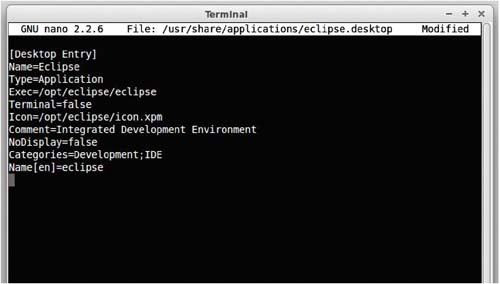
Figure 1. Eclipse Desktop File

4. Copy the shortcut to the desktop:

::

	$ cp /usr/share/applications/eclipse.desktop  ~/Desktop/

Eclipse is now installed and ready to use.

Installing Pydev and EGit Eclipse Plug-ins
------------------------------------------
The transactional network code is stored in a Git repository. A plug-in is available for Eclipse that makes development more convenient (note: you must have Git installed on the system and have built the project).

1. Select Help. Select Install New Software (Figure 2).

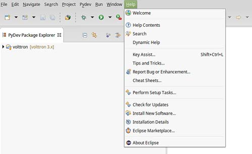
Figure 2. Installing Eclipse EGit Plugin

2. Click the Add button (Figure 3).

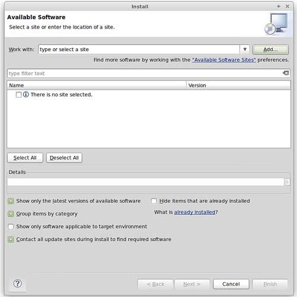
Figure 3. Installing Eclipse EGit Plugin (continued)

3. As shown in Figure 4, enter the following information:
	- For name use:  EGit
	- For location: http://download.eclipse.org/egit/updates

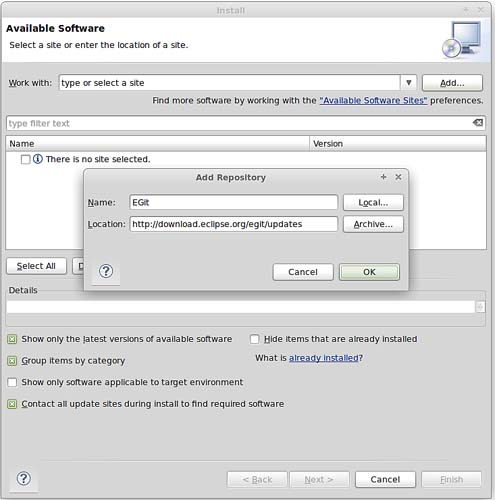
Figure 4. Installing Eclipse Egit Plugin (continued)

4. After clicking OK, check the Select All button.
5. Click through Next > Agree to Terms > Finish. Allow Eclipse to restart.

6. After installing Eclipse, you must add the PyDev plug-in to the environment. 

In Eclipse:

- Select Help and select Install New Software.
- Click the Add button.
- As shown in Figure 5, enter the following information:
	- For name use: PyDev
	- For location: http://pydev.org/updates
	- Click OK.

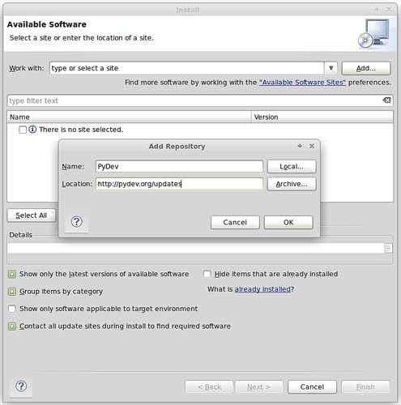
Figure 5. Installing Eclipse PyDev Plugin

7. Check the box for PyDev.
8. Click through Next > Agree to Terms > Finish. Allow Eclipse to restart.

Checkout VOLTTRON Project
-------------------------
VOLTTRON can be imported into Eclipse from an existing VOLTTRON project (VOLTTRON was previously checked out from GitHub) or a new download from GitHub.

Import VOLTTRON into Eclipse from an Existing Local Repository (Previously Downloaded VOLTTRON Project)
^^^^^^^^^^^^^^^^^^^^^^^^^^^^^^^^^^^^^^^^^^^^^^^^^^^^^^^^^^^^^^^^^^^^^^^^^^^^^^^^^^^^^^^^^^^^^^^^^^^^^^^
To import an existing VOLTTRON project into Eclipse, complete the following steps:

1. Select File and select Import (Figure 6).

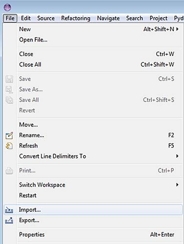
Figure 6. Checking VOLTTRON with Eclipse from Local Source

2. Select Git. Select Projects from Git. Click the Next button (Figure 7).

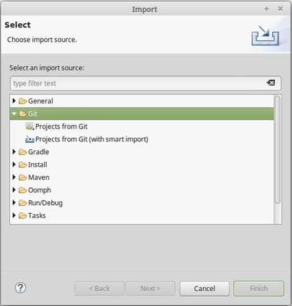
Figure 7. Checking VOLTTRON with Eclipse from Local Source (continued)

3. Select Existing local repository and click the Next button (Figure 8).

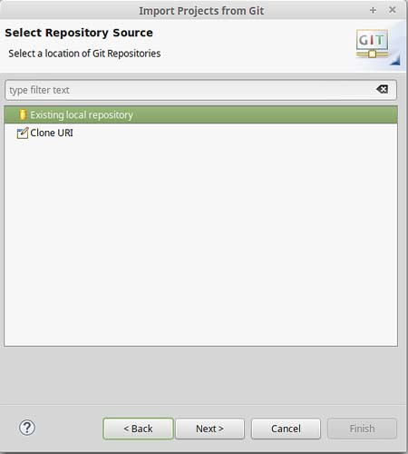
Figure 8. Checking VOLTTRON with Eclipse from Local Source (continued)

4. Select Add (Figure 9).

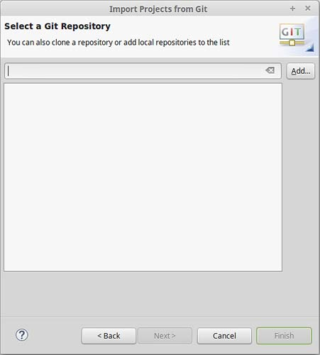
Figure 9. Checking VOLTTRON with Eclipse from Local Source (continued)

5. Select Browse. Navigate to the top-level base VOLTTRON directory. Select OK (Figure 10).

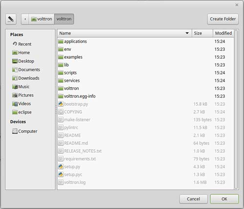
Figure 10. Checking Out VOLTTRON with Eclipse from Local Source (continued)

6. Click Finish (Figure 11).

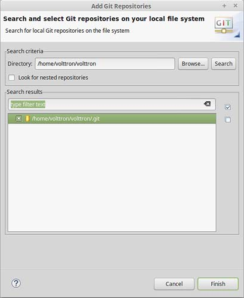
Figure 11. Checking Out VOLTTRON with Eclipse from Local Source (continued)

7. Click Next (Figure 12).

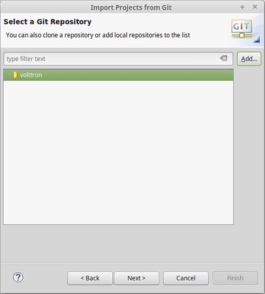
Figure 12. Checking Out VOLTTRON with Eclipse from Local Source (continued)

8. Select Import as general project. Click Next. Click Finish (Figure 13). The project will be imported into the workspace.

.. image:: files/13-check-volttron-with-eclipse.jpg
Figure 13. Checking Out VOLTTRON with Eclipse from Local Source (continued)
 
Import New VOLTTRON Project from GitHub
^^^^^^^^^^^^^^^^^^^^^^^^^^^^^^^^^^^^^^^
To import a new VOLTTRON project directly from GitHub into Eclipse, complete the following steps:

1. Select File and select Import (Figure 14).

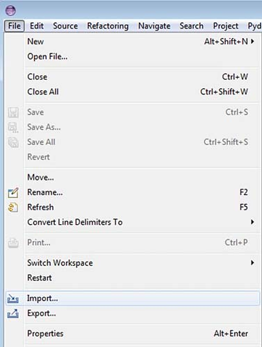
Figure 14. Checking Out VOLTTRON with Eclipse from GitHub

2. Select Git. Select Projects from Git. Click the Next button (Figure 15).

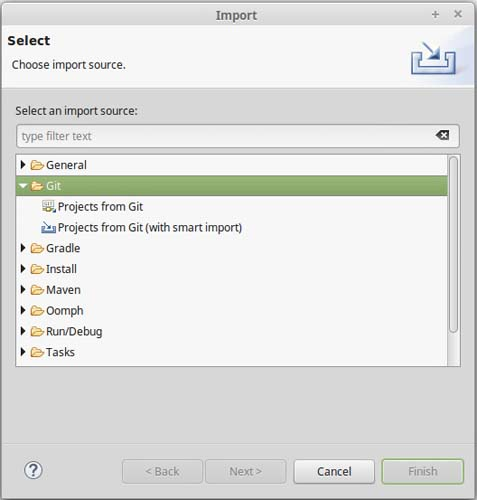
Figure 15. Checking Out VOLTTRON with Eclipse from GitHub (continued)

3. Select Clone URI and select Next (Figure 16).

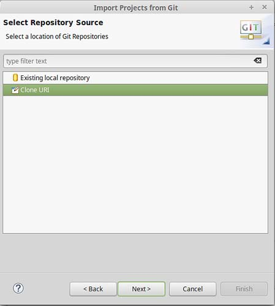
Figure 16. Checking Out VOLTTRON with Eclipse GitHub (continued)

4. Fill in https://github.com/VOLTTRON/volttron.git for the URI. If you have a GitHub account, enter a username and password in the User and Password sections. This is not required but will allow you to receive notifications from GitHub for VOLTTRON related news. (Figure 17)

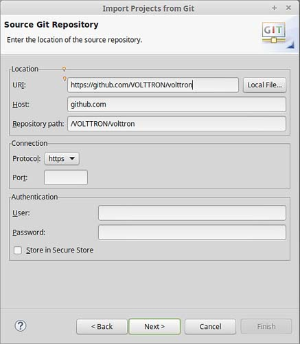
Figure 17. Checking Out VOLTTRON with Eclipse from GitHub (continued)

5. Select the 3.x branch (Figure 18).

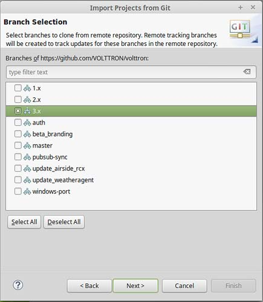
Figure 18. Checking Out VOLTTRON with Eclipse from GitHub (continued)

6. Select a location to save the local repository (Figure 19).

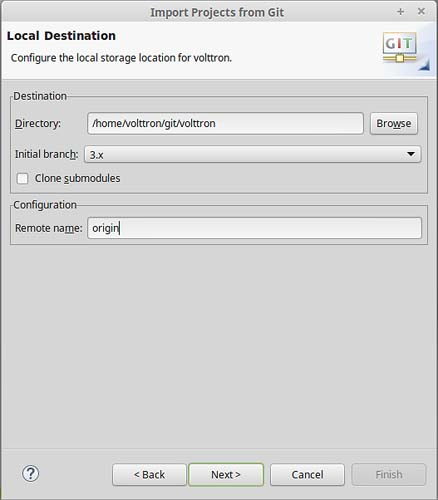
Figure 19. Checking Out VOLTTRON with Eclipse from GitHub (continued)

7. Select Import as general project. Select Next. Select Finish (Figure 20). The project will now be imported into the workspace.

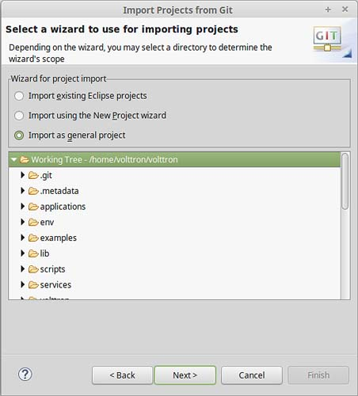
Figure 20. Checking Out VOLTTRON with Eclipse from GitHub (continued)

If the VOLTTRON project has not been built (<project directory>/bootstrap.py file has not been run), proceed to ##Section 2.4 Building the VOLTTRON Platform## and follow the instruction for running the bootstrap.py script before proceeding to the following sections.

Linking Eclipses
----------------
PyDev must now be configured to use the Python interpreter packaged with VOLTTRON.

1. Select Window and select Preferences.
2. Expand the PyDev tree.
3. Select Interpreters and select Python interpreter.
4. Select New (Figure 21).

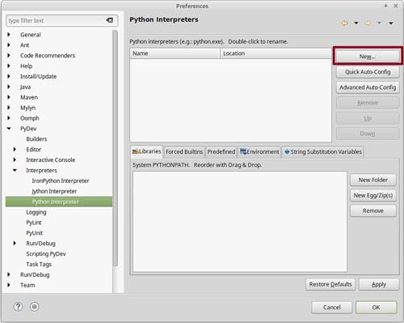
Figure 21. Configuring PyDev

5. Select Browse and navigate to the pydev-python file located at (``<project directory>/scripts/pydev-python``) (Figure 22).

6. Select OK (Figure 22).

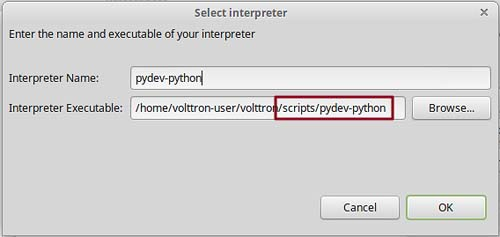
Figure 22. Configuring PyDev (continued)

7. Select All and uncheck the VOLTTRON base directory (Figure 23).

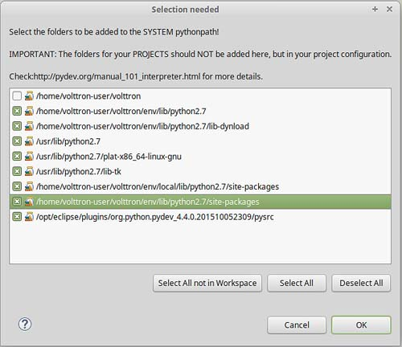
Figure 23. Configuring PyDev (continued)

8. In the Project/PackageExplorer view on the left, right-click on the project, PyDev, and set as PyDev Project (Figure 24).

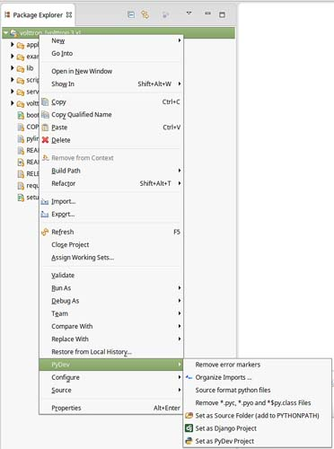
Figure 24. Setting as PyDev Project

9. Switch to the PyDev perspective: Select Window. Select Perspective. Select Open Perspective. Select Other. Select PyDev (Figure 25). Eclipse should now be configured to use the project's environment. 

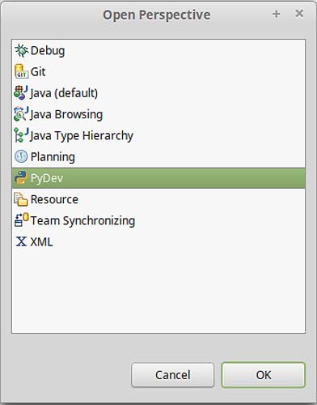
Figure 25. Setting PyDev Perspective in Eclipse

Running the VOLTTRON Platform and Agents
----------------------------------------

VOLTTRON and agents within VOLTTRON can now be run within Eclipse. This section will describe the process to run VOLTTRON and an agent within Eclipse.

Setup a Run Configuration for the Platform
^^^^^^^^^^^^^^^^^^^^^^^^^^^^^^^^^^^^^^^^^^
The following steps describe the process for running VOLTTRON within Eclipse:

1. Select Run and select Run Configurations (Figure 26).

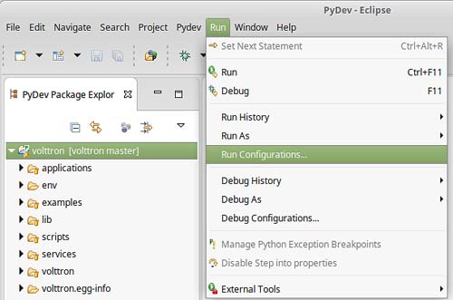
Figure 26. Running VOLTTRON Platform, Setting Up a Run Configuration

2. Select Python Run from the menu on left. Click the New launch configuration button (Figure 27).

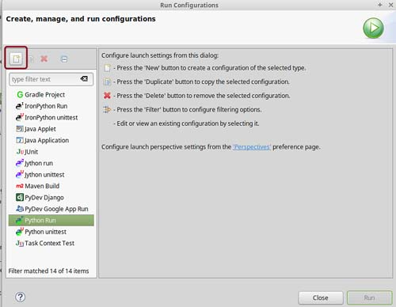
Figure 27. Running VOLTTRON Platform, Setting Up a Run Configuration (continued)

3. Change the name (any name may be used but for this example the name VOLTTRON was chosen) and select the main module (``<project directory>/volttron/platform/main.py``).

4. Select the Arguments tab and enter '-vv --developer-mode' in the Program arguments field (Figure 28) then select the Run button.

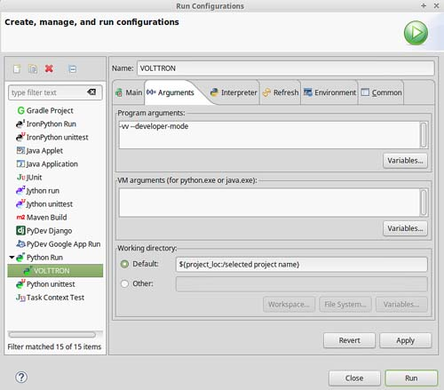
Figure 28. Running VOLTTRON Platform, Setting Up a Run Configuration (continued)

5. If the run is successful, the console should appear similar to Figure 29. If the run does not succeed (red text describing why the run failed will populate the console), click the all stop icon (two red boxes overlaid) on the console and then retry.

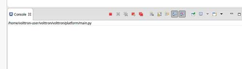
Figure 29. Running VOLTTRON Platform, Console View on Successful Run

Configure a Run Configuration for the Listener Agent
^^^^^^^^^^^^^^^^^^^^^^^^^^^^^^^^^^^^^^^^^^^^^^^^^^^^

The following steps  describe the process for configuring an agent within Eclipse:

1. Select Run and select Run Configurations (Figure 30).

Figure 30. Running the Listener Agent, Setting Up a Run Configuration

2. Select Python Run from the menu on left and click the New launch configuration button (Figure 31).

Figure 31. Running the Listener Agent, Setting Up a Run Configuration (continued)

3. Change the name (for this example Listener is used) and select the main module (``<project directory>/examples/ListenerAgent/listener/agent.py``) (Figure 32).

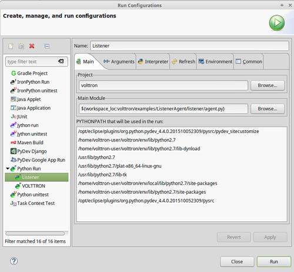
Figure 32. Running the Listener Agent, Setting Up a Run Configuration (continued)

4. Click the Arguments tab and change Working directory to Default (Figure 33).

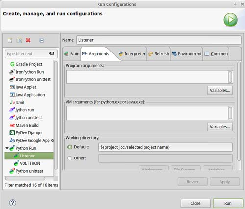
Figure 33. Running the Listener Agent, Setting Up a Run Configuration (continued)

5. In the Environment tab, select New and add the following environment variables (bulleted list below), as shown in Figure 34:

- AGENT_CONFIG = /home/<USER>/examples /ListenerAgent/config

AGENT_CONFIG is the absolute path the agent’s configuration file. To access a remote message bus, use the VIP address as described in ##Section 3.5 Platform Management:VOLTTRON Management Central.##

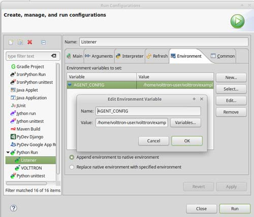
Figure 34. Running the Listener Agent, Setting Up a Run Configuration

6. Click Run. This launches the agent. You should see the agent start to publish and receive its own heartbeat message (Figure 35).

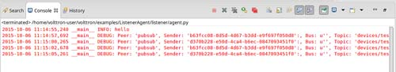
Figure 35. Listener Agent Output on Eclipse Console

The process for running other agents in Eclipse is identical to that of the Listener agent. Several useful development tools are available within Eclipse and PyDev that make development, debugging, and testing of agents much simpler.

Agent Creation Walkthrough
--------------------------
Developers should look at the Listener agent before developing their own agent. The Listener agent illustrates the basic functionality of an agent. The following example demonstrates the steps for creating an agent. 

Agent Folder Setup
^^^^^^^^^^^^^^^^^^

Create a folder within the workspace to help consolidate the code your agent will utilize.

1. In the VOLTTRON base directory, create a new folder TestAgent.

2. In TestAgent, create a new folder tester. This is the package where the Python code will be created (Figure 36).

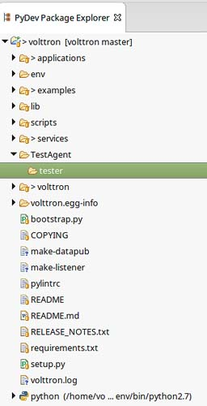
Figure 36. Creating an Agent Test Folder

Create Agent Code
^^^^^^^^^^^^^^^^^

The following steps describe the necessary agent files and modules.

1. In tester, create a file called *__init__.py*, which tells Python to treat this folder as a package.
	
2. In the tester package folder, create the file *testagent.py*

3. Create a class called TestAgent.

4. Import the packages and classes needed: 

::

	from __future__ import absolute_import

	from datetime import datetime
	import logging
	import sys
	
	from volttron.platform.vip.agent import Agent, Core
	from volttron.platform.agent import utils

5. Set up a logger. The ``utils`` module from ``volttron.platform.agent`` builds on Python’s already robust logging module and is easy to use. Add the following lines after the import statements:

::

	utils.setup_logging()
	_log = logging.getLogger(__name__)

This agent will inherit features from the Agent class (base class) extending the agent’s default functionality. The class definition for the TestAgent will be configured as shown below (with ``__init__``).

::

	class TestAgent(Agent):
	   def __init__(self, config_path, **kwargs):
	       super(TestAgent, self).__init__(**kwargs)

Setting up a Subscription
^^^^^^^^^^^^^^^^^^^^^^^^^
1. Create a startup method. This method is tagged with the decorator ``@Core.receiver("onstart")``. The startup method will run after the agent is initialized. The TestAgent’s startup method will contain a subscription to the Listener agent’s heartbeat (heartbeat/listeneragent). The TestAgent will detect when a message with this topic is published on the message bus and will run the method specified with the callback keyword argument passed to ``self.vip.pubsub.subscribe``.

::

	@Core.receiver("onstart")
	def starting(self, sender, **kwargs):
	   '''
	   Subscribes to the platform message bus on
	   the heatbeat/listeneragent topic
	   '''
	   print('TestAgent example agent start-up function')
	   self.vip.pubsub.subscribe('pubsub', 'heartbeat/listeneragent',
		                     callback=self.on_heartbeat)

2. Create the callback method. Typically, the callback is the response to a message (or event). In this simple example, the TestAgent will do a print statement and publish a message to the bus:

:: 

	def on_heartbeat(self, peer, sender, bus, topic, headers, message):
	   '''TestAgent callback method'''
	   print('Matched topic: {}, for bus: {}'.format(topic, bus))
	   self.vip.pubsub.publish('pubsub',
		                   'testagent/publish',
		                   headers=headers,
		                   message='test publishing').get(timeout=30)

Argument Parsing Main Method
^^^^^^^^^^^^^^^^^^^^^^^^^^^^
The test agent will need to be able to parse arguments being passed on the command line by the agent launcher. Use the **utils.default_main** method to handle argument parsing and other default behavior. 

1. Create a main method that can be called by the launcher:

::

	def main(argv=sys.argv):
	   '''Main method called by the eggsecutable.'''
	   try:
	       utils.vip_main(TestAgent)
	   except Exception as e:
	       _log.exception(e)

	if __name__ == '__main__':
	   # Entry point for script
	   sys.exit(main())

Create Support Files for Test Agent
^^^^^^^^^^^^^^^^^^^^^^^^^^^^^^^^^^^
VOLTTRON agents need configuration files for packaging, configuration, and launching. The “setup.py” file details the naming and Python package information. The launch configuration file is a JSON-formatted text file used by the platform to launch instances of the agent. 

Packaging Configuration
^^^^^^^^^^^^^^^^^^^^^^^
In the TestAgent folder, create a file called "setup.py". This file sets up the name, version, required packages, method to execute, etc. for the agent. The packaging process will also use this information to name the resulting file.

::

	from setuptools import setup, find_packages

	#get environ for agent name/identifier
	packages = find_packages('.')
	package = packages[0]

	setup(
	   name = package + 'agent',
	   version = "0.1",
	   install_requires = ['volttron'],
	   packages = packages,
	   entry_points = {
	       'setuptools.installation': [
		   'eggsecutable = ' + package + '.testagent:main',
	       ]
	   }
	)

Launch Configuration
^^^^^^^^^^^^^^^^^^^^
In TestAgent, create a file called "testagent.launch.json". This is the file the platform will use to launch the agent. It can also contain configuration parameters for the agent:

::

	{
	   "agentid": "Test1" 
	}

Testing the Agent
^^^^^^^^^^^^^^^^^
From a terminal, in the base VOLTTRON directory, enter the following commands (with the platform activated and VOLTTRON running):

1. Run `pack_install` script on TestAgent:

::

	$ ./scripts/core/pack_install.sh TestAgent TestAgent/config test-agent

- Upon successful completion of this command, the terminal output will show the install directory, the agent UUID (unique identifier for an agent; the UUID shown in red is  only an example and each instance of an agent will have a different UUID) and the agent name (blue text):

::

	Installed /home/volttron-user/.volttron/packaged/testeragent-0.1-py2-none-any.whl 
	as d4ca557a-496c-4f02-8ad9-42f5d435868a testeragent-0.1

2. Start the agent:

:: 

	$ volttron-ctl start --tag test-agent

3. Verify that the agent is running:

::

	$ volttron-ctl status
	$ tail -f volttron.log

If changes are made to the Passive AFDD agent’s configuration file after the agent is launched, stop and reload the agent. In a terminal, enter the following commands:

::

	$ volttron-ctl stop --tag test-agent
	$ volttron-ctl remove --tag test-agent

Re-build and start the updated agent (Figure 37).

Figure 37. TestAgent Output In VOLTTRON Log

Running the TestAgent in Eclipse
^^^^^^^^^^^^^^^^^^^^^^^^^^^^^^^^

If you are working in Eclipse, create a run configuration for the TestAgent based on the Listener agent configuration in the Eclipse development environment ##(Section 5.5.5 Running the VOLTTRON Platform and Agents)##.

1. Launch the platform (##Section 5.5.5.1 Setup a Run Configuration for the Platform##)

2. Launch the TestAgent by following the steps outlined in ##Section 5.5.5.2 *Configure a Run Configuration for the Listener Agent*## for launching the Listener agent.

3. Launch the Listener agent. TestAgent should start receiving the heartbeats from Listener agent and the following should be displayed in the console (Figure 38).

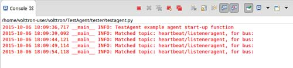
Figure 38. Console Output for TestAgent

Adding Additional Features to the TestAgent
-------------------------------------------
Additional code can be added to the TestAgent to utilize additional services in the platform. The following sections show how to use the weather and device scheduling service within the TestAgent.

Subscribing to Weather Data
^^^^^^^^^^^^^^^^^^^^^^^^^^^
This agent can be modified to listen to weather data from the Weather agent by adding the following line at the end of the TestAgent startup method. This will subscribe the agent to the temperature subtopic. For the full list of topics available, please see: 

https://github.com/VOLTTRON/volttron/wiki/WeatherAgentTopics

::

	self.vip.pubsub.subscribe('pubsub', 'weather/temperature/temp_f',
		                 callback=self.on_weather)

Add the callback method ``on_weather``:

::

	def on_weather(self, peer, sender, bus, topic, headers, message):
	   print("TestAgent got weather\nTopic: {}, Message: {}".format(topic, message))

The platform log file should appear similar to Figure 39.

Figure 39. TestAgent Output when Subscribing to Weather Topic

Utilizing the Scheduler Agent
^^^^^^^^^^^^^^^^^^^^^^^^^^^^^
The TestAgent can be modified to publish a schedule to the Actuator agent by reserving time on virtual devices. Modify the following code to include current time ranges and include a call to the publish schedule method in setup. The following example posts a simple schedule. For more detailed information on device scheduling, please see: 

https://github.com/VOLTTRON/volttron/wiki/ActuatorAgent

Ensure the Actuator agent is running as per ##Section 3.3 Device Control: Configuring and Launching the Actuator Agent##. Add the following line to the TestAgent’s import statements:

::

	from volttron.platform.messaging import topics

Add the following lines to the TestAgent’s starting method. This sets up a subscription to the **ACTUATOR_RESPONSE** topic and calls the **publish_schedule** method.

::

	self.vip.pubsub.subscribe('pubsub', topics.ACTUATOR_RESPONSE,
		                 callback=self.on_schedule_result)
	self.publish_schedule()

The **publish_schedule** method sends a schedule request message to the Actuator agent (Update the schedule with appropriate times):

::

	def publish_schedule(self):
	   headers = {
		   'AgentID': self._agent_id,
		   'type': 'NEW_SCHEDULE',
		   'requesterID': self._agent_id, # Name of requesting agent
		   'taskID': self._agent_id + "-TASK", # Unique task ID
		   'priority': 'LOW'            # Task Priority (HIGH, LOW, LOW_PREEMPT)
	   } 
	   msg = [
		   ["campus/building/device1", # First time slot.
		    "2014-1-31 12:27:00",      # Start of time slot.
		    "2014-1-31 12:29:00"],     # End of time slot.
		   ["campus/building/device1", # Second time slot.
		    "2014-1-31 12:26:00",      # Start of time slot.
		    "2014-1-31 12:30:00"],     # End of time slot.
		   ["campus/building/device2", # Third time slot.
		    "2014-1-31 12:30:00",      # Start of time slot.
		    "2014-1-31 12:32:00"],     # End of time slot.
		   #etc...
	       ]
	   self.vip.rpc.call('platform.actuator',      # Target agent
			     'request_new_schedule',   # Method to call
			      agent_id,                # Requestor
			     "some task",              # TaskID
			     "LOW",                    # Priority
	  						   msg).get(timeout=10)     # Request message

Add the call back method for the schedule request:

::

	def on_schedule_result(self, topic, headers, message, match):
	   print (("TestAgent schedule result \nTopic: {topic}, "
		   "{headers}, Message: {message}")
		   .format(topic=topic, headers=headers, message=message))

Full TestAgent Code
^^^^^^^^^^^^^^^^^^^
The following is the full TestAgent code built in the previous steps:

::

	from __future__ import absolute_import

	from datetime import datetime
	import logging
	import sys

	from volttron.platform.vip.agent import Agent, Core
	from volttron.platform.agent import utils
	from volttron.platform.messaging import headers as headers_mod

	utils.setup_logging()
	_log = logging.getLogger(__name__)

	class TestAgent(Agent):
	   def __init__(self, config_path, **kwargs):
	       super(TestAgent, self).__init__(**kwargs)
	       
	   @Core.receiver("onstart")
	   def starting(self, sender, **kwargs):
	       '''
	       Subscribes to the platform message bus on
	       the heatbeat/listeneragent topic
	       '''
	       _log.info('TestAgent example agent start-up function')
	       self.vip.pubsub.subscribe(peer='pubsub', topic='heartbeat/listeneragent',
		                         callback=self.on_heartbeat)
	       self.vip.pubsub.subscribe('pubsub', topics.ACTUATOR_RESPONSE,
		                         callback=self.on_schedule_result)
	       self.vip.pubsub.subscribe('pubsub', 'weather/temperature/temp_f',
		                         callback=self.on_weather)

	       self.publish_schedule()
		            
	   def on_heartbeat(self, peer, sender, bus, topic, headers, message):
	       '''TestAgent callback method'''
	       _log.info('Matched topic: {}, for bus: {}'.format(topic, bus))
	       self.vip.pubsub.publish(peer='pubsub',
		                       topic='testagent/publish',
		                       headers=headers,
		                       message='test publishing').get(timeout=30)

	   def on_weather(self, peer, sender, bus, topic, headers, message):
	       _log.info(
		   "TestAgent got weather\nTopic: {}, Message: {}".format(topic, message))

	   def on_schedule_result(self, topic, headers, message, match):
	       print (("TestAgent schedule result \nTopic: {topic}, "
		       "{headers}, Message: {message}")
		       .format(topic=topic, headers=headers, message=message))

	def main(argv=sys.argv):
	   '''Main method called by the eggsecutable.'''
	   try:
	       utils.vip_main(TestAgent)
	   except Exception as e:
	       _log.info(e)

	if __name__ == '__main__':
	   # Entry point for script
	   sys.exit(main())

