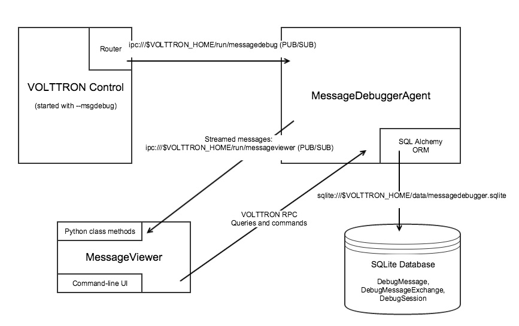

.. _Message-Debugging:

Message Debugging
=================

VOLTTRON agent messages are routed to each other over the VOLTTRON message bus.
The Message Debugger Agent enables examination of this message stream's
contents as an aid to debugging and troubleshooting agents and drivers.

When it is enabled, the Message Debugger Agent captures and records each message.
A second process, Message Viewer, provides a user interface that can filter the
resulting data stream, either in real time or retrospectively, and display its contents.

In the Message Viewer, a summary view conveys information about the high-level interactions
occurring among VOLTTRON agents as conversations that can be filtered and/or expanded.
A simple RPC call involving 4 message send/receive segments can be displayed as a single,
expandable row of data. In this way, a higher-level, easier-to-obtain view of message bus
activity is available than might be gleaned from using grep on verbose log files.

Pub/sub interactions can be summarized by topic, with high-level statistics such as
number of messages published, by sender, during the capture period.
One view shows the most recently published message meeting filter criteria, continuously updated
as new messages arrive.

Enabling the Message Debugger Agent
~~~~~~~~~~~~~~~~~~~~~~~~~~~~~~~~~~~

TBD: Talk about why message debugging is disabled by default, and the consequences of enabling it.

TBD: Describe the ``--msgdebug`` command line option.
::

    (volttron) volttron -vv -l log1 ``--msgdebug``

TBD: Show starting the Agent from volttron-ctl (include a link to volttron-ctl documentation)
::

    (volttron) $ volttron-ctl status
       AGENT                      IDENTITY                 TAG                      STATUS
    fd listeneragent-3.2          listener                 listener
    08 messagedebuggeragent-0.1   platform.messagedebugger platform.messagedebugger
    e1 vcplatformagent-3.5.4      platform.agent           vcp
    47 volttroncentralagent-3.5.5 volttron.central         vc

    (volttron) $ volttron-ctl start 08
    Starting 089c53f0-f225-4608-aecb-3e86e0df30eb messagedebuggeragent-0.1

    (volttron) $ volttron-ctl status
       AGENT                      IDENTITY                 TAG                      STATUS
    fd listeneragent-3.2          listener                 listener
    08 messagedebuggeragent-0.1   platform.messagedebugger platform.messagedebugger running [43498]
    e1 vcplatformagent-3.5.4      platform.agent           vcp
    47 volttroncentralagent-3.5.5 volttron.central         vc

Configuring the Message Debugger Agent
~~~~~~~~~~~~~~~~~~~~~~~~~~~~~~~~~~~~~~

TBD: Describe the agent's "out of the box" configuration
::

    {
        "agent": {
            "exec": "messagedebuggeragent-0.1-py2.7.egg --config \"%c\" --sub \"%s\" --pub \"%p\""
        },
        "agentid": "messagedebugger",
        "router_path": "$VOLTTRON_HOME/run/messagedebug",
        "monitor_path": "$VOLTTRON_HOME/run/messageviewer",
        "db_path": "$VOLTTRON_HOME/data/messagedebugger.sqlite"
    }

The Message Viewer
~~~~~~~~~~~~~~~~~~

TBD: Describe how the Message Viewer interacts with the agent

TBD: Describe the command-line UI, which gets started by default.

TBD: Reference the MessageViewer class methods, described later in this document.
::

    (volttron) $ cd services/core/MessageDebuggerAgent/messageviewer
    (volttron) $ python viewer.py
    Welcome to the MessageViewer command line. Supported commands include:
         display_message_stream
         display_messages
         display_exchanges
         display_exchange_details
         display_session_details_by_agent <session_id>
         display_session_details_by_topic <session_id>

         list_sessions
         set_verbosity <level>
         list_filters
         set_filter <filter_name> <value>
         clear_filters
         clear_filter <filter_name>

         start_streaming
         stop_streaming
         start_session
         stop_session
         delete_session <session_id>
         delete_database

         help
         quit
    Please enter a command.

Command-Line Help
~~~~~~~~~~~~~~~~~

TBD: Describe command-line (two-level) help
::

    Viewer> help

    Documented commands (type help <topic>):
    ========================================
    clear_filter              display_messages                  set_filter
    clear_filters             display_session_details_by_agent  set_verbosity
    delete_database           display_session_details_by_topic  start_session
    delete_session            help                              start_streaming
    display_exchange_details  list_filters                      stop_session
    display_exchanges         list_sessions                     stop_streaming
    display_message_stream    quit

    Viewer> help set_filter

                Set a filter to a value; syntax is: set_filter <filter_name> <value>

                Some recognized filters include:
                . freq <n>: Use a single-line display, refreshing every <n> seconds (<n> can be floating point)
                . session_id <n>: Display Messages and Exchanges for the indicated debugging session ID only
                . results_only <n>: Display Messages and Exchanges only if they have a result
                . sender <agent_name>
                . recipient <agent_name>
                . device <device_name>
                . point <point_name>
                . topic <topic_name>: Matches all topics that start with the supplied <topic_name>
                . starttime <YYYY-MM-DD HH:MM:SS>: Matches rows with timestamps after the supplied time
                . endtime <YYYY-MM-DD HH:MM:SS>: Matches rows with timestamps before the supplied time
                . (etc. -- see the structures of DebugMessage and DebugMessageExchange)

Debug Sessions
~~~~~~~~~~~~~~

TBD: Discuss ``list_sessions``.
::

    Viewer> list_sessions
      rowid        start_time                  end_time                    num_messages
      1            2017-03-20 17:07:13.867951  -                           2243
      2            2017-03-20 17:17:35.725224  -                           1320
      3            2017-03-20 17:33:35.103204  2017-03-20 17:46:15.657487  12388

Filtered Display of Debug Messages
~~~~~~~~~~~~~~~~~~~~~~~~~~~~~~~~~~

TBD: Discuss ``set_filter`` and ``display_messages``.
::

    Viewer> set_filter session_id 4
    Set filters to {'session_id': '4'}
    Viewer> set_filter sender testagent
    Set filters to {'sender': 'testagent', 'session_id': '4'}
    Viewer> display_messages
      timestamp    direction    sender       recipient                 request_id                     subsystem    method          topic                     device        point        result
      11:51:00     incoming     testagent    messageviewer.connection  -                              RPC          pubsub.sync     -                         -             -            -
      11:51:00     outgoing     testagent    pubsub                    -                              RPC          pubsub.push     -                         -             -            -
      11:51:00     incoming     testagent    platform.driver           1197886248649056372.284581685  RPC          get_point       -                         chargepoint1  Status       -
      11:51:01     outgoing     testagent    platform.driver           1197886248649056372.284581685  RPC          -               -                         -             -            AVAILABLE
      11:51:01     incoming     testagent    pubsub                    1197886248649056373.284581649  RPC          pubsub.publish  test_topic/test_subtopic  -             -            -
      11:51:01     outgoing     testagent    pubsub                    1197886248649056373.284581649  RPC          -               -                         -             -            None

Debug Message Exchanges
~~~~~~~~~~~~~~~~~~~~~~~

TBD: Discuss DebugMessageExchange and ``display_exchanges``.

A VOLTTRON message ID is not unique to a single message. A group of messages in a "conversation"
may share a common ID, for instance during RPC request/response exchanges.
When detailed display of all messages for a single message ID is requested, they will be displayed
in chronological order.
::

    Viewer> list_filters
    {'sender': 'testagent', 'session_id': '4'}
    Viewer> display_exchanges
      sender       recipient        sender_time  topic                     device        point        result
      testagent    platform.driver  11:51:00     -                         chargepoint1  Status       AVAILABLE
      testagent    pubsub           11:51:01     test_topic/test_subtopic  -             -            None

Special Filters
~~~~~~~~~~~~~~~

TBD: Discuss ``set_filter starttime`` and ``set_filter endtime``.
TBD: Note the use of quoted strings for the timestamps (any filter's value can be entered in quotes).
::

    Viewer> list_sessions
      rowid        start_time                  end_time                    num_messages
      1            2017-03-20 17:07:13.867951  -                           -
      2            2017-03-20 17:17:35.725224  -                           -
      3            2017-03-21 11:48:33.803288  2017-03-21 11:50:57.181136  6436
      4            2017-03-21 11:50:59.656693  2017-03-21 11:51:05.934895  450
      5            2017-03-21 11:51:08.431871  -                           74872
      6            2017-03-21 12:17:30.568260  -                           2331
    Viewer> set_filter session_id 5
    Set filters to {'session_id': '5'}
    Viewer> set_filter sender testagent
    Set filters to {'sender': 'testagent', 'session_id': '5'}
    Viewer> set_filter endtime '2017-03-21 11:51:30'
    Set filters to {'endtime': '2017-03-21 11:51:30', 'sender': 'testagent', 'session_id': '5'}
    Viewer> display_exchanges
      sender       recipient        sender_time  topic                     device        point        result
      testagent    platform.driver  11:51:11     -                         chargepoint1  Status       AVAILABLE
      testagent    pubsub           11:51:11     test_topic/test_subtopic  -             -            None
      testagent    platform.driver  11:51:25     -                         chargepoint1  Status       AVAILABLE
      testagent    pubsub           11:51:25     test_topic/test_subtopic  -             -            None
      testagent    platform.driver  11:51:26     -                         chargepoint1  Status       AVAILABLE
      testagent    pubsub           11:51:26     test_topic/test_subtopic  -             -            None

TBD: Discuss using ``set_filter topic``, matching only the start of the topic name.
TBD: Unlike other filters, a 'topic' filter can match leading substrings.
::

    Viewer> set_filter topic test_topic
    Set filters to {'topic': 'test_topic', 'endtime': '2017-03-21 11:51:30', 'sender': 'testagent', 'session_id': '5'}
    Viewer> display_exchanges
      sender       recipient    sender_time  topic                     device       point        result
      testagent    pubsub       11:51:11     test_topic/test_subtopic  -            -            None
      testagent    pubsub       11:51:25     test_topic/test_subtopic  -            -            None
      testagent    pubsub       11:51:26     test_topic/test_subtopic  -            -            None
    Viewer>

TBD: Discuss using ``set_filter results_only 1``.
TBD: (Explain that the "1" is required by the set_filter syntax, but is ignored.)
TBD: (Clear the topic filter.)
::

    Viewer> clear_filter topic
    Set filters to {'endtime': '2017-03-21 11:51:30', 'sender': 'testagent', 'session_id': '5'}
    Viewer> set_filter results_only 1
    Set filters to {'endtime': '2017-03-21 11:51:30', 'sender': 'testagent', 'session_id': '5', 'results_only': '1'}
    Viewer> display_exchanges
      sender       recipient        sender_time  topic        device        point        result
      testagent    platform.driver  11:51:11     -            chargepoint1  Status       AVAILABLE
      testagent    platform.driver  11:51:25     -            chargepoint1  Status       AVAILABLE
      testagent    platform.driver  11:51:26     -            chargepoint1  Status       AVAILABLE

Streamed Display
~~~~~~~~~~~~~~~~

TBD: Discuss using ``display_message_stream`` (interrupt with ctrl-C).
TBD: Discuss how filters are applied to it.
::

    Viewer> clear_filters
    Set filters to {}
    Viewer> set_filter sender testagent
    Set filters to {'sender': 'testagent'}
    Viewer> display_message_stream
    Streaming debug messages
      timestamp    direction    sender       recipient    request_id   subsystem    method       topic        device       point        result
      12:28:58     outgoing     testagent    pubsub       -            RPC          pubsub.push  -            -            -            -
      12:28:58     incoming     testagent    platform.dr  11978862486  RPC          get_point    -            chargepoint  Status       -
                                             iver         49056826.28                                         1
                                                          4581713
      12:28:58     outgoing     testagent    platform.dr  11978862486  RPC          -            -            -            -            AVAILABLE
                                             iver         49056826.28
                                                          4581713
      12:28:58     incoming     testagent    pubsub       11978862486  RPC          pubsub.publ  test_topic/  -            -            -
                                                          49056827.28               ish          test_subtop
                                                          4581685                                ic
      12:28:58     outgoing     testagent    pubsub       11978862486  RPC          -            -            -            -            None
                                                          49056827.28
                                                          4581685
      12:28:58     outgoing     testagent    pubsub       -            RPC          pubsub.push  -            -            -            -
      12:28:58     outgoing     testagent    pubsub       -            RPC          pubsub.push  -            -            -            -
      12:28:58     incoming     testagent    platform.dr  11978862486  RPC          get_point    -            chargepoint  Status       -
                                             iver         49056828.28                                         1
                                                          4581685
      12:28:58     outgoing     testagent    platform.dr  11978862486  RPC          -            -            -            -            AVAILABLE
                                             iver         49056828.28
                                                          4581685
      12:28:58     incoming     testagent    pubsub       11978862486  RPC          pubsub.publ  test_topic/  -            -            -
                                                          49056829.28               ish          test_subtop
                                                          4581649                                ic
      12:28:58     outgoing     testagent    pubsub       11978862486  RPC          -            -            -            -            None
                                                          49056829.28
                                                          4581649
    ^CViewer> stop_streaming
    Stopped streaming debug messages

Single-Line Display
~~~~~~~~~~~~~~~~~~~

TBD: Discuss using ``set_filter freq`` to display a single line (interrupt with ctrl-C).
::

    Viewer> list_filters
    {'sender': 'testagent'}
    Viewer> set_filter freq 10
    Set filters to {'freq': '10', 'sender': 'testagent'}
    Viewer> display_exchanges
      sender       recipient    sender_time  topic                     device       point        result
      testagent    pubsub       12:31:28     test_topic/test_subtopic  -            -            None

TBD: Discuss truncation vs wrap in table columns.

Displaying Exchange Details
~~~~~~~~~~~~~~~~~~~~~~~~~~~

TBD: Show the use of ``display_exchange_details`` at low/medium verbosity.
::

    Viewer> set_filter sender testagent
    Set filters to {'sender': 'testagent', 'session_id': '4'}
    Viewer> display_messages
      timestamp    direction    sender       recipient                 request_id                     subsystem    method          topic                     device        point        result
      11:51:00     incoming     testagent    messageviewer.connection  -                              RPC          pubsub.sync     -                         -             -            -
      11:51:00     outgoing     testagent    pubsub                    -                              RPC          pubsub.push     -                         -             -            -
      11:51:00     incoming     testagent    platform.driver           1197886248649056372.284581685  RPC          get_point       -                         chargepoint1  Status       -
      11:51:01     outgoing     testagent    platform.driver           1197886248649056372.284581685  RPC          -               -                         -             -            AVAILABLE
      11:51:01     incoming     testagent    pubsub                    1197886248649056373.284581649  RPC          pubsub.publish  test_topic/test_subtopic  -             -            -
      11:51:01     outgoing     testagent    pubsub                    1197886248649056373.284581649  RPC          -               -                         -             -            None
    Viewer> display_exchange_details 1197886248649056373.284581649
      timestamp    direction    sender       recipient    request_id                     subsystem    method          topic                     device       point        result
      11:51:01     incoming     testagent    pubsub       1197886248649056373.284581649  RPC          pubsub.publish  test_topic/test_subtopic  -            -            -
      11:51:01     outgoing     testagent    pubsub       1197886248649056373.284581649  RPC          -               -                         -            -            None

TBD: Show the use of ``display_exchange_details`` at high verbosity.
::

    Viewer> set_verbosity high
    Set verbosity to high
    Viewer> display_exchange_details 1197886248649056373.284581649

    {
        "data": "{\"params\":{\"topic\":\"test_topic/test_subtopic\",\"headers\":{\"Date\":\"2017-03-21T11:50:56.293830\",\"max_compatible_version\":\"\",\"min_compatible_version\":\"3.0\"},\"message\":[{\"property_1\":1,\"property_2\":2},{\"property_3\":3,\"property_4\":4}],\"bus\":\"\"},\"jsonrpc\":\"2.0\",\"method\":\"pubsub.publish\",\"id\":\"15828311332408898779.284581649\"}",
        "device": "",
        "direction": "incoming",
        "frame7": "",
        "frame8": "",
        "frame9": "",
        "headers": "{u'Date': u'2017-03-21T11:50:56.293830', u'max_compatible_version': u'', u'min_compatible_version': u'3.0'}",
        "message": "[{u'property_1': 1, u'property_2': 2}, {u'property_3': 3, u'property_4': 4}]",
        "message_size": 374,
        "message_value": "{u'property_1': 1, u'property_2': 2}",
        "method": "pubsub.publish",
        "params": "{u'topic': u'test_topic/test_subtopic', u'headers': {u'Date': u'2017-03-21T11:50:56.293830', u'max_compatible_version': u'', u'min_compatible_version': u'3.0'}, u'message': [{u'property_1': 1, u'property_2': 2}, {u'property_3': 3, u'property_4': 4}], u'bus': u''}",
        "point": "",
        "point_value": "",
        "recipient": "pubsub",
        "request_id": "1197886248649056373.284581649",
        "result": "",
        "sender": "testagent",
        "session_id": 4,
        "subsystem": "RPC",
        "timestamp": "2017-03-21 11:51:01.027623",
        "topic": "test_topic/test_subtopic",
        "user_id": "",
        "vip_signature": "VIP1"
    }

    {
        "data": "{\"params\":{\"topic\":\"test_topic/test_subtopic\",\"headers\":{\"Date\":\"2017-03-21T11:50:56.293830\",\"max_compatible_version\":\"\",\"min_compatible_version\":\"3.0\"},\"message\":[{\"property_1\":1,\"property_2\":2},{\"property_3\":3,\"property_4\":4}],\"bus\":\"\"},\"jsonrpc\":\"2.0\",\"method\":\"pubsub.publish\",\"id\":\"15828311332408898779.284581649\"}",
        "device": "",
        "direction": "outgoing",
        "frame7": "",
        "frame8": "",
        "frame9": "",
        "headers": "{u'Date': u'2017-03-21T11:50:56.293830', u'max_compatible_version': u'', u'min_compatible_version': u'3.0'}",
        "message": "[{u'property_1': 1, u'property_2': 2}, {u'property_3': 3, u'property_4': 4}]",
        "message_size": 383,
        "message_value": "{u'property_1': 1, u'property_2': 2}",
        "method": "pubsub.publish",
        "params": "{u'topic': u'test_topic/test_subtopic', u'headers': {u'Date': u'2017-03-21T11:50:56.293830', u'max_compatible_version': u'', u'min_compatible_version': u'3.0'}, u'message': [{u'property_1': 1, u'property_2': 2}, {u'property_3': 3, u'property_4': 4}], u'bus': u''}",
        "point": "",
        "point_value": "",
        "recipient": "testagent",
        "request_id": "1197886248649056373.284581649",
        "result": "",
        "sender": "pubsub",
        "session_id": 4,
        "subsystem": "RPC",
        "timestamp": "2017-03-21 11:51:01.031183",
        "topic": "test_topic/test_subtopic",
        "user_id": "testagent",
        "vip_signature": "VIP1"
    }

    {
        "data": "{\"jsonrpc\":\"2.0\",\"id\":\"15828311332408898779.284581649\",\"result\":null}",
        "device": "",
        "direction": "incoming",
        "frame7": "",
        "frame8": "",
        "frame9": "",
        "headers": "",
        "message": "",
        "message_size": 124,
        "message_value": "",
        "method": "",
        "params": "",
        "point": "",
        "point_value": "",
        "recipient": "testagent",
        "request_id": "1197886248649056373.284581649",
        "result": "None",
        "sender": "pubsub",
        "session_id": 4,
        "subsystem": "RPC",
        "timestamp": "2017-03-21 11:51:01.038373",
        "topic": "",
        "user_id": "",
        "vip_signature": "VIP1"
    }

    {
        "data": "{\"jsonrpc\":\"2.0\",\"id\":\"15828311332408898779.284581649\",\"result\":null}",
        "device": "",
        "direction": "outgoing",
        "frame7": "",
        "frame8": "",
        "frame9": "",
        "headers": "",
        "message": "",
        "message_size": 135,
        "message_value": "",
        "method": "",
        "params": "",
        "point": "",
        "point_value": "",
        "recipient": "pubsub",
        "request_id": "1197886248649056373.284581649",
        "result": "None",
        "sender": "testagent",
        "session_id": 4,
        "subsystem": "RPC",
        "timestamp": "2017-03-21 11:51:01.042501",
        "topic": "",
        "user_id": "vip.service",
        "vip_signature": "VIP1"
    }

Verbosity
~~~~~~~~~

TBD: Discuss ``set_verbosity``.
::

    Viewer> set_verbosity high
    Set verbosity to high
    Viewer> set_verbosity none
    Invalid verbosity choice none; valid choices are ['low', 'medium', 'high']

TBD: Discuss the effects of each verbosity level.

High verbosity:

. When displaying timestamps, display the full date and time (including microseconds), not just the HH:MM:SS time.
. Display json dictionary-style, not as a table (see above).
. Display all columns, not just "interesting" ones. (Show which are "interesting")
. Don't exclude any messages/exchanges based on excluded senders/receivers. (Show which are excluded)

Medium or low verbosity:

. Display "interesting" columns only.
. Exclude messages/exchanges based on excluded senders/receivers.

Low verbosity:

. If > 1000 objects returned from query, display count only

"Interesting" columns:
::

    Debug Message       Debug Message Exchange      Debug Session

    timestamp           sender_time                 rowid
    direction                                       start_time
    sender              sender                      end_time
    recipient           recipient                   num_messages
    request_id
    subsystem
    method
    topic               topic
    device              device
    point               point
    result              result

Excluded rows by sender and receiver:
::

    Sender                                  Receiver

    (empty)                                 (empty)
    None
    control                                 control
    config.store                            config.store
    pubsub
    control.connection
    messageviewer.connection
    platform.messagedebugger
    platform.messagedebugger.loopback_rpc

Session Statistics
~~~~~~~~~~~~~~~~~~

TBD: Discuss ``display_session_details_by_agent``.
::

    Viewer> list_sessions
      rowid        start_time                  end_time                    num_messages
      1            2017-03-20 17:07:13.867951  -                           -
      2            2017-03-20 17:17:35.725224  -                           -
      3            2017-03-21 11:48:33.803288  2017-03-21 11:50:57.181136  6436
      4            2017-03-21 11:50:59.656693  2017-03-21 11:51:05.934895  450
      5            2017-03-21 11:51:08.431871  -                           74872
      6            2017-03-21 12:17:30.568260  2017-03-21 12:38:29.070000  60384
      7            2017-03-21 12:38:31.617099  2017-03-21 12:39:53.174712  3966
    Viewer> clear_filters
    Set filters to {}
    Viewer> display_session_details_by_agent 7
      Receiving Agent               control     listener  messageviewer.connection  platform.driver  platform.messagedebugger       pubsub    testagent
      (No Receiving Agent)                -            -                         2                -                         -            -            -
      control                             -            -                         -                -                         -            2            -
      listener                            -            -                         -                -                         -          679            -
      messageviewer.connection            -            -                         -                -                         3            -            -
      platform.driver                     -            -                         -                -                         -         1249           16
      platform.messagedebugger            -            -                         3                -                         -            -            -
      pubsub                              2          679                         -             1249                         -            4           31
      testagent                           -            -                         -               16                         -           31            -

TBD: Discuss ``display_session_details_by_topic``.
::

    Viewer> display_session_details_by_topic 7
      Topic                                    control     listener  messageviewer.connection  platform.driver  platform.messagedebugger       pubsub    testagent
      (No Topic)                                     1          664                         5              640                         3         1314           39
      devices/chargepoint1/Address                   -            -                         -                6                         -            6            -
      devices/chargepoint1/City                      -            -                         -                6                         -            6            -
      devices/chargepoint1/Connector                 -            -                         -                5                         -            5            -
      devices/chargepoint1/Country                   -            -                         -                5                         -            5            -
      devices/chargepoint1/Current                   -            -                         -                6                         -            6            -
      devices/chargepoint1/Description               -            -                         -                6                         -            6            -
      devices/chargepoint1/Energy                    -            -                         -                5                         -            5            -
      devices/chargepoint1/Lat                       -            -                         -                6                         -            6            -
      devices/chargepoint1/Level                     -            -                         -                5                         -            5            -
      devices/chargepoint1/Long                      -            -                         -                6                         -            6            -
      devices/chargepoint1/Mode                      -            -                         -                5                         -            5            -
      devices/chargepoint1/Power                     -            -                         -                6                         -            6            -
      devices/chargepoint1/Reservable                -            -                         -                5                         -            5            -
      devices/chargepoint1/State                     -            -                         -                6                         -            6            -
      devices/chargepoint1/Status                    -            -                         -                5                         -            5            -
      devices/chargepoint1/Status.TimeSta            -            -                         -                6                         -            6            -
      mp
      devices/chargepoint1/Type                      -            -                         -                6                         -            6            -
      devices/chargepoint1/Voltage                   -            -                         -                5                         -            5            -
      devices/chargepoint1/alarmTime                 -            -                         -                6                         -            6            -
      devices/chargepoint1/alarmType                 -            -                         -                6                         -            6            -
      devices/chargepoint1/all                       -            -                         -                5                         -            5            -
      devices/chargepoint1/allowedLoad               -            -                         -                6                         -            6            -
      devices/chargepoint1/clearAlarms               -            -                         -                6                         -            6            -
      devices/chargepoint1/currencyCode              -            -                         -                6                         -            6            -
      devices/chargepoint1/driverAccountN            -            -                         -                5                         -            5            -
      umber
      devices/chargepoint1/driverName                -            -                         -                5                         -            5            -
      devices/chargepoint1/endTime                   -            -                         -                5                         -            5            -
      devices/chargepoint1/mainPhone                 -            -                         -                6                         -            6            -
      devices/chargepoint1/maxPrice                  -            -                         -                5                         -            5            -
      devices/chargepoint1/minPrice                  -            -                         -                5                         -            5            -
      devices/chargepoint1/numPorts                  -            -                         -                6                         -            6            -
      devices/chargepoint1/orgID                     -            -                         -                5                         -            5            -
      devices/chargepoint1/organizationNa            -            -                         -                5                         -            5            -
      me
      devices/chargepoint1/percentShed               -            -                         -                6                         -            6            -
      devices/chargepoint1/portLoad                  -            -                         -                6                         -            6            -
      devices/chargepoint1/portNumber                -            -                         -                6                         -            6            -
      devices/chargepoint1/postalCode                -            -                         -                5                         -            5            -
      devices/chargepoint1/rfidSerialNumb            -            -                         -                6                         -            6            -
      er
      devices/chargepoint1/sessionID                 -            -                         -                5                         -            5            -
      devices/chargepoint1/sessionTime               -            -                         -                6                         -            6            -
      devices/chargepoint1/sgID                      -            -                         -                6                         -            6            -
      devices/chargepoint1/sgName                    -            -                         -                6                         -            6            -
      devices/chargepoint1/shedState                 -            -                         -                5                         -            5            -
      devices/chargepoint1/startTime                 -            -                         -                6                         -            6            -
      devices/chargepoint1/stationID                 -            -                         -                5                         -            5            -
      devices/chargepoint1/stationMacAddr            -            -                         -                6                         -            6            -
      devices/chargepoint1/stationManufac            -            -                         -                5                         -            5            -
      turer
      devices/chargepoint1/stationModel              -            -                         -                6                         -            6            -
      devices/chargepoint1/stationName               -            -                         -                5                         -            5            -
      devices/chargepoint1/stationRightsP            -            -                         -                6                         -            6            -
      rofile
      devices/chargepoint1/stationSerialN            -            -                         -                6                         -            6            -
      um
      devices/chargepoint1/unitPriceForFi            -            -                         -                6                         -            6            -
      rst
      devices/chargepoint1/unitPricePerHo            -            -                         -                5                         -            5            -
      ur
      devices/chargepoint1/unitPricePerHo            -            -                         -                5                         -            5            -
      urThereafter
      devices/chargepoint1/unitPricePerKW            -            -                         -                6                         -            6            -
      h
      devices/chargepoint1/unitPricePerSe            -            -                         -                6                         -            6            -
      ssion
      heartbeat/control                              1            -                         -                -                         -            1            -
      heartbeat/listener                             -           15                         -                -                         -           15            -
      heartbeat/platform.driver                      -            -                         -                1                         -            1            -
      heartbeat/pubsub                               -            -                         -                -                         -            2            -
      test_topic/test_subtopic                       -            -                         -                -                         -            8            8

Database Administration
~~~~~~~~~~~~~~~~~~~~~~~

The ``delete_session <session_id>`` command deletes the database's DebugSession row
with the indicated ID, and also deletes all DebugMessage and DebugMessageExchange rows
with that session ID. This can be a good way to recover disk space when a given debug
session is obsolete. The delete_session command in the following example deletes the
60,000 DebugMessages captured during a 20-minute period as session 6:
::

    Viewer> list_sessions
      rowid        start_time                  end_time                    num_messages
      1            2017-03-20 17:07:13.867951  -                           -
      2            2017-03-20 17:17:35.725224  -                           -
      3            2017-03-21 11:48:33.803288  2017-03-21 11:50:57.181136  6436
      4            2017-03-21 11:50:59.656693  2017-03-21 11:51:05.934895  450
      5            2017-03-21 11:51:08.431871  -                           74872
      6            2017-03-21 12:17:30.568260  2017-03-21 12:38:29.070000  60384
      7            2017-03-21 12:38:31.617099  2017-03-21 12:39:53.174712  3966
      8            2017-03-21 12:42:08.482936  -                           3427
    Viewer> delete_session 6
    Deleted debug session 6
    Viewer> list_sessions
      rowid        start_time                  end_time                    num_messages
      1            2017-03-20 17:07:13.867951  -                           -
      2            2017-03-20 17:17:35.725224  -                           -
      3            2017-03-21 11:48:33.803288  2017-03-21 11:50:57.181136  6436
      4            2017-03-21 11:50:59.656693  2017-03-21 11:51:05.934895  450
      5            2017-03-21 11:51:08.431871  -                           74872
      7            2017-03-21 12:38:31.617099  2017-03-21 12:39:53.174712  3966
      8            2017-03-21 12:42:08.482936  -                           4370

The ``delete_database`` command deletes the SQLite database, removing all records
of previously-captured DebugMessages, DebugMessageExchanges and DebugSessions.
This could be an important tactic for preserving disk space, since the
Message Debugger Agent can consume a lot of storage in a relatively short time.
::

    Viewer> delete_database
    Database deleted
    Viewer> list_sessions
    No query results

It's also a good idea to delete the database when there are changes in the data structures
of DebugMessage, DebugMessageExchange or DebugSession. A skew between these data structures
in code vs. the ones in the database can cause instability in the Message Debugger Agent,
perhaps causing it to fail. If a failure of this kind is interfering with database deletion
via the Message Viewer command line, the database can be deleted directly from the filesystem.
By default, the database can be found in $VOLTTRON_HOME's ``run`` directory.

Calling MessageViewer Directly
~~~~~~~~~~~~~~~~~~~~~~~~~~~~~~

TBD: Describe how commands are available as class methods, and issue RPC calls to the Agent.

The message viewer will display messages from the SQLite db.  We need to consider whether it should also subscribe
to receiving messages in real-time.  The viewer will be responsible for displaying message statistics and will provide
a command line interface to filter and display messages.

Message Debugger Agent Data Storage
~~~~~~~~~~~~~~~~~~~~~~~~~~~~~~~~~~~

TBD: Describe the ``SQLite`` database and the use of ``SQL Alchemy``.

::

    message(id, created_on, issue_topic, extras, sender, recipient, user_id, msg_id, subsystem, data)

msg_id will be used to associate pairs of incoming/outgoing messages.
**note: data will be a jsonified list of frames, alternatively we could add a message_data table with one
row per frame.

A session table will track the start and end of a debug session and, at the end of a session, record statistics
on the messages in the session.

::

    session(id, created_on, name, start_time,  end_time, num_messages)

The command line tool will allow users to delete old sessions and select a session for review/playback.

Router Implementation Details
~~~~~~~~~~~~~~~~~~~~~~~~~~~~~

MessageDebuggerAgent reads and stores all messages that pass through the VIP router. This is
accomplished by subscribing to the messages on a new socket published by the platform's
``Router.issue()`` method. Each messsage is recorded as a DebugMessage row in a relational database.
SQLite is used since it's packaged with Python and is already being used by other VOLTTRON agents.
Database semantics are kept simple through the use of the SQL Alchemy object-relational mapping
framework; this is the only additional third-party software install required by the agent.

Most agent interactions result in at least two messages, an incoming request and an outgoing response.
``Router.issue()`` has a ``topic`` parameter with values INCOMING, OUTGOING, ERROR and UNROUTABLE.
This "issue topic" (not to be confused with a message's ``topic``) is passed, along with each message,
to MessageDebuggerAgent. It is recorded as the DebugMessage's ``direction`` property, since the value
for almost all messages will be either INCOMING or OUTGOING.

Caveats
~~~~~~~

TBD: Describe differences between running from the command line vs. running from a PyCharm debugger.

TBD: List known bugs, limitations and opportunities for future enhancement.
