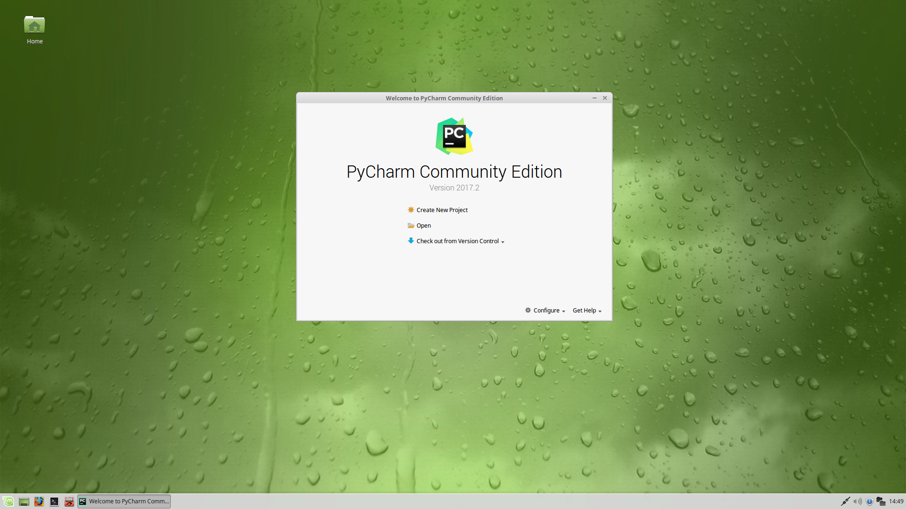
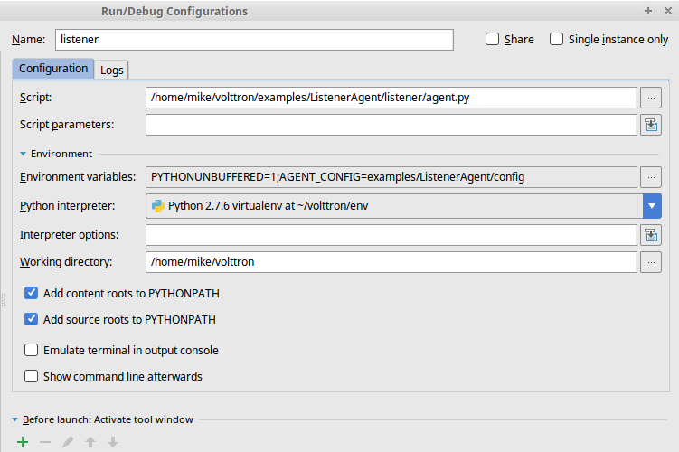
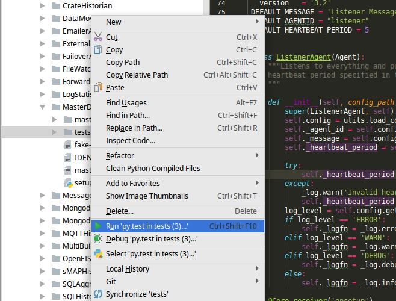

.. _Pycharm-Dev-Environment:

Pycharm Development Environment
===============================

Pycharm is an IDE dedicated to developing python projects. It provides coding
assistance and easy access to debugging tools as well as integration with
py.test. It is a popular tool for working with VOLTTRON.
Jetbrains provides a free community version that can be downloaded from
https://www.jetbrains.com/pycharm/

Open Pycharm and Load VOLTTRON
------------------------------

When launching Pycharm for the first time we have to tell it where to find the
VOLTTRON source code. If you have already cloned the repo then point Pycharm to
the cloned project. Pycharm also has options to access remote repositories.

Subsequent instances of Pycharm will automatically load the VOLTTRON project.

.. note::

   When getting started make sure to search for `gevent` in the settings and
   ensure that support for it is enabled.

|Open Pycharm|
|Load Volttron|

Set the Project Interpreter
---------------------------

This step should be completed after running the bootstrap script in the VOLTTRON
source directory. Pycharm needs to know which python environment it should  use
when running and debugging code. This also tells Pycharm where to find python
dependencies. Settings menu can be found under the File option in Pycharm.

|Set Project Interpreter|

Running the VOLTTRON Process
----------------------------

If you are not interested in running the VOLTTRON process itself in Pycharm then
this step can be skipped.

In **Run > Edit Configurations** create a configuration that has
`<your source dir>/env/bin/volttron` in the script field, `-vv` in the script
parameters field (to turn on verbose logging), and set the working directory to
the top level source directory.

VOLTTRON can then be run from the Run menu.

|Run Settings|

Running an Agent
----------------

Running an agent is configured similarly to running VOLTTRON proper. In
**Run > Edit Configurations** add a configuration and give it the same name
as your agent. The script should be the path to `scripts/pycharm-launch.py` and
and the script parameter must be the path to your agent's `agent.py` file.

In the Environment Variables field add the variable
`AGENT_CONFIG` that has the path to the agent's configuration file as its value,
as well as `AGENT_VIP_IDENTITY`, which must be unique on the platform.

A good place to keep configuration files is in a directory called `config` in
top level source directory; git will ignore changes to these files.

.. note::

   There is an issue with imports in Pycharm when there is a secondary file
   (i.e. not `agent.py` but another module within the same
   package). When that happens right click on the directory in the file tree
   and select **Mark Directory As -> Source Root**

|Listener Settings|
|Run Listener|

Testing an Agent
----------------

Agent tests written in py.test can be run simply by right-clicking the tests
directory and selecting `Run 'py.test in tests`, so long as the root directory
is set as the VOLTTRON source root.

|Run Tests|

.. |Load Volttron| image:: files/01_load_volttron.png
.. |Set Project Interpreter| image:: files/02_set_project_interpreter.png
.. |Run Settings| image:: files/03_run_settings.png

.. |Run Listener| image:: files/05_run_listener.png

