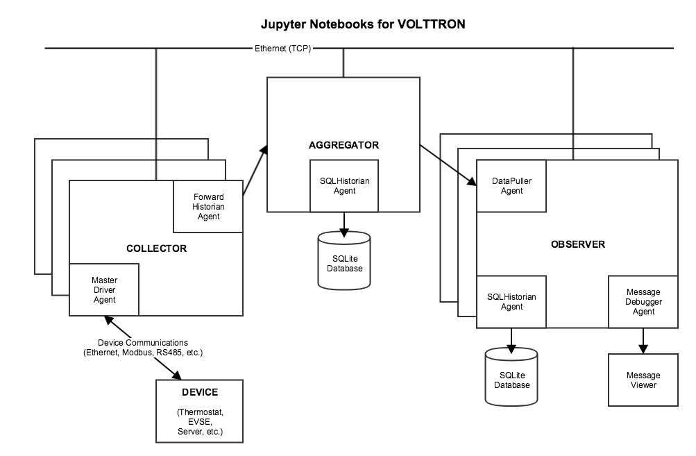

.. _Jupyter-Notebooks:

Jupyter Notebooks
=================

Jupyter is an open-source web application that lets you create and share “notebook” documents.
A notebook displays formatted text along with live code that can be executed from the browser,
displaying the execution output and preserving it in the document.
Notebooks that execute Python code used to be called `iPython Notebooks`.
The iPython Notebook project has now merged into Project Jupyter.

Using Jupyter to Manage a Set of VOLTTRON Servers
-------------------------------------------------

The following Jupyter notebooks for VOLTTRON have been provided as examples:

    -   **Collector notebooks**. Each Collector notebook sets up a particular type of device driver
        and forwards device data to another VOLTTRON instance, the Aggregator.

        -   **SimulationCollector notebook**. This notebook sets up a group of Simulation device drivers
            and forwards device data to another VOLTTRON instance, the Aggregator.
        -   **BacnetCollector notebook**. This notebook sets up a Bacnet (or Bacnet gateway) device driver
            and forwards device data to another VOLTTRON instance, the Aggregator.
        -   **ChargePointCollector notebook**. This notebook sets up a ChargePoint device driver
            and forwards device data to another VOLTTRON instance, the Aggregator.
        -   **SEP2Collector notebook**. This notebook sets up a SEP2.0 (IEEE 2030.5) device driver
            and forwards device data to another VOLTTRON instance, the Aggregator.
            The Smart Energy Profile 2.0 ("SEP2") protocol implements IEEE 2030.5, and is capable
            of connecting a wide array of smart energy devices to the Smart Grid. The standard is
            designed to run over TCP/IP and is physical layer agnostic.

    -   **Aggregator notebook**. This notebook sets up and executes aggregation of forwarded data
        from other VOLTTRON instances, using a historian to record the data.
    -   **Observer notebook**. This notebook sets up and executes a DataPuller that captures data from
        another VOLTTRON instance, using a Historian to record the data. It also uses the
        Message Debugger agent to monitor messages flowing across the VOLTTRON bus.

Each notebook configures and runs a set of VOLTTRON Agents. When used as a set, they
implement a multiple-VOLTTRON-instance architecture that catures remote device data, aggregates it,
and reports on it, routing the data as follows:

Install VOLTTRON and Jupyter on a Server
----------------------------------------

The remainder of this guide describes how to set up a host for VOLTTRON and Jupyter.
Use this setup process on a server in order to prepare it to run Jupyter notebook for VOLLTTRON.

**Set Up the Server and Install VOLTTRON**

The following is a complete, but terse, description of the steps for installing
and running VOLTTRON on a server. For more detailed, general instructions,
see :ref:`Installing Volttron <install>`.

The VOLTTRON server should run on the same host as the Jupyter server.

*Load third-party software:*
::

    $ sudo apt-get update
    $ sudo apt-get install build-essential python-dev openssl libssl-dev libevent-dev git
    $ sudo apt-get install sqlite3

*Clone the VOLTTRON repository from github:*
::

    $ cd ~
    $ mkdir repos
    $ cd repos
    $ git clone https://github.com/VOLTTRON/volttron/

*Check out the develop (or master) branch and bootstrap the development environment:*
::

    $ cd volttron
    $ git checkout develop
    $ python3.6 bootstrap.py

*Activate and initialize the VOLTTRON virtual environment:*

Run the following each time you open a new command-line shell on the server:
::

    $ export VOLTTRON_ROOT=~/repos/volttron
    $ export VOLTTRON_HOME=~/.volttron
    $ cd $VOLTTRON_ROOT
    $ source env/bin/activate

**Install Extra Libraries**

*Add Python libraries to the VOLTTRON virtual environment:*

These notebooks use third-party software that's not included in VOLTTRON's standard distribution
that was loaded by ``bootstrap.py``. The following additional packages are required:

-   Jupyter
-   SQLAlchemy (for the Message Debugger)
-   Suds (for the ChargePoint driver)
-   Numpy and MatPlotLib (for plotted output)

*Note*: A Jupyter installation also installs and/or upgrades many dependent libraries.
Doing so could disrupt other work on the OS, so it’s safest to load Jupyter (and any other
library code) in a virtual environment. VOLTTRON runs in a virtual environment anyway,
so if you're using Jupyter in conjunction with VOLTTRON, it should be installed in your
VOLTTRON virtual environment.
(In other words, be sure to use ``cd $VOLTTRON_ROOT`` and ``source env/bin/activate``
to activate the virtual environment before running ``pip install``.)

*Install the third-party software:*
::

    $ pip install SQLAlchemy==1.1.4
    $ pip install suds-jurko==0.6
    $ pip install numpy
    $ pip install matplotlib
    $ pip install jupyter

Note: If ``pip install`` fails due to an untrusted cert, try using this command instead:
::

    $ pip install --trusted-host pypi.python.org <libraryname>

(An InsecurePlatformWarning may be displayed, but it typically won't stop the installation from proceeding.)

**Configure VOLTTRON**

Use the ``vcfg`` wizard to configure the VOLTTRON instance. By default, the wizard
configures a VOLTTRON instance that communicates with agents only on the local host (ip 127.0.0.1).
This set of notebooks manages communications among multiple VOLTTRON instances on different hosts.
To enable this cross-host communication on VOLTTRON's web server, replace 127.0.0.1 with the
host's IP address, as follows:
::

    $ vcfg

-   Accept all defaults, except as follows.
-   If a prompt defaults to 127.0.0.1 as an IP address, substitute the ``host's IP address`` (this may happen multiple times).
-   When asked whether this is a volttron central, answer ``Y``.
-   When prompted for a username and password, use ``admin`` and ``admin``.

**Start VOLTTRON**

Start the main VOLTTRON process, logging to $VOLTTRON_ROOT/volttron.log:
::

    $ volttron -vv -l volttron.log --msgdebug

This runs VOLTTRON as a foreground process. To run it in the background, use:
::

    $ ./start-volttron --msgdebug

This also enables the Message Debugger, a non-production VOLTTRON debugging aid
that's used by some notebooks. To run with the Message Debugger disabled (VOLTTRON's normal state),
omit the ``--msgdebug`` flag.

Now that VOLTTRON is running, it's ready for agent configuration and execution.
Each Jupyter notebook contains detailed instructions and executable code for doing that.

**Configure Jupyter**

More detailed information about installing, configuring and using Jupyter Notebooks is available
on the Project Jupyter site, http://jupyter.org/.

*Create a Jupyter configuration file:*
::

    $ jupyter notebook --generate-config

*Revise the Jupyter configuration:*

Open ``~/.jupyter/jupyter_notebook_config.py`` in your favorite text editor.
Change the configuration to accept connections from any IP address (not just from localhost)
and use a specific, non-default port number:

-   Un-comment ``c.NotebookApp.ip`` and set it to: ``'*'`` instead of ``'localhost'``
-   Un-comment ``c.NotebookApp.port`` and set it to: ``'8891'`` instead of ``'8888'``

Save the config file.

*Open ports for TCP connections:*

Make sure that your Jupyter server host's security rules allow inbound TCP connections on port ``8891``.

If the VOLTTRON instance needs to receive TCP requests, for example ForwardHistorian or DataPuller
messages from other VOLTTRON instances, make sure that the host's security rules also allow inbound TCP
communications on VOLTTRON's port, which is usually ``22916``.

**Launch Jupyter**

*Start the Jupyter server:*

In a separate command-line shell, set up VOLTTRON's environment variables and virtual environment,
and then launch the Jupyter server:
::

    $ export VOLTTRON_HOME=(your volttron home directory, e.g. ~/.volttron)
    $ export VOLTTRON_ROOT=(where volttron was installed; e.g. ~/repos/volttron)
    $ cd $VOLTTRON_ROOT
    $ source env/bin/activate
    $ cd examples/JupyterNotebooks
    $ jupyter notebook --no-browser

*Open a Jupyter client in a web browser:*

Look up the host's IP address (e.g., using ifconfig). Open a web browser and navigate to
the URL that was displayed when you started jupyter, replacing ``localhost`` with that
IP address. A Jupyter web page should display, listing your notebooks.
