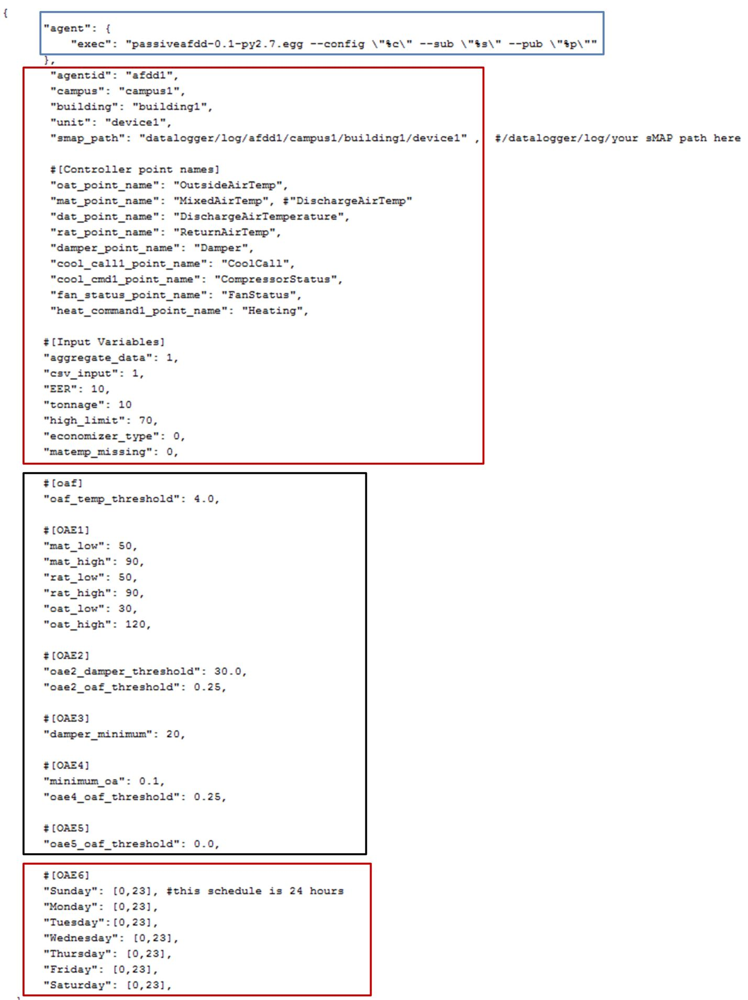
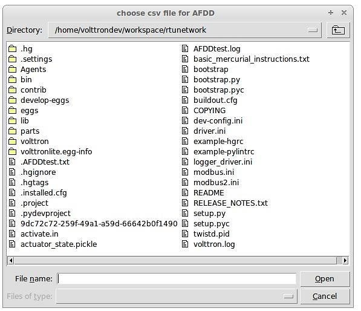
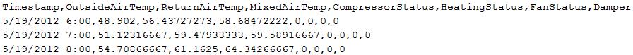
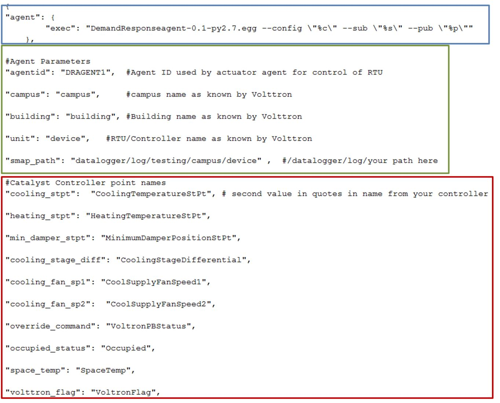
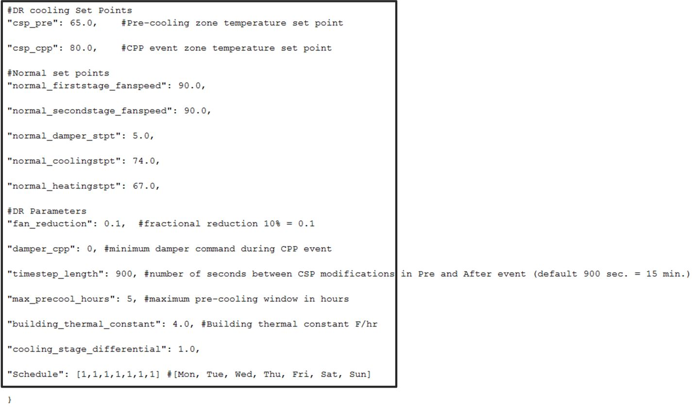

.. _sample-applications:

================================
Acquiring Third Party Agent Code
================================

Add the volttron-applications repository under the volttron/applications directory by using following command:

    git subtree add --prefix applications https://github.com/VOLTTRON/volttron-applications.git develop --squash

Passive Automated Fault Detection and Diagnostic Agent
======================================================

The Passive Automated Fault Detection and Diagnostic (Passive AFDD) agent is used to identify problems in the operation and performance of air-handling units (AHUs) or packaged rooftop units (RTUs). Air-side economizers modulate controllable dampers to use outside air to cool instead of (or to supplement) mechanical cooling, when outdoor-air conditions are more favorable than the return-air conditions. Unfortunately, economizers often do not work properly, leading to increased energy use rather than saving energy. Common problems include incorrect control strategies, diverse types of damper linkage and actuator failures, and out-of-calibration sensors. These problems can be detected using sensor data that is normally used to control the system.

The Passive AFDD requires the following data fields to perform the fault detection and diagnostics: 

- Outside-air temperature
- Return-air temperature
- Mixed-air temperature
- Outside-air damper position/signal
- Supply fan status
- Mechanical cooling status
- Heating status.  

The AFDD supports both real-time data via a Modbus or BACnet device, or input of data from a csv style text document.

The following section describes how to configure the Passive AFDD agent, methods for data input (real-time data from a device or historical data in a comma separated value formatted text file), and launching the Passive AFDD agent.

Note:  A proactive version of the Passive AFDD exists as a PNNL application (AFDDAgent). This application requires active control of the RTU for fault detection and diagnostics to occur. The Passive AFDD was created to allow more users a chance to run diagnostics on their HVAC equipment without the need to actively modify the controls of the system. 

Configuring the Passive AFDD Agent
----------------------------------

Before launching the Passive AFDD agent, several parameters require configuration. The AFDD utilizes the same JSON style configuration file used by the Actuator, Listener, and Weather agents. The threshold parameters used for the fault detection algorithms are pre-configured and will work well for most RTUs or AHUs. Figure 1 shows an example configuration file for the AFDD agent.

The parameters boxed in black (in Figure 1) are the pre-configured fault detection thresholds; these do not require any modification to run the Passive AFDD agent. The parameters in the example configuration that are boxed in red will require user input. The following list describes each user configurable parameter and their possible values: 
 
- **agentid** – This is the ID used when making schedule, set, or get requests to the Actuator agent; usually a string data type.
- **campus** – Campus name as configured in the sMAP driver. This parameter builds the device path that allows the Actuator agent to set and get values on the device; usually a string data type.
- **building** – Building name as configured in the sMAP driver. This parameter builds the device path that allows the Actuator agent to set and get values on the device; usually a string data type.
- **unit** –  Device name as configured in the sMAP driver. This parameter builds the device path that allows the Actuator agent to set and get values on the device; usually a string data type. Note:  The campus, building, and unit parameters are used to build the device path (campus/building/unit). The device path is used for communication on the message bus.
-  **controller point names** – When using real-time communication, the Actuator agent identifies what registers or values to set or get by the point name you specify. This name must match the “Point Name” given in the Modbus registry file, as specified in VOLTTRON Core Services.
- **aggregate_data** – When using real-time data sampled at an interval of less than 1 hour or when inputting data via a csv file sampled at less than 1 hour intervals, set this flag to “1.” Value should be an integer or floating-point number (i.e., 1 or 1.0)
- **csv_input** – Flag to indicate if inputting data from a csv text file. Set to “0” for use with real-time data from a device or “1” if data is input from a csv text file. It should be an integer or floating point number (i.e., 1 or 1.0)
- **EER** – Energy efficiency ratio for the AHU or RTU. It should be an integer or floating-point number (i.e., 10 or 10.0)
- **tonnage** – Cooling capacity of the AHU or RTU in tons of cooling. It should be an integer or floating-point number (i.e., 10 or 10.0)
- **economizer_type** – This field indicates what type of economizer control is used. Set to “0” for differential dry-bulb control or to “1” for high limit dry-bulb control. It should be an integer or floating-point number.
- **high_limit** – If the economizer is using high-limit dry-bulb control, this value  indicates what the outside-air temperature high limit should be. The input should be floating-point number (i.e., 60.0)
- **matemp_missing** – Flag used to indicate if the mixed-air temperature is missing for this system. If utilizing csv data input, simply set this flag to “1” and replace the mixed-air temperature column with discharge-air temperature data. If using real-time data input, change the field “mat_point_name” under Point Names section to the point name indicating the discharge-air temperature. It should be an integer or floating-point number (i.e., 1 or 1.0)
- **OAE6** – This section contains the schedule information for the AHU or RTU. The default is to indicate a 24-hour schedule for each day of the week. To modify this, change the numbers in the bracketed list next to the corresponding day with which you are making operation schedule modifications. For example: “Saturday”:  [0,0] (This indicates the system is off on Saturdays).

**Figure 1. Example Passive AFDD Agent Configuration File**

Launching the Passive AFDD Agent
~~~~~~~~~~~~~~~~~~~~~~~~~~~~~~~~

The Passive AFDD agent performs passive diagnostics on AHUs or RTUs, monitors and utilizes sensor data, but does not actively control the devices. Therefore, the agent does not require interaction with the Actuator agent. Steps for launching the agent are provided below.

In a terminal window, enter the following commands:

1. Run *pack_install* script on Passive AFDD agent:

::

	$ . scripts/core/pack_install.sh applications/PassiveAFDD applications/PassiveAFDD/passiveafdd.launch.json passive-afdd

Upon successful completion of this command, the terminal output will show the install directory, the agent UUID (unique identifier for an agent; the UUID shown in red is  only an example and each instance of an agent will have a different UUID), and the agent name (blue text):

::

	Installed /home/volttron-user/.volttron/packaged/passiveafdd-0.1-py2-none-any.whl as 5df00517-6a4e-4283-8c70-5f0759713c64 passiveafdd-0.1

2. Start the agent:

::

	$ vctl start --tag passive-afdd

3. Verify that the agent is running:

::

	$ vctl status
	$ tail -f volttron.log

If changes are made to the Passive AFDD agent’s configuration file after the agent is launched, it is necessary to stop and reload the agent. In a terminal, enter the following commands:

::

	$ vctl stop --tag passive-afdd
	$ vctl remove --tag passive-afdd

Then re-build and start the updated agent.

When the AFDD agent is monitoring a device via the message bus, the agent relies on the periodic data published from the sMAP driver. The AFDD agent then aggregates this data each hour and performs the diagnostics on the average hourly data. The result is written to a csv text file, which is appended if the file already exists. This file is in a folder titled “Results” under the (``<project directory>/applications/pnnl/PassiveAFDD/passiveafdd``) directory. Below is a key that describes how to interpret the diagnostic results:

+-----------------+-----------------------------------------------------------------------------------------+
| Diagnostic Code | Code Message 									    |
+=================+=========================================================================================+
| AFDD-1 (Temperature Sensor Fault)									    |
+-----------------+-----------------------------------------------------------------------------------------+
| 20 		  | No faults detected 								 	    |
+-----------------+-----------------------------------------------------------------------------------------+
| 21	  	  | Temperature sensor fault							   	    |
+-----------------+-----------------------------------------------------------------------------------------+
| 22		  | Conditions not favorable for diagnostic					 	    |
+-----------------+-----------------------------------------------------------------------------------------+
| 23		  | Mixed-air temperature outside of expected range					    |
+-----------------+-----------------------------------------------------------------------------------------+
| 24		  | Return-air temperature outside of expected range				 	    |
+-----------------+-----------------------------------------------------------------------------------------+
| 25		  | Outside-air temperature outside of expected range				   	    |
+-----------------+-----------------------------------------------------------------------------------------+
| 27		  | Missing data necessary for fault detection						    |
+-----------------+-----------------------------------------------------------------------------------------+
| 29		  | Unit is off (No Fault)							  	    |
+-----------------+-----------------------------------------------------------------------------------------+
| AFDD-2 (RTU Economizing When it Should)								    |
+-----------------+-----------------------------------------------------------------------------------------+
| 30		  | No faults detected									    |
+-----------------+-----------------------------------------------------------------------------------------+
| 31		  | Unit is not currently cooling or conditions are not favorable for economizing (No Fault)|
+-----------------+-----------------------------------------------------------------------------------------+
| 32		  | Insufficient outdoor air when economizing (Fault)					    |
+-----------------+-----------------------------------------------------------------------------------------+
| 33		  | Outdoor-air damper is not fully open when the unit should be economizing (Fault)	    |
+-----------------+-----------------------------------------------------------------------------------------+
| 36	  	  | OAD is open but conditions were not favorable for OAF calculation (No Fault)	    |
+-----------------+-----------------------------------------------------------------------------------------+
| 37	 	  | Missing data necessary for fault detection (No Fault)				    |
+-----------------+-----------------------------------------------------------------------------------------+
| 38		  | OAD is open when economizing but OAF calculation led to an unexpected value (No Fault)  |
+-----------------+-----------------------------------------------------------------------------------------+
| 39		  | Unit is off (No Fault)								    |
+-----------------+-----------------------------------------------------------------------------------------+
| AFDD-3 (Unit Economizing When it Should)								    |
+-----------------+-----------------------------------------------------------------------------------------+
| 40		  | No faults detected									    |
+-----------------+-----------------------------------------------------------------------------------------+
| 41		  | Damper should be at minimum position but is not (Fault)				    |
+-----------------+-----------------------------------------------------------------------------------------+
| 42	 	  | Damper is at minimum for ventilation (No Fault)					    |
+-----------------+-----------------------------------------------------------------------------------------+
| 43		  | Conditions favorable for economizing (No Fault)					    |
+-----------------+-----------------------------------------------------------------------------------------+
| 47		  | Missing data necessary for fault detection (No Fault)				    |
+-----------------+-----------------------------------------------------------------------------------------+
| 49		  | Unit is off (No Fault)								    |
+-----------------+-----------------------------------------------------------------------------------------+
| AFDD-4 (Excess Outdoor-air Intake)									    |
+-----------------+-----------------------------------------------------------------------------------------+
| 50		  | No faults detected 									    |
+-----------------+-----------------------------------------------------------------------------------------+
| 51		  | Excessive outdoor-air intake							    |
+-----------------+-----------------------------------------------------------------------------------------+
| 52	 	  | Damper is at minimum but conditions are not favorable for OAF calculation (No Fault)    |
+-----------------+-----------------------------------------------------------------------------------------+
| 53	 	  | Damper is not at minimum (Fault)							    |
+-----------------+-----------------------------------------------------------------------------------------+
| 56		  | Unit should be economizing (No Fault)						    |
+-----------------+-----------------------------------------------------------------------------------------+
| 57		  | Missing data necessary for fault detection (No Fault)				    |
+-----------------+-----------------------------------------------------------------------------------------+
| 58		  | Damper is at minimum but OAF calculation led to  an unexpected value (No Fault)	    |
+-----------------+-----------------------------------------------------------------------------------------+
| 59		  | Unit is off (No Fault)								    |
+-----------------+-----------------------------------------------------------------------------------------+
| AFDD-5 (Insufficient Outdoor-air Ventilation)								    |
+-----------------+-----------------------------------------------------------------------------------------+
| 60		  | No faults detected									    |
+-----------------+-----------------------------------------------------------------------------------------+
| 61		  | Insufficient outdoor-air intake (Fault)						    |
+-----------------+-----------------------------------------------------------------------------------------+
| 62		  | Damper is at minimum but conditions are not favorable for OAF calculation (No Fault)    |
+-----------------+-----------------------------------------------------------------------------------------+
| 63		  | Damper is not at minimum when is should not be (Fault)				    |
+-----------------+-----------------------------------------------------------------------------------------+
| 66		  | Unit should be economizing (No Fault)						    |
+-----------------+-----------------------------------------------------------------------------------------+
| 67		  | Missing data necessary for fault detection (No Fault)				    |
+-----------------+-----------------------------------------------------------------------------------------+
| 68		  | Damper is at minimum but conditions are not favorable for OAF calculation (No Fault)    |
+-----------------+-----------------------------------------------------------------------------------------+
| 69		  | Unit is off (No Fault)								    |
+-----------------+-----------------------------------------------------------------------------------------+
| AFDD-6 (Schedule)											    |
+-----------------+-----------------------------------------------------------------------------------------+
| 70		  | Unit is operating correctly based on input on/off time (No Fault)			    |
+-----------------+-----------------------------------------------------------------------------------------+
| 71		  | Unit is operating at a time designated in schedule as "off" time			    |
+-----------------+-----------------------------------------------------------------------------------------+
| 77		  | Missing data									    |
+-----------------+-----------------------------------------------------------------------------------------+

Launching the AFDD for CSV Data Input
-------------------------------------
When utilizing the AFDD agent and inputting data via a csv text file, set the **csv_input** parameter, contained in the AFDD configuration file, to “1.”
 
- Launch the agent normally.
- A small file input box will appear. Navigate to the csv data file and select the csv file to input for the diagnostic.
- The result will be created for this RTU or AHU in the results folder described.

Figure 2 shows the dialog box that is used to input the csv data file.

**Figure 2 File Selection Dialog Box when Inputting Data in a csv File**

If “Cancel” is pushed on the file input dialog box, the AFDD will acknowledge that no file was selected. The Passive AFDD must be restarted to run the diagnostics. If a non-csv file is selected, the AFDD will acknowledge the file selected was not a csv file. The AFDD must be restarted to run the diagnostics.

Figure 3 shows a sample input data in a csv format. The header, or name for each column from the data input csv file used for analysis, should match the name given in the configuration file, as shown in Figure 1, boxed in red.

**Figure 3 Sample of CSV Data for Passive AFDD Agent**

The Demand Response (DR) Agent
==============================

Many utilities around the country have or are considering implementing dynamic electrical pricing programs that use time-of-use (TOU) electrical rates. TOU electrical rates vary based on the demand for electricity. Critical peak pricing (CPP), also referred to as critical peak days or event days, is an electrical rate where utilities charge an increased price above normal pricing for peak hours on the CPP day. CPP times coincide with peak demand on the utility; these CPP events are generally called between 5 to 15 times per year and occur when the electrical demand is high and the supply is low. Customers on a flat standard rate who enroll in a peak time rebate program receive rebates for using less electricity when a utility calls for a peak time event. Most CPP events occur during the summer season on very hot days. The initial implementation of the DR agent addresses CPP events where the RTU would normally be cooling. This implementation can be extended to handle CPP events for heating during the winter season as well. This implementation of the DR agent is specific to the CPP, but it can easily be modified to work with other incentive signals (real-time pricing, day ahead, etc.).

The main goal of the building owner/operator is to minimize the electricity consumption during peak summer periods on a CPP day. To accomplish that goal, the DR agent performs three distinct functions:  

- **Step 1 – Pre-Cooling:**  Prior to the CPP event period, the cooling and heating (to ensure the RTU is not driven into a heating mode) set points are reset lower to allow for pre-cooling. This step allows the RTU to cool the building below its normal cooling set point while the electrical rates are still low (compared to CPP events). The cooling set point is typically lowered between 3 and 5oF below the normal. Rather than change the set point to a value that is 3 to 5oF below the normal all at once, the set point is gradually lowered over a period of time.
- **Step 2 – Event:**  During the CPP event, the cooling set point is raised to a value that is 4 to 5oF above the normal, the damper is commanded to a position that is slightly below the normal minimum (half of the normal minimum), the fan speed is slightly reduced (by 10% to 20% of the normal speed, if the unit has a variable-frequency drive (VFD)), and the second stage cooling differential (time delay between stage one and stage two cooling) is increased (by few degrees, if the unit has multiple stages). The modifications to the normal set points during the CPP event for the fan speed, minimum damper position, cooling set point, and second stage cooling differential are user adjustable. These steps will reduce the electrical consumption during the CPP event. The pre-cooling actions taken in step 1 will allow the temperature to slowly float up to the CPP cooling temperature set point and reduce occupant discomfort during the attempt to shed load.
- **Step 3 – Post-Event:** The DR agent will begin to return the RTU to normal operations by changing the cooling and heating set points to their normal values. Again, rather than changing the set point in one step, the set point is changed gradually over a period of time to avoid the “rebound” effect (a spike in energy consumption after the CPP event when RTU operations are returning to normal).

The following section will detail how to configure and launch the DR agent.

Configuring DR Agent
--------------------
Before launching the DR agent, several parameters require configuration. The DR utilizes the same JSON style configuration file that the Actuator, Listener, and Weather agent use. A notable limitation of the DR agent is that the DR agent requires active control of an RTU/AHU. The DR agent modifies set points on the controller or thermostat to reduce electrical consumption during a CPP event. The DR agent must be able to **set** certain values on the RTU/AHU controller or thermostat via the Actuator agent. Figure 4 shows a sample configuration file for the DR agent:

**Figure 4 Example Configuration File for the DR Agent**

The parameters boxed in black (Figure 4) are the demand response parameters; these may require modification to ensure the DR agent and corresponding CPP event are executed as one desires. The parameters in the example configuration that are boxed in red are the controller or thermostat points, as specified in the Modbus or BACnet (depending on what communication protocol your device uses) registry file, that the DR agent will set via the Actuator agent. These device points must be writeable, and configured as such, in the registry (Modbus or BACnet) file. The following list describes each user configurable parameter:

- **agentid** - This is the ID used when making schedule, set, or get requests to the Actuator agent; usually a string data type.
- **campus** - Campus name as configured in the sMAP driver. This parameter builds the device path that allows the Actuator agent to set and get values on the device; usually a string data type.
- **building** - Building name as configured in the sMAP driver. This parameter builds the device path that allows the Actuator agent to set and get values on the device; usually a string data type.
- **unit** - Device name as configured in the sMAP driver. This parameter builds the device path that allows the Actuator agent to set and get values on the device; usually a string data type. Note:  The campus, building, and unit parameters are used to build the device path  (campus/building/unit). The device path is used for communication on the message bus.
- **csp_pre** - Pre-cooling space cooling temperature set point.
- **csp_cpp** - CPP event space cooling temperature set point.
- **normal_firststage_fanspeed** - Normal operations, first stage fan speed set point.
- **normal_secondstage_fanspeed** - Normal operations, second stage fan speed set point.
- **normal_damper_stpt** - Normal operations, minimum outdoor-air damper set point.
- **normal_coolingstpt** - Normal operations, space cooling temperature set point.
- **normal_heatingstpt** - Normal operations, space heating temperature set point.
- **fan_reduction** - Fractional reduction in fan speeds during CPP event (default:  0.1-10%).
- **damper_cpp** - CPP event, minimum outdoor-air damper set point.
- **max_precool_hours** - Maximum allotted time for pre-cooling, in hours.
- **cooling_stage_differential** - Difference in actual space temperature and set-point temperature before second stage cooling is activated.
- **schedule** - Day of week occupancy schedule “0” indicate unoccupied day and “1” indicate occupied day (e.g., [1,1,1,1,1,1,1] =  [Mon, Tue, Wed, Thu, Fri, Sat, Sun]).

OpenADR (Open Automated Demand Response)
----------------------------------------

Open Automated Demand Response (OpenADR) is an open and standardized way for electricity providers and system operators to communicate DR signals with each other and with their customers using a common language over any existing IP-based communications network, such as the Internet. Lawrence Berkeley National Laboratory created an agent to receive DR signals from an external source (e.g., OpenADR server) and publish this information on the message bus. The DR agent subscribes to the OpenADR topic and utilizes the contents of this message to coordinate the CPP event.

The OpenADR signal is formatted as follows:

::

	'openadr/event',{'Content-Type': ['application/json'], 'requesterID': 'openadragent'}, {'status': 'near',
	'start_at': '2013-6-15 14:00:00', 'end_at': '2013-10-15 18:00:00', 'mod_num': 0, 'id': 
	'18455630-a5c4-4e4a-9d53-b3cf989ccf1b','signals': 'null'}

The red text in the signal is the topic associated with CPP events that are published on the message bus. The text in dark blue is the message; this contains the relevant information on the CPP event for use by the DR agent. 

If one desires to test the behavior of a device when responding to a DR event, such an event can be simulated by manually publishing a DR signal on the message bus. From the base VOLTTRON directory, in a terminal window, enter the following commands:

1. Activate project:

::

	$ source env/bin/activate

2. Start Python interpreter:

::

	$ python

3. Import VOLTTRON modules:

::

	$ from volttron.platform.vip.agent import Core, Agent

4. Import needed Python library:

::

	$ import gevent

5. Instantiate agent (agent will publish OpenADR message):

::

	$ agent = Agent(address='ipc://@/home/volttron-user/.volttron/run/vip.socket')

6. Ensure the setup portion of the agent run loop is executed:

::

	$ gevent.spawn(agent.core.run).join(0)

7. Publish simulated OpenADR message:

::

	$ agent.vip.pubsub.publish(peer='pubsub', topic='openadr/event',headers={},
	message={'id': 'event_id','status': 'active', 'start_at': 10-30-15 15:00', 'end_at': '10-30-15
	18:00'})

To cancel this event, enter the following command:

::

	$ agent.vip.pubsub.publish(peer='pubsub', topic='openadr/event',headers={}, message={'id':
	'event_id','status': 'cancelled', 'start_at': 10-30-15 15:00', 'end_at': '10-30-15 18:00'})

The DR agent will use the most current signal for a given day. This allows utilities/OpenADR to modify the signal up to the time prescribed for pre-cooling.

DR Agent Output to sMAP
-----------------------

After the DR agent has been configured, the agent can be launched. To launch the DR agent from the base VOLTTRON directory, enter the following commands in a terminal window:

1. Run *pack_install* script on DR agent:

::

	$ . scripts/core/pack_install.sh applications/DemandResponseAgent 
	applications/DemandResponseAgent/demandresponse.launch.json dr-agent

Upon successful completion of this command, the terminal output will show the install directory, the agent UUID (unique identifier for an agent; the UUID shown in red is only an example and each instance of an agent will have a different UUID) and the agent name (blue text):

::

	Installed 
	/home/volttron-user/.volttron/packaged/DemandResponseagent-0.1-py2-none-
	any.whlas 5b1706d6-b71d-4045-86a3-8be5c85ce801 
	DemandResponseagent-0.1

2. Start the agent:

::

	$ vctl start --tag dr-agent

3. Verify that agent is running:

::

	$ vctl status
	$ tail -f volttron.log

If changes are made to the DR agent’s configuration file after the agent is launched, it is necessary to stop and reload the agent. In a terminal, enter the following commands:

::

	$ vctl stop --tag dr-agent
	$ vctl remove --tag dr-agent

Then re-build and start the updated agent.

