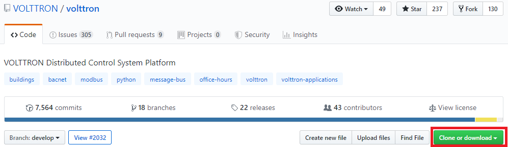
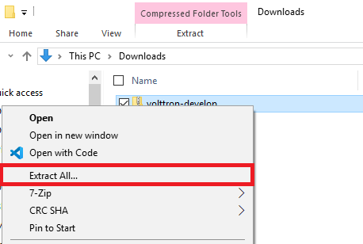
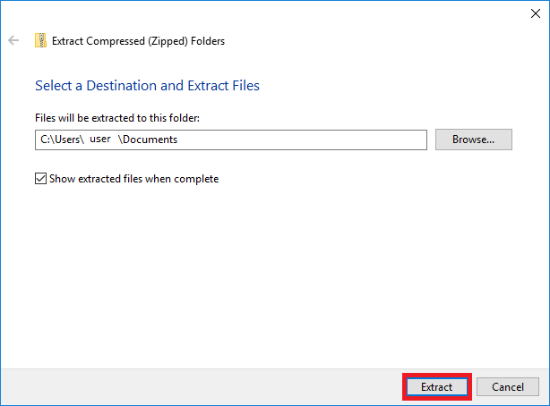
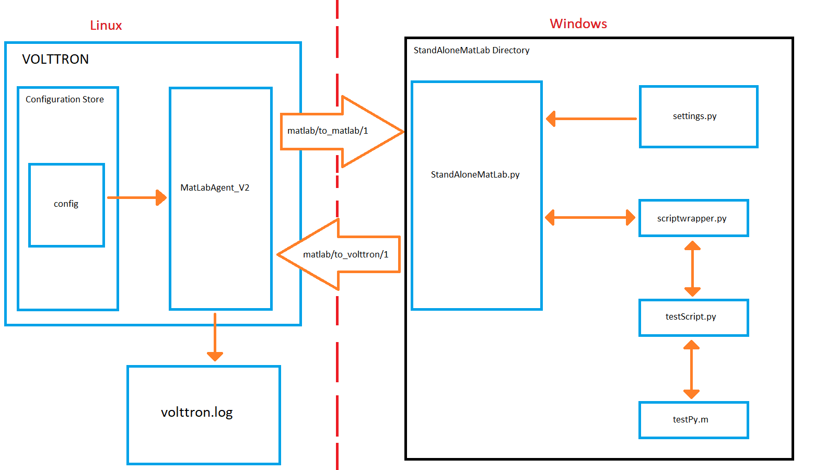

.. _MatlabAgent:

MatLab Agent
============

The MatLab agent and Matlab standalone agent together are 
example agents that allow for matlab scripts to be run in a
Windows environment and interact with the VOLTTRON platform running in a Linux environment. 
The MatLab agent takes advantage of the config store to 
dynamically send scripts and commandline arguments across 
the message bus to one or more standalone agents in
Windows. The standalone agent then executes the requested script 
and arguments, and sends back the results to the MatLab agent.

Overview of Matlab Agents
-------------------------

There are multiple components that are used for the matlab agent. 
This diagram is to represent the components that are connected to  
the matlab agents. In this example, the scripts involved are 
based on the default settings in the matlab agent.

|matlab-agent-diagram|

MatLabAgentV2
~~~~~~~~~~~~~

MatLabAgentV2 publishes the name of a python script along with any command 
line arguments that are needed for the script to the appropriate topic. 
The agent then listens on another topic, and whenever anything is published 
on this topic, it stores the message in the log file chosen when the volttron 
instance is started. If there are multiple standalone agents, the agent can 
send a a script to each of them, along with their own set of command line 
arguments. In this case, each script name and set of command line arguments 
should be sent to separate subtopics. This is done so that no matter how many 
standalone agents are in use, MatLabAgentV2 will record all of their responses.

.. code::

        class MatlabAgentV2(Agent):

            def __init__(self,script_names=[], script_args=[], topics_to_matlab=[], 
                    topics_to_volttron=None,**kwargs):

                super(MatlabAgentV2, self).__init__(**kwargs)
                _log.debug("vip_identity: " + self.core.identity)

                self.script_names = script_names
                self.script_args = script_args
                self.topics_to_matlab = topics_to_matlab
                self.topics_to_volttron = topics_to_volttron
                self.default_config = {"script_names": script_names,
                                       "script_args": script_args,
                                       "topics_to_matlab": topics_to_matlab,
                                       "topics_to_volttron": topics_to_volttron}

                #Set a default configuration to ensure that self.configure is called immediately to setup
                #the agent.
                self.vip.config.set_default("config", self.default_config)
                #Hook self.configure up to changes to the configuration file "config".
                self.vip.config.subscribe(self.configure, actions=["NEW", "UPDATE"], pattern="config")

            def configure(self, config_name, action, contents):
                """
                Called after the Agent has connected to the message bus. 
                If a configuration exists at startup this will be 
                called before onstart.
                Is called every time the configuration in the store changes.
                """
                config = self.default_config.copy()
                config.update(contents)

                _log.debug("Configuring Agent")

                try:
                    script_names = config["script_names"]
                    script_args = config["script_args"]
                    topics_to_matlab = config["topics_to_matlab"]
                    topics_to_volttron = config["topics_to_volttron"]

                except ValueError as e:
                    _log.error("ERROR PROCESSING CONFIGURATION: {}".format(e))
                    return

                self.script_names = script_names
                self.script_args = script_args
                self.topics_to_matlab = topics_to_matlab
                self.topics_to_volttron = topics_to_volttron
                self._create_subscriptions(self.topics_to_volttron)

                for script in range(len(self.script_names)):
                    cmd_args = ""
                    for x in range(len(self.script_args[script])):
                        cmd_args += ",{}".format(self.script_args[script][x])
                    _log.debug("Publishing on: {}".format(self.topics_to_matlab[script]))
                    self.vip.pubsub.publish('pubsub', topic=self.topics_to_matlab[script], 
                            message="{}{}".format(self.script_names[script],cmd_args))
                    _log.debug("Sending message: {}{}".format(self.script_names[script],cmd_args))
        
                _log.debug("Agent Configured!")

For this example, the agent is publishing to the matlab/to_matlab/1 topic, 
and is listening to the matlab/to_volttron topic. It is sending the script 
name testScript.py with the argument 20. These are the default values found 
in the agent, if no configuration is loaded.

.. code::

        script_names = config.get('script_names', ["testScript.py"])
        script_args = config.get('script_args', [["20"]])
        topics_to_matlab = config.get('topics_to_matlab', ["matlab/to_matlab/1"])
        topics_to_volttron = config.get('topics_to_volttron', "matlab/to_volttron/")

StandAloneMatLab.py
~~~~~~~~~~~~~~~~~~~

The StandAloneMatLab.py script is a standalone agent designed to be able to 
run in a windows environment. Its purpose is to listen to a topic, and when 
something is published to this topic, it takes the message, and sends it to 
the script_runner function in scriptwrapper.py. This function processes the 
inputs, and then the output is published to another topic.

.. code::

        class StandAloneMatLab(Agent):
            '''The standalone version of the MatLab Agent'''
            
            @PubSub.subscribe('pubsub', _topics['volttron_to_matlab'])
            def print_message(self, peer, sender, bus, topic, headers, message):
                print('The Message is: ' + str(message))
                messageOut = script_runner(message)
                self.vip.pubsub.publish('pubsub', _topics['matlab_to_volttron'], message=messageOut)

The topic to listen to and the topic to publish to are defined in settings.py, 
along with the information needed to connect the standalone agent to the primary 
volttron instance. These should be the same topics that the MatLabAgentV2 is 
publishing and listening to, so that the communication can be successful. To 
connect the standalone agent to the primary volttron instance, the ip address 
and port of the instance are needed, along with the server key. 

.. code::

        settings.py

        _topics = {
                'volttron_to_matlab': 'matlab/to_matlab/1',
                'matlab_to_volttron': 'matlab/to_volttron/1'
                }

        # The parameters dictionary is used to populate the agent's 
        # remote vip address.
        _params = {
                # The root of the address.
                # Note:
                # 1. volttron instance should be configured to use tcp. use command vcfg
                # to configure
                'vip_address': 'tcp://192.168.56.101',
                'port': 22916,
                
                # public and secret key for the standalone_matlab agent.
                # These can be created using the command:  volttron-ctl auth keypair
                # public key should also be added to the volttron instance auth
                # configuration to enable standalone agent access to volttron instance. Use
                # command 'vctl auth add' Provide this agent's public key when prompted
                # for credential.

                'agent_public': 'dpu13XKPvGB3XJNVUusCNn2U0kIWcuyDIP5J8mAgBQ0',
                'agent_secret': 'Hlya-6BvfUot5USdeDHZ8eksDkWgEEHABs1SELmQhMs',
                
                # Public server key from the remote platform.  This can be
                # obtained using the command:
                # volttron-ctl auth serverkey
                'server_key': 'QTIzrRGQ0-b-37AbEYDuMA0l2ETrythM2V1ac0v9CTA'

        }

        def remote_url():
                return "{vip_address}:{port}?serverkey={server_key}" \
                        "&publickey={agent_public}&" \
                        "secretkey={agent_secret}".format(**_params)

The primary volttron instance will then need to add the public key from the 
standalone agent. In this example, the topic that the standalone agent is 
listening to is matlab/to_matlab/1, and the topic it is publishing to is matlab/to_volttron/1.

scriptwrapper.py
~~~~~~~~~~~~~~~~

Scriptwrapper.py contains the script_runner function. The purpose of 
this function is to take in a string that contains a python script 
and command line arguments separated by commas. This string is parsed 
and passed to the system arguments, which allows the script sent to 
the function to use the command line arguments. The function then 
redirects standard output to a StringIO file object, and then attempts 
to execute the script. If there are any errors with the script, the 
error that is generated is returned to the standalone agent. Otherwise, 
the file object stores the output from the script, is converted to a string, 
and is sent to the standalone agent. 
In this example, the script that is to be run is testScript.py.

.. code::

        #Script to take in a string, run the program, 
        #and output the results of the command as a string.

        import time
        import sys
        from StringIO import StringIO

        def script_runner(message):
            original = sys.stdout
        #    print(message)
        #    print(sys.argv)
            sys.argv = message.split(',')
        #    print(sys.argv)

            try:
                out = StringIO()
                sys.stdout = out
                execfile(sys.argv[0])
                sys.stdout = original
        return out.getvalue()
    except Exception as ex:
        out = str(ex)
        sys.stdout = original
        return out

.. note::

        The script that is to be run needs to be in the same folder as the agent
        and the scriptwrapper.py script. The script_runner function needs to be edited 
        if it is going to call a script at a different location.

testScript.py
~~~~~~~~~~~~~

This is a very simple test script designed to demonstrate the 
calling of a matlab function from within python. First it initializes 
the matlab engine for python. It then takes in a single command line 
argument, and passes it to the matlab function testPy.m. If no 
arguments are sent, it will send 0 to the testPy.m function. It then 
prints the result of the testPy.m function. In this case, since 
standard output is being redirected to a file object, this is 
how the result is passed from this function to the standalone agent.

.. code::

        import matlab.engine
        import sys

        eng = matlab.engine.start_matlab()

        if len(sys.argv) == 2:
            result = eng.testPy(float(sys.argv[1]))
        else:
            result = eng.testPy(0)

        print(result)

testPy.m
~~~~~~~~

This matlab function is a very simple example, designed to show a 
function that takes an argument, and produces an array as the output.
The input argument is added to each element in the array, and the 
entire array is then returned.

.. code::

        function out = testPy(z)
        x = 1:100
        out = x + z
        end

Setup on Linux
--------------

1. Setup and run Volttron from develop branch using instructions :ref:`here <Building-VOLTTRON>`.

2. Configure volttron instance using the ``vcfg`` command.
   When prompted for the vip address use tcp://<ip address of the linux machine>. 
   This is necessary to enable volttron communication with external processes. 

.. note::
        
        If you are running VOLTTRON from within VirtualBox, It would be good to set
        one of your adapters as a Host-only adapter. This can be done within the 
        VM's settings, under the Network section. Once this is done, use this IP
        for the vip address.

.. _MatlabAgent_config:
3. Update the configuration for MatLabAgent_v2 at <volttron source dir>/example/MatLabAgent_v2/config. 

The configuration file for the MatLab agent has four variables.

   1. script_names

   2. script_args
   
   3. topics_to_matlab

   4. topics_to_volttron

An example config file included with the folder.

.. code::

        {
          # VOLTTRON config files are JSON with support for python style comments.
          "script_names": ["testScript.py"],
          "script_args": [["20"]],
          "topics_to_matlab": ["matlab/to_matlab/1"],
          "topics_to_volttron": "matlab/to_volttron/"
        }

To edit the configuration, the format should be as follows:

.. code::

        {
          "script_names": ["script1.py", "script2.py", ...],
          "script_args": [["arg1","arg2"], ["arg1"], ...],
          "topics_to_matlab": ["matlab/to_matlab/1", "matlab/to_matlab/2", ...],
          "topics_to_volttron": "matlab/to_volttron/"
        }

The config requires that each script name lines up with a set of 
commandline arguments and a topic. So a commandline argument 
must be included, even if it is not used. The placement of 
brackets are important, even when only communicating with one 
standalone agent. 

For example, if only one standalone agent is used, and no command line 
arguments are in place, the config file may look like this.

.. code::

        {
          "script_names": ["testScript.py"],
          "script_args": [["0"]],
          "topics_to_matlab": ["matlab/to_matlab/1"],
          "topics_to_volttron": "matlab/to_volttron/"
        }

4. Install MatLabAgent_v2 and start agent (from volttron root directory)

``python ./scripts/install-agents.py -s examples/MatLabAgent_v2 -c examples/MatLabAgent_v2/config --start``

5. Run the below command and make a note of the server key. This required in configuring the stand alone agent on windows.

``volttron-ctl auth serverkey``

Configuration Modifications
~~~~~~~~~~~~~~~~~~~~~~~~~~~

The MatLab agent uses the configuration store to dynamically change inputs.
More information on the config store and how it used can be found here.

 * :ref:`VOLTTRON Configuration Store <VOLTTRON-Configuration-Store>`

 * :ref:`Agent Configuration Store <ConfigurationStore>`

 * :ref:`Agent Configuration Store Interface <Agent-Configuration-Store-Interface>`

Setup on Windows
----------------

Install pre-requisites
~~~~~~~~~~~~~~~~~~~~~~~
1. Install python 2.7 from `here <https://www.python.org/downloads/windows/>`__.

2. Install MatLab engine from  `here <https://www.mathworks.com/help/matlab/matlab_external/install-the-matlab-engine-for-python.html>`_.

Install StandAloneMatLab Agent
~~~~~~~~~~~~~~~~~~~~~~~~~~~~~~

The standalone MatLab agent is designed to be usable in a 
Windows environment. 

.. warning:: 

        VOLTTRON is not designed to run in a Windows environment. 
        Outside of cases where it is stated to be usable in a 
        Windows environment, it should be assumed that it will
        NOT function as expected.

1. Download VOLTTRON

   Download the VOLTTRON develop repository from github. Download the zip  
   from `GitHub <https://github.com/VOLTTRON/volttron/tree/develop>`_. 
   
   |github-image|

   |github-zip-image|

   Once the zipped file has been downloaded, go to your Downloads folder,
   right-click on the file, and select "Extract All..."

   |extract-image_1|

   Choose a location for the extracted folder, and select "Extract"

   |extract-image_2|

2. Setup the PYTHONPATH
   
   Open the Windows explorer, and navigate to "Edit environment variables for your account."
   
   |cmd-image|

   Select "New"
   
   |env-vars-image_1|
   
   For "Variable name" enter: "PYTOHNPATH"
   For "Variable value" either browse to your volttron installation, or enter in the path to your volttron installation.
   
   |env-vars-image_2|
   
   Select "OK" twice.

3. Set up the environment.
   
   Open up the command prompt.
   
   |cmd-image_2|
   
   Naviage to your volttron installation.
   
   ``cd \Your\directory\path\to\volttron-develop``
   
   Use pip to install and setup dependencies.
   
   ``pip install -r requirements.txt``
   
   ``pip install -e .``
   
   .. note::
   
     If you get the error doing the second step because of an already installed volttron 
     from a different directory, manually delete the volttron-egg.link file from your 
     <python path>\Lib\site-pacakages directory (for example, del  C:\Python27\lib\site-packages\volttron-egg.link ) 
     and re-run the second command

4. Configure the agent

The configuration settings for the standalone agent are in setting.py (located in the same directory as the standalone agent)

**settings.py**

   * 'volttron_to_matlab' needs to be set to the topic that will send your script
     and command line arguments to your stand alone agent. This was defined in :ref:`config. <MatlabAgent_config>`

   * 'matlab_to_volttron' needs to be set to the topic that will send your script's
     output back to your volttron platform. This was defined in :ref:`config. <MatlabAgent_config>`

   * 'vip_address' needs to be set to the address of your volttron instance
   
   * 'port' needs to be set to the port of your volttron instance
   
   * 'server_key' needs to be set to the public server key of your primary volttron platform.
     This can be obtained from the primary volttron platform  using ``vctl auth serverkey``.
     (volttron must be running to use this command)

.. note:: 
        
        These changes are only necessary if you make changes to the example
        config file topics or if you want to run multiple standalone agents.

It is possible to have multiple standalone agents running. In this case,
copy the StandAloneMatLab folder, and make the changes mentioned above.

.. note::

        It is recommended that you generate a new agent_public and agent_private
        key for your standalone agent. This can be done using the ``vctl auth keypair``
        command on your primary volttron platform. If you plan to use multiple standalone agents,
        they will each need their own keypair.

5. Add standalone agent key to volttron platform
   
   * Copy the public key from settings.py in the StandAloneMatLab folder.

   * While the primary volttron platform is running on the linux machine, 
     add the agent public key using the vctl auth command.
     
   .. code::
        
        vctl auth add --credentials <standalone agent public key>

6. Run standalone agent

At this point, the agent is ready to run. To use the agent, navigate to the
example folder and use python to start the agent.

``cd examples\StandAloneMatLab\``

``python standalone_matlab.py``

.. note::

If you have python3 as your default python run the command ``python -2 standalone_matlab.py``

.. |cmd-image| image:: files/cmd-image.png
.. |env-vars-image_1| image:: files/env-vars-image_1.png
.. |env-vars-image_2| image:: files/env-vars-image_2.png
.. |cmd-image_2| image:: files/cmd-image_2.png
.. |github-zip-image| image:: files/github-zip-image.png

