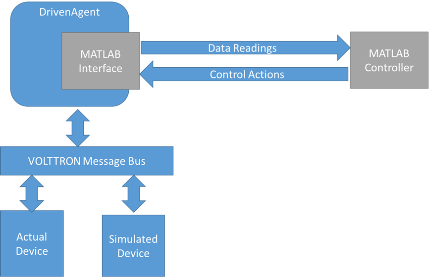

.. _MatLabBridge:

MatLab Integration
==================

Overview:
---------

Matlab-VOLTTRON integration allows Matlab applications to receive
data from devices and send control commands to change points on
those devices.

DrivenMatlabAgent in VOLTTRON allows this interaction by using ZeroMQ
sockets to communicate with the Matlab application.

DrivenMatlabAgent subscribes to all the device topics configured in its
configuration file. Every time a new device data is published by the master
driver, the driven agent sends the data to the matlab code. Matlab code can act
on this data (analysis, simulation etc. ) and return a command to driven agent
that specifies how to change the device state. Driven matlab agent then
requests a one minute time schedule on the device to Actuator agent and at
the scheduled time, sets the given values for the given device points.

Data Flow Architecture:
~~~~~~~~~~~~~~~~~~~~~~~

|Architecture|

Installation steps for system running Matlab:
---------------------------------------------

1. Install python. Suggested 3.4. Other supported versions are 2.7, 3.3.

2. Install pyzmq (tested with version 15.2.0)
   Follow steps at: https://github.com/zeromq/pyzmq

3. Install Matlab (tested with R2015b)

4. Start Matlab and set the python path.
   In the Matlab command window set the python path with `pyversion`:

   .. code-block:: console

      >> pyversion python.exe

5. To test that the python path has been set correctly type following in
   the Matlab command window. Matlab shoud print the python path with version
   information.

   .. code-block:: console

      >> pyversion

6. To test that the pyzmq library is installed correctly and is accessible
   from python inside Matlab, type the following in Matlab command window
   and it should show pyzmq version installed.

   .. code-block:: console

      >> py.zmq.pyzmq_version()

7. Copy `example.m` from `volttron/examples/ExampleMatlabApplication/matlab`
   to your desired folder.

Run and test Matlab VOLTTRON Integration:
-----------------------------------------

Installation:
~~~~~~~~~~~~~

1. Install VOLTTRON on a VM or different system than the one
   running Matlab.

   Follow link: http://volttron.readthedocs.io/en/develop/install.html

2. Clone volttron-applications in any directory outside of your volttron
   source directory.

   .. Note::

      Best practise is to clone in the parent directory of volttron
      source. For example, /users/user1/volttron and
      /users/user1/volttron-applications).

   .. code-block:: console

      (volttron)[user1@osboxes workspace]$ ls
      volttron
      (volttron)[user1@osboxes workspace]$ git clone https://github.com/VOLTTRON/volttron-applications.git
      (volttron)[user1@osboxes workspace]$ ls
      volttron volttron-applications

Install Dependencies
~~~~~~~~~~~~~~~~~~~~

To test the interaction between matlab driven agent and matlab code you would
 need the following agents installed and running

1. Run master driver and configure it to publish device data. Data published
   by the device will be scraped by master driver agent and published to message
   bus. DrivenMatlabAgent subscribes to device topics and sends the data to
   matalab code.
   To test the interaction between the masterdriver and matlab agent install
   master driver agent, a fake device, and a listener agent using command

   .. code-block:: console

      (volttron)[velo@osboxes workspace]$ cd myvolttron
      (volttron)[velo@osboxes myvolttron]$ vcfg --agent master_driver listener
      Configuring /home/velo/workspace/myvolttron/services/core/MasterDriverAgent
      Install a fake device on the master driver? [N]: y
      Should agent autostart? [N]: n
      Configuring examples/ListenerAgent
      Should agent autostart? [N]: n

   .. Note::

      The vcfg command needs to be run when volttron instance is not running.
      The above command sets up a fake device -
      fake-campus/fake-building/fake-device.

2. Actuator Agent

   Run the following command to install and start Actuator agent if you don't
   already have it running. Drivenmatlab agent get device control commands from
   matlab code and sends it to the device using an Actuator agent.

   .. code-block:: console

      python scripts/install-agent.py  -s services/core/ActuatorAgent

3. Start volttron

   .. code-block:: console

      ./start-volttron

Configure driven matlab agent
~~~~~~~~~~~~~~~~~~~~~~~~~~~~~
1. Create a config directory in your volttron source directory if one doesn't
   already exist

2. Copy example configuration file
   <your cloned volttron-applications directory>/pnnl/DrivenMatlabAgent/config_waterheater
   to <volttron source directory>/config.

3. Change config\_url and data\_url in the new config file to the
   ipaddress of machine running Matlab. Keep the same port numbers.

4. Change campus, building and unit (device) name in the config file. If you
   used volttron-cfg command to configure a fake device it would be fake-campus,
   fake-building, and fake-device respectively

5. Update arguments, conversion_map, and unittype field to use the correct point name(s).
   Following is an example of config with a single point "temperature".
   Provide the ip address of the machine running matlab in config_url and
   data_url

   .. code-block:: python

      "arguments": {
           "temperature": "temperature",

           "config_url": "tcp://<ip address of machine running matlab>:5556",
           "data_url": "tcp://<ip address of machine running matlab>:5557",
           "recv_timeout": 50000
       },
       "conversion_map": {
           "temperature*": "float"
       },
       "unittype_map": {
           "temperature*": "Farenheit"
       }

5. Open example.m and change following line:

.. code-block:: matlab

   matlab_result = '{"commands":{"Zone1":[["temperature",27]],"Zone2":[["temperature",28]]}}';

Change it to include correct device name(instead of Zone1 and Zone2) and point
names(instead of "temperature") in the format:

.. code-block:: matlab

   '{"commands":{"device1":[["point1",value1]],"device2":[["point2",value2]]}}';

Steps to test integration:
~~~~~~~~~~~~~~~~~~~~~~~~~~

1. Start VOLTTRON

2. Run Actuator

3. Run device driver agent

4. Install  DrivenMatlabAgent with the new config file

.. code-block:: console

   python scripts/install-agent.py  -s <source
   directory of volttron-applications>/pnnl/DrivenMatlabAgent -c
   config/config_waterheater

5. Run DrivenMatlabAgent

.. code-block:: console

   vctl start --name DrivenMat*

6. Run example.m in Matlab

7. Matlab should show result similar to below

.. code-block:: console

   Sending config request
   waiting for config params
   Receiving config params and initial data
   Python dict with no properties.

       {u'analysis_name': u'WaterHeater_Agent', u'temperature': u'temperature'}

   waiting for initial data
   Receiving data
   Got data from WH
     Python dict with no properties.

       {'powerstate&fake-device': 0, 'heartbeat&fake-device': True,
     'valvestate&fake-device': 0, 'temperature&fake-device': 50.0}

   sending matlab result

8. volttron.log should show logs about driven matlabagent sending and
recieving data from matlab code. For example

.. code-block:: console

   2018-07-12 14:08:20,509 (drivenmatlabagent-3.5.0 7128) <stdout> INFO: Checking for config request from Matlab
   2018-07-12 14:08:31,711 (drivenmatlabagent-3.5.0 7128) <stdout> INFO: Sending config params
   2018-07-12 14:08:35,016 (drivenmatlabagent-3.5.0 7128) <stdout> INFO:
     Waiting for matlab results
   2018-07-12 14:08:35,010 (drivenmatlabagent-3.5.0 7128) volttron.platform.agent.driven DEBUG: Pattern temperature* used to process temperature&fake-device.
   2018-07-12 14:08:35,021 (drivenmatlabagent-3.5.0 7128) drivenmatlab.drivenagent INFO: Processing Results!
   2018-07-12 14:08:35,022 (drivenmatlabagent-3.5.0 7128) drivenmatlab.drivenagent INFO: Make Request fake-campus/fake-building/Zone2 for start 07-12-18 14:08 and end 07-12-18 14:09
   2018-07-12 14:08:35,049 (actuatoragent-1.0 7076) actuator.agent DEBUG: Got new schedule request: drivenmatlabagent-3.5.0_1, fake-campus/fake-building/Zone2, HIGH, [['fake-campus/fake-building/Zone2', datetime.datetime(2018, 7, 12, 14, 8, tzinfo=<DstTzInfo 'America/Vancouver' PDT-1 day, 17:00:00 DST>), datetime.datetime(2018, 7, 12, 14, 9, tzinfo=<DstTzInfo 'America/Vancouver' PDT-1 day, 17:00:00 DST>)]]
   2018-07-12 14:08:35,081 (drivenmatlabagent-3.5.0 7128) drivenmatlab.drivenagent INFO: Make Request fake-campus/fake-building/Zone1 for start 07-12-18 14:08 and end 07-12-18 14:09

Agent - Matlab Interaction
~~~~~~~~~~~~~~~~~~~~~~~~~~

1. Matlab code sends request for device(s) configuration
2. DrivenMatlabAgent send the device and points that it has subscribed to
3. Matlab code waits for initial data
4. DrivenMatlabAgent sends the data published by masterdriver agent
5. Matlab receives the data and decides what needs to change in the device state
6. Matlab sends commands to set new values to device points
7. DrivenMatlabAgent request a new schedule to ActuatorAgent
8. At the scheduled time, DrivenMatlab agent sent the device point with the
   new value provided by matlab code.

Troubleshooting
~~~~~~~~~~~~~~~

1. Matlab fails with "No volttron agent running"

   There are two possible causes.

   a. Driven agent waits for a initial config
   request from matlab only the configured time before it timeouts. Check
   the timeout parameter of driven matalb agent, increase is as needed and
   reinstall and restart the driven matalab agent

   b. Your firewall is restricting access to port 5556 and 5557. Verify that
   these ports are open for zmq socket communication. Easiest way to check
   this is run volttron on a VM in nat mode and run matlab in the host that
   runs the VM. This way the communication is within the host and hence your
   internet firewall rules will not apply

2. Verify zmq communitcation outside of VOLTTRON

   You could also verify that the zmq communication is working fine outside
   of volttron environment using the
   volttron/examples/ExampleMatlabApplication/matlab/matlab_example.py.
   Update the variables config_url and data_url in this file to point to ip
   address of machine running matlab and run this python code on the machine
   running volttron and then start matlab. See if the python code and matlab
   code are able to talk to each other without any errors.

Resources
---------

http://www.mathworks.com/help/matlab/getting-started_buik_wp-3.html

