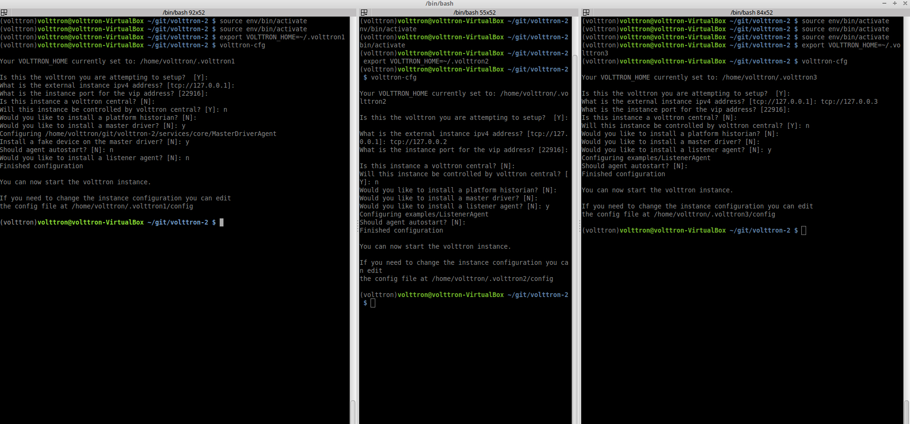
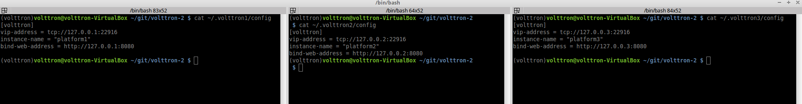
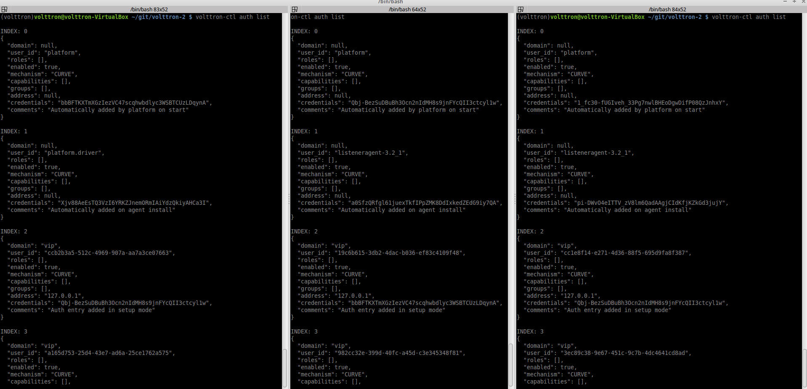
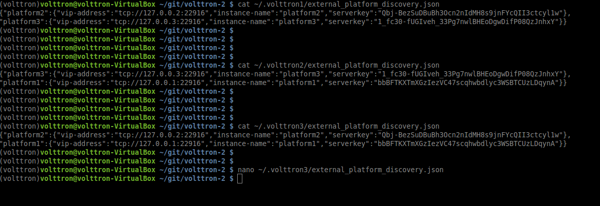
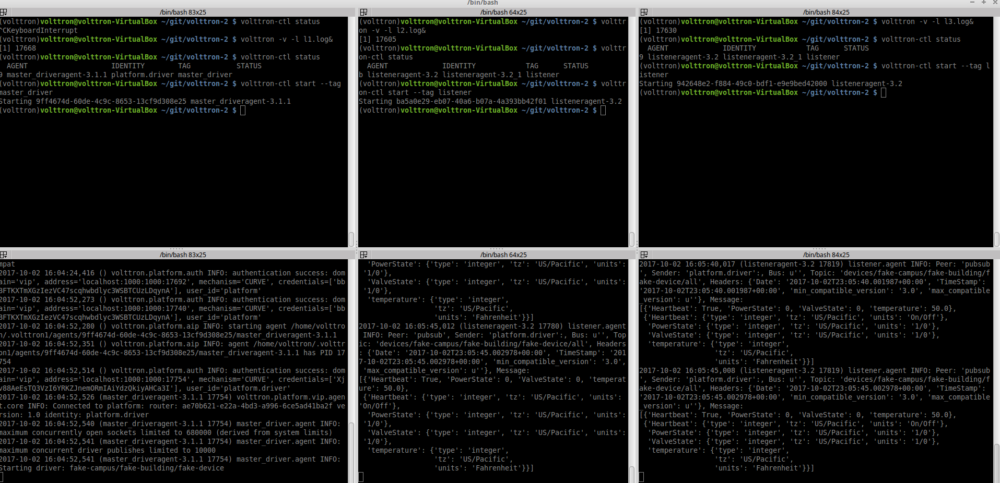

.. _MultiPlatform-Walkthrough:

Multi-Platform Connection Walkthrough
====================================

VOLTTRON Central is a platform management web application that allows
platforms to communicate and to be managed from a centralized server.
This agent alleviates the need to ssh into independent nodes in order
to manage them. This guide will show how to connect three VOLTTRON instances with a fake driver running on VOLTTRON
instance 1 and a listener agent running on other 2 VOLTTRON instances subscribed to topic "devices".

-  `Getting Started <#getting-started>`__
-  `Multi-Platform Configuration <#multi-platform-configuration>`__
-  `Configuration and Authentication in Setup Mode <#configuration-and-authentication-in-setup-mode>`__
-  `Setup Configuration and Authentication Manually <#setup-configuration-and-authentication-manually>`__
-  `Start Master driver on VOLTTRON instance 1 <#start-master-driver-on-volttron-instance-1>`__
-  `Start Listener agents on VOLTTRON instance 2 and 3 <#Start-listener-agents-on-VOLTTRON-instance-2-and-3>`__
-  `Stopping All the Platforms <#stopping-allthe-platforms>`__

Getting Started
---------------
After :ref:`building VOLTTRON <Building-VOLTTRON>`, open three shells with the current directory the root of the
VOLTTRON repository. Then activate the VOLTTRON environment and export the VOLTTRON\_HOME variable. The home
variable needs to be different for each instance.

.. code-block:: console

    $ source env/bin/activate
    $ export VOLTTRON_HOME=~/.volttron1

Run `volttron-cfg` in all the three shells. This command will ask how the instance
should be set up. Many of the options have defaults and that will be sufficient. Enter a different VIP address for each
platform. Configure fake master driver in the first shell and listener agent in second and third shell.

|Terminator Setup|

Multi-Platform Configuration
----------------------------
For each instance, specify the instance name in platform config file under it's ``VOLTTRON_HOME`` directory.
If the platform supports web server, add the ``bind-web-address`` as well.

Here is an example,
Path of the config: VOLTTRON_HOME/config

[volttron]
vip-address = tcp://127.0.0.1:22916
instance-name = "platform1"
bind-web-address = http://127.0.0.1:8080

|Multi-Platform Config|

Each instance needs to know the VIP address, platform name and server keys of the remote platforms that it is connecting
to. In addition, each platform has to authenticate or accept the connecting instances' public keys. We can do this step
either by running VOLTTRON in setup mode or configure the information manually.

Configuration and Authentication in Setup Mode
----------------------------------------------
* Note: It is necessary for each platform to have a web server if running in setup mode *

Add list of web addresses of remote platforms in ``VOLTTRON_HOME\external_address.json``

Start VOLTTRON instances in setup mode in the three terminal windows. The "-l" option in the following command tells
VOLTTRON to log to a file. The file name should be different for each instance.

.. code-block:: console

    $ volttron -l l1.log --setup-mode&

A new auth entry is added for each new platform connection. This can be checked with -

.. code-block:: console

    $ volttron-ctl auth list

|Auth Entry|

After all the connections are authenticated, we can start the instances in normal mode.

.. code-block:: console

    $ volttron-ctl shutdown --platform
    $ volttron -l l1.log&

Setup Configuration and Authentication Manually
-----------------------------------------------
If you do not need web servers in your setup, then you will need to build the platform discovery config file manually.
For each remote platform connection, there should be an entry containing VIP address, instance name and serverkey of
the platform.

Name of the file: external_platform_discovery.json

Directory path:   Each platform’s VOLTTRON_HOME directory.

For example, since VOLTTRON instance 1 is connecting to VOLTTRON instance 2 and 3, contents of
``external_platform_discovery.json`` will be

{
"platform2":{"vip-address":"tcp://127.0.0.2:22916",
             "instance-name":"platform2",
             "serverkey":"YFyIgXy2H7gIKC1x6uPMdDOB_i9lzfAPB1IgbxfXLGc"},
"platform3":{"vip-address":"tcp://127.0.0.3:22916",
            "instance-name":"platform3",
            "serverkey":"hzU2bnlacAhZSaI0rI8a6XK_bqLSpA0JRK4jq8ttZxw"}
}

After this, you will need to add the server keys of the connecting platforms using the ``volttron-ctl`` utility. Type
**volttron-ctl auth add** command on the command prompt and simply hit Enter to select defaults on all fields
except **credentials**, where we can either add serverkey of connecting platform or type `/.*/` to allow ALL
connections.

.. code-block:: console

   $ volttron-ctl auth add
   domain []:
   address []:
   user_id []:
   capabilities (delimit multiple entries with comma) []:
   roles (delimit multiple entries with comma) []:
   groups (delimit multiple entries with comma) []:
   mechanism [CURVE]:
   credentials []: /.*/
   comments []:
   enabled [True]:
   added entry domain=None, address=None, mechanism='CURVE', credentials=u'/.*/', user_id=None

For more information on authorization see :ref:`authentication<VIP-Authentication>`.

Once the initial configuration are setup, you can start all the VOLTTRON instances in normal mode.

.. code-block:: console

    $ volttron -l l1.log&

Next steps is to start agents in each platform to see multi-platform PubSub communication behavior.

Start Master driver on VOLTTRON instance 1
------------------------------------------
If master driver is not configured to autostart when the instance starts up, we can start it explicitly with this
command.

.. code-block:: console

    $ volttron-ctl start --tag master_driver

Start Listener agents on VOLTTRON instance 2 and 3
--------------------------------------------------
If the listener agent is not configured to autostart when the instance starts up, we can start it explicitly with this
command.

.. code-block:: console

    $ volttron-ctl start --tag listener

We should start seeing messages with prefix="devces" in the logs of VOLTTRON instances 2 and 3.

Stopping All the Platforms
--------------------------

We can stop all the VOLTTRON instances by executing below command in each terminal window.

.. code-block:: console

    $ volttron-ctl shutdown --platform

