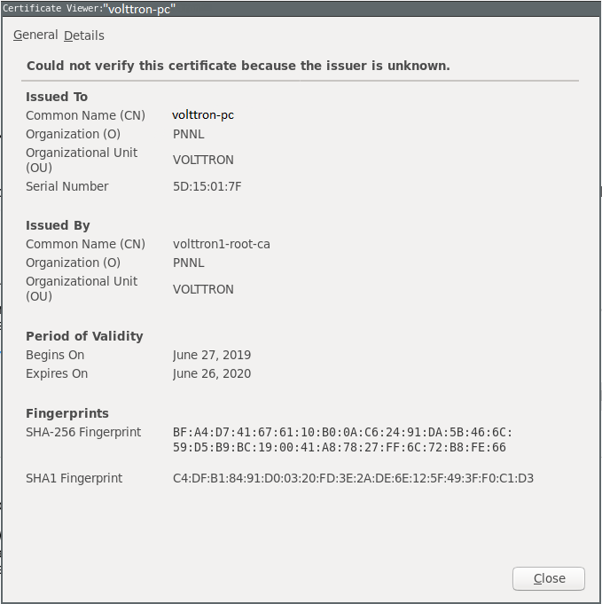

.. _SingleMachine-Walkthrough:

Single Machine Deployment
=========================

The purpose of this demonstration is to show the process of setting up a simple VOLTTRON instance for use on a single machine.

Install and Build VOLTTRON
--------------------------

First, :ref:`install <VOLTTRON-Prerequisites>` and :ref:`build <Building-VOLTTRON>` VOLTTRON:

For a quick reference: 

.. code-block:: console
        
        sudo apt-get update
        sudo apt-get install build-essential python-dev openssl libssl-dev libevent-dev git
        git clone https://github.com/VOLTTRON/volttron/
        cd volttron
        python2.7 bootstrap.py

Activating the  VOLTTRON Environment
------------------------------------

After the build is complete, activate the VOLTTRON environment.

.. code-block:: console

        source env/bin/activate

Configuring VOLTTRON
--------------------

The ``vcfg`` command allows for an easy configuration of the VOLTTRON environment.

.. note::
        
        To create a simple instance of VOLTTRON, leave the default response, or select yes (y) if prompted for a yes or no response [Y/N]. You must choose a username and password for the VOLTTRON Central admin account.

A set of example responses are included here:

.. code-block:: console

        (volttron)<username>@<localhost>:~/volttron$ vcfg

        Your VOLTTRON_HOME currently set to: /home/<username>/.volttron

        Is this the volttron you are attempting to setup? [Y]: 
        What type of message bus (rmq/zmq)? [zmq]: 
        What is the vip address? [tcp://127.0.0.1]: 
        What is the port for the vip address? [22916]: 
        Is this instance web enabled? [N]: y
        What is the protocol for this instance? [https]: 
        Web address set to: https://<localhost>
        What is the port for this instance? [8443]: 
        Would you like to generate a new web certificate? [Y]: 
        WARNING! CA certificate does not exist.
        Create new root CA? [Y]: 

        Please enter the following details for web server certificate:
                Country: [US]: 
                State: WA
                Location: Richland
                Organization: PNNL
                Organization Unit: VOLTTRON
        Created CA cert
        Creating new web server certificate.
        Is this an instance of volttron central? [N]: y
        Configuring /home/<username>/volttron/services/core/VolttronCentral.
        Enter volttron central admin user name: <vc-username>
        Enter volttron central admin password: <password>
        Retype password: <password>
        Installing volttron central.
        Should the agent autostart? [N]: y
        Will this instance be controlled by volttron central? [Y]: y
        Configuring /home/<username>/volttron/services/core/VolttronCentralPlatform.
        What is the name of this instance? [volttron1]: 
        What is the hostname for volttron central? [https://<localhost>]: 
        What is the port for volttron central? [8443]: 
        Should the agent autostart? [N]: y
        Would you like to install a platform historian? [N]: y
        Configuring /home/<username>/volttron/services/core/SQLHistorian.
        Should the agent autostart? [N]: y
        Would you like to install a master driver? [N]: y
        Configuring /home/<username>/volttron/services/core/MasterDriverAgent.
        Would you like to install a fake device on the master driver? [N]: y
        Should the agent autostart? [N]: y
        Would you like to install a listener agent? [N]: y
        Configuring examples/ListenerAgent.
        Should the agent autostart? [N]: y
        Finished configuration!

        You can now start the volttron instance.

        If you need to change the instance configuration you can edit
        the config file is at /home/<username>/.volttron/config

        (volttron)<username>@<localhost>:~/volttron$ 

Once this is finished, run VOLTTRON and test the new configuration.

Testing VOLTTRON
----------------

Command Line
~~~~~~~~~~~~

To test that the configuration was successful, start an instance of VOLTTRON in the background:

.. code-block:: console

        volttron -vv -l volttron.log >/dev/null 2>&1&

If the example ``vcfg`` responses were used, the listener, master_driver, platform_historian, vcp, and vc agents should have all started automatically. This can be checked using ``vctl status``. 

The output should look similar to this:

.. code-block:: console

        (volttron)<username>@<localhost>:~/volttron$ vctl status
          AGENT                    IDENTITY            TAG                STATUS          HEALTH
        8 listeneragent-3.2        listeneragent-3.2_1 listener           running [2810]  GOOD
        0 master_driveragent-3.2   platform.driver     master_driver      running [2813]  GOOD
        3 sqlhistorianagent-3.7.0  platform.historian  platform_historian running [2811]  GOOD
        2 vcplatformagent-4.8      platform.agent      vcp                running [2812]  GOOD
        9 volttroncentralagent-5.0 volttron.central    vc                 running [2808]  GOOD

You can further verify that the agents are functioning correctly with ``tail -f volttron.log``

VOLTTRON Central
~~~~~~~~~~~~~~~~

To test that the configuration was successful, start an instance of VOLTTRON in the background:

.. code-block:: console

        volttron -vv -l volttron.log >/dev/null 2>&1&

Open a web browser and navigate to \https://<localhost>:8443/vc/index.html

There may be a message warning about a potential security risk. Check to see if the certificate that was created in vcfg is being used. The process below is for firefox.

|vc-cert-warning-1|

.. |vc-cert-warning-1| image:: files/vc-cert-warning-1.png

|vc-cert-warning-2|

|vc-cert-warning-3|

|vc-cert-warning-4|

.. |vc-cert-warning-4| image:: files/vc-cert-warning-4.png

Log in using the username and password you created during the ``volttron-ctl`` prompt.

|vc-login|

.. |vc-login| image:: files/vc-login.png

Once you have logged in, click on the Platforms tab in the upper right corner of the window.

|vc-dashboard|

.. |vc-dashboard| image:: files/vc-dashboard.png

Once in the Platforms screen, click on the name of the platform.

|vc-platform|

.. |vc-platform| image:: files/vc-platform.png

You will now see a list of agents. They should all be running.

|vc-agents|

.. |vc-agents| image:: files/vc-agents.png

For more information on VOLTTRON Central, please see:

* :ref:`VOLTTRON Central Management <VOLTTRON-Central>`
* :ref:`VOLTTRON Central Demo <volttron-central-demo>`
