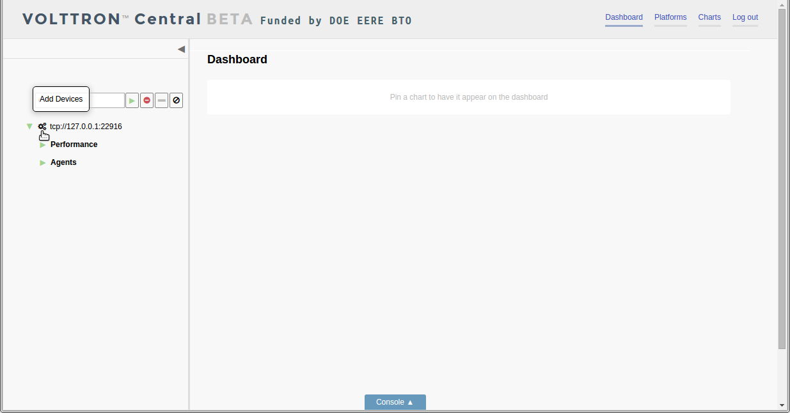
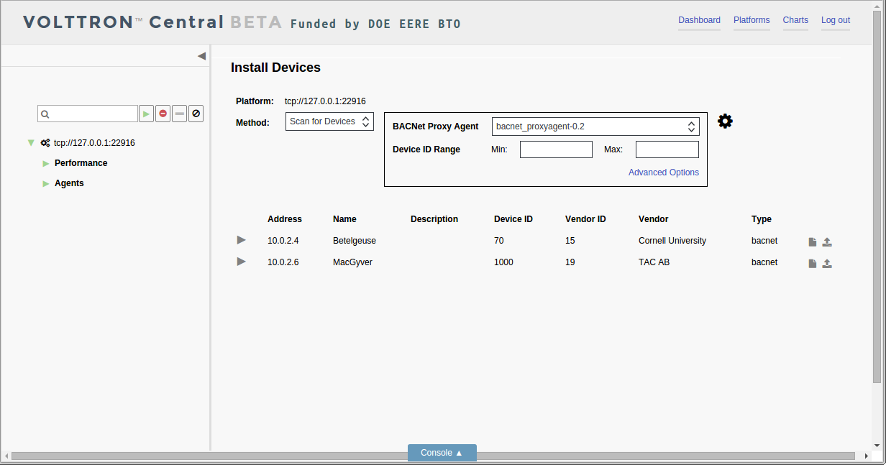
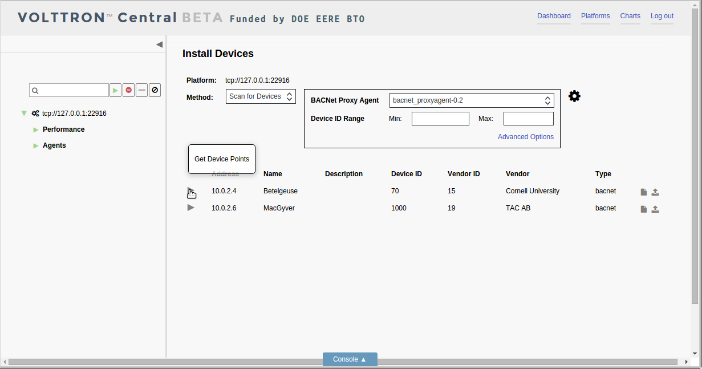
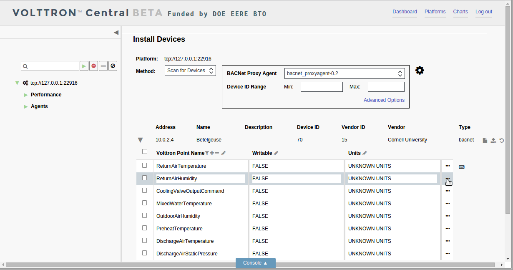
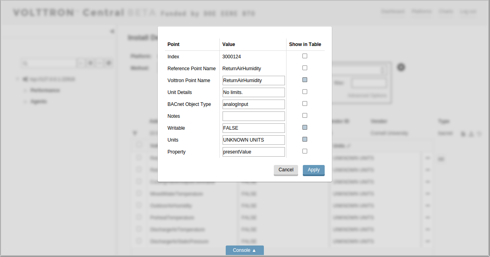
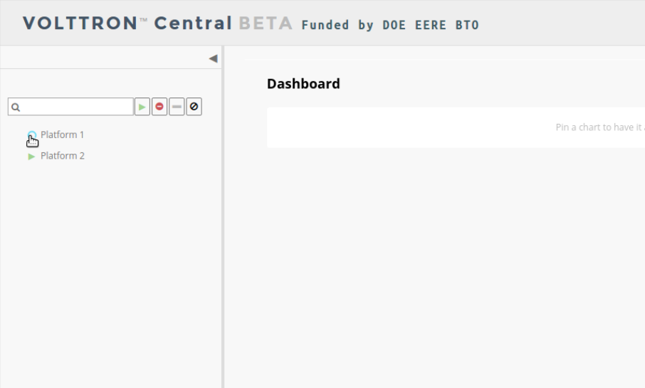
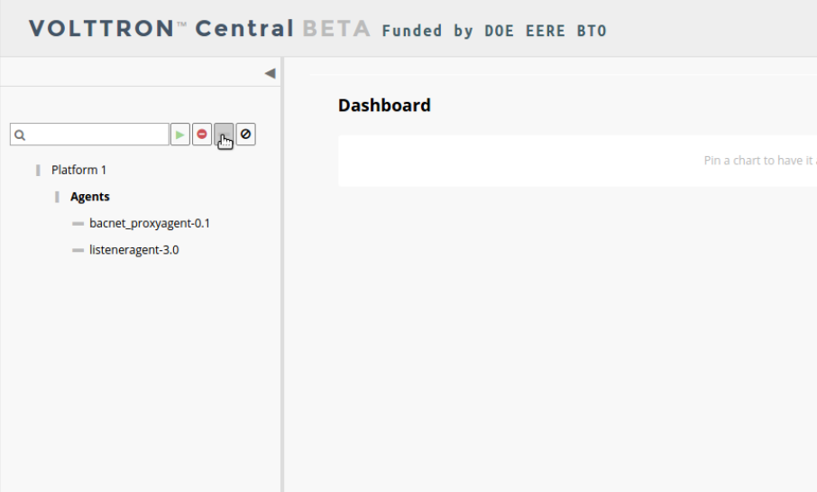
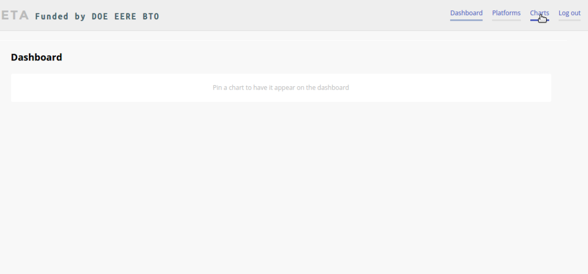

.. _VOLTTRON-Central-Demo:

==============================================
Device Conifiguration in VOLTTRON Central Demo
==============================================

Devices in your network can be detected by VOLTTRON Central and configured
through the VOLTTRON Central UI. The current version of VOLTTRON enables
the configuration of BACNet devices only. The following steps describe the
process. 

-  `Launching Device Configuration <#launching-device-configuration>`__
-  `Scanning for Devices <#scanning-for-devices>`__
-  `Scanning for Points <#scanning-for-points>`__
-  `Stopping the Demo <#stopping-the-demo>`__
-  `Log In <#log-in>`__
-  `Log Out <#log-out>`__
-  `Platforms Tree <#platforms-tree>`__
-  `Loading the Tree <#loading-the-tree>`__
-  `Health Status <#health-status>`__
-  `Filter the Tree <#filter-the-tree>`__
-  `Platforms Screen <#platforms-screen>`__
-  `Register New Platform <#register-new-platform>`__
-  `Deregister Platform <#deregister-platform>`__
-  `Platform View <#platform-view>`__
-  `Add Charts <#add-charts>`__
-  `Dashboard Charts <#dashboard-charts>`__
-  `Remove Charts <#remove-charts>`__

Launching Device Configuration
------------------------------

In VOLTTRON Central, extend the side panel on the left and find the configure
cogs button next to the platform instance you want to add the device to. Click 
the cogs button to launch the device configuration feature.

|Add Devices|

|Install Devices|

Currently the only method of adding devices is to conduct a scan to detect 
BACNet devices. A BACnet Proxy Agent must be running in order to do the scan.
If more than one BACnet Proxy is installed on the platform, choose the one that
will be used for the scan.

The scan can be conducted without setting any further options. However, optional
settings that can be used include the range of device IDs that the scan should 
target. Further advanced options include the ability to specify the IP address
of a device to detect as well as the ability to change the duration of the scan
from the default of five seconds.

Scanning for Devices
--------------------

To start the scan, click the large cog button to the right of the scan settings.

|Start Scan|

Devices that are detected will appear in the space below the scan settings. 
Scanning can be repeated at any time by clicking the large cog button again.

|Devices Found|

Scanning for Points
-------------------

Another scan can be performed on each device to retrieve its available points.
This scan is initiated by clicking the triangle next to the device in the list.
The first time the arrow is clicked, it initiates the scan. After the points
are retrieved, the arrow becomes a hide-and-show toggle button and won't 
reinitiate scanning the device. 

After the points have been retrieved once, the only way to scan the same device 
for points again is to relaunch the device configuration process from the start 
by clicking on the small cogs button next to the platform instance in the panel tree.

|Get Device Points|

When all the points on the device have been retrieved, the points are loaded
into the registry configuration editor. There, the points can be modified and 
selected to go into the registry file for the configured device.

|Edit Points|

Each row represents a point, and each column represents the point's 
attributes. Type directly in a cell to change an attribute value for
a point.

The default view of the editor the shows the attributes that are most often 
needing to be changed during configuration: the VOLTTRON point name, the writable
setting, and the units. Other attributes are present but not shown in the 
default view. To see all the attributes for a point, click the Edit Point button 
(the three dots) at the end of the point row.

|Edit Point Button|

Point attributes can also be changed by typing in the fields in the Edit Point
window, including changing the hidden attributes that aren't shown in the
registry configuration editor. 

|Edit Point Dialog|

Check or uncheck the "Show in Table" box for an attribute to add it or remove 
it as a column in the registry configuration editor.

Several quick-edit features are available 

The 

One of our instances will have a VOLTTRON Central agent. We will install a
platform agent and a historian on all three platforms.

Run `volttron-cfg` in the first shell. This command will ask how the instance
should be set up. Many of the options have defaults that will be sufficient.
When asked if this instance is a VOLTTRON Central enter `y`. Read through the
options and use the enter key to accept default options. There are no default
credentials for VOLTTRON Central.

|VC Config|

Continue by configuring the the platform agent and installing the historian.
The platform agent is installed if you accept the default `y` when asked if
the instance will be controlled by a VOLTTRON Central. If you kept the
VOLTTRON Central defaults then no changes need to be made to the platform agent.
There are no options for the historian.

VOLTTRON Central needs to accept the connecting instances'
public keys. For this example we'll allow any CURVE credentials to be accepted.
After `starting <#starting-the-demo>`__, the command **volttron-ctl auth add** will prompt the user for
information about how the credentials should be used. We can simply hit Enter
to select defaults on all fields except **credentials**, where we will type
`/.*/`

.. code-block:: console

   $ volttron-ctl auth add
   domain []:
   address []:
   user_id []:
   capabilities (delimit multiple entries with comma) []:
   roles (delimit multiple entries with comma) []:
   groups (delimit multiple entries with comma) []:
   mechanism [CURVE]:
   credentials []: /.*/
   comments []:
   enabled [True]:
   added entry domain=None, address=None, mechanism='CURVE', credentials=u'/.*/', user_id=None

For more information on authorization see :ref:`authentication<VIP-Authentication>`.

Remote Platform Configuration
-----------------------------

The next step is to configure the instances that will connect to VOLTTRON
Central. In the second and third terminal windows run `volttron-cfg`. Like
the VOLTTRON\_HOME variable, these instances need to have unique addresses.

Install a platform agent and a historian as before. Since we used the default
options when configuring VOLTTRON Central, we can use the default options when
configuring these platform agents as well.

|Platform Config|

Starting the Demo
-----------------

Start each Volttron instance after configuration. The "-l" option in the
following command tells volttron to log to a file. The file name
should be different for each instance.

.. code-block:: console

    $ volttron -l log1&

If you choose to not start your agents with their platforms they will need to
be started by hand. List the installed agents with

.. code-block:: console

    $ volttron-ctl status

A portion of each agent's uuid makes up the leftmost column of the status
output. This is all that is needed to start or stop the agent. If any
installed agents share a common prefix then more of the uuid will be needed
to identify it.

.. code-block:: console

    $ volttron-ctl start uuid

or

.. code-block:: console

    $ volttron-ctl start --tag tag

Now point your browser to `localhost:8080` and and log in with the credentials
you provided. The platform agents should automatically register with VOLTTRON
central.

Stopping the Demo
-----------------

Once you have completed your walk through of the different elements of
the VOLTTRON Central demo you can stop the demos by executing the following
command in each terminal window.

.. code-block:: console

    $ volttron-ctl shutdown --platform

Once the demo is complete you may wish to see the
:ref:`VOLTTRON Central Management Agent <VOLTTRON-Central>` page for more
details on how to configure the agent for your specific use case.

Log In
------

To log in to VOLTTRON Central, navigate in a browser to localhost:8080,
and enter the user name and password on the login screen.

|Login Screen|

Log Out
-------

To log out of VOLTTRON Central, click the link at the top right
of the screen.

|Logout Button|

Platforms Tree
~~~~~~~~~~~~~~

The side panel on the left of the screen can be extended to
reveal the tree view of registered platforms.

|Platforms Panel|

|Platforms Tree|

Top-level nodes in the tree are platforms. Platforms can be expanded
in the tree to reveal installed agents, devices on buildings, and
performance statistics about the platform instances.

Loading the Tree
----------------

The initial state of the tree is not loaded. The first time a top-level
node is expanded is when the items for that platform are loaded.

|Load Tree|

After a platform has been loaded in the tree, all the items under a node
can be quickly expanded by double-clicking on the node.

Health Status
-------------

The health status of an item in the tree is indicated by the color
and shape next to it. A green triangle means healthy, a red circle
means there's a problem, and a gray rectangle means the status can't
be determined.

Information about the health status also may be found by hovering the
cursor over the item.

|Status Tooltips|

Filter the Tree
---------------

The tree can be filtered by typing in the search field at the top or
clicking on a status button next to the search field.

|Filter Name|

|Filter Button|

Meta terms such as "status" can also be used as filter keys. Type the
keyword "status" followed by a colon, and then the word "good," "bad,"
or "unknown."

|Filter Status|

Platforms Screen
~~~~~~~~~~~~~~~~

This screen lists the registered VOLTTRON platforms and allows new
platforms to be registered by clicking the Register Platform button.
Each platform is listed with its unique ID and the number and status
of its agents. The platform's name is a link that can be clicked on
to go to the platform management view.

|Platforms|

Register New Platform
---------------------

To register a new VOLTTRON platform, click the Register Platform button.
You'll need to provide a name and the IP address of the platform. Click
the Advanced link for additional configuration options.

|Register Platform Information|

Deregister Platform
-------------------

To deregister a VOLTTRON Platform, click on the X button for that platform
in the list.

Platform View
~~~~~~~~~~~~~

From the platforms screen, click on the name link of a platform to
manage it. Managing a platform includes installing, starting, stopping,
and removing its agents.

|Platform Screen|

To install a new agent, all you need is the agent’s wheel file. Click on
the button and choose the file to upload it and install the agent.

To start, stop, or remove an agent, click on the button next to the agent
in the list. Buttons may be disabled if the user lacks the correct
permission to perform the action or if the action can't be performed
on a specific type of agent. For instance, platform agents and VOLTTRON
Central agents can't be removed or stopped, but they can be restarted
if they've been interrupted.

Add Charts
~~~~~~~~~~

Performance statistics and device points can be added to charts either
from the Charts page or from the platforms tree in the side panel.

Click the Charts link at the top-right corner of the screen to go to
the Charts page.

|Charts Page|

From the Charts page, click the Add Chart button to open the Add Chart
window.

|Charts Button|

|Charts Window|

Click in the topics input field to make the list of available chart
topics appear.

|Chart Topics|

Scroll and select from the list, or type in the field to filter the
list, and then select.

|Filter Select|

Select a chart type and click the Load Chart button to close the
window and load the chart.

|Load Chart|

To add charts from the side panel, check boxes next to items in the
tree.

|Tree Charts|

Choose points with the same name from multiple platforms or devices
to plot more than one line in a chart.

|Multiple Lines|

Move the cursor arrow over the chart to inspect the graphs.

|Inspect Chart|

To change the chart's type, click on the Chart Type button and choose
a different option.

|Chart Type|

Dashboard Charts
----------------

To pin a chart to the Dashboard, click the Pin Chart button to toggle
it. When the pin image is black and upright, the chart is pinned; when
the pin image is gray and diagonal, the chart is not pinned and won't
appear on the Dashboard.

|Pin Chart|

Charts that have been pinned to the Dashboard are saved to the database
and will automatically load when the user logs in to VOLTTRON Central.
Different users can save their own configurations of dashboard charts.

Remove Charts
-------------

To remove a chart, uncheck the box next to the item in the tree or click
the X button next to the chart on the Charts page. Removing a chart
removes it from the Charts page and the Dashboard.

.. |Install Devices| image:: files/02-install-devices.png
.. |Start Scan| image:: files/03-start-scan.png

.. |Edit Points| image:: files/07-edit-points.png

.. |Filter Points Button| image:: files/08-filter-points-button.png
.. |Platforms Tree| image:: files/side-panel-open.png
.. |Platforms Panel| image:: files/side-panel-closed.png
.. |Status Tooltips| image:: files/problems-found.png

.. |Filter Name| image:: files/filter-name.png
.. |Filter Status| image:: files/filter-status.png
.. |Tree Charts| image:: files/add-charts.png

.. |Charts Button| image:: files/add-charts-button.png
.. |Charts Window| image:: files/charts-window.png
.. |Chart Topics| image:: files/load-topics.png
.. |Filter Select| image:: files/filter-and-select.png
.. |Load Chart| image:: files/load-chart.png
.. |Multiple Lines| image:: files/chart-multiple-lines.png
.. |Chart Type| image:: files/chart-type.png
.. |Pin Chart| image:: files/pin-chart.png
.. |Inspect Chart| image:: files/inspect-charts.png
