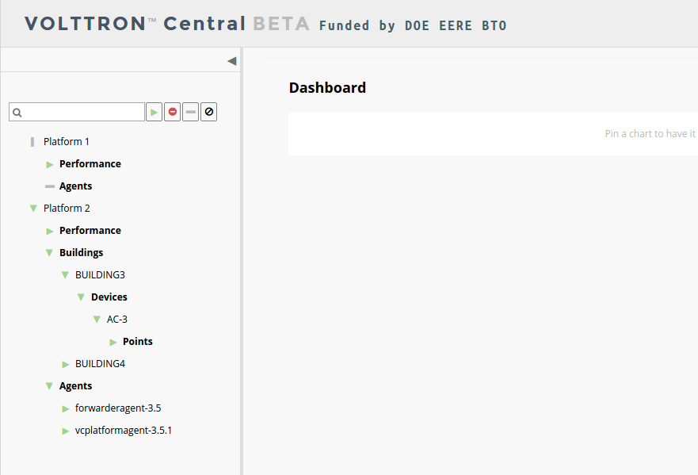
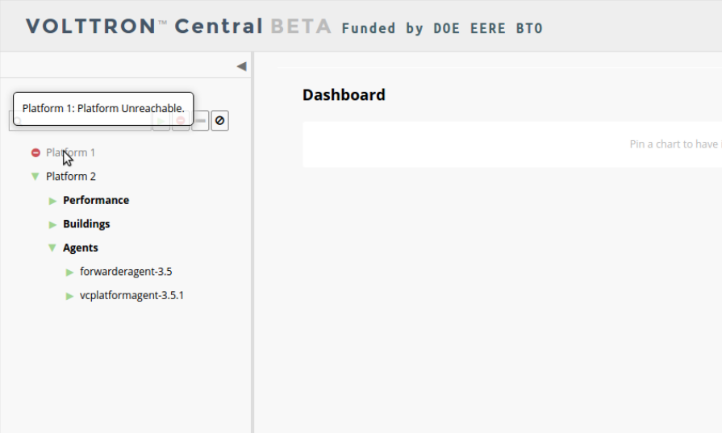
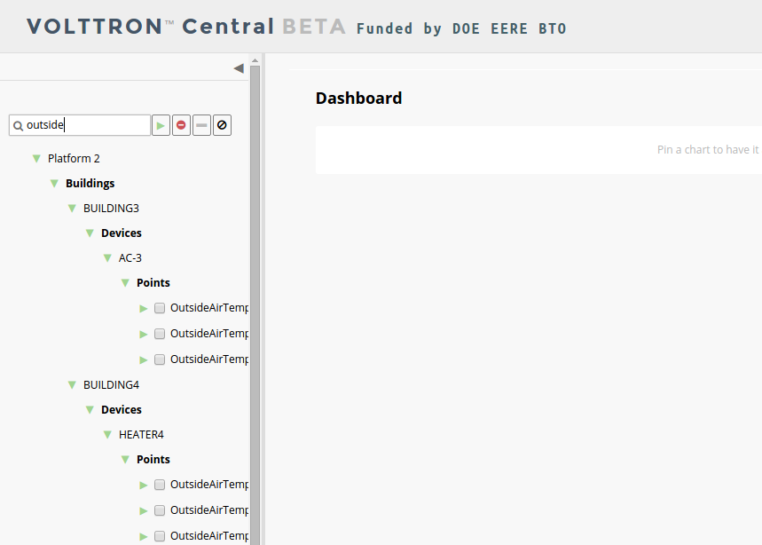
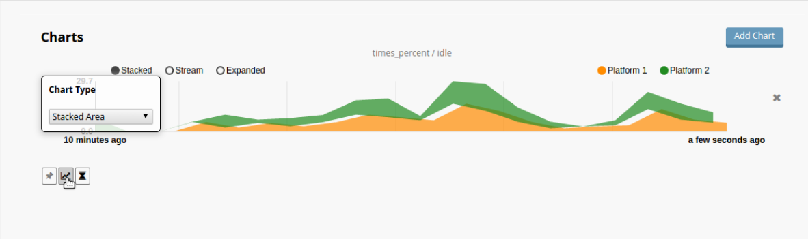

.. _VOLTTRON-Central-Demo:
VOLTTRON Central Demo
=====================

VOLTTRON Central is a platform management web application that allows
platforms to communicate and to be managed from a centralized server.
This agent alleviates the need to ssh into independent nodes in order 
to manage them. The demo will start up three different instances of 
VOLTTRON with three historians and different agents on each host. The 
following entries will help to navigate around the VOLTTRON Central 
interface.

-  `Running the Demo <#running-the-demo>`__
-  `Stopping the Demo <#stopping-the-demo>`__
-  `Log In <#log-in>`__
-  `Log Out <#log-out>`__
-  `Platforms Tree <#platforms-tree>`__
-  `Loading the Tree <#loading-the-tree>`__
-  `Health Status <#health-status>`__
-  `Filter the Tree <#filter-the-tree>`__
-  `Platforms Screen <#platforms-screen>`__
-  `Register New Platform <#register-new-platform>`__
-  `Deregister Platform <#deregister-platform>`__
-  `Platform View <#platform-view>`__
-  `Add Charts <#add-charts>`__
-  `Dashboard Charts <#dashboard-charts>`__
-  `Remove Charts <#remove-charts>`__

Running the Demo
~~~~~~~~~~~~~~~~

After :ref:`building VOLTTRON <Building-VOLTTRON>`, open a shell with the
current directory the root of the volttron repository. Activate the
shell

::

    . env/bin/activate

execute the script

::

    ./volttron/scripts/management-service-demo/run-demo

Upon completion a browser window (opened to http://localhost:8080/)
should be opened with a login prompt and the shell should look like the
following image.

|Run VC Demo|

#. Log in to the front page using credentials admin/admin.
#. From the console window copy the first platform address from the
   shell.
#. In the upper right of the browser window, click Platforms, then click
   Register Platform.
#. Type 'Platform 1' in the name parameter and paste the first platforms
   ipc address that you copied from step 2.

-  The Platform 1 should show up in the list of platforms on this page.

#. Repeat step 4 for the other two platforms.

Stopping the Demo
-----------------

Once you have completed your walk through of the different elements of
the VOLTTRON Central demo you can stop the demos by executing

::

    ./scripts/management-service-demo/stop-platforms.sh

Once the demo is complete you may wish to see the 
:ref:`VOLTTRON Central Management Agent <VOLTTRON-Central>` page for more 
details on how to configure the agent for your specific use case.

Log In
------

To log in to VOLTTRON Central, navigate in a browser to localhost:8080, 
and enter the username and password on the login screen.

|Login Screen|

Log Out
-------

To log out of VOLTTRON Central, click the link at the top right
of the screen.

|Logout Button|

Platforms Tree
~~~~~~~~~~~~~~

The side panel on the left of the screen can be extended to
reveal the tree view of registered platforms.

|Platforms Panel|

|Platforms Tree|

Top-level nodes in the tree are platforms. Platforms can be expanded
in the tree to reveal installed agents, devices on buildings, and 
performance statistics about the platform instances. 

Loading the Tree
----------------

The initial state of the tree is not loaded. The first time a top-level
node is expanded is when the items for that platform are loaded.

|Load Tree|

After a platform has been loaded in the tree, all the items under a node
can be quickly expanded by double-clicking on the node.

Health Status
-------------

The health status of an item in the tree is indicated by the color  
and shape next to it. A green triangle means healthy, a red circle
means there's a problem, and a gray rectangle means the status can't
be determined.

Information about the health status also may be found by hovering the
cursor over the item.

|Status Tooltips|

Filter the Tree
---------------

The tree can be filtered by typing in the search field at the top or 
clicking on a status button next to the search field.

|Filter Name|

|Filter Button|

Meta terms such as "status" can also be used as filter keys. Type the
keyword "status" followed by a colon, and then the word "good," "bad,"
or "unknown."

|Filter Status|

Platforms Screen
~~~~~~~~~~~~~~~~

This screen lists the registered VOLTTRON platforms and allows new
platforms to be registered by clicking the Register Platform button. 
Each platform is listed with its unique ID and the number and status
of its agents. The platform's name is a link that can be clicked on 
to go to the platform management view.

|Platforms|

Register New Platform
---------------------

To register a new VOLTTRON platform, click the Register Platform button.
You'll need to provide a name and the IP address of the platform. Click 
the Advanced link for additional configuration options.

|Register Platform Information|

Deregister Platform
-------------------

To deregister a VOLTTRON Platform, click on the X button for that platform 
in the list.

Platform View
~~~~~~~~~~~~~

From the platforms screen, click on the name link of a platform to
manage it. Managing a platform includes installing, starting, stopping, 
and removing its agents.

|Platform Screen|

To install a new agent, all you need is the agent’s wheel file. Click on
the button and choose the file to upload it and install the agent.

To start, stop, or remove an agent, click on the button next to the agent
in the list. Buttons may be disabled if the user lacks the correct 
permission to perform the action or if the action can't be performed 
on a specific type of agent. For instance, platform agents and VOLTTRON
Central agents can't be removed or stopped, but they can be restarted
if they've been interrupted.

Add Charts
~~~~~~~~~~

Performance statistics and device points can be added to charts either
from the Charts page or from the platforms tree in the side panel.

Click the Charts link at the top-right corner of the screen to go to 
the Charts page. 

|Charts Page|

From the Charts page, click the Add Chart button to open the Add Chart
window. 

|Charts Button|

|Charts Window|

Click in the topics input field to make the list of available chart 
topics appear.

|Chart Topics|

Scroll and select from the list, or type in the field to filter the
list, and then select.

|Filter Select|

Select a chart type and click the Load Chart button to close the 
window and load the chart.

|Load Chart|

To add charts from the side panel, check boxes next to items in the 
tree.

|Tree Charts|

Choose points with the same name from multiple platforms or devices 
to plot more than one line in a chart.

|Multiple Lines|

Move the cursor arrow over the chart to inspect the graphs.

|Inspect Chart|

To change the chart's type, click on the Chart Type button and choose 
a different option.

|Chart Type|

Dashboard Charts
----------------

To pin a chart to the Dashboard, click the Pin Chart button to toggle 
it. When the pin image is black and upright, the chart is pinned; when 
the pin image is gray and diagonal, the chart is not pinned and won't 
appear on the Dashboard.

|Pin Chart|

Charts that have been pinned to the Dashboard are saved to the database
and will automatically load when the user logs in to VOLTTRON Central.
Different users can save their own configurations of dashboard charts.

Remove Charts
-------------

To remove a chart, uncheck the box next to the item in the tree or click
the X button next to the chart on the Charts page. Removing a chart 
removes it from the Charts page and the Dashboard.

.. |Run VC Demo| image:: files/vc-run-demo.png

.. |Logout Button| image:: files/logout-button.png
.. |Platforms| image:: files/platforms.png
.. |Register Platform Information| image:: files/register-new-platform.png
.. |Platform Screen| image:: files/manage-platforms.png

.. |Platforms Panel| image:: files/side-panel-closed.png

.. |Load Tree| image:: files/load-tree-item.png
.. |Filter Button| image:: files/filter-button.png

.. |Filter Status| image:: files/filter-status.png
.. |Tree Charts| image:: files/add-charts.png
.. |Charts Page| image:: files/go-to-charts.png

.. |Charts Window| image:: files/charts-window.png

.. |Filter Select| image:: files/filter-and-select.png
.. |Load Chart| image:: files/load-chart.png
.. |Multiple Lines| image:: files/chart-multiple-lines.png

.. |Pin Chart| image:: files/pin-chart.png
.. |Inspect Chart| image:: files/inspect-charts.png
