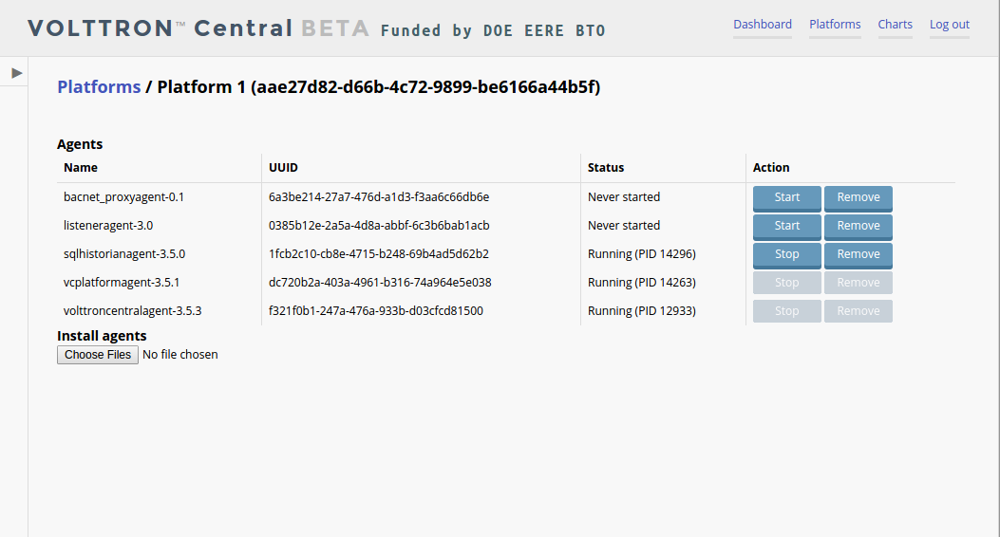
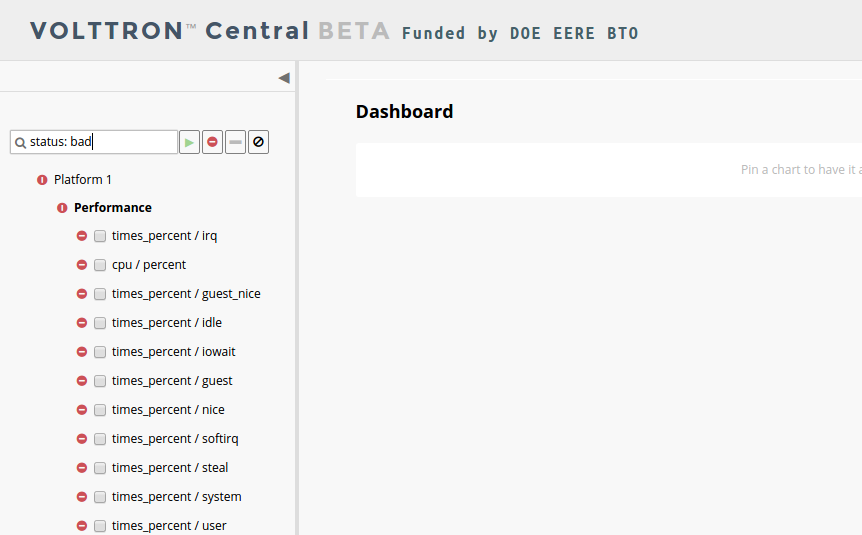

VOLTTRON Central is a platform management web application that allows
platforms to communicate and to be managed from a centralized server.
This agent alleviates the need to ssh into independent nodes in order to
manage them. The demo will start up 3 different instances of VOLTTRON
with 3 historians and different agents on each host. The following
entries will help to navigate around the VOLTTRON Central interface.

-  `Running the Demo <#running-the-demo>`__
-  `Stopping the Demo <#stopping-the-demo>`__
-  `The Login <#login>`__
-  `Logging Out <#logout>`__
-  `Platforms Screen <#platforms-screen>`__
-  `Register new Platform <#register-new-platform>`__
-  `Deregister Platform <#deregister-platform>`__
-  `Platform View <#platform-view>`__
-  `Start and Stop Agents <#start-and-stop-agents>`__
-  `Add Chart <#add-chart>`__
-  `Edit Chart <#edit-chart>`__

Running the Demo
----------------

After `building VOLTTRON <Building-VOLTTRON>`__, open a shell with the
current directory the root of the volttron repository. Activate the
shell

::

    . env/bin/activate

execute the script

::

    ./volttron/scripts/management-service-demo/run-demo

Upon completion a browser window (opened to http://localhost:8080/)
should be opened with a login prompt and the shell should look like the
following image.

|Run VC Demo|

#. Log into the front page using credentials admin/admin.
#. From the console window copy the first platform address from the
   shell.
#. In the upper right of the browser window, click Platforms, then click
   Register Platform.
#. Type 'Platform 1' in the name parameter and paste the first platforms
   ipc address that you copied from step 2.

-  The Platform 1 should show up in the list of platforms on this page.

#. Repeat step 4 for the other 2 platforms.

Stopping the Demo
~~~~~~~~~~~~~~~~~

Once you have completed your walk through of the different elements of
the VOLTTRON Central demo you can stop the demos by executing

::

    ./scripts/management-service-demo/stop-platforms.sh

Once the demo is complete you may wish to see the `VOLTTRON
Central <VOLTTRON-Central>`__ page for more details on how to configure
the agent for your specific use case.

Login
~~~~~

To log into the VOLTTRON Central web app, navigate in a browser to
localhost:8080, and enter the username and password on the login screen.
|Login Screen|

Logout
~~~~~~

To log out of VOLTTRON Central, click the link at the top right
of the screen.
|Logout Button|

Platforms Tree
----------------

The side panel on the left side of the screen can be extended to
reveal the tree view of registered platforms.

|Platforms Panel|

|Platforms Tree|

Top-level nodes in the tree are platforms. Platforms can be expanded
in the tree to reveal installed agents, devices on buildings, and 
performance statistics about the platform instances. 

Loading the Tree
----------------

The initial state of the tree is not loaded. The first time a top-level
node is expanded is when the items for that platform are loaded.

|Load Tree|

After a platform has been loaded in the tree, all the items under a node
can be quickly expanded by double-clicking on the node.

Health Status
----------------

The health status of items in the tree is indicated by the color and 
shape next to items. A green triangle means healthy, a red circle
means there's a problem, and a gray rectangle means the status can't
be determined.

Information about the health status also may be found by hovering the
cursor over the item.

|Status Tooltips|

Filtering the Tree
----------------

The tree can be filtered by typing in the search field at the top or 
clicking on a status button next to the search field.

|Filter Name|

|Filter Button|

|Filter Status|

Charts from Tree
----------------

Performance statistics and device points can be added to charts from
the tree by checking boxes next to the items.

|Add Charts|

Platforms Screen
----------------

This screen lists the registered VOLTTRON Platforms, and allows new
platforms to be registered by clicking the button in the top right
corner of the screen. This includes the Platform UID as well as the
number of agents running, stopped and installed on each platform.

|Platforms|

Register new Platform
~~~~~~~~~~~~~~~~~~~~~

To register a new VOLTTRON Platform, click the button in the corner of
the screen. You will need to provide a name and the IP address of the
VOLTTRON Platform.
|Register Platform Information|

Deregister Platform
~~~~~~~~~~~~~~~~~~~

To deregister a VOLTTRON Platform, click on the ‘X’ at the far right of
the platform display.

Platform View
-------------

Use the Platform View to manage a specific VOLTTRON Platform. This
includes installing agents, start/stop agents, and configuring charts.
|Platform Screen|

Install Agent
~~~~~~~~~~~~~

To install a new agent, all you need is the agent’s wheel file. Click on
the button To upload the wheel file used to install the agent.

Start and Stop Agents
~~~~~~~~~~~~~~~~~~~~~

To Start or Stop an Agent, click on the button as shown in the figure.
If the agent is running, its PID will be displayed.
|Start Agent Button|

Add Chart
~~~~~~~~~

To add a chart, click the Add Chart button. You will need to provide
the published topic the chart pulls data from. You may also select
refresh interval and chart type as well as pin the chart to the
dashboard.
|Add Chart Screen|

Edit Chart
~~~~~~~~~~

To edit a chart, click the edit chart button. You will get a popup
window of settings for the chart, as shown in the figure. To pin the
chart to the dashboard select the checkbox.
|Edit Chart Screen|

.. |Run VC Demo| image:: files/vc-run-demo.png
.. |Login Screen| image:: files/login-screen.png
.. |Logout Button| image:: files/logout-button.png
.. |Platforms| image:: files/platforms.png
.. |Register Platform Information| image:: files/register-new-platform.png

.. |Start Agent Button| image:: files/start-agent.png
.. |Add Chart Screen| image:: files/add-chart.png
.. |Edit Chart Screen| image:: files/edit-chart.png
.. |Platforms Tree| image:: files/side-panel-open.png
.. |Platforms Panel| image:: files/side-panel-closed.png
.. |Status Tooltips| image:: files/problems-found.png
.. |Load Tree| image:: files/load-tree-item.png
.. |Filter Button| image:: files/filter-button.png
.. |Filter Name| image:: files/filter-name.png

.. |Add Charts| image:: files/add-charts.png
