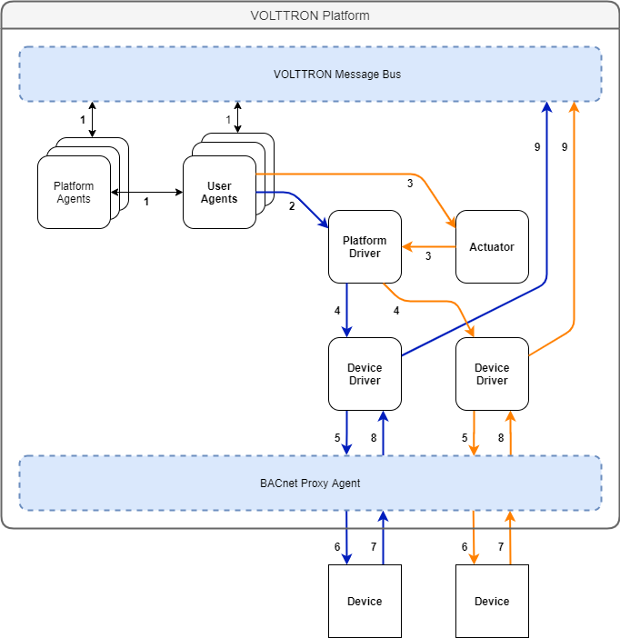

.. _Driver-Framework:

=========================
Driver Framework Overview
=========================

VOLTTRON drivers act as an interface between agents on the platform and a device.  While running on the platform,
drivers are special purpose agents which instead of being run as a separate process, are run as a greenlet in the
Platform Driver process.

Driver instances are created by the Platform Driver when a new driver configuration is added to the configuration store.
Drivers use the following topic pattern `devices/<campus>/<building>/<device id>`.  When a configuration file is added
to the Platform Driver's store using this pattern, the Platform Driver creates a Driver Agent.  The Driver agent is in turn
instantiated with an instance of the Interface class corresponding to the `driver_type` parameter in the configuration
file.  The Interface class is responsible for implementing the communication paradigms of a device or protocol.  Once
configured, the Platform Driver periodically polls the Driver Agent for data which is collected from the interface class.
Additionally, points can be requested ad-hoc via the Platform Driver's JSON-RPC method "get_point". Points may be set
by using JSON-RPC with the Actuator agent to set up a schedule and calling the "set_point" method.

Driver Conventions
******************

* Drivers are polled by the Platform Driver agent and values can be set using the `Actuator Agent`
* Drivers should have a 1-to-1 relationship with a device
* Driver modules should be written in Python files in the `services/core/PlatformDriverAgent/platform_driver/interfaces` directory in the VOLTTRON repository.  The platform driver will search for a Python file in this directory matching the name provided by the `driver_type` value from the driver configuration when creating the Driver agent.
* Driver code consists of an Interface class (exactly named), supported in most cases by one or more Register classes

.. _Driver_Communication:

Agent-Driver Communication Patterns
***********************************

The VOLTTRON message bus has been developed to allow agents on the platform to interact with each other, as well as with
ICS (Industrial Control Systems) and IOT (Internet of Things) devices via the VOLTTRON driver framework. Agents and
drivers have the ability to publish data to the message bus and to subscribe to message bus topics to read in data as it
is published. Additionally, agents may implement JSONRPC calls and expose JSONRPC endpoints to communicate more directly
with other agents. The following diagram demonstrates typical platform communication patterns for a single platform
deployment.

Typical Single Platform Behavior
================================

The diagram features several entities that comprise the platform and its connected components:

* The VOLTTRON message bus - The message bus is the means of transmission of information in VOLTTRON. The VOLTTRON
  message bus is built around existing message bus software; currently VOLTTRON supports RabbitMQ and ZeroMQ. The
  VOLTTRON integration includes Pub/Sub and JSON RPC interfaces for agent and driver communication.
* VOLTTRON Platform Agents and Subsystems - These agents and subsystems are installed on the platform to manage the
  platform. They provide many user facing functions, aid in communication, and manage other agents and drivers.
* User's Agents - These agents are either agents included in the core repository but installed by a user or user-built
  agent modules. They may perform a huge variety of user specified tasks, including data collection, device control,
  simulation, etc.
* Platform Driver Agent - This agent is installed by a user to facilitate communication with drivers. Drivers should not
  communicated with directly - the platform driver implements several features for communicating with drivers to ensure
  smooth operation and consistent driver behavior.
* Actuator agent - This agent is installed by a user to provide scheduling capability for controlling drivers. The
  Platform Driver does not include protections for race conditions, etc. It is always recommended to use the Actuator
  agent to set values on a device.
* Device Driver - Drivers are special purpose agents which provide an interface between the platform driver and devices
  such as Modbus and BACnet devices. Drivers implement a specific set of features for protecting device communication,
  ensuring uniform behaviors across different devices.
* Device - Devices may be low level physical computers for controlling various systems such as PLCs (Programmable Logic
  Controller), devices which communicate on the local network (such as a Smart T.V.), or devices which are accessed via
  a remote web API (other smart devices).

Lines of Communication
----------------------

Connectivity of the platform follows the following paradigm:

* Platform agents (including the Platform Driver and Actuator), subsystems, and user agents communicate with the message
  bus via a publish/subscribe system.
* Agents can communicate "directly" to each other via JSONRPC calls. JSONRPC calls use the VOLTTRON message bus router
  to "direct" messages to an intended recipient. RPC calls from an agent specify a function for the recipient to
  perform including input parameters; the response to the sender should contain the value output by the specified
  function.
* The Platform Driver will periodically poll device drivers. This functionality is intentionally not user-facing. The
  Platform Driver iterates over the configured drivers and calls their respective "scrape_all" methods. This will trigger
  the drivers to collect point values.
* The Driver will communicate with its configured end devices to collect data points which it then returns to the
  driver. The driver then publishes the point data to the bus under the `<campus>/<building>/<device id>/all` topic.
* To get an individual device point, the user agent should send an RPC call to the Platform Driver for "get_point",
  providing the point's corresponding topic. After the Platform Driver processes the request, communication happens very
  similarly to polling, but rather than an "all" publish, the data is returned via the Platform Driver to the user agent.
* To set a point on a device, it is recommended to use an Actuator Agent. The user agent sends an RPC request to the
  Actuator to schedule time for the agent to control the device. During that scheduled time the user agent may send it
  a set point request. If the schedule has been created, the actuator will then forward that request to the Platform
  Driver, at which point the communication happens similarly to a "get_point" request.

The general paradigm for the device-driver relationship as specified by the VOLTTRON driver framework is a 1-to-1
relationship. Each end device should be interacted with via a single device driver configured on one platform. To
distribute device data, the DataPuller and forwarder agents can be used at the platform level. Multiple platforms are
not intended to collect data or share control of a single device.

The below diagram demonstrates driver communication on the platform in a typical case.

.. image:: files/driver_flow.png

1. Platform agents and agents developed and/or installed by users communicate with the platform via pub/sub or JSON-RPC.
   Agents share data for a number of reasons including querying historians for data to use in control algorithms,
   fetching data from remote web APIs and monitoring.
2. A user agent which wants to request data ad-hoc sends a JSON-RPC request to the Platform Driver to `get_point`, asking
   the driver to fetch the most up-to-date point data for the point topic provided.

    .. note::

       For periodic `scrape_all` data publishes, step 2 is not required.  The Platform Driver is configured to
       automatically collect all point data for a device on a regular interval and publish the data to the bus.

3. A user agent sends a request to the actuator to establish a schedule for sending device control signals, and during
   the scheduled time sends a `set_point` request to the Actuator.  Given that the control signal arrives during the
   scheduled period, the Actuator forwards the request to the Platform Driver.  If the control signal arrives outside the
   scheduled period or without an existing schedule, a LockError exception will be thrown.
4. The Platform Driver issues a `get_point`/`set_point` call to the Driver corresponding to the request it was sent.
5. The device driver uses the interface class it is configured for to send a data request or control signal to the
   device (i.e. the BACnet driver issues a `readProperty` request to the device).
6. The device returns a response indicating the current state.
7. The the response is forwarded to the requesting device.  In the case of a `scrape_all`, the device data is published
   to the message bus.

Special Case Drivers
====================

Some drivers require a different communication paradigm. One common alternative is shown in the diagram below:

This example describes an alternative pattern wherein BACnet drivers communicate via a BACnet proxy agent to communicate
with end devices. This behavior is derived from the networking requirements of the BACnet specification. BACnet
communication in the network layer requires that only one path exist between BACnet devices on a network.
In this case, the BACnet proxy acts as a virtual BACnet device, and device drivers forward their requests to this agent
which then implements the BACnet communication (whereas the typical pattern would have devices communicate directly with
the corresponding device). There are many other situations which may require this paradigm to be adopted (such as
working with remote APIs with request limits), and it is up to the party implementing the driver to determine if this
pattern or another pattern may be the most appropriate implementation pattern for their respective use case.

.. note::

   Other requirements for driver communication patterns may exist, but on an individual basis.  Please refer to the
   documentation for the driver of interest for more about any atypical pattern that must be adhered to.

Installing the Fake Driver
**************************

The Fake Driver is included as a way to quickly see data published to the message bus in a format that mimics what a
real driver would produce.  This is a simple implementation of the VOLTTRON driver framework.

See :ref:`instructions for installing the fake driver <Fake-Driver-Install>`

To view data being published from the fake driver on the message bus, one can
:ref:`install the Listener Agent <Listener-Agent>` and read the VOLTTRON log file:

.. code-block:: bash

    cd <root volttron directory>
    tail -f volttron.log
