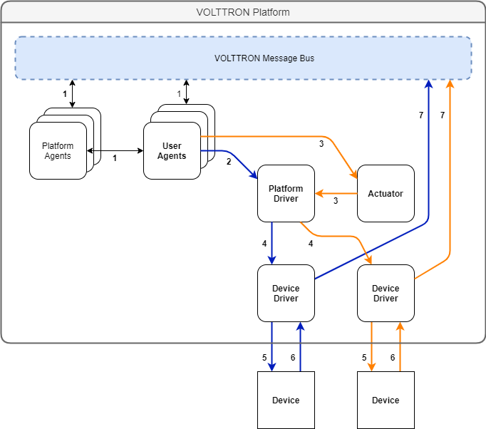

.. _Master-Driver:

=============
Master Driver
=============

The Master Driver agent is a special purpose agent a user can install on the platform to manage communication of
the platform with devices.  The Master driver features a number of endpoints for collecting data and sending control
signals using the message bus and automatically publishes data to the bus on a specified interval.

How does it work?
=================

The Master Driver creates a number of driver instances based on the contents of its config store; for each
combination of driver configuration, registry configuration and other referenced config files, a driver instance is
created by the Master Driver.  When configuration files are removed, the corresponding driver instance is removed by the
Master Driver.

Drivers are special-purpose agents for device communication, and unlike most agents, run
as separate threads under the Master Driver (typically agents are spawned as their own process).  While running, the
driver periodically "scrapes" device data and publishes the scrape to the message bus, as well as handling ad-hoc data
collection and control signalling commands issued from the Master Driver.  The actual commands are issued to devices by
the driver's "Interface" class.

An Interface class is a Python class which serves as the interface between the driver and the device.  The Interface
does this by implementing a set of well-defined actions using the communication paradigms and protocols used by the
device.  For devices such as BACnet and Modbus devices, interfaces wrap certain protocol functions in Python code to be
used by the driver.  In other cases, interfaces interact with web-API's, etc.

Device/Driver Communication
---------------------------

The below diagram demonstrates driver communication on the platform in a typical case.

Communication occurs using the following steps:

#. Platform agents and the user's agents communicate between themselves and the message bus using publish/subscribe or
   JSON-RPC
#. The user's agent sends a JSON-RPC request to the Platform Driver to `get_point`
#. And/Or the user's agent sends a JSON-RPC request to the Actuator to `set_point`
#. The Platform Driver forwards the request to the driver instance specified in the request
#. The device driver communicates with the end device
#. The end device returns a response to the driver indicating its current status
#. The driver publishes the device's response to the message bus using a publish

Installation
============

The Master Driver must first be :ref:`configured <Master-Driver-Configuration>`, similarly to other agents.

Then, the user must add driver configurations, registry configurations, and any other referenced configurations
to the config store if they do not already exist.

.. _Adding-Devices-To-Config-Store:

Adding Device Configurations to the Configuration Store
-------------------------------------------------------

Configurations are added to the Configuration Store using the command line:

.. code-block:: bash

    volttron-ctl config store platform.driver <name> <file name> <file type>

* **name** - The name used to refer to the file from the store.
* **file name** - A file containing the contents of the configuration.
* **file type** - ``--raw``, ``--json``, or ``--csv``. Indicates the type of the file. Defaults to ``--json``.

The main configuration must have the name ``config``

Device configuration but **not** registry configurations must have a name prefixed with ``devices/``.  Scripts that
automate the process will prefix registry configurations with ``registry_configs/``, but that is not a requirement for
registry files.

The name of the device's configuration in the store is used to create the topic used to reference the device. For
instance, a configuration named `devices/PNNL/ISB1/vav1` will publish scrape results to `devices/PNNL/ISB1/vav1` and
is accessible with the Actuator Agent via `PNNL/ISB1/vav1`.

The name of a registry configuration must match the name used to refer to it in the driver configuration.  The reference
is not case sensitive.

If the Master Driver Agent is running any changes to the configuration store will immediately affect the running devices
according to the changes.

Example
^^^^^^^

Consider the following three configuration files:  A master driver configuration called `master-driver.agent`, a
Modbus device configuration file called `modbus_driver.config` and corresponding Modbus registry configuration file called
`modbus_registry.csv`

To store the master driver configuration run the command:

.. code-block:: bash

    volttron-ctl config store platform.driver config master-driver.agent

To store the registry configuration run the command (note the ``--csv`` option):

.. code-block:: bash

    volttron-ctl config store platform.driver registry_configs/modbus_registry.csv modbus_registry.csv --csv

.. Note::

    The `registry_configs/modbus_registry.csv` argument in the above command must match the reference to the
    `registry_config` found in `modbus_driver.config`.

To store the driver configuration run the command:

.. code-block:: bash

    volttron-ctl config store platform.driver devices/my_campus/my_building/my_device modbus_config.config

Converting Old Style Configuration
^^^^^^^^^^^^^^^^^^^^^^^^^^^^^^^^^^

The new Master Driver no longer supports the old style of device configuration.  The old `device_list` setting is
ignored.

To simplify updating to the new format `scripts/update_master_driver_config.py` is provide to automatically update to
the new configuration format.

With the platform running run:

.. code-block:: bash

    python scripts/update_master_driver_config.py <old configuration> <output>

old_configuration`` is the main configuration file in the old format. The script automatically modifies the driver
files to create references to CSV files and adds the CSV files with the appropriate name.

`output` is the target output directory.

If the ``--keep-old`` switch is used the old configurations in the output directory (if any) will not be deleted before
new configurations are created.  Matching names will still be overwritten.

The output from `scripts/update_master_driver_config.py` can be automatically added to the configuration store
for the Master Driver agent with `scripts/install_master_driver_configs.py`.

Creating and naming configuration files in the form needed by `scripts/install_master_driver_configs.py` can speed up
the process of changing and updating a large number of configurations. See the ``--help`` message for
`scripts/install_master_driver_configs.py` for more details.

Usage
=====

After installing the Master Driver and loading driver configs into the config store, the installed drivers begin
polling and JSON-RPC endpoints become usable.

Polling
-------

Once running, the Master Driver will spawn drivers using the `driver_type` parameter of the
:ref:`driver configuration <Driver-Configuration-File>` and periodically poll devices for all point data specified in
the :ref:`registry configuration <Registry-Configuration-File>` (at the interval specified by the interval parameter
of the driver configuration).

Using the default configuration provided in the repository, device data collected during a "scrape all" is published
to the `depth_first_all` topic for the device.

.. code-block::

    "devices/campus/building/device/all"

For more information on device data topics, please view the :ref:`device state publish <Device-State-Publish>` docs.

JSON-RPC Endpoints
------------------

**get_point** - Returns the value of specified device set point

    Parameters
        - **path** - device topic string (typical format is devices/campus/building/device)
        - **point_name** - name of device point from registry configuration file

**set_point** - Set value on specified device set point. If global override is condition is set, raise OverrideError
  exception.

    Parameters
        - **path** - device topic string (typical format is devices/campus/building/device)
        - **point_name** - name of device point from registry configuration file
        - **value** - desired value to set for point on device

    .. warning::

        It is not recommended to call the `set_point` method directly.  It is recommended to instead use the
        :ref:`Actuator <Actuator-Agent>` agent to set points on a device, using its scheduling capability.

**scrape_all** - Returns values for all set points on the specified device.

    Parameters
        - **path** - device topic string (typical format is devices/campus/building/device)

**get_multiple_points** - return values corresponding to multiple points on the same device

    Parameters
        - **path** - device topic string (typical format is devices/campus/building/device)
        - **point_names** - iterable of device point names from registry configuration file

**set_multiple_points** - Set values on multiple set points at once.  If global override is condition is set, raise
  OverrideError exception.

    Parameters
        - **path** - device topic string (typical format is devices/campus/building/device)
        - **point_names_value** - list of tuples consisting of (point_name, value) pairs for setting a series of
          points

**heart_beat** - Send a heartbeat/keep-alive signal to all devices configured for Master Driver

**revert_point** - Revert the set point of a device to its default state/value.  If global override is condition is
  set, raise OverrideError exception.

    Parameters
        - **path** - device topic string (typical format is devices/campus/building/device)
        - **point_name** - name of device point from registry configuration file

**revert_device** - Revert all the set point values of the device to default state/values.  If global override is
  condition is set, raise OverrideError exception.

    Parameters
        - **path** - device topic string (typical format is devices/campus/building/device)

**set_override_on** - Turn on override condition on all the devices matching the specified pattern (
  :ref:`override docs <Master-Driver-Override>`)

    Parameters
        - **pattern** - Override pattern to be applied. For example,
            - If pattern is `campus/building1/*` - Override condition is applied for all the devices under
              `campus/building1/`.
            - If pattern is `campus/building1/ahu1` - Override condition is applied for only `campus/building1/ahu1`
              The pattern matching is based on bash style filename matching semantics.
        - **duration** - Duration in seconds for the override condition to be set on the device (default 0.0,
          duration <= 0.0 imply indefinite duration)
        - **failsafe_revert** - Flag to indicate if all the devices falling under the override condition must to be
          set
          to its default state/value immediately.
        - **staggered_revert** -

**set_override_off** - Turn off override condition on all the devices matching the pattern.

    Parameters
        - **pattern** - device topic pattern for devices on which the override condition should be removed.

**get_override_devices** - Get a list of all the devices with override condition.

**clear_overrides** - Turn off override condition for all points on all devices.

**get_override_patterns** - Get a list of all override condition patterns currently set.
