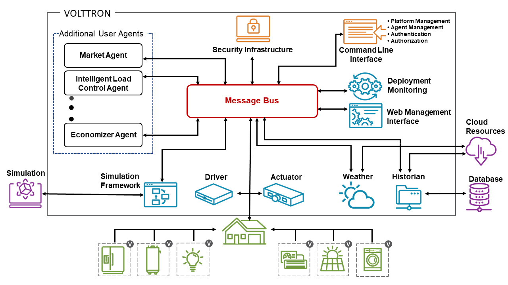

.. VOLTTRON documentation root file

==========================
|VOLTTRON|  documentation!
==========================

|VOLTTRON Tagline|

|VOLTTRON| is an open source, scalable, and distributed platform that seamlessly integrates data, devices, and
systems for sensing and control applications.  It is built on extensible frameworks allowing contributors to easily
expand the capabilities of the platform to meet their use cases.  Features are implemented as loosely coupled software
components, called agents, enabling flexible deployment options and easy customization.

Key Use-Cases
=============

- Developing scalable, reusable applications to deploy in the field without spending development resources on
  operational components not specific to the application
- Low-cost data collection deployable on commodity hardware
- Integration hub for connecting a diverse set of devices together in a common interface
- Testbed for developing applications for a simulated environment

Features
========

- A :ref:`message bus <Message-Bus>` allowing connectivity between agents on individual platforms and
  between platform instances in large scale deployments
- Integrated security features enabling the management of secure communication between agents and platform instances
- A flexible :ref:`agent framework <Agent-Framework>` allowing users to adapt the platform to their unique use-cases
- A configurable :ref:`driver framework <Driver-Framework>` for collecting data from and sending control
  signals to buildings and devices
- automatic data capture and retrieval through our :ref:`historian framework <Historian-Framework>`
- An extensible :ref:`web framework <Web-Framework>` allowing users and services to securely connect to the platform
  from anywhere
- Capability to interface with simulation engines and applications to evaluate applications prior to deployment

VOLTTRON™ is publicly available from `GitHub <https://github.com/volttron/volttron.git>`_. The project
is supported by the U.S. Department of Energy and receives ongoing updates from a team of core developers at PNNL.  The
VOLTTRON team encourages and appreciates community involvement including issues and pull requests on Github, meetings
at our bi-weekly office-hours and on Slack. To be invited to office-hours or slack, please `send the team an email
<volttron@pnnl.gov>`_.

.. toctree::
   :caption: Introduction
   :hidden:
   :titlesonly:
   :maxdepth: 1

   introduction/platform-install
   introduction/definitions
   introduction/license

.. toctree::
   :caption: Developing in VOLTTRON
   :hidden:
   :titlesonly:
   :maxdepth: 1

   developing-volttron/community
   developing-volttron/development-environment/index
   developing-volttron/developing-agents/agent-development
   developing-volttron/developing-drivers/driver-development
   developing-volttron/contributing-code
   developing-volttron/contributing-documentation
   developing-volttron/jupyter/jupyter-notebooks
   developing-volttron/python-for-matlab-users

.. toctree::
   :caption: Deploying VOLTTRON
   :hidden:
   :titlesonly:
   :maxdepth: 1

   deploying-volttron/bootstrap-process
   deploying-volttron/platform-configuration
   deploying-volttron/deployment-planning-options
   deploying-volttron/single-machine
   deploying-volttron/multi-platform/index
   deploying-volttron/secure-deployment-considerations
   deploying-volttron/linux-system-hardening
   deploying-volttron/recipe-deployment

.. toctree::
   :caption: Agent Framework
   :hidden:
   :titlesonly:
   :maxdepth: 1

   agent-framework/agents-overview
   agent-framework/core-service-agents/index
   agent-framework/operations-agents/index
   agent-framework/historian-agents/historian-framework
   agent-framework/web-framework
   agent-framework/integrating-simulations/index
   agent-framework/platform-service-standardization
   agent-framework/third-party-agents

.. toctree::
   :caption: Driver Framework
   :hidden:
   :titlesonly:
   :maxdepth: 1

   driver-framework/drivers-overview
   driver-framework/platform-driver/platform-driver
   driver-framework/actuator/actuator-agent
   driver-framework/fake-driver/fake-driver
   driver-framework/bacnet/bacnet-driver
   driver-framework/chargepoint/chargepoint-driver
   driver-framework/dnp3-driver/dnp3-driver
   driver-framework/ecobee/ecobee-web-driver
   driver-framework/ieee-2030_5/ieee-2030_5-driver
   driver-framework/modbus/modbus-driver
   driver-framework/modbus/modbus-tk-driver
   driver-framework/obix/obix
   driver-framework/ted-driver/the-energy-detective-driver

.. toctree::
   :caption: Platform Features
   :hidden:
   :titlesonly:
   :maxdepth: 1

   platform-features/message-bus/index
   platform-features/control/index
   platform-features/config-store/configuration-store
   platform-features/security/volttron-security

.. toctree::
   :caption: VOLTTRON Core Service Agents
   :hidden:
   :titlesonly:
   :maxdepth: 2
   :glob:

   volttron-api/services/*/modules

.. toctree::
   :caption: VOLTTRON Core Operations Agents
   :hidden:
   :titlesonly:
   :maxdepth: 2
   :glob:

   volttron-api/ops/*/modules

.. toctree::
   :caption: VOLTTRON Topics
   :hidden:
   :titlesonly:
   :maxdepth: 1

   volttron-topics/VOLTTRON-releases/index
   volttron-topics/troubleshooting/index
   volttron-topics/volttron-applications/index

Indices and tables
==================

* :ref:`genindex`
* :ref:`modindex`

.. |VOLTTRON| unicode:: VOLTTRON U+2122
.. |VOLTTRON Tagline| image:: files/VOLLTRON_Logo_Black_Horizontal_with_Tagline.png
