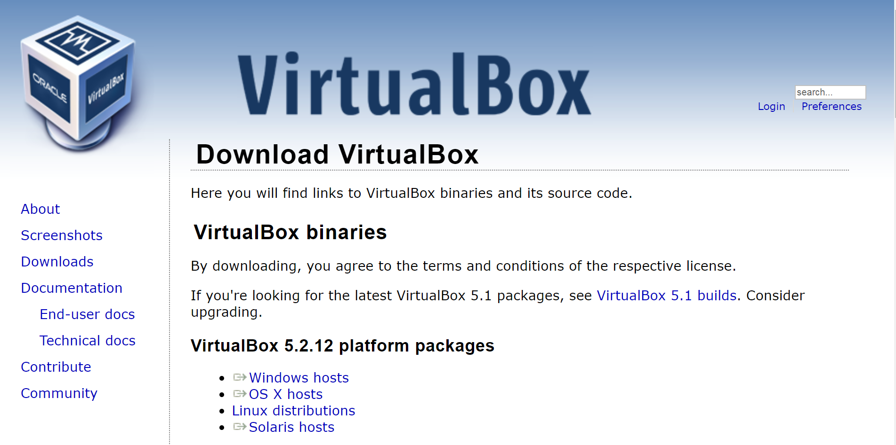
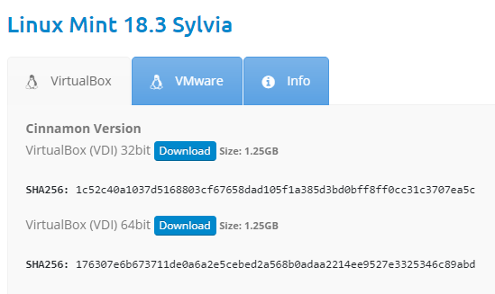
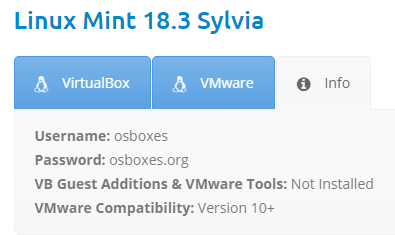
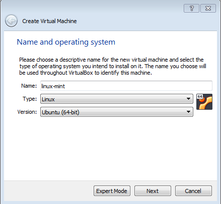
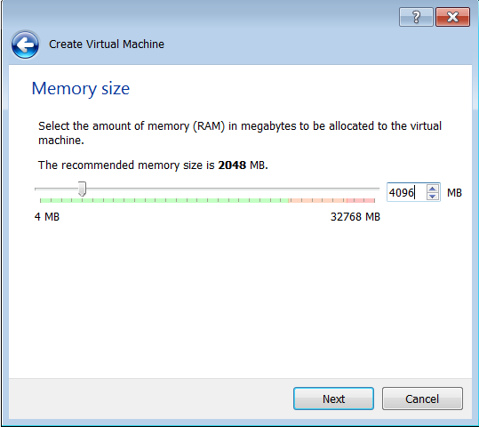
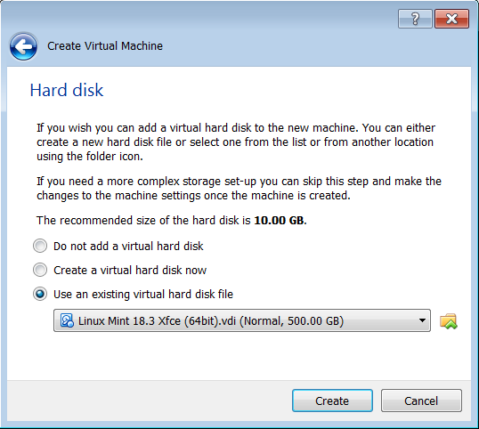
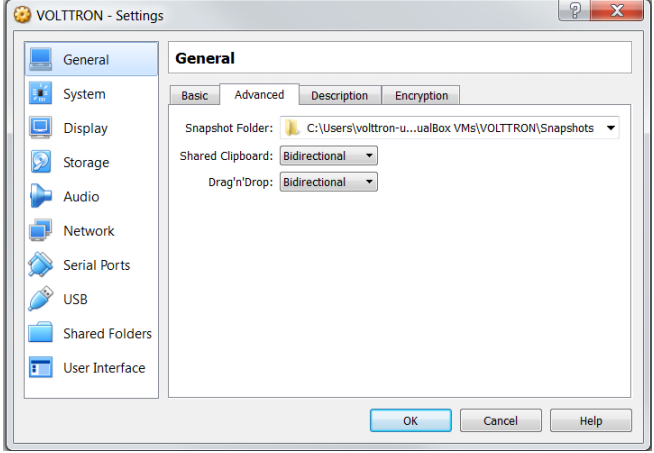
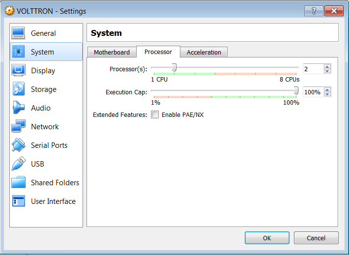
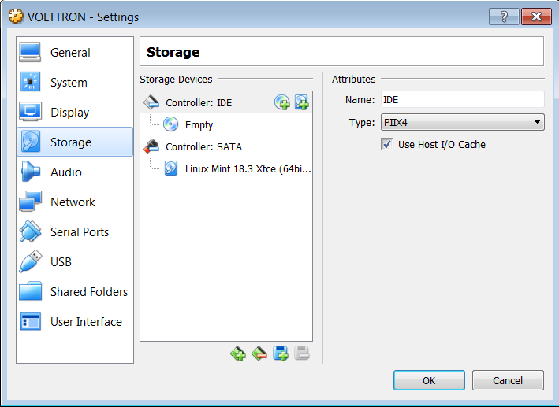

.. _install:

===================
Installing Volttron
===================

Installing Linux Virtual Machine
--------------------------------
Volttron requires a Linux system to run. For most this will require virtual machine (VM). This section will describe the
steps necessary to install VOLTTRON using Oracle VirtualBox software. Virtual Box is free and can be
downloaded from https://www.virtualbox.org/wiki/Downloads.

|VirtualBox Download|

After installing VirtualBox, it will also be necessary to download a Linux operating system image for use on the VM.
Ubuntu 14.04 LTS or Linux Mint 17 or later is the recommended Linux operating system for use with VOLTTRON, however any
distribution will work. Linux Mint 18.3 with the Xfce desktop is used as an example, however platform setup in Ubuntu
should be identical. A 32-bit version of Linux should be used when running VOLTTRON on a system with limited hardware
(less than 2 GB of RAM). Go to https://www.osboxes.org/linux-mint/ to download one of the versions of Linux Mint and
extract VDI from downloaded archive.

Note: this is a prepackaged version with many of the VM settings already defined. To get the base version of Linux Mint
go to https://linuxmint.com/.

|Linux Mint|

The below info holds the VM's preset username and password.

|Linux Mint Credentials|

Create a new VirtualBox Image.

|VirtualBox VM Naming|

Select the amount of RAM for the VM. The recommended minimum is shown in the image below:

|VirtualBox Memory Size Selection|

Specify the hard drive image using the extracted VDI file.

|VirtualBox Hard Disk|

With the newly created VM selected, choose Machine from the VirtualBox menu in the top left corner of the VirtualBox
window; from the drop down menu, choose Settings.

To enable bidirectional copy and paste, select the General tab in the VirtualBox Settings. Enable Shared Clipboard and
Drag’n’Drop as Bidirectional.

|VirtualBox Bidirectional|

Go to System Settings. In the processor tab, set the number of processors to two.

|VirtualBox Processors|

Go to Storage Settings. Confirm that the Linux Mint VDI is attached to Controller: SATA.
Do **not** install the Linux Mint iso for Controller: IDE. Will result in errors.

|VirtualBox Controller|

Start the machine by saving these changes and clicking the “Start” arrow located on the upper left hand corner of the
main VirtualBox window.

Installing Required Dependencies
--------------------------------

VOLTTRON requires the following dependencies in order to bootstrap the
development environment.

* Essential build tools (gcc, make, autodev-tools, etc.)
* Python development files (headers)
* Openssl.
* Git (Optional)

On **Debian-based systems**, these can all be installed with the following
command:

.. code-block:: bash

   sudo apt-get update
   sudo apt-get install build-essential python-dev openssl libssl-dev libevent-dev git

On **Redhat or CENTOS systems**, these can all be installed with the following
command:

.. code-block:: bash

   sudo yum update
   sudo yum install make automake gcc gcc-c++ kernel-devel python-devel openssl openssl-devel libevent-devel git

On **Arch Linux**, the following command will install the dependencies:

.. code-block:: bash

    sudo pacman -S base-devel python2 openssl libssl-dev libsodium

Source Code
-----------

To work with the latest stable code clone the master branch using the following
git command.

.. code-block:: bash

    git clone https://github.com/VOLTTRON/volttron/

You may use the following command to work with the latest code from the develop
branch. It must be run within the VOLLTRON source directory. More discussion on the 
repository structure can be found at :ref:`Repository Structure <Repository-Structure>`.

.. code-block:: bash

    git checkout develop

Bootstrap
---------

To create a development environment, execute the following in the project root
directory.

.. code-block:: bash

    python2.7 bootstrap.py

Activate
--------

Activating the shell sets the correct environment for executing a volttron
instance.  From the project root directory execute the following.

.. code-block:: bash

    source env/bin/activate

.. note::

  An 'activated' command prompt is like the following

  .. code-block:: bash

    (volttron)user@machine $

Testing
-------

VOLTTRON uses py.test as a framework for executing tests.  py.test is not installed
with the distribution by default.  To install py.test and it's dependencies
execute the following:

.. code-block:: bash

    python bootstrap.py --testing

.. note::

  There are other options for different agent requirements.  To see all of the options use:

  .. code-block:: bash

    python bootstrap.py --help

  in the Extra Package Options section.

To run all of the tests in the volttron repository execute the following in the
root directory using an activated command prompt:

.. code-block:: bash

    ./ci-integration/run-tests.sh

Execution
---------

To start a default instance of volttron from an activated command prompt
execute the following.

.. code-block:: bash

    volttron -vv

Or to start volttron in the background with logging to a file called
volttron.log execute the following.

.. code-block:: bash

    volttron -vv -l volttron.log&

Acquiring Third Party Agent Code
--------------------------------

Third party agents developed from a variety of sources are available from the volttron-applications repository (https://github.com/VOLTTRON/volttron-applications.git).  The current best practice is to have the main volttron and the volttron-applications repository within the same common ansestry folder.

.. code-block:: bash

  volttron-repositories/
  |
  |--- volttron/
  |
  |--- volttron-applications/

One can clone the latest applications from the repository via the following command:

.. code-block:: bash

  git clone https://github.com/VOLTTRON/volttron-applications.git

Additional Considerations
-------------------------

If you are planning to install VOLTTRON at scale or to collect data you want to keep, please see the
:ref:`Installation Planning <planning-install>` page.
