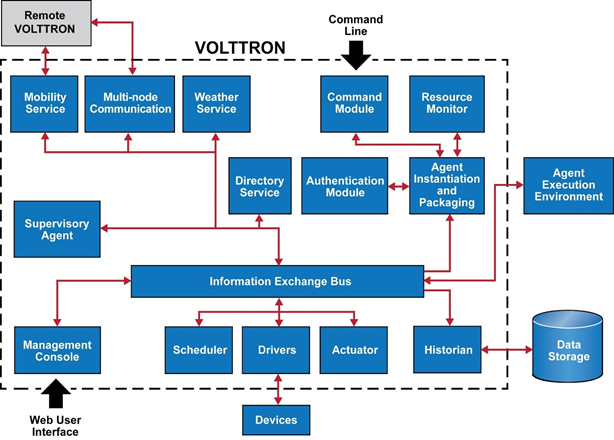

.. _components:

==========
Components
==========

An overview of the VOLTTRON platform components is illustrated in the figure below. The platform
comprises several components
and agents that provide services to other agents. Of these components, the Information Exchange Bus (IEB),
or :ref:`Message Bus <messagebus>` is central to the
platform. All other VOLTTRON components communicate through it using the publish/subscribe paradigm over a variety of
topics.

:ref:`Drivers <VOLTTRON-Driver-Framework>` communicate with devices allowing their data to be published on the IEB.
Agents can control devices by interacting with the :ref:`Actuator Agent <ActuatorAgent>` to schedule and send commands.
The :ref:`Historian <Historian Index>` framework takes data published on the messages bus and stores it to a database,
file, or sends it to another location.

The agent lifecycle is controlled by the Agent Instantiation and Packaging (AIP) component which launches agents in an
Agent Execution Environment. This isolates agents from the platform while allowing them to interact with the IEB.

|Overview of the VOLTTRON platform|

