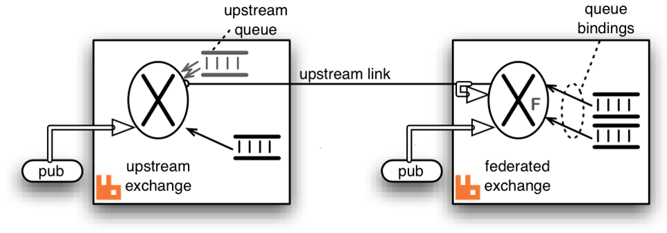

.. _Multi-Platform-RabbitMQ:

============================
Distributed RabbitMQ Brokers
============================

RabbitMQ allows multiple distributed RabbitMQ brokers to be connected in three different ways - with clustering, with
federation and using shovel.  We take advantage of these built-in plugins for multi-platform VOLTTRON communication. For
more information about the differences between clustering, federation, and shovel, please refer to the RabbitMQ
documentation on `Distributed RabbitMQ brokers <https://www.rabbitmq.com/distributed.html>`_.

Clustering
----------

Clustering connects multiple brokers residing in multiple machines to form a single logical broker.  It is used in
applications where tight coupling is necessary i.e, where each node shares the data and knows the state of all other
nodes in the cluster.  A new node can connect to the cluster through a peer discovery mechanism if configured to do so
in the RabbitMQ config file.  For all the nodes to be connected together in a cluster, it is necessary for them to share
the same Erlang cookie and be reachable through it's DNS hostname.  A client can connect to any one of the nodes in the
cluster and perform any operation (to send/receive messages from other nodes etc.), the nodes will route the operation
internally.  In case of a node failure, clients should be able to reconnect to a different node, recover their topology
and continue operation.

.. note::

    This feature is not integrated into VOLTTRON, but we hope to support it in the future.  For more detailed
    information about clustering, please refer to RabbitMQ documentation on the
    `Clustering plugin <https://www.rabbitmq.com/clustering.html>`_.

.. _RabbitMQ-Federation:

Federation
----------
Federation plugin is used in applications that does not require as much of tight coupling as clustering.  Federation has
several useful features:

* Loose coupling - The federation plugin can transmit messages between brokers (or clusters) in different administrative
  domains:

  * they may have different users and virtual hosts;
  * they may run on different versions of RabbitMQ and Erlang.

* WAN friendliness - They can tolerate network intermittent connectivity.

* Specificity - Not everything needs to be federated ( made available to other brokers ); There can be local-only
  components.

* Scalability - Federation does not require O(n2) connections for *n* brokers, so it scales better.

The federation plugin allows you to make exchanges and queues *federated*.  A federated exchange or queue can receive
messages from one or more upstreams (remote exchanges and queues on other brokers).  A federated exchange can route
messages published upstream to a local queue.  A federated queue lets a local consumer receive messages from an upstream
queue.

Before we move forward, let's define upstream and downstream servers.

* Upstream server - The node that is publishing some message of interest
* Downstream server - The node connected to a different broker that wants to receive messages from the upstream server

A federation link needs to be established from downstream server to the upstream server.  The data flows in single
direction from upstream server to downstream server. For bi-directional data flow, we would need to create federation
links on both the nodes.

We can receive messages from upstream server to downstream server by either making an exchange or a queue *federated*.

For more detailed information about federation, please refer to RabbitMQ documentation
`Federation plugin <https://www.rabbitmq.com/federation.html>`_.

Federated Exchange
------------------

When we make an exchange on the downstream server *federated*, the messages published to the upstream exchanges are
copied to the federated exchange, as though they were published directly to it.

The above figure explains message transfer using federated exchange.  The box on the right acts as the downstream server
and the box on the left acts as the upstream server.  A federation/upstream link is established between the downstream
server and the upstream server by using the federation management plugin.

An exchange on the downstream server is made  *federated* using federation policy configuration.  The federated exchange
only receives the messages for which it has  subscribed.  An upstream queue is created on the upstream server with a
binding key same as subscription made on the  federated exchange.  For example, if an upstream server is publishing
messages with binding key "foo" and a client on  the downstream server is interested in receiving messages of the
binding key "foo", then it creates a queue and binds the queue to the federated with the same binding key. This binding
is sent to the upstream and the upstream queue binds to the upstream exchange with that key.

Publications to either exchange may be received by queues bound to the federated exchange, but publications
directly to the federated exchange cannot be received by queues bound to the upstream exchange.

For more information about federated exchanges and different federation topologies, please read about
`Federated Exchanges <https://www.rabbitmq.com/federated-exchanges.html>`_.

Federated Queue
---------------

Federated queue provides a way of balancing load of a single queue across nodes or clusters.  A federated queue lets a
local consumer receive messages from an upstream queue.  A typical use would be to have the same "logical" queue
distributed over many brokers.  Such a logical distributed queue is capable of having higher capacity than a single
queue.  A federated queue links to other upstream queues.

A federation or upstream link needs to be created like before and a federated queue needs to be setup on the downstream
server using federation policy configuration.  The federated queue will only retrieve messages when it has run out of
messages locally, it has consumers that need messages, and the upstream queue has "spare" messages that are not being
consumed.

For more information about federated queues, please read about
`Federated Queues <https://www.rabbitmq.com/federated-queues.html>`_.

.. _RabbitMQ-Shovel:

Shovel
------
The Shovel plugin allows you to reliably and continually move messages from a source in one
broker to destination in another broker.  A shovel behaves like a well-written client application in that it:

* connects to it's source and destination broker
* consumes messages from the source queue
* re-publishes messages to the destination if the messages match the routing key.

The Shovel plugin uses an Erlang client under the hood.  In the case of shovel, apart from configuring the hostname,
port and virtual host of the remote node, we will also have to provide a list of routing keys that we want to forward to
the remote node.  The primary advantages of shovels are:

* Loose coupling - A shovel can move messages between brokers (or clusters) in different administrative domains:
  * they may have different users and virtual hosts;
  * they may run on different versions of RabbitMQ and Erlang.
* WAN friendliness - They can tolerate network intermittent connectivity.

Shovels are also useful in cases where one of the nodes is behind NAT.  We can setup shovel on the node behind NAT to
forward messages to the node outside NAT.  Shovels do not allow you to adapt to subscriptions like a federation link and
we need to a create a new shovel per subscription.

For more detailed information about shovel, please refer to RabbitMQ documentation on the
`Shovel plugin <https://www.rabbitmq.com/shovel.html>`_.

.. toctree::

   agent-communication-rabbitmq
