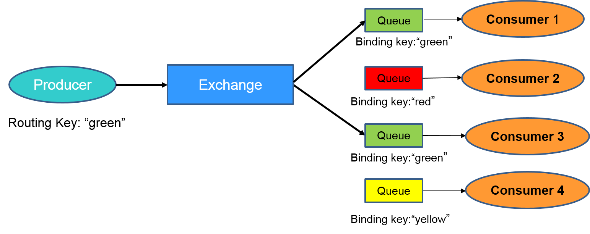

 .. _RabbitMQ-Overview:

=================
RabbitMQ Overview
=================

.. NOTE::

    Some of the RabbitMQ summary/overview documentation and supporting images added here are taken from the
    `RabbitMQ official documentation <https://www.rabbitmq.com/documentation.html>`_.

RabbitMQ is the most popular messaging library with over 35,000 production deployments.  It is highly scalable, easy to
deploy, runs on many operating systems and cloud environments.  It supports many kinds of distributed deployment
methodologies such as clusters, federation and shovels.

RabbitMQ uses `Advanced Message Queueing Protocol` (AMQP) and works on the basic producer consumer model.  A consumer is
a program that consumes/receives messages and producer is a program that sends the messages.  Following are some
important definitions that we need to know before we proceed.

* Queue - Queues can be considered like a post box that stores messages until consumed by the consumer.  Each consumer
  must create a queue to receives messages that it is interested in receiving.  We can set properties to the queue
  during it's declaration.  The queue properties are:

  * Name - Name of the queue
  * Durable - Flag to indicate if the queue should survive broker restart.
  * Exclusive - Used only for one connection and it will be removed when connection is closed.
  * Auto-queue - Flag to indicate if auto-delete is needed.  The queue is deleted when last consumer un-subscribes from
    it.
  * Arguments - Optional, can be used to set message TTL (Time To Live), queue limit etc.

* Bindings - Consumers bind the queue to an exchange with binding keys or routing patterns.  Producers send messages and
  associate them with a routing key.  Messages are routed to one or many queues based on a pattern matching between a
  message routing key and binding key.

* Exchanges - Exchanges are entities that are responsible for routing messages to the queues based on the routing
  pattern/binding key used.  They look at the routing key in the message when deciding how to route messages to queues.
  There are different types of exchanges and one must choose the type of exchange depending on the application design
  requirements

    #. Fanout - It blindly broadcasts the message it receives to all the queues it knows.

    #. Direct - Here, the message is routed to a queue if the routing key of the message exactly matches the binding key
       of the queue.

    #. Topic - Here, the message is routed to a queue based on pattern matching of the routing key with the binding key.
       The binding key and the routing key pattern must be a list of words delimited by dots, for example,
       "car.subaru.outback" or "car.subaru.*", "car.#".  A message sent with a particular routing key will be delivered
       to all the queues that are bound with a matching binding key with some special rules as

        '*' (star) - can match exactly one word in that position.
        '#' (hash) - can match zero or more words

    #. Headers - If we need more complex matching then we can add a header to the message with all the attributes set to
       the values that need to be matched.  The message is considered matching if the values of the attributes in the
       header is equal to that of the binding. The Header exchange ignores the routing key.

  We can set some properties of the exchange during it's declaration.

  * Name - Name of the exchange
  * Durable - Flag to indicate if the exchange should survive broker restart.
  * Auto-delete - Flag indicates if auto-delete is needed. If set to true, the exchange is deleted when the last queue
    is unbound from it.
  * Arguments - Optional, used by plugins and broker-specific features

Lets use an example to understand how they all fit together. Consider an example where there are four consumers
(Consumer 1 - 4) interested in receiving messages matching the pattern "green", "red" or "yellow".  In this example, we
are using a direct exchange that will route the messages to the queues only when there is an exact match of the routing
key of the message with the binding key of the queues.  Each of the consumers declare a queue and bind the queue to the
exchange with a binding key of interest. Lastly, we have a producer that is continuously sending messages to exchange
with routing key "green". The exchange will check for an exact match and route the messages to only Consumer 1 and
Consumer 3.

For more information about queues, bindings, exchanges, please refer to the
`RabbitMQ tutorial <https://www.rabbitmq.com/getstarted.html>`_.

Authentication in RabbitMQ
==========================

By default RabbitMQ supports SASL PLAIN authentication with username and password.  RabbitMQ supports other SASL
authentication mechanisms using plugins.  In VOLTTRON we use one such external plugin based on x509 certificates
(`<https://github.com/rabbitmq/rabbitmq-auth-mechanism-ssl>`_).  This authentication is based on a technique called
public key cryptography which consists of a key pair - a public key and a private key.  Data that has been encrypted
with a public key can only be decrypted with the corresponding private key and vice versa.  The owner of key pair makes
the public key available and keeps the private confidential.  To send a secure data to a receiver, a sender encrypts the
data with the receiver's public key.  Since only the receiver has access to his own private key only the receiver can
decrypted. This ensures that others, even if they can get access to the encrypted data, cannot decrypt it.  This is how
public key cryptography achieves confidentiality.

A digital certificate is a digital file that is used to prove ownership of a public key.  Certificates act like
identification cards for the owner/entity.  Certificates are therefore crucial to determine that a sender is using the
right public key to encrypt the data in the first place.  Digital Certificates are issued by Certification
Authorities(CA).  Certification Authorities fulfill the role of the `Trusted Third Party` by accepting Certificate
applications from entities, authenticating applications, issuing Certificates and maintaining status information about
the Certificates issued.  Each CA has its own public private key pair and its public key certificate is called a root CA
certificate.  The CA attests to the identity of a Certificate applicant when it signs the Digital Certificate using its
private key.

In x509 based authentication, a signed certificate is presented instead of username/password for authentication and if
the server recognizes the the signer of the certificate as a trusted CA, accepts and allows the connection.  Each
server/system can maintain its own list of trusted CAs (i.e. list of public certificates of CAs).  Certificates signed
by any of the trusted CA would be considered trusted.  Certificates can also be signed by intermediate CAs that are in
turn signed by a trusted.

This section only provides a brief overview about the SSL based authentication.  Please refer to the vast material
available online for detailed description.  Some useful links to start:

 * `<https://en.wikipedia.org/wiki/Public-key_cryptography>`_
 * `<https://robertheaton.com/2014/03/27/how-does-https-actually-work/>`_

Management Plugin
=================

The RabbitMQ-management plugin provides an HTTP-based API for management and monitoring of RabbitMQ nodes and clusters,
along with a browser-based UI and a command line tool, *rabbitmqadmin*. The management interface allows you to:

* Create, Monitor the status and delete resources such as virtual hosts, users, exchanges, queues etc.
* Monitor queue length, message rates and connection information and more
* Manage users and add permissions (read, write and configure) to use the resources
* Manage policies and runtime parameters
* Send and receive messages (for trouble shooting)

For more detailed information about the management plugin, please refer to RabbitMQ documentation on the
`Management Plugin <https://www.rabbitmq.com/management.html>`_.

Deployments
===========

The :ref:`platform installation <Platform-Installation>` docs describe performing first time setup for single machine
RabbitMQ deployments.

See the :ref:`multi-platform RabbitMQ <RabbitMQ-Multi-platform-SSL>` docs for setting up shovel or federation in
multi-platform RabbitMQ deployments.
