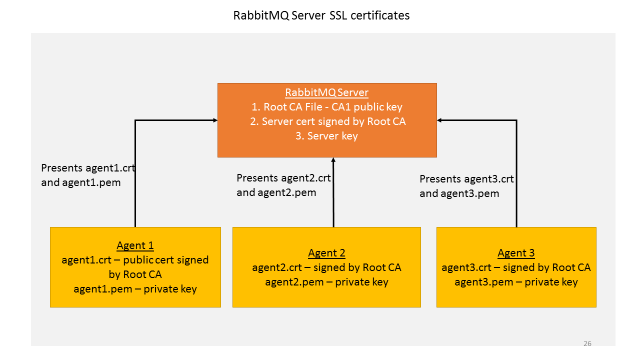

.. _RabbitMQ-Auth:

==========================================================
Authentication And Authorization With RabbitMQ Message Bus
==========================================================

Authentication In RabbitMQ VOLTTRON
***********************************

RabbitMQ VOLTTRON uses SSL based authentication, rather than the default username and password authentication.  VOLTTRON
adds SSL based configuration entries into the `rabbitmq.conf` file during the setup process.  The necessary SSL
configurations can be seen by running the following command:

.. code-block:: bash

    cat ~/rabbitmq_server/rabbitmq_server-3.7.7/etc/rabbitmq/rabbitmq.conf

The configurations required to enable SSL:

.. code-block:: shell

    listeners.ssl.default = 5671
    ssl_options.cacertfile = VOLTTRON_HOME/certificates/certs/volttron1-trusted-cas.crt
    ssl_options.certfile = VOLTTRON_HOME/certificates/certs/volttron1-server.crt
    ssl_options.keyfile = VOLTTRON_HOME/certificates/private/volttron1-server.pem
    ssl_options.verify = verify_peer
    ssl_options.fail_if_no_peer_cert = true

**Parameter explanations**

- listeners.ssl.default: port for listening for SSL connections  
- ssl_options.cacertfile: path to trusted Certificate Authorities (CA)  
- ssl_options.certfile: path to server public certificate  
- ssl_options.keyfile: path to server's private key
- ssl_options.verify: whether verification is enabled
- ssl_options.fail_if_no_peer_cert: upon client's failure to provide certificate, SSL connection either rejected (true)
  or accepted (false)
- auth_mechanisms.1: type of authentication mechanism. EXTERNAL means SSL authentication is used

SSL in RabbitMQ VOLTTRON
------------------------

To configure RabbitMQ-VOLTTRON to use SSL based authentication, we need to add SSL configuration in rabbitmq_config.yml.

.. code-block:: yaml

    # mandatory. fully qualified domain name for the system
    host: mymachine.pnl.gov

    # mandatory. certificate data used to create root ca certificate. Each volttron
    # instance must have unique common-name for root ca certificate
    certificate-data:
      country: 'US'
      state: 'Washington'
      location: 'Richland'
      organization: 'PNNL'
      organization-unit: 'VOLTTRON Team'
      # volttron1 has to be replaced with actual instance name of the VOLTTRON instance
      common-name: 'volttron1_root_ca'

    virtual-host: 'volttron' # defaults to volttron

    # use the below four port variables if using custom rabbitmq ports
    # defaults to 5672
    amqp-port: '5672'

    # defaults to 5671
    amqp-port-ssl: '5671'

    # defaults to 15672
    mgmt-port: '15672'

    # defaults to 15671
    mgmt-port-ssl: '15671'

    # defaults to true
    ssl: 'true'

    # defaults to ~/rabbitmq_server/rabbbitmq_server-3.7.7
    rmq-home: "~/rabbitmq_server/rabbitmq_server-3.7.7"

The parameters of interest for SSL based configuration are

- certificate-data: subject information needed to create certificates
- ssl: Flag set to 'true' for SSL based authentication
- amqp-port-ssl: Port number for SSL connection (defaults to 5671)
- mgmt-port-ssl: Port number for HTTPS management connection (defaults to 15671)

We can then configure the VOLTTRON instance to use SSL based authentication with the below command:

    vcfg rabbitmq single [--config optional path to rabbitmq_config.yml]

When one creates a single instance of RabbitMQ, the following is created / re-created in the VOLTTRON_HOME/certificates
directory:

- Public and private certificates of root Certificate Authority (CA)
- Public and private (automatically signed by the CA) server certificates needed by RabbitMQ broker
- Admin certificate for the RabbitMQ instance
- Public and private (automatically signed by the CA) certificates for VOLTTRON platform service agents.
- Trusted CA certificate

The public files can be found at ``VOLTTRON_HOME/certificates/certs`` and the private files can be found
at ``VOLTTRON_HOME/certificates/private``.  The `trusted-cas.crt` file is used to store
the root CAs of all VOLTTRON instances that the RabbitMQ server has to connected to.  The trusted CA is only created
once, but can be updated.  Initially, the trusted CA is a copy of the the root CA file,
but when an external VOLTTRON instance needs to be connected to an instance, the external VOLTTRON instance's root CA
will be appended to this file in order for the RabbitMQ broker to trust the new connection.

Every RabbitMQ has a single self signed root ca and server certificate signed by the root CA. This is created during
VOLTTRON setup and the RabbitMQ server is configured and started with these two certificates.  Every time an agent is
started, the platform automatically creates a pair of public-private certificates for that agent that is signed by the
same root CA. When an agent communicates with the RabbitMQ message bus it presents it's public certificate and private
key to the server and the server validates if it is signed by a root CA it trusts – ie., the root certificate it was
started with. Since there is only a single root CA for one VOLTTRON instance, all the agents in this instance can
communicate with the message bus over SSL.

For information about using SSL with multi-platform RabbitMQ deployments, view the
:ref:`docs <RabbitMQ-Multi-platform-SSL>`

Authorization in RabbitMQ VOLTTRON
==================================

To be implemented in VOLTTRON at a later date.

For more detailed information about access control, please refer to RabbitMQ documentation
`Access Control <https://www.rabbitmq.com/access-control.html>`_.
