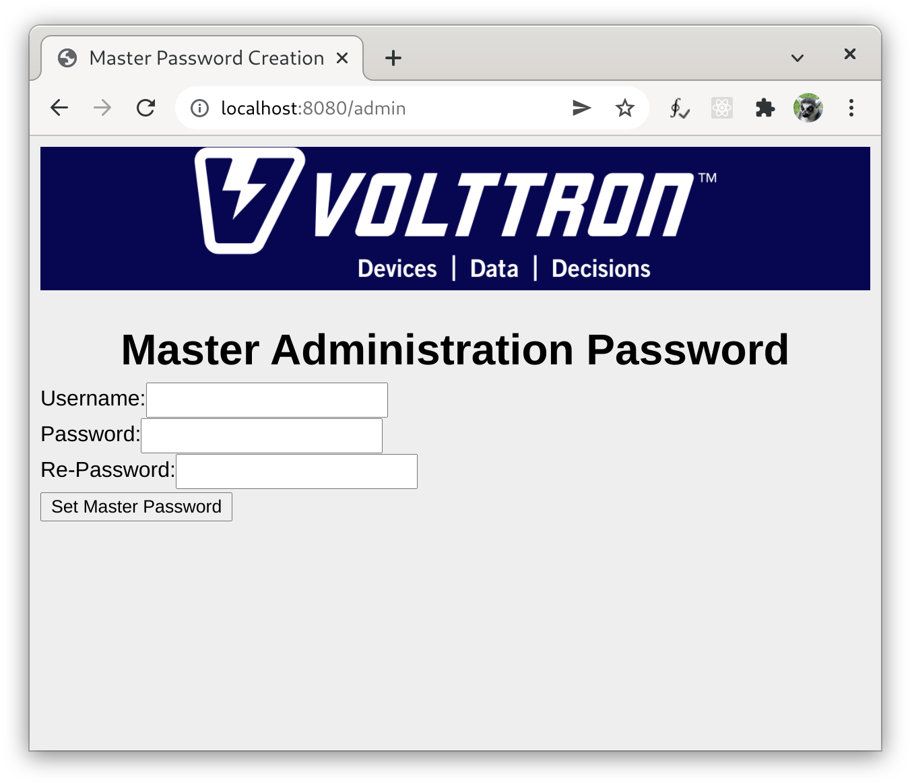

.. _Web-API:

======================================
VOLTTRON User Interface API
======================================

The VOLTTRON User Interface API (VUI) is provided by the VOLTTRON Web Service, and is
intended to provide capabilities for building fully featured frontend applications.
The VUI is a RESTful HTTP API for communicating with components of the VOLTTRON system.

Installation
------------
The VUI is a built-in part of the VOLTTRON Web Service. To enable to VOLTTRON Web Service,
bootstrap VOLTTRON within the virtual environment using the `--web` option:

.. code-block:: bash

    python boostrap.py --web

Additionally, to enable the web service, it is necessary to add a `bind-web-address` key to the $VOLTTRON_HOME/config
file. The value of this key represents address bound to by the  platform web service for handling HTTP(s) requests.
Typical addresses would be ``https://<hostname>:8443`` or  ``http://<hostname>:8080``. HTTPS is recommended, though
if https is used, it will also be necessary to include `web-ssl-cert` and `web-ssl-key` entries:

.. code-block:: ini

    [volttron]
    message-bus = zmq
    instance-name = my_instance
    vip-address = tcp://127.0.0.1:22916
    bind-web-address = https://<hostname>:8443
    web-ssl-cert = /home/volttron/.volttron/certificates/certs/platform_web-server.crt
    web-ssl-key = /home/volttron/.volttron/certificates/private/platform_web-server.pem

The ``vctl`` tool may be used to make the changes to the $VOLTTRON_HOME/config file by choosing "Y" for the "Is this
instance web enabled?" prompt. To use HTTPS, enter "https" when asked "What is the protocol for this instance?".
The ``vctl`` tool will then give the option to generate the required SSL cert and key if these do not already exist.

.. code-block:: console

    (volttron) [volttron@my_instance volttron]$ vcfg

    Your VOLTTRON_HOME currently set to: /home/volttron/.volttron

    Is this the volttron you are attempting to setup? [Y]: y
    What type of message bus (rmq/zmq)? [zmq]:
    What is the vip address? [tcp://127.0.0.1]:
    What is the port for the vip address? [22916]:
    What is the name of this instance? [my_instance]:
    Is this instance web enabled? [N]: y
    What is the protocol for this instance? [http]: https
    Web address set to: https://127.0.0.1
    What is the port for this instance? [8080]: 8443
    Would you like to generate a new web certificate? [Y]: y
    WARNING! CA certificate does not exist.
    Create new root CA? [Y]: y

    Please enter the following details for web server certificate:
	    Country: [US]:
	    State: WA
	    Location: MyTown
	    Organization: My Organization
	    Organization Unit:
    Created CA cert
    Creating new web server certificate.
    Is this an instance of volttron central? [N]: n
    Will this instance be controlled by volttron central? [Y]: n
    Would you like to install a platform historian? [N]: n
    Would you like to install a platform driver? [N]: n
    Would you like to install a listener agent? [N]:
    Finished configuration!

    You can now start the volttron instance.

    If you need to change the instance configuration you can edit
    the config file is at /home/volttron/.volttron/config

Finally, a user must be configured in the $VOLTTRON_HOME/web-users.json file to allow authentication to the API.
This file can be generated, if it does not exist, by navigating to `bind-web-address`/admin in a web browser and
creating a user and password:

Once the web-users.json file exists, add a group called "vui" to the list of groups for any user which should
have access to the API:

.. code-block:: json

    {
    "my_user":{
        "hashed_password":"$argon2id$v=19$m=102400,t=2,p=8$tbb2PgdA6B3jnPOeUwrB+A$yGA2xYOXld+COq4opWbs3Q",
        "groups":["admin", "vui"]
        }
    }

Users with the "vui" claim in `groups` will now be able to use the API by sending requests
to endpoints with paths on `bind-web-address` beginning with `/vui`:

::

    GET https://localhost:8443/vui/

Path Structure
---------------

Paths to endpoints consist of alternating constant and variable segments, and are designed
to be readable and discoverable:

.. image:: files/path_structure.png

Get requests to non-leaf nodes typically return a `route-options` JSON object which gives additional possible paths
within the API. For instance, a GET request send to the path `/vui` will return:

.. code-block:: json

    {
    "route_options": {
        "platforms": "/vui/platforms"
        }
    }

Available Endpoints
-------------------

Endpoints which are currently provided by the API are described in detail in the
following sections:

- `Authentication <authentication-endpoints.html>`_: Endpoints for authenticating to the the API.
- `Platforms <platform-endpoints.html>`_: Endpoints for working with a particular platform.
    - `Agents <platforms/agent-endpoints.html>`_: Endpoints for working with agents on the platform.
        - `Enabled <platforms/agents/enabled-endpoints.html>`_: Endpoints for enabling, disabling, and setting the
          start priority of agents on the platform.
        - `RPC <platforms/agents/rpc-endpoints.html>`_: Endpoints allowing, discovery, inspection, and calling of
          remote procedure calls to agents running on the platform.
        - `Running <platforms/agents/running-endpoints.html>`_: Endpoints for starting and stopping agents on the
          platform.
        - `Status <platforms/agents/status-endpoints.html>`_: Endpoints for determining or clearing the status
          information for agents running on the platform.
        - `Tag <platforms/agents/tag-endpoints.html>`_: Endpoints for getting, setting, and deleting the tag of agents.
    - `Devices <platforms/device-endpoints.html>`_: Endpoints for getting, setting, and resetting devices on the
      platform.
    - `Historians <platforms/historian-endpoints.html>`_: Endpoints for querying data from historians on the platform.
    - `Pubsub <platforms/pubsub-endpoints.html>`_: Endpoints for subscribing and publishing to the message bus on the
      platform.
    - `Status <platforms/status-endpoints.html>`_: Endpoints for determining the status of all agents on the platform.
