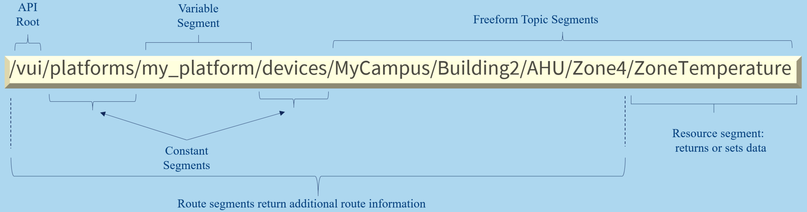

======================================
VOLTTRON User Interface API
======================================

The VOLTTRON User Interface API (VUI) is provided by the VOLTTRON Web Service, and is
intended to provide capabilities for building fully featured frontend applications.
The VUI is a RESTful HTTP API for communicating with components of the VOLTTRON system.

Path Structure
---------------
Paths to endpoints consist of alternating constant and variable segments, and are designed
to be readable and discoverable:

Available Endpoints
-------------------
Endpoints which are currently provided by the API are describe in detail in the
following sections:

- :ref:`Authentication <Authentication Endpoints>`
- :ref:`Platforms <Platform Endpoints>`
    - :ref:`Agents <Agent Endpoints>`
        - :ref:`RPC <RPC Endpoints>`
    - :ref:`Devices <Device Endpoints>`
    - :ref:`Historians <Historian Endpoints`
    - :ref:`Pubsub <PubSub Endpoints`
