.. _Multi_Platform_Walkthrough:

Multi-Platform Multi-Bus Walk-through
=====================================

This guide describes the setup process for a multi-platform connection that has a combination of ZeroMQ and RabbitMQ
instances. For this example, we want to use the Forwarder to pass device data from two VOLTTRON instance to
a single "central" instance for storage. It will also have a Volttron Central agent running on the "central"
instance and Volttron Central Platform agents on all 3 instances and connected to "central" instance to provide
operational status of it's instance to the "central" instance. For this document "node" will be used interchangeably
with VOLTTRON instance.

Node Setup
----------

For this example we will have two types of nodes; a data collector and a central node.  Each of the data
collectors will have different message buses (VOLTTRON supports both RabbitMQ and ZeroMQ). The nodes will
be configured as in the following table.

.. csv-table:: Node Configuration
   :header: "", "Central", "Node-ZMQ", "Node-RMQ"
   :widths: 20, 15, 10, 10

   "Node Type", "Central", "Data Collector", "Data Collector"
   "Master Driver", "", "yes", "yes"
   "Forwarder", "", "yes", "yes"
   "SQL Historian", "yes", "", ""
   "Volttron Central", "yes", "", ""
   "Volttron Central Platform", "yes", "yes", "yes"
   "Exposes RMQ Port", "yes", "", ""
   "Exposes ZMQ Port", "yes", "", ""
   "Exposes HTTPS Port", "yes", "", ""

The goal of this is to be able to see the data from Node-ZMQ and Node-RMQ in the Central SQL Historian and on
the trending charts of Volttron Central.

Virtual Machine Setup
---------------------

The first step in creating a VOLTTRON instance is to make sure the machine is ready for VOLTTRON.  Each machine
should have its hostname setup.  For this walkthrough, the hostnames "central", "node-zmq" and "node-rmq" will be used.

For Central and Node-RMQ follow the instructions :ref:`Building-VOLTTRON#steps-for-rabbitmq`.  For Node-ZMQ use
:ref:`Building-VOLTTRON#steps-for-zmq`.

Instance Setup
--------------

The following conventions/assumptions are made for the rest of this document:

  - Commands should be run from the VOLTTRON root
  - Default values are used for VOLTTRON_HOME($HOME/.volttron), vip port (22916), HTTPS port (8443), rabbitmq ports( 5671 for AMQPs and 15671 for RabbitMQ management interface). If using different VOLTTRON_HOME or ports, please replace accordingly.
  - Replace central, node-zmq and node-rmq with your own hostnames.

The following will use vcfg (volttron-cfg) to configure the individual platforms.

Central Instance Setup
----------------------

.. note::

  This instance must have been bootstrapped using --rabbitmq see :ref:`Building-VOLTTRON#steps-for-rabbitmq`.

Next step would be to configure the instance to have a web interface to accept/deny incoming certificate signing
requests from other instances. Additionally, we will need to install a Volttron Central agent, Volttron Central
Platform agent, SQL historian agent and a Listener agent. The following shows an example command output for this setup.

.. code-block:: console

    (volttron)d3x140@central:~/volttron$ vcfg

    Your VOLTTRON_HOME currently set to: /home/d3x140/.volttron

    Is this the volttron you are attempting to setup? [Y]:
    What type of message bus (rmq/zmq)? [zmq]: rmq
    Name of this volttron instance: [volttron1]: central
    RabbitMQ server home: [/home/d3x140/rabbitmq_server/rabbitmq_server-3.7.7]:
    Fully qualified domain name of the system: [central]:
    Would you like to create a new self signed root CAcertificate for this instance: [Y]:

    Please enter the following details for root CA certificate
      Country: [US]:
      State: WA
      Location: Richland
      Organization: PNNL
      Organization Unit: volttron
    Do you want to use default values for RabbitMQ home, ports, and virtual host: [Y]:
    2019-06-20 16:28:11,341 volttron.utils.rmq_mgmt DEBUG: Creating new VIRTUAL HOST: volttron
    2019-06-20 16:28:11,422 volttron.utils.rmq_mgmt DEBUG: Create READ, WRITE and CONFIGURE permissions for the user: central- admin
    Create new exchange: volttron, {'durable': True, 'type': 'topic', 'arguments': {'alternate-exchange': 'undeliverable'}}
    Create new exchange: undeliverable, {'durable': True, 'type': 'fanout'}
    Created CA cert

    The rmq message bus has a backward compatibility
    layer with current zmq instances. What is the
    zmq bus's vip address? [tcp://127.0.0.1]: tcp://172.20.214.72
    What is the port for the vip address? [22916]:
    Is this instance web enabled? [N]: y
    Web address set to: https://central
    What is the port for this instance? [8443]:
    Is this an instance of volttron central? [N]: y
    Configuring /home/d3x140/volttron/services/core/VolttronCentral.
    Enter volttron central admin user name: admin
    Enter volttron central admin password:
    Retype password:
    Installing volttron central.
    Should the agent autostart? [N]: y
    Will this instance be controlled by volttron central? [Y]:
    Configuring /home/d3x140/volttron/services/core/VolttronCentralPlatform.
    What is the name of this instance? [central]:
    What is the hostname for volttron central? [https://central]:
    What is the port for volttron central? [8443]:
    Should the agent autostart? [N]:
    Would you like to install a platform historian? [N]: y
    Configuring /home/d3x140/volttron/services/core/SQLHistorian.
    Should the agent autostart? [N]: y
    Would you like to install a master driver? [N]:
    Would you like to install a listener agent? [N]: y
    Configuring examples/ListenerAgent.
    Should the agent autostart? [N]: y
    Finished configuration!

    You can now start the volttron instance.

    If you need to change the instance configuration you can edit
    the config file is at /home/d3x140/.volttron/config

Start VOLTTRON instance and check if the agents are installed.

.. code-block:: console

  ./start-volttron
  vctl status

Open browser and go to master admin authentication page `https://central:8443/index.html` to accept/reject incoming certificate signing request (CSR) from other platforms. 

.. note::

  Replace "central" with the proper hostname of VC instance in the admin page URL. If opening the admin page from a
  different system, then please make that the hostname is resolvable in that machine.

Click on "Login To Admistration Area".

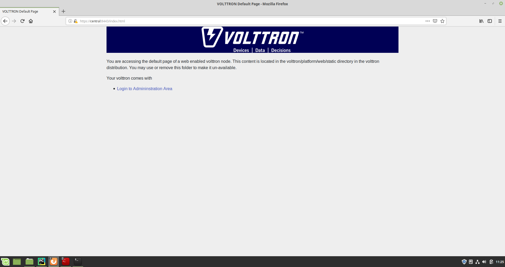

Set the master admin username and password. This can be later used to login into master admin authentication page.

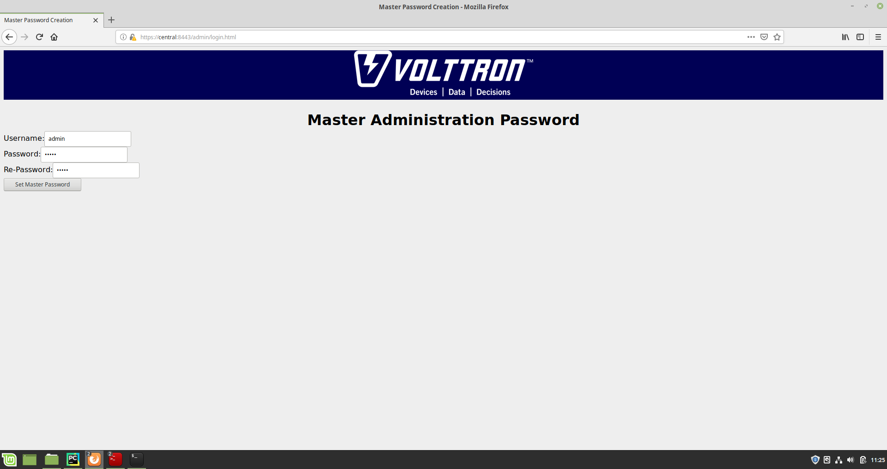

Login into the Master Admin page.

.. image:: images/csr-login-page.png

After logging in, you will see no CSR requests initially.

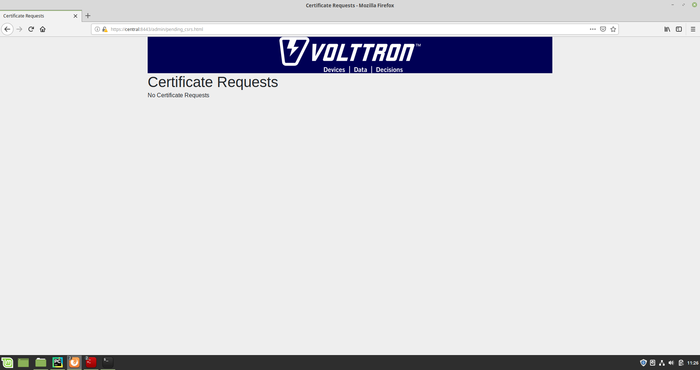

Go back to the terminal and start Volttron Central Platform agent on the "central" instance. The agent will send a CSR
request to the web interface.

.. code-block:: console

  vctl start --tag vcp

Now go to master admin page to check if there is a new pending CSR request. You will see a "PENDING" request from
"central.central.platform.agent"

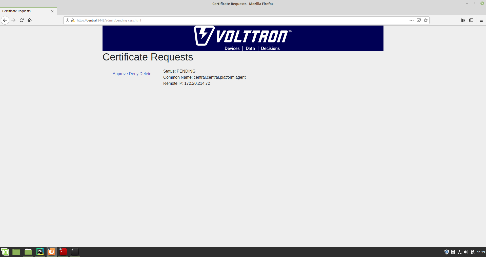

Approve the CSR request to allow authenticated SSL based connection to the "central" instance.

.. image::images/csr-approve.png

Go back to the terminal and check the status of Volttron Central Platform agent. It should be set to "GOOD".

Node-ZMQ Instance Setup
-----------------------
On the "node-zmq" VM, setup a ZeroMQ based VOLTTRON instance. Using "vcfg" command, install Volttron Central Platform agent,
a master driver agent with a fake driver.

.. note::

  This instance will use old ZeroMQ based authentication mechanism using CURVE keys.

.. code:: console

   (volttron)d3x140@node-zmq:~/volttron$ vcfg

   Your VOLTTRON_HOME currently set to: /home/d3x140/.volttron

   Is this the volttron you are attempting to setup? [Y]:
   Message bus set to zmq
   What is the vip address? [tcp://127.0.0.1]:
   What is the port for the vip address? [22916]:
   Is this instance web enabled? [N]:
   Will this instance be controlled by volttron central? [Y]:
   Configuring /home/d3x140/volttron/services/core/VolttronCentralPlatform.
   What is the name of this instance? [volttron1]: collector1
   What is the hostname for volttron central? [http://node-zmq]: https://central
   What is the port for volttron central? [8080]:
   Should the agent autostart? [N]:
   Would you like to install a platform historian? [N]:
   Would you like to install a master driver? [N]: y
   Configuring /home/d3x140/volttron/services/core/MasterDriverAgent.
   Would you like to install a fake device on the master driver? [N]: y
   Should the agent autostart? [N]: y
   Would you like to install a listener agent? [N]:
   Finished configuration!

   You can now start the volttron instance.

   If you need to change the instance configuration you can edit
   the config file is at /home/d3x140/.volttron/config

Please note the Volttron Central web-address should point to that of the "central" instance.

Start VOLTTRON instance and check if the agents are installed.

.. code-block:: console

  ./start-volttron
  vctl status

Start Volttron Central Platform on this platform manually.

.. code-block:: console

  vctl start --tag vcp

Check the VOLTTRON log in the "central" instance, you will see "authentication failure" entry from the incoming
connection. You will need to add the public key of VCP agent on the "central" instance.

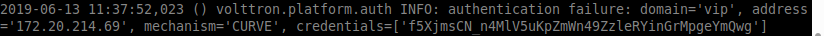

On the "node-zmq" box execute this command and grab the public key of the VCP agent.

.. code-block:: console

  vctl auth publickey

Add auth entry corresponding to VCP agent on "central" instance using the below command. Replace the user id value and credentials value appropriately before running

.. code-block:: console

  vctl auth add --user_id <any unique user id. for example zmq_node_vcp> --credentials <public key of vcp on zmq node>

Complete similar steps to start a forwarder agent that connects to "central" instance. Modify the configuration in
`services/core/ForwardHistorian/rmq_config.yml` to have a destination VIP address pointing to VIP address of the
"central" instance and server key of the "central" instance.

.. code-block:: yaml

  ---
  destination-vip: tcp://<ip>:22916
  destination-serverkey: <serverkey>

.. note::

  Replace <ip> with public facing IP-address of "central" instance and <serverkey> with serverkey of "central"
  instance.
  Use the command **vctl auth serverkey** on the "central" instance to get the server key of the instance

Install and start forwarder agent.

.. code-block:: console

  python scripts/install-agent.py -s services/core/ForwardHistorian -c services/core/ForwardHistorian/rmq_config.yml --start

Grab the public key of the forwarder agent.

.. code-block:: console

  vctl auth publickey

Add auth entry corresponding to VCP agent on **central** instance.

.. code-block:: console

  vctl auth add --user_id <any unique user id. for example zmq_node_forwarder> --credentials <public key of forwarder on zmq node>

You should start seeing messages from "collector1" instance on the "central" instance's VOLTTRON log now.

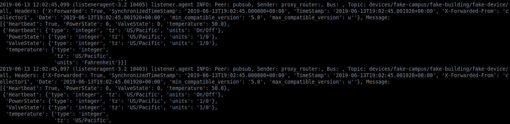

Node-RMQ Instance Setup
-----------------------

.. note::

  This instance must have been bootstrapped using --rabbitmq see :ref:`Building-VOLTTRON#steps-for-rabbitmq`.

Using "vcfg" command, install Volttron Central Platform agent, a master driver agent with fake driver. The instance
name is set to "collector2".

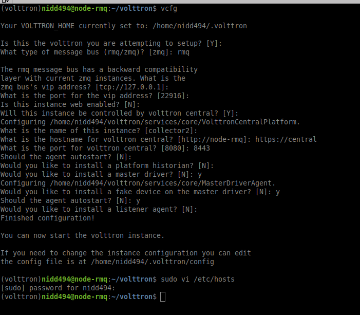

.. note::

 The Volttron Central web-address should point to that of the "central" instance.

Start VOLTTRON instance and check if the agents are installed.

.. code-block:: console

  ./start-volttron
  vctl status

Start Volttron Central Platform on this platform manually.

.. code-block:: console

  vctl start --tag vcp

Go the master admin authentication page and check if there is a new pending CSR request from VCP agent of "collector2"
instance.

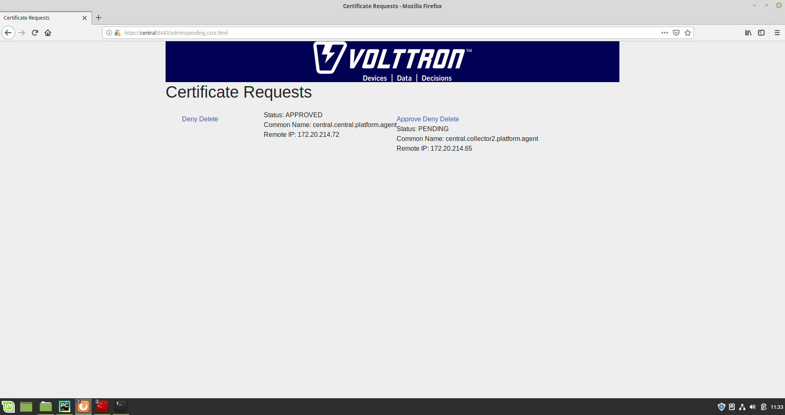

Approve the CSR request to allow authenticated SSL based connection to the "central" instance.

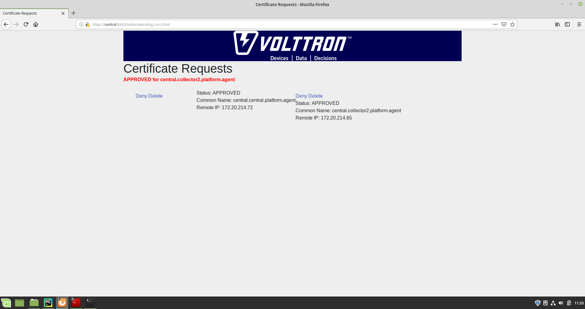

Now go back to the terminal and check the status of Volttron Central Platform agent. It should be set to "GOOD".

Let's now install a forwarder agent on this instance to forward local messages matching "devices" topic to external
"central" instance. Modify the configuration in `services/core/ForwardHistorian/rmq_config.yml` to have a destination
address pointing to web address of the "central" instance.

.. code-block:: yaml

  ---
  destination-address: https://central:8443

Start forwarder agent.

.. code-block:: console

  python scripts/install-agent.py -s services/core/ForwardHistorian -c services/core/ForwardHistorian/rmq_config.yml --start

Go the master admin authentication page and check if there is a new pending CSR request from forwarder agent of "collector2"
instance.

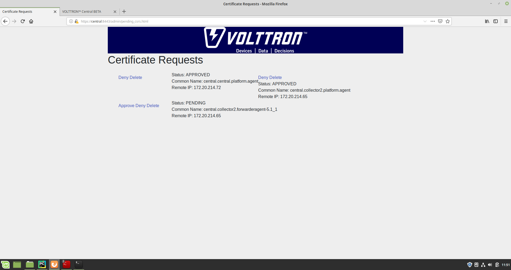

Approve the CSR request to allow authenticated SSL based connection to the "central" instance.

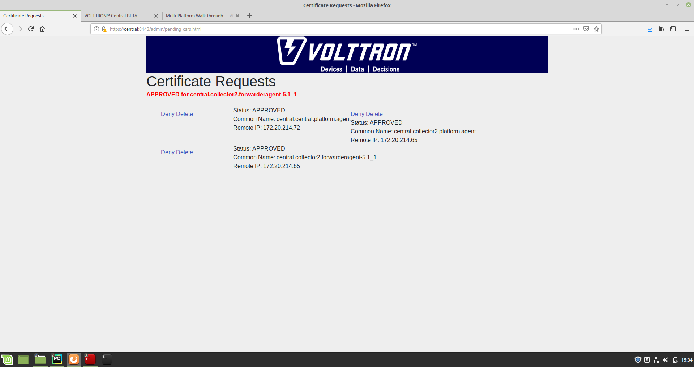

Now go back to the terminal and check the status of forwarder agent. It should be set to "GOOD".

Check the VOLTTRON log of "central" instance. You should see messages with "devices" topic coming from "collector2"
instance.

.. image:: images/vc-collector2-forwarder.png

To confirm that VolttronCentral is monitoring the status of all the 3 platforms, open a browser and type this URL
`https://central:8443/vc/index.html`. Login using credentials (username and password) earlier set during the VC
configuration step (using vcfg command in "central" instance). Click on "platforms" tab in the far right corner. You
should see all three platforms listed in that page. Click on each of the platforms and check the status of the agents.

.. image:: images/vc-platforms.png
