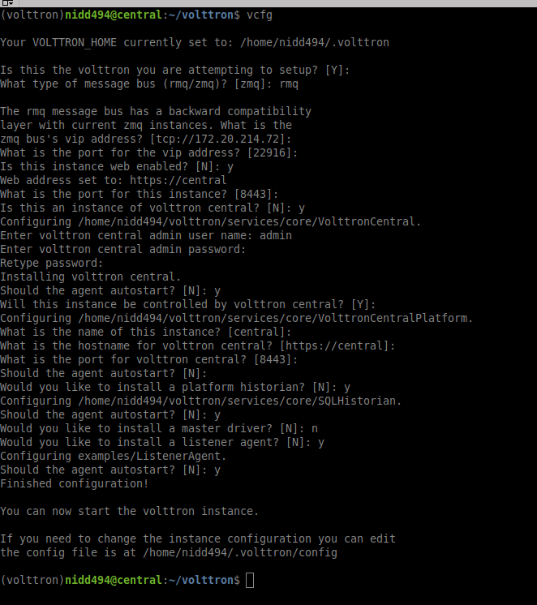
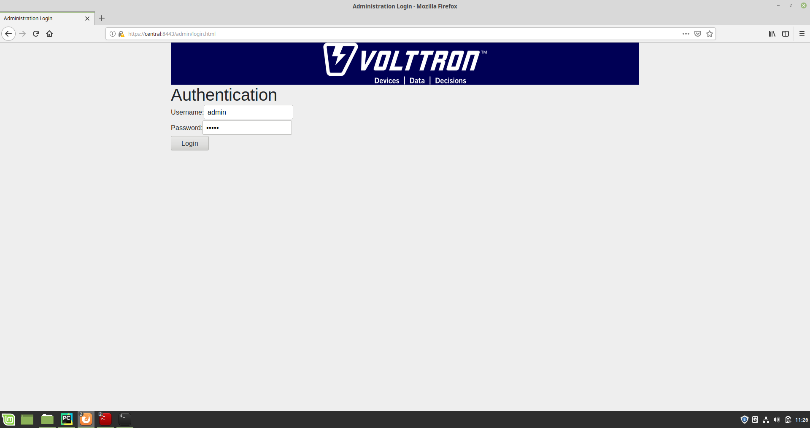

.. _Multi_Platform_Walkthrough:

Multi-Platform Walk-through
====================================

This guide describes the setup process for a multi-platform connection that has a combination of ZeroMQ and RabbitMQ
instances. For this example, we want to use the Forwarder to pass device data from two VOLTTRON instance to
a single "central" instance for storage. It will also have a Volttron Central agent running on the "central"
instance and Volttron Central Platform agents on all 3 instances and connected to "central" instance to provide
operational status of it's instance to the "central" instance. For this document "node" will be used interchangeably
with VOLTTRON instance.

Node Setup
----------

For this example we will have two types of nodes; a data collector and a central node.  Each of the data
collectors will have different message buses (VOLTTRON supports both RabbitMQ and ZeroMQ).  The nodes will
be configured as in the following table.

.. csv-table:: Node Configuration
   :header: "", "Central", "Node-ZMQ", "Node-RMQ"
   :widths: 20, 15, 10, 10

   "Node Type", "Central", "Data Collector", "Data Collector"
   "Master Driver", "", "yes", "yes"
   "Forwarder", "", "yes", "yes"
   "SQL Historian", "yes", "", ""
   "Volttron Central", "yes", "", ""
   "Volttron Central Platform", "yes", "yes", "yes"
   "Exposes RMQ Port", "yes", "", ""
   "Exposes ZMQ Port", "yes", "", ""
   "Exposes HTTPS Port", "yes", "", ""

The goal of this is to be able to see the data from Node-ZMQ and Node-RMQ in the Central SQL Historian and on
the trending charts of Volttron Central.

Virtual Machine Setup
---------------------

The first step in creating a VOLTTRON instance is to make sure the machine is ready for VOLTTRON.  Each machine
should have its hostname setup.  For this walkthrough, the hostnames "central", "node-zmq" and "node-rmq" will be used.

For Central and Node-RMQ follow the instructions :ref:`Building-VOLTTRON#steps-for-rabbitmq`.  For Node-ZMQ use
:ref:`Building-VOLTTRON#steps-for-zmq`.

Instance Setup
--------------

The following conventions/assumptions are made for the rest of this document:

  - Commands should be run from the VOLTTRON root
  - VOLTTRON_HOME will use the default: $HOME/.volttron
  - Default vip port shall be used: 22916
  - HTTPS port shall be 8443
  - Replace central, node-zmq and node-rmq with your own hostnames.
  - RabbitMQ instances will use default ports - 5671 (for SSL), 15671 (for RabbitMQ management interface)

The following will use vcfg (volttron-cfg) to configure the individual platforms.

Central Instance Setup
----------------------

..note::

  This instance must have been bootstrapped using --rabbitmq see :ref:`Building-VOLTTRON#steps-for-rabbitmq`.

Next step would be to configure the instance to have a web interface to accept/deny incoming certificate signing
requests from other instances. Additionally, we will need to install a Volttron Central agent, Volttron Central
Platform agent, SQL historian agent and a Listener agent.

Start VOLTTRON instance and check if the agents are installed.

.. code-block:: console

  ./start-volttron
  vctl status

Open browser and go to master admin authentication page `https://central:8443/index.html` to accept/reject incoming certificate
signing request (CSR) from other platforms. For more background information about the same will be be found in <ref>

..note::

  Replace "central" with the proper hostname of VC instance in the admin page URL.

Click on "Login To Admistration Area".

Set the master admin username and password. This can be later used to login into master admin authentication page.

.. image:: images/csr-set-admin.png

Login into the Master Admin page.

After logging in, you will see no CSR requests initially.

Go back to the terminal and start Volttron Central Platform agent on the "central" instance. The agent will send a CSR
request to the web interface.

.. code-block:: console

  vctl start --tag vcp

Now go to master admin page to check if there is a new pending CSR request. You will see a "PENDING" request from
"central.central.platform.agent"

.. image:: images/csr-request.png

Approve the CSR request to allow authenticated SSL based connection to the "central" instance.

.. image::images/csr-approve.png

Go back to the terminal and check the status of Volttron Central Platform agent. It should be set to "GOOD".

Node-ZMQ Instance Setup
-----------------------
On the "node-zmq" VM, setup a ZeroMQ based VOLTTRON instance. Using "vcfg" command, install Volttron Central Platform agent,
a master driver agent with a fake driver.

..note::

  This instance will use old ZeroMQ based authentication mechanism using CURVE keys.

Please note the Volttron Central web-address should point to that of the "central" instance.

Start VOLTTRON instance and check if the agents are installed.

.. code-block:: console

  ./start-volttron
  vctl status

Start Volttron Central Platform on this platform manually.

.. code-block:: console

  vctl start --tag vcp

Check the VOLTTRON log in the "central" instance, you will see "authentication failure" entry from the incoming
connection. You will need to add the public key of VCP agent on the "central" instance.

.. image:: images/vc-auth-failure.png

On the "node-zmq" box execute this command and grab the public key of the VCP agent.

.. code-block:: console

  vctl auth publickey

Add auth entry corresponding to VCP agent on "central" instance.

.. code-block:: python

  vctl auth add
  domain []:
  address []:
  user_id []: node_zmq_vcp
  capabilities (delimit multiple entries with comma) []:
  roles (delimit multiple entries with comma) []:
  groups (delimit multiple entries with comma) []:
  mechanism [CURVE]:
  credentials []: <publickey>
  comments []:
  enabled [True]:

..note::

  Replace <publickey> with publickey of the forwarder agent.

Go back to the terminal and check the status of Volttron Central Platform agent on the "collector1" instance. It
should be set to "GOOD".

Let's to do similar steps to start a forwarder agent that connects to "central" instance. Modify the configuration in
`services/core/ForwardHistorian/rmq_config.yml` to have a destination VIP address pointing to VIP address of the
"central" instance and server key of the "central" instance.

.. code-block:: yaml

  ---
  destination-vip: tcp://<ip>:22916
  destination-serverkey: <serverkey>

..note::

  Replace <ip> with public facing IP-address of "central" instance and <serverkey> with serverkey of "central"
  instance.

Start forwarder agent.

.. code-block:: console

  python scripts/install-agent.py -s services/core/ForwardHistorian -c services/core/ForwardHistorian/rmq_config.yml --start

Grab the public key of the forwarder agent.

.. code-block:: console

  vctl auth publickey

Add auth entry corresponding to VCP agent on "central" instance.

.. code-block:: console

  vctl auth add
  domain []:
    address []:
    user_id []: node_zmq_forwarder
    capabilities (delimit multiple entries with comma) []:
    roles (delimit multiple entries with comma) []:
    groups (delimit multiple entries with comma) []:
    mechanism [CURVE]:
    credentials []: <publickey>
    comments []:
    enabled [True]:

..note::

  Replace <publickey> with publickey of the forwarder agent.

You should start seeing messages from "collector1" instance on the "central" instance's VOLTTRON log now.

.. image:: images/vc-collector1-forwarder.png

Node-RMQ Instance Setup
-----------------------

..note::

  This instance must have been bootstrapped using --rabbitmq see :ref:`Building-VOLTTRON#steps-for-rabbitmq`.

Using "vcfg" command, install Volttron Central Platform agent, a master driver agent with fake driver. The instance
name is set to "collector2".

.. image:: images/node-rmq-collector2-vcfg.png

..note::

 The Volttron Central web-address should point to that of the "central" instance.

Start VOLTTRON instance and check if the agents are installed.

.. code-block:: console

  ./start-volttron
  vctl status

Start Volttron Central Platform on this platform manually.

.. code-block:: console

  vctl start --tag vcp

Go the master admin authentication page and check if there is a new pending CSR request from VCP agent of "collector2"
instance.

.. image:: images/csr-collector-vcp-request.png

Approve the CSR request to allow authenticated SSL based connection to the "central" instance.

.. image:: images/csr-collector-vcp-approve.png

Now go back to the terminal and check the status of Volttron Central Platform agent. It should be set to "GOOD".

Let's now install a forwarder agent on this instance to forward local messages matching "devices" topic to external
"central" instance. Modify the configuration in `services/core/ForwardHistorian/rmq_config.yml` to have a destination
address pointing to web address of the "central" instance.

.. code-block:: yaml

  ---
  destination-address: https://central:8443

Start forwarder agent.

.. code-block:: console

  python scripts/install-agent.py -s services/core/ForwardHistorian -c services/core/ForwardHistorian/rmq_config.yml --start

Go the master admin authentication page and check if there is a new pending CSR request from forwarder agent of "collector2"
instance.

Approve the CSR request to allow authenticated SSL based connection to the "central" instance.

Now go back to the terminal and check the status of forwarder agent. It should be set to "GOOD".

Check the VOLTTRON log of "central" instance. You should see messages with "devices" topic coming from "collector2"
instance.

.. image:: images/vc-collector2-forwarder.png

To confirm that VolttronCentral is monitoring the status of all the 3 platforms, open a browser and type this URL
`https://central:8443/vc/index.html`. Login using credentials (username and password) earlier set during the VC
configuration step (using vcfg command in "central" instance). Click on "platforms" tab in the far right corner. You
should see all three platforms listed in that page. Click on each of the platforms and check the status of the agents.

.. image:: images/vc-platforms.png
