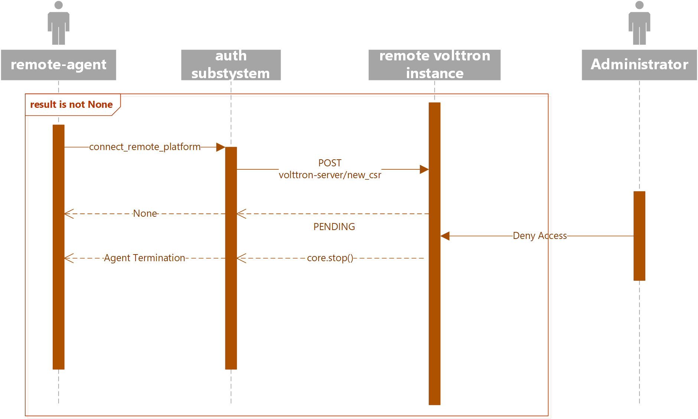

.. _Connecting_to_remote_RMQ:

===============================================
Agent communication to Remote RabbitMQ instance
===============================================

Communication between two RabbitMQ based VOLTTRON instances must be done using SSL certificate based authentication.
None SSL based authentication will not be supported for communication to remote RabbitMQ based VOLTTRON instances.
An volttron instance that wants to communicate with a remote instance should first request a SSL certificate that is
signed by the remote instance. To facilitate this process there will be a web based server api for requesting, listing,
approving and denying certificate requests.  This api will be exposed via the MasterWebService and will be available
to any RabbitMQ based VOLTTRON instance with ssl enabled.  This api will be tested and used in the following agents:

- ForwarderAgent
- DataPuller
- VolttronCentralPlatform

For the following document we will assume we have two instances a volttron-server and a volttron-client.
The volttron-server will be configured to allow certificate requests to be sent to it from the volttron-client.

Configuration
-------------

Both volttron-server and volttron-client must be configured for RabbitMQ message bus with SSL using the step described
at :ref:`Installing Volttron<setup>`.

In addtion the volttron-servers configuration file must have the bind-web-address specified in the
main VOLTTRON instance config file. You can use the vcfg command to configure the bind-web-address or directly add the
entry to an existing config file

.. code-block:: bash

    (volttron)volttron@volttron1:~/git/rmq_volttron$ vcfg

    Your VOLTTRON_HOME currently set to: /home/volttron/.volttron

    Is this the volttron you are attempting to setup?  [Y]: y
    What is the external instance ipv4 address? [tcp://127.0.0.1]:
    What is the instance port for the vip address? [22916]:
    What is type of message bus? [zmq]: rmq
    Is this instance a volttron central? [N]: y
    Configuring /home/volttron/git/rmq_volttron/services/core/VolttronCentral

    In order for external clients to connect to volttron central or the instance
    itself, the instance must bind to a tcp address.  If testing this can be an
    internal address such as 127.0.0.1.

    Please enter the external ipv4 address for this instance?  [http://127.0.0.1]: https://volttron1
    What is the port for volttron central? [8080]: 8443
    Enter volttron central admin user name: admin
    Enter volttron central admin password:
    Retype password:
    Installing volttron central
    Should agent autostart? [N]: n
    Will this instance be controlled by volttron central? [Y]: n
    Would you like to install a platform historian? [N]: n
    Would you like to install a master driver? [N]: n
    Would you like to install a listener agent? [N]: n
    Finished configuration

    You can now start the volttron instance.

    If you need to change the instance configuration you can edit
    the config file at /home/volttron/.volttron/config

Example config file in volttron home

.. code-block::

    [volttron]
    message-bus = rmq
    vip-address = tcp://127.0.0.1:22916
    bind-web-address = https://volttron1:8443
    instance-name = volttron1

.. note::

    - By default the `bind-web-address` parameter will use the `MasterWebService` agent's certificate and
      private key to reference.  Both are necessary in order to bind the port to the socket for
      incoming connections.

    - The `/etc/hosts` file should be modified in order for the dns name to be used for the bound address.

volttron-client
-------------

The `auth` subsystem of the volttron architecture is how a `volttron-client` will connect to the
remote platform.

The following is a snippet from the `ForwarderHistorian` using the new function to connect
to a remote instance.

.. code-block:: python

    ...
    value = self.vip.auth.connect_remote_platform(address)

The above function call will return a agent that connects to the remote instance only after the request is approved
by an adminstrator of the remote instance. It is up to the agent to repeat calling `connect_remote_platform`
periodically until an agent object is obtained.

Approving a CSR Request
~~~~~~~~~~~~~~~~~~~~~~~

The following diagram shows the sequence of events when an access request is approved by the administrator of remote
volttron instance. In this case, the volttron-client agent will get a Agent object that is connected to the
remote instance. The diagram shows the client agent repeating the call to connect_remote_platform until the return value
is not None.

|CSR Approval|

Denying a CSR Request
~~~~~~~~~~~~~~~~~~~~~~~~
The following diagram shows the sequence of events when an access request is denied by the administrator. The client
agent repeats the call to connect_remote_platform until the return value is not None. When the remote instance's
administrator denies a access request, the auth subsystem will raise an alert and shutdown the agent.

|CSR Denied|

.. |CSR Approval| image:: images/csr-sequence-approval.png

