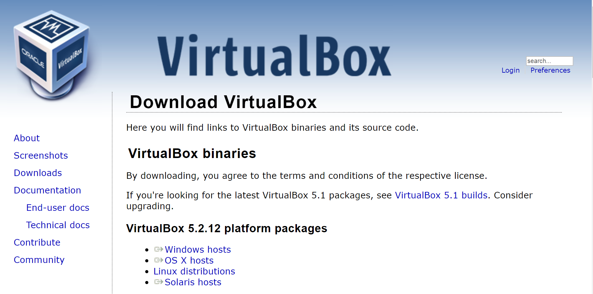
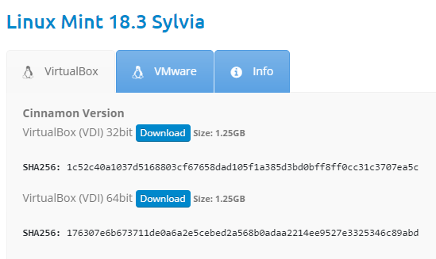
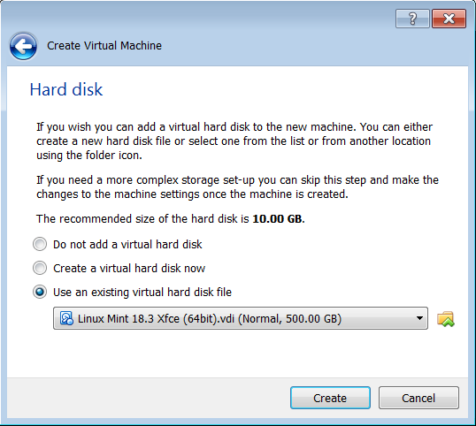
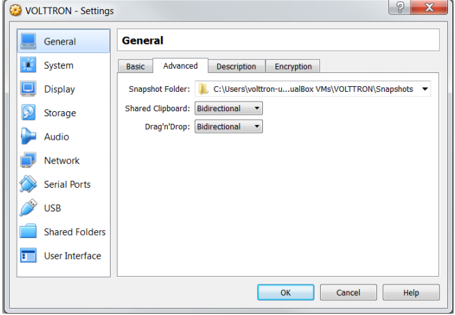

.. _install-vm:

================================
Installing Linux Virtual Machine
================================

VOLTTRON requires a Linux system to run. For Windows users this will require a virtual machine (VM).

Installing Linux Virtual Machine
--------------------------------
This section describes the steps necessary to install
VOLTTRON using Oracle VirtualBox software. Virtual Box is free and can be downloaded from
https://www.virtualbox.org/wiki/Downloads.

|VirtualBox Download|

After installing VirtualBox download a virtual box appliance from https://www.osboxes.org/linux-mint/ extract the
VDI from the downlaoded archive, **or** download a system installation disk. VOLTTRON version 7.0.x has been tested
using Ubuntu 18.04, 18.10; Linux Mint 19; VOLTTRON version 6.0.x has been tested with Ubuntu 16.04, 18.04. However,
any modern apt based Linux distribution should work out of the box. Linux Mint 19.3 with the Xfce desktop is used
as an example, however platform setup in Ubuntu should be identical.

.. note::

    A 32-bit version of Linux should be used when
    running VOLTTRON on a system with limited hardware (less than 2 GB of RAM).

Adding a VDI Image to VirtualBox Environment
--------------------------------------------

|Linux Mint|

The below info holds the VM's preset username and password.

|Linux Mint Credentials|

.. |Linux Mint Credentials| image:: images/vbox-credentials.png

Create a new VirtualBox Image.

|VirtualBox VM Naming|

.. |VirtualBox VM Naming| image:: images/vbox-naming.png

Select the amount of RAM for the VM. The recommended minimum is shown in the image below:

|VirtualBox Memory Size Selection|

.. |VirtualBox Memory Size Selection| image:: images/vbox-memory-size.png

Specify the hard drive image using the extracted VDI file.

|VirtualBox Hard Disk|

With the newly created VM selected, choose Machine from the VirtualBox menu in the top left corner of the VirtualBox
window; from the drop down menu, choose Settings.

To enable bidirectional copy and paste, select the General tab in the VirtualBox Settings. Enable Shared Clipboard and
Drag’n’Drop as Bidirectional.

|VirtualBox Bidirectional|

.. note::
    Currently, this feature only works under certain circumstances (e.g. copying / pasting text).

Go to System Settings. In the processor tab, set the number of processors to two.

|VirtualBox Processors|

.. |VirtualBox Processors| image:: images/vbox-proc-settings.png

Go to Storage Settings. Confirm that the Linux Mint VDI is attached to Controller: SATA.

.. DANGER::
    Do **NOT** mount the Linux Mint iso for Controller: IDE. **Will result in errors.**

|VirtualBox Controller|

.. |VirtualBox Controller| image:: images/vbox-controller.png

Start the machine by saving these changes and clicking the “Start” arrow located on the upper left hand corner of the
main VirtualBox window.

