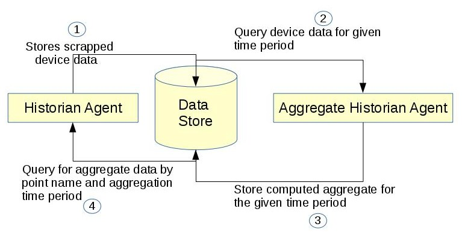

.. _AggregateHistorianSpec:

=======================================
Aggregate Historian Agent Specification
=======================================

Description
===========

An aggregate historian computes aggregates of data stored in a given volttron
historian's data store. It runs periodically to compute aggregate data
and store it in new tables/collections in the historian's data store. Each
regular historian ( `BaseHistorian <../apidocs/volttron/volttron.platform.agent.html#module-volttron.platform.agent.base_historian>`_ )
needs a corresponding aggregate historian to compute and store aggregates of
the data collected by the regular historian.

Software Interfaces
===================

**Data Collection** - Data store that the aggregate historian uses as input source needs to be up. Access to it should be provided using an account that has create, read, and write privileges. For example, a MongoAggregateHistorian needs to be able to connect to the mongodb used by MongoHistorian using an account that has read and write access to the db used by the MongoHistorian.

**Data retrieval**
Aggregate Historian Agent does not provide api for retrieving the aggregate data collected. Use Historian agent's query interface. Historian's query api will be modified as below

1. topic_name can now be a list of topic names or a single topic
2. Two near optional parameters have been added to the query api - agg_type (aggregation type), agg_period (aggregation time period). Both these parameters are mandatory for query aggregate data.
3. New api to get the list of aggregate topics available for querying

User Interfaces
===============

Aggregation agent requires user to configure the following details as part of the agent configuration file

1. Connection details for historian's data store (same as historian agent configuration)
2. List of aggregation groups where each group contains:
    1. Aggregation period - integer followed by m/h/d/w/M (minutes, hours, days, weeks or months)
    2. Boolean parameter to indicate if aggregation periods should align to calendar times
    3. Optional collection start time in utc. If not provided, aggregation collection will start from current time
    4. List of aggregation points with topic name, type of aggregation (sum, avg, etc.), and minimum number of records that should be available for the aggregate to be computed
    5. Topic name can be specified either as a list of specific topic names (topic_names=[topic1, topic2]) or a regular expression pattern (topic_name_pattern="Building1/device_*/Zone*temperature")
    6. When aggregation is done for a single topic then name of topic will be used for the computed aggregation as well. You could optionally provide a unique aggregation_topic_name
    7. When topic_name_pattern or multiple topics are specified a unique aggregate topic name should be specified for the collected aggregate. Users can query for the collected aggregate data using this aggregate topic name.
    8. User should be able to configure multiple aggregations done with the same time period/time interval and these should be time synchronized.

Functional Capabilities
=======================

1. Should run periodically to compute aggregate data.
2. Same instance of the agent should be able to collect data at more than one time interval
3. For each configured time period/interval agent should be able to collect different type of aggregation for different topics/points
4. Support aggregation over multiple topics/points
5. Agent should be able to handle and normalize different time units such as minutes, hours, days, weeks and months
6. Agent should be able to compute aggregate both based on wall clock based time intervals and calendar based time interval. For example, agent should be able to calculate daily average based on 12.00AM to 11.59PM of a calendar day or between current time and the same time the previous day.
7. Data should be stored in such a way that users can easily retrieve multiple aggregate topics data within a given time interval

Data Structure
==============

Collected aggregate data should be stored in the historian data store into new collection or tables and should be accessible by historian agent's query interface. Users should easily be able to query aggregate data of multiple points for which data is time synchronized.

Use Cases
=========

Collect monthly average of multiple topic using data from MongoDBHistorian
--------------------------------------------------------------------------

1. Create a configuration file with connection details from Mongo Historian configuration file and add additional aggregation specific configuration
::

    {
        # configuration from mongo historian - START
        "connection": {
            "type": "mongodb",
            "params": {
                "host": "localhost",
                "port": 27017,
                "database": "mongo_test",
                "user": "test",
                "passwd": "test"
            }
        },
        # configuration from mongo historian - START
        "aggregations":[
            # list of aggregation groups each with unique aggregation_period and
            # list of points that needs to be collected
            {
            "aggregation_period": "1M",
            "use_calendar_time_periods": true,
            "utc_collection_start_time":"2016-03-01T01:15:01.000000",
            "points": [
                {
                 "topic_names": ["Building/device/point1", "Building/device/point2"],
                 "aggregation_topic_name":"building/device/point1_2/month_sum",
                 "aggregation_type": "avg",
                 "min_count": 2
                }
            ]
            }
        ]
    }

In the above example configuration, here is what each field under "aggregations" represent

- **aggregation_period**: can be minutes(m), hours(h), weeks(w), or months(M)
- **use_calendar_time_periods**: true or false - Should aggregation period align to calendar time periods. Default False.  Example,
    - if "aggregation_period":"1h" and "use_calendar_time_periods": false, example periods: 10.15-11.15, 11.15-12.15, 12.15-13.15 etc.
    - if "aggregation_period":"1h" and "use_calendar_time_periods": true, example periods: 10.00-11.00, 11.00-12.00, 12.00-13.00 etc.
    - if "aggregation_period":"1M" and "use_calendar_time_periods": true, aggregation would be computed from the first day of the month to last day of the month
    - if "aggregation_period":"1M" and "use_calendar_time_periods": false, aggregation would be computed with a 30 day interval based on aggregation collection start time

- **utc_collection_start_time**: The time from which aggregation computation should start. If not provided this would default to current time.
- **points**: List of points, its aggregation type and min_count
    **topic_names**: List of topic_names across which aggregation should be computed.
    **aggregation_topic_name**: Unique name given for this aggregate. Optional if aggregation is for a single topic.
    **aggregation_type**: Type of aggregation to be done. Please see `Constraints and Limitations`_

    **min_count**: Optional. Minimum number of records that should exist within the configured time period for a aggregation to be computed.

2. install and starts the aggregate historian using the above configuration

3. Query aggregate data: Query using historian's query api by passing two additional parameters - agg_type and agg_period
::

    result1 = query_agent.vip.rpc.call('platform.historian',
                                       'query',
                                       topic='building/device/point1_2/month_sum',
                                       agg_type='avg',
                                       agg_period='1M',
                                       count=20,
                                       order="FIRST_TO_LAST").get(10)

Collect weekly average(sunday to saturday) of single topic using data from MongoDBHistorian
-------------------------------------------------------------------------------------------

1. Create a configuration file with connection details from Mongo Historian configuration file and add additional aggregation specific configuration. The configuration file should be similar to the first use case except
    - **aggregation_period**: "1w",
    - **topic_names**: ["Building/device/point1"], #topic for which you want to compute aggregation
    - **aggregation_topic_name** need not be provided

2. install and starts the aggregate historian using the above configuration

3. Query aggregate data: Query using historian's query api by passing two additional parameters - agg_type and agg_period. topic_name will be the same as the point name for which aggregation is collected
::

    result1 = query_agent.vip.rpc.call('platform.historian',
                                       'query',
                                       topic='Building/device/point1',
                                       agg_type='avg',
                                       agg_period='1w',
                                       count=20,
                                       order="FIRST_TO_LAST").get(10)

Collect hourly average for multiple topics based on topic_name pattern
----------------------------------------------------------------------

1. Create a configuration file with connection details from Mongo Historian configuration file and add additional aggregation specific configuration. The configuration file should be similar to the first use case except
    - **aggregation_period**: "1h",
    - Insetead of topic_names provide **topic_name_pattern**. For example, **"topic_name_pattern":"Building1/device_a*/point1"**
    - **aggregation_topic_name** provide a unique aggregation topic name
2. install and starts the aggregate historian using the above configuration

3. Query aggregate data: Query using historian's query api by passing two additional parameters - agg_type and agg_period. topic_name will be the same as the point name for which aggregation is collected
::

    result1 = query_agent.vip.rpc.call('platform.historian',
                                       'query',
                                       topic="unique aggregation_topic_name provided in configuration",
                                       agg_type='avg',
                                       agg_period='1h',
                                       count=20,
                                       order="FIRST_TO_LAST").get(10)

Collect 7 day average of two topics and time synchronize them for easy comparison
----------------------------------------------------------------------------------

1. Create a configuration file with connection details from Mongo Historian configuration file and add additional aggregation specific configuration. The configuration file should be similar to the below example
::

    {
        # configuration from mongo historian - START
        "connection": {
            "type": "mongodb",
            "params": {
                "host": "localhost",
                "port": 27017,
                "database": "mongo_test",
                "user": "test",
                "passwd": "test"
            }
        },
        # configuration from mongo historian - START
        "aggregations":[
            # list of aggregation groups each with unique aggregation_period and
            # list of points that needs to be collected
            {
            "aggregation_period": "1w",
            "use_calendar_time_periods": false, #compute for last 7 days, then the next and so on..
            "points": [
                {
                 "topic_names": ["Building/device/point1"],
                 "aggregation_type": "avg",
                 "min_count": 2
                },
                {
                 "topic_names": ["Building/device/point2"],
                 "aggregation_type": "avg",
                 "min_count": 2
                }
            ]
            }
        ]
    }

2. install and starts the aggregate historian using the above configuration

3. Query aggregate data: Query using historian's query api by passing two additional parameters - agg_type and agg_period. provide the list of topic names for which aggregate was configured above. Since both the points were configured within a single "aggregations" array element, their aggregations will be time synchronized
::

    result1 = query_agent.vip.rpc.call('platform.historian',
                                       'query',
                                       topic=['Building/device/point1''Building/device/point2'],
                                       agg_type='avg',
                                       agg_period='1w',
                                       count=20,
                                       order="FIRST_TO_LAST").get(10)

Results will be of the format
::

    {'values': [
       ['Building/device/point1', '2016-09-06T23:31:27.679910+00:00', 2],
       ['Building/device/point1', '2016-09-15T23:31:27.679910+00:00', 3],
       ['Building/device/point2', '2016-09-06T23:31:27.679910+00:00', 2],
       ['Building/device/point2', '2016-09-15T23:31:27.679910+00:00', 3]],
    'metadata': {}}

Qurey list of aggregate data collected
--------------------------------------
::

    result = query_agent.vip.rpc.call('platform.historian',
                                  'get_aggregate_topics').get(10)

The result will be of the format:
::

    [(aggregate topic name, aggregation type, aggregation time period, configured list of topics or topic name pattern), ...]

This shows the list of aggregation currently being computed periodically

Qurey list of supported aggregation types
-----------------------------------------
::

    result = query_agent.vip.rpc.call(
        AGG_AGENT_VIP,
        'get_supported_aggregations').get(timeout=10)

Constraints and Limitations
===========================

1. Initial implementation of this agent will not support any data filtering for raw data before computing data aggregation
2. Initial implementation should support all aggregation types directly supported by underlying data store. End user input is needed to figure out what additional aggregation methods are to be supported

    **MySQL**

    ================ ==============
          Name        Description
    ================ ==============
    AVG()            Return the average value of the argument
    BIT_AND()        Return bitwise AND
    BIT_OR()         Return bitwise OR
    BIT_XOR()        Return bitwise XOR
    COUNT()          Return a count of the number of rows returned
    GROUP_CONCAT()   Return a concatenated string
    MAX()            Return the maximum value
    MIN()            Return the minimum value
    STD()            Return the population standard deviation
    STDDEV()         Return the population standard deviation
    STDDEV_POP()     Return the population standard deviation
    STDDEV_SAMP()    Return the sample standard deviation
    SUM()            Return the sum
    VAR_POP()        Return the population standard variance
    VAR_SAMP()       Return the sample variance
    VARIANCE()       Return the population standard variance
    ================ ==============

    **SQLite**

    ================ ==============
          Name        Description
    ================ ==============
    AVG()            Return the average value of the argument
    COUNT()          Return a count of the number of rows returned
    GROUP_CONCAT()   Return a concatenated string
    MAX()            Return the maximum value
    MIN()            Return the minimum value
    SUM()            Return sum of all non-NULL values in the group. If there are no non-NULL input rows then returns NULL .
    TOTAL()          Return sum of all non-NULL values in the group.If there are no non-NULL input rows returns 0.0
    ================ ==============

    **MongoDB**

    ================ ==============
          Name        Description
    ================ ==============
    SUM              Returns a sum of numerical values. Ignores non-numeric values
    AVG              Returns a average of numerical values. Ignores non-numeric values
    MAX              Returns the highest expression value for each group.
    MIN              Returns the lowest expression value for each group.
    FIRST            Returns a value from the first document for each group. Order is only defined if the documents are in a defined order.
    LAST             Returns a value from the last document for each group. Order is only defined if the documents are in a defined order.
    PUSH             Returns an array of expression values for each group
    ADDTOSET         Returns an array of unique expression values for each group. Order of the array elements is undefined.
    STDDEVPOP        Returns the population standard deviation of the input values
    STDDEVSAMP       Returns the sample standard deviation of the input values
    ================ ==============

