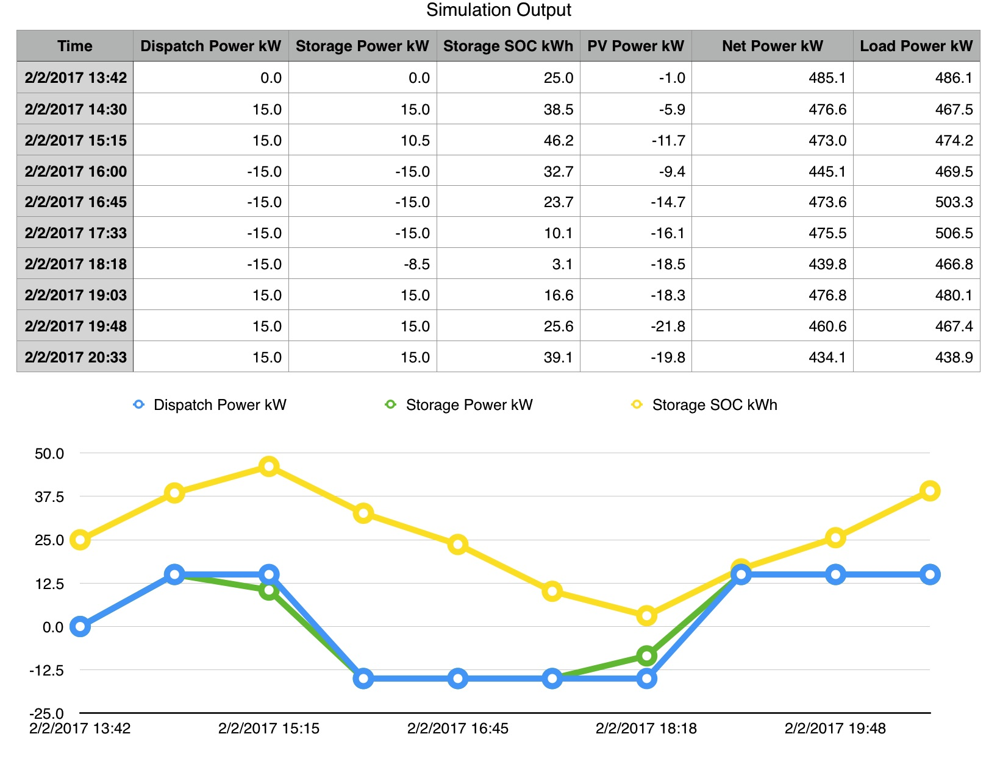

.. _Simulated-Drivers:

Simulation Subsystem
~~~~~~~~~~~~~~~~~~~~

The simulation subsystem includes a set of device simulators and a clock
that can run faster (or slower) than real time. It can be used to test VOLTTRON agents
or drivers. It could be particularly useful when simulating
multi-agent and/or multi-driver scenarios.

The source code for the agents and drivers comprising this subsystem
resides in the https://github.com/VOLTTRON/volttron-applications github repository.

This subsystem is designed to be extended easily. Its initial delivery includes a set of
simulated energy devices that report status primarily in terms of power (kilowatts)
produced and consumed. It could easily be adapted, though, to simulate and report data for
devices that produce, consume and manage resources other than energy.

Three agents work together to run a simulation:

1. **SimulationClockAgent.**  This agent manages the simulation's clock.
   After it has been supplied with a start time, a stop time, and a clock-speed multiplier,
   and it has been asked to start a simulation, it provides the current simulated time
   in response to requests. If no stop time has been provided, the SimulationClockAgent
   continues to manage the simulation clock until the agent is stopped. If no clock-speed
   multiplier has been provided, the simulation clock runs at normal wall-clock speed.
2. **SimulationDriverAgent.**  Like MasterDriverAgent, this agent is a front-end manager for
   device drivers. It handles get_point/set_point requests from other agents, and it
   periodically "scrapes" and publishes each driver's points. If a device driver has been
   built to run under MasterDriverAgent, with a few minor modifications (detailed below)
   it can be adapted to run under SimulationDriverAgent.
3. **SimulationAgent.**  This agent configures, starts, and reports on a simulation.
   It furnishes a variety of configuration parameters to the other simulation agents,
   starts the clock, subscribes to scraped driver points, and generates a CSV output file.

Four device drivers have been provided:

1. **storage (simstorage).**  The storage driver simulates an energy storage device (i.e., a
   battery). When it receives a power dispatch value (positive to charge the battery,
   negative to discharge it), it adjusts its charging behavior accordingly. Its reported
   power doesn't necessarily match the dispatch value, since (like an actual battery)
   it stays within configured max-charge/max-discharge limits, and its power dwindles as its
   state of charge approaches a full or empty state.
2. **pv (simpv).**  The PV driver simulates a photovoltaic array (solar panels), reporting
   the quantity of solar power produced. Solar power is calculated as a function of (simulated)
   time, using a data file of incident-sunlight metrics. A year's worth of solar data has
   been provided as a sample resource.
3. **load (simload).**  The load driver simulates the behavior of a power consumer such
   as a building, reporting the quantity of power consumed. It gets its power metrics as a
   function of (simulated) time from a data file of power readings. A year's worth of
   building-load data has been provided as a sample resource.
4. **meter (simmeter).**  The meter driver simulates the behavior of a circuit's power meter.
   This driver, as delivered, is actually just a shell of a simulated device. It's able to
   report power as a function of (simulated) time, but it has no built-in default logic for
   deciding what particular power metrics to report.

Linux Installation
==================

The following steps describe how to set up and run a simulation. They assume that
``VOLTTRON / volttron`` and ``VOLTTRON / volttron-applications`` repositories have been
downloaded from github, and that Linux shell variables ``$VOLTTRON_ROOT`` and
``$VOLTTRON_APPLICATIONS_ROOT`` point at the root directories of these repositories.

First, create a soft link to the applications directory from the volttron directory,
if that hasn't been done already:
::

    $ cd $VOLTTRON_ROOT
    $ ln -s $VOLTTRON_APPLICATIONS_ROOT applications

With VOLTTRON running, load each simulation driver's configuration into a "simulation.driver" config store:
::

    $ export SIMULATION_DRIVER_ROOT=$VOLTTRON_ROOT/applications/kisensum/Simulation/SimulationDriverAgent

    $ vctl config store simulation.driver simload.csv $SIMULATION_DRIVER_ROOT/simload.csv --csv
    $ vctl config store simulation.driver devices/simload $SIMULATION_DRIVER_ROOT/simload.config

    $ vctl config store simulation.driver simmeter.csv $SIMULATION_DRIVER_ROOT/simmeter.csv --csv
    $ vctl config store simulation.driver devices/simmeter $SIMULATION_DRIVER_ROOT/simmeter.config

    $ vctl config store simulation.driver simpv.csv $SIMULATION_DRIVER_ROOT/simpv.csv --csv
    $ vctl config store simulation.driver devices/simpv $SIMULATION_DRIVER_ROOT/simpv.config

    $ vctl config store simulation.driver simstorage.csv $SIMULATION_DRIVER_ROOT/simstorage.csv --csv
    $ vctl config store simulation.driver devices/simstorage $SIMULATION_DRIVER_ROOT/simstorage.config

Install and start each simulation agent:
::

    $ export SIMULATION_ROOT=$VOLTTRON_ROOT/applications/kisensum/Simulation
    $ export VIP_SOCKET="ipc://$VOLTTRON_HOME/run/vip.socket"

    $ python scripts/install-agent.py \
        --vip-identity simulation.driver \
        --tag          simulation.driver \
        --agent-source $SIMULATION_ROOT/SimulationDriverAgent \
        --config       $SIMULATION_ROOT/SimulationDriverAgent/simulationdriver.config \
        --force \
        --start

    $ python scripts/install-agent.py \
        --vip-identity simulationclock \
        --tag          simulationclock \
        --agent-source $SIMULATION_ROOT/SimulationClockAgent \
        --config       $SIMULATION_ROOT/SimulationClockAgent/simulationclock.config \
        --force \
        --start

    $ python scripts/install-agent.py \
        --vip-identity simulationagent \
        --tag          simulationagent \
        --agent-source $SIMULATION_ROOT/SimulationAgent \
        --config       $SIMULATION_ROOT/SimulationAgent/simulationagent.config \
        --force \
        --start

SimulationAgent Configuration Parameters
========================================

This section describes SimulationAgent's configurable parameters. Each of these has a
default value and behavior, allowing the simulation to be run “out of the box” without
configuring any parameters.

========  ============================  ================  =======================================  ==========================================
Type      Param Name                    Data Type         Default                                  Comments
========  ============================  ================  =======================================  ==========================================
General   agent_id                      str               simulation
General   heartbeat_period              int sec           5
General   sim_driver_list               list of str       [simload, simmeter, simpv, simstorage]   Allowed keywords are simload, simmeter,
                                                                                                   simpv, simstorage.
Clock     sim_start                     datetime str      2017-02-02 13:00:00
Clock     sim_end                       datetime str      None                                     If None, sim doesn't stop.
Clock     sim_speed                     float sec         180.0                                    This is a multiplier, e.g. 1 sec actual
                                                                                                   time = 180 sec sim time.
Load      load_timestamp_column_header  str               local_date
Load      load_power_column_header      str               load_kw
Load      load_data_frequency_min       int min           15
Load      load_data_year                str               2015
Load      load_csv_file_path            str               ~/repos/volttron-applications/kisensum/  ~ and shell variables in the pathname
                                                          Simulation/SimulationAgent/data/load_an  will be expanded. The file must exist.
                                                          d_pv.csv
PV        pv_panel_area                 float m2          50.0
PV        pv_efficiency                 float 0.0-1.0     0.75
PV        pv_data_frequency_min         int min           30
PV        pv_data_year                  str               2015
PV        pv_csv_file_path              str               ~/repos/volttron-applications/kisensum/  ~ and shell variables in the pathname
                                                          Simulation/SimulationAgent/data/nrel_pv  will be expanded. The file must exist.
                                                          _readings.csv
Storage   storage_soc_kwh               float kWh         30.0
Storage   storage_max_soc_kwh           float kWh         50.0
Storage   storage_max_charge_kw         float kW          15.0
Storage   storage_max_discharge_kw      float kW          12.0
Storage   storage_reduced_charge_soc    float 0.0-1.0     0.80                                     Charging will be reduced when SOC % >
          _threshold                                                                               this value.
Storage   storage_reduced_discharge_s   float 0.0-1.0     0.20                                     Discharging will be reduced when SOC %
          oc_threshold                                                                             < this value.
Dispatch  storage_setpoint_rule         str keyword       oscillation                              See below.
Dispatch  positive_dispatch_kw          float kW >= 0.0   15.0
Dispatch  negative_dispatch_kw          float kW <= 0.0   -15.0
Dispatch  go_positive_if_below          float 0.0-1.0     0.1
Dispatch  go_negative_if_above          float 0.0-1.0     0.9
Report    report_interval               int seconds       14
Report    report_file_path              str               $VOLTTRON_HOME/run/simulation_out.csv    ~ and shell variables in the pathname
                                                                                                   will be expanded. If the file exists,
                                                                                                   it will be overwritten.
========  ============================  ================  =======================================  ==========================================

The **oscillation** setpoint rule slowly oscillates between charging and discharging based on
the storage device's state of charge (SOC):
::

    If SOC < (``go_positive_if_below`` * ``storage_max_soc_kwh``):
        dispatch power = ``positive_dispatch_kw``

    If SOC > (``go_negative_if_above`` * ``storage_max_soc_kwh``)
        dispatch power = ``negative_dispatch_kw``

    Otherwise:
        dispatch power is unchanged from its previous value.

The **alternate** setpoint rule is used when ``storage_setpoint_rule`` has been configured with any
value other than **oscillation**. It simply charges at the dispatched charging value (subject to the
constraints of the other parameters, e.g. ``storage_max_discharge_kw``):
::

    dispatch power = ``positive_dispatch_kw``

Driver Parameters and Points
============================

Load Driver
-----------

The load driver's parameters specify how to look up power metrics in its data file.

===========  =======================  =========  ==========  ========================
Type         Name                     Data Type  Default     Comments
===========  =======================  =========  ==========  ========================
Param/Point  csv_file_path            string                 This parameter must be
                                                             supplied by the agent.
Param/Point  timestamp_column_header  string     local_date
Param/Point  power_column_header      string     load_kw
Param/Point  data_frequency_min       int        15
Param/Point  data_year                string     2015
Point        power_kw                 float      0.0
Point        last_timestamp           datetime
===========  =======================  =========  ==========  ========================

Meter Driver
------------

===========  =======================  =========  ==========  ========================
Type         Name                     Data Type  Default     Comments
===========  =======================  =========  ==========  ========================
Point        power_kw                 float      0.0
Point        last_timestamp           datetime
===========  =======================  =========  ==========  ========================

PV Driver
---------

The PV driver's parameters specify how to look up sunlight metrics in its data file,
and how to calculate the power generated from that sunlight.

===========  =======================  =========  ==========  ========================
Type         Name                     Data Type  Default     Comments
===========  =======================  =========  ==========  ========================
Param/Point  csv_file_path            string                 This parameter must be
                                                             supplied by the agent.
Param/Point  max_power_kw             float      10.0
Param/Point  panel_area               float      50.0
Param/Point  efficiency               float      0.75
Param/Point  data_frequency_min       int        30
Param/Point  data_year                string     2015
Point        power_kw                 float      0.0
Point        last_timestamp           datetime
===========  =======================  =========  ==========  ========================

Storage Driver
--------------

The storage driver's parameters describe the device's power and SOC limits, its initial SOC,
and the SOC thresholds at which charging and discharging start to be reduced as its SOC
approaches a full or empty state. This reduced power is calculated as a straight-line
reduction: charging power is reduced in a straight line from ``reduced_charge_soc_threshold`` to
100% SOC, and discharging power is reduced in a straight line from ``reduced_discharge_soc_threshold``
to 0% SOC.

===========  ===============================  =========  =======  =================
Type         Name                             Data Type  Default  Comments
===========  ===============================  =========  =======  =================
Param/Point  max_charge_kw                    float      15.0
Param/Point  max_discharge_kw                 float      15.0
Param/Point  max_soc_kwh                      float      50.0
Param/Point  soc_kwh                          float      25.0
Param/Point  reduced_charge_soc_threshold     float      0.8
Param/Point  reduced_discharge_soc_threshold  float      0.2
Point        dispatch_kw                      float      0.0
Point        power_kw                         float      0.0
Point        last_timestamp                   datetime
===========  ===============================  =========  =======  =================

Working with the Sample Data Files
==================================

The Load and PV simulation drivers report power readings that are based on metrics
from sample data files. The software distribution includes sample Load and PV files
containing at least a year's worth of building-load and sunlight data.

CSV files containing different data sets of load and PV data can be substituted by
specifying their paths in SimulationAgent's configuration, altering its other parameters
if the file structures and/or contents are different.

Load Data File
--------------

``load_and_pv.csv`` contains building-load and PV power readings at 15-minute increments
from 01/01/2014 - 12/31/2015. The data comes from a location in central Texas. The file's
data columns are: ``utc_date, local_date, time_offset, load_kw, pv_kw``.
The load driver looks up the row with a matching local_date and returns its load_kw value.

Adjust the following SimulationAgent configuration parameters to change how load power
is derived from the data file:

-  Use ``load_csv_file_path`` to set the path of the sample data file
-  Use ``load_data_frequency_min`` to set the frequency of the sample data
-  Use ``load_data_year`` to set the year of the sample data
-  Use ``load_timestamp_column_header`` to indicate the header name of the timestamp column
-  Use ``load_power_column_header`` to indicate the header name of the power column

PV Data File
------------

``nrel_pv_readings.csv`` contains irradiance data at 30-minute increments from
01/01/2015 - 12/31/2015, downloaded from NREL's National Solar Radiation Database,
https://nsrdb.nrel.gov. The file's data columns are:
``Year, Month, Day, Hour, Minute, DHI, DNI, Temperature``. The PV driver looks up
the row with a matching date/time and uses its DHI (diffuse horizontal irradiance)
to calculate the resulting solar power produced:
::

    power_kw = irradiance * panel_area * efficiency / elapsed_time_hrs

Adjust the following SimulationAgent configuration parameters to change how solar power
is derived from the data file:

-  Use ``pv_csv_file_path`` to set the path of the sample data file
-  Use ``pv_data_frequency_min`` to set the frequency of the sample data
-  Use ``pv_data_year`` to set the year of the sample data
-  Use ``pv_panel_area`` and ``pv_efficiency`` to indicate how to transform
   an irradiance measurement in wh/m2 into a power reading in kw.

If a PV data file will be used that has a column structure which differs from the
one in the supplied sample, an adjustment may need to be made to the simpv driver software.

Running the Simulation
======================

One way to monitor the simulation's progress is to look at debug trace in VOLTTRON’s log output, for example:
::

    2017-05-01 15:05:42,815 (simulationagent-1.0 9635) simulation.agent DEBUG: 2017-05-01 15:05:42.815484 Initializing drivers
    2017-05-01 15:05:42,815 (simulationagent-1.0 9635) simulation.agent DEBUG: 	Initializing Load: timestamp_column_header=local_date, power_column_header=load_kw, data_frequency_min=15, data_year=2015, csv_file_path=/Users/robcalvert/repos/volttron-applications/kisensum/Simulation/SimulationAgent/data/load_and_pv.csv
    2017-05-01 15:05:42,823 (simulationagent-1.0 9635) simulation.agent DEBUG: 	Initializing PV: panel_area=50, efficiency=0.75, data_frequency_min=30, data_year=2015, csv_file_path=/Users/robcalvert/repos/volttron-applications/kisensum/Simulation/SimulationAgent/data/nrel_pv_readings.csv
    2017-05-01 15:05:42,832 (simulationagent-1.0 9635) simulation.agent DEBUG: 	Initializing Storage: soc_kwh=30.0, max_soc_kwh=50.0, max_charge_kw=15.0, max_discharge_kw=12.0, reduced_charge_soc_threshold = 0.8, reduced_discharge_soc_threshold = 0.2
    2017-05-01 15:05:42,844 (simulationagent-1.0 9635) simulation.agent DEBUG: 2017-05-01 15:05:42.842162 Started clock at sim time 2017-02-02 13:00:00, end at 2017-02-02 16:00:00, speed multiplier = 180.0
    2017-05-01 15:05:57,861 (simulationagent-1.0 9635) simulation.agent DEBUG: 2017-05-01 15:05:57.842164 Reporting at sim time 2017-02-02 13:42:00
    2017-05-01 15:05:57,862 (simulationagent-1.0 9635) simulation.agent DEBUG: 	devices/simload/power_kw = 486.1
    2017-05-01 15:05:57,862 (simulationagent-1.0 9635) simulation.agent DEBUG: 	devices/simpv/power_kw = -0.975
    2017-05-01 15:05:57,862 (simulationagent-1.0 9635) simulation.agent DEBUG: 	devices/simstorage/dispatch_kw = 0.0
    2017-05-01 15:05:57,862 (simulationagent-1.0 9635) simulation.agent DEBUG: 	devices/simstorage/last_timestamp = 2017-02-02 13:33:00
    2017-05-01 15:05:57,862 (simulationagent-1.0 9635) simulation.agent DEBUG: 	devices/simstorage/power_kw = 0.0
    2017-05-01 15:05:57,862 (simulationagent-1.0 9635) simulation.agent DEBUG: 	devices/simstorage/soc_kwh = 30.0
    2017-05-01 15:05:57,862 (simulationagent-1.0 9635) simulation.agent DEBUG: 	net_power_kw = 485.125
    2017-05-01 15:05:57,862 (simulationagent-1.0 9635) simulation.agent DEBUG: 	report_time = 2017-02-02 13:42:00
    2017-05-01 15:05:57,862 (simulationagent-1.0 9635) simulation.agent DEBUG: 		Setting storage dispatch to 15.0 kW
    2017-05-01 15:06:12,901 (simulationagent-1.0 9635) simulation.agent DEBUG: 2017-05-01 15:06:12.869471 Reporting at sim time 2017-02-02 14:30:00
    2017-05-01 15:06:12,901 (simulationagent-1.0 9635) simulation.agent DEBUG: 	devices/simload/power_kw = 467.5
    2017-05-01 15:06:12,901 (simulationagent-1.0 9635) simulation.agent DEBUG: 	devices/simpv/power_kw = -5.925
    2017-05-01 15:06:12,901 (simulationagent-1.0 9635) simulation.agent DEBUG: 	devices/simstorage/dispatch_kw = 15.0
    2017-05-01 15:06:12,901 (simulationagent-1.0 9635) simulation.agent DEBUG: 	devices/simstorage/last_timestamp = 2017-02-02 14:27:00
    2017-05-01 15:06:12,901 (simulationagent-1.0 9635) simulation.agent DEBUG: 	devices/simstorage/power_kw = 15.0
    2017-05-01 15:06:12,901 (simulationagent-1.0 9635) simulation.agent DEBUG: 	devices/simstorage/soc_kwh = 43.5
    2017-05-01 15:06:12,901 (simulationagent-1.0 9635) simulation.agent DEBUG: 	net_power_kw = 476.575
    2017-05-01 15:06:12,901 (simulationagent-1.0 9635) simulation.agent DEBUG: 	report_time = 2017-02-02 14:30:00
    2017-05-01 15:06:12,901 (simulationagent-1.0 9635) simulation.agent DEBUG: 		Setting storage dispatch to 15.0 kW
    2017-05-01 15:06:27,931 (simulationagent-1.0 9635) simulation.agent DEBUG: 2017-05-01 15:06:27.907951 Reporting at sim time 2017-02-02 15:15:00
    2017-05-01 15:06:27,931 (simulationagent-1.0 9635) simulation.agent DEBUG: 	devices/simload/power_kw = 474.2
    2017-05-01 15:06:27,931 (simulationagent-1.0 9635) simulation.agent DEBUG: 	devices/simpv/power_kw = -11.7
    2017-05-01 15:06:27,932 (simulationagent-1.0 9635) simulation.agent DEBUG: 	devices/simstorage/dispatch_kw = 15.0
    2017-05-01 15:06:27,932 (simulationagent-1.0 9635) simulation.agent DEBUG: 	devices/simstorage/last_timestamp = 2017-02-02 15:03:00
    2017-05-01 15:06:27,932 (simulationagent-1.0 9635) simulation.agent DEBUG: 	devices/simstorage/power_kw = 5.362
    2017-05-01 15:06:27,932 (simulationagent-1.0 9635) simulation.agent DEBUG: 	devices/simstorage/soc_kwh = 48.033
    2017-05-01 15:06:27,932 (simulationagent-1.0 9635) simulation.agent DEBUG: 	net_power_kw = 467.862
    2017-05-01 15:06:27,932 (simulationagent-1.0 9635) simulation.agent DEBUG: 	report_time = 2017-02-02 15:15:00
    2017-05-01 15:06:27,932 (simulationagent-1.0 9635) simulation.agent DEBUG: 		Setting storage dispatch to -15.0 kW
    2017-05-01 15:06:42,971 (simulationagent-1.0 9635) simulation.agent DEBUG: 2017-05-01 15:06:42.939181 Reporting at sim time 2017-02-02 16:00:00
    2017-05-01 15:06:42,971 (simulationagent-1.0 9635) simulation.agent DEBUG: 	devices/simload/power_kw = 469.5
    2017-05-01 15:06:42,971 (simulationagent-1.0 9635) simulation.agent DEBUG: 	devices/simpv/power_kw = -9.375
    2017-05-01 15:06:42,971 (simulationagent-1.0 9635) simulation.agent DEBUG: 	devices/simstorage/dispatch_kw = -15.0
    2017-05-01 15:06:42,971 (simulationagent-1.0 9635) simulation.agent DEBUG: 	devices/simstorage/last_timestamp = 2017-02-02 15:57:00
    2017-05-01 15:06:42,971 (simulationagent-1.0 9635) simulation.agent DEBUG: 	devices/simstorage/power_kw = -12.0
    2017-05-01 15:06:42,971 (simulationagent-1.0 9635) simulation.agent DEBUG: 	devices/simstorage/soc_kwh = 37.233
    2017-05-01 15:06:42,971 (simulationagent-1.0 9635) simulation.agent DEBUG: 	net_power_kw = 448.125
    2017-05-01 15:06:42,971 (simulationagent-1.0 9635) simulation.agent DEBUG: 	report_time = 2017-02-02 16:00:00
    2017-05-01 15:06:42,971 (simulationagent-1.0 9635) simulation.agent DEBUG: 		Setting storage dispatch to -15.0 kW
    2017-05-01 15:06:58,001 (simulationagent-1.0 9635) simulation.agent DEBUG: The simulation has ended.

Report Output
-------------

The SimulationAgent also writes a CSV output file so that simulation results can be reported
by spreadsheets, for example this graph of the simulated storage device following an
oscillating dispatch:

Using the Simulation Framework to Test a Driver
===============================================

If you're developing a VOLTTRON driver, and you intend to add it to the drivers
managed by MasterDriverAgent, then with a few tweaks, you can adapt it so that it's testable from
this simulation framework.

As with drivers under MasterDriverAgent, your driver should be go in a .py module that implements
a Register class and an Interface class. In order to work within the simulation framework,
simulation drivers need to be adjusted as follows:

-  Place the module in the interfaces directory under SimulationDriverAgent.
-  The module's Register class should inherit from SimulationRegister.
-  The module's Interface class should inherit from SimulationInterface.
-  If the driver has logic that depends on time, get the simulated time by calling self.sim_time().

Add files with your driver's config and point definitions, and load them into the config store:
::

    $ vctl config store simulation.driver \
        yourdriver.csv \
        $VOLTTRON_ROOT/applications/kisensum/Simulation/SimulationDriverAgent/yourdriver.csv --csv
    $ vctl config store simulation.driver \
        devices/yourdriver \
        $VOLTTRON_ROOT/applications/kisensum/Simulation/SimulationDriverAgent/yourdriver.config

To manage your driver from the SimulationAgent, first add the driver to the sim_driver_list in that
agent's config:
::

    "sim_driver_list": ["simload", "simpv", "simstorage", "youdriver"]

Then, if you choose, you can also revise SimulationAgent's config and logic to scrape and report
your driver's points, and/or send RPC requests to your driver.

For Further Information
=======================

If you have comments or questions about this simulation support,
please contact Rob Calvert at Kisensum, Inc.:

-  (github) @rob-calvert
-  (email) rob@kisensum.com
