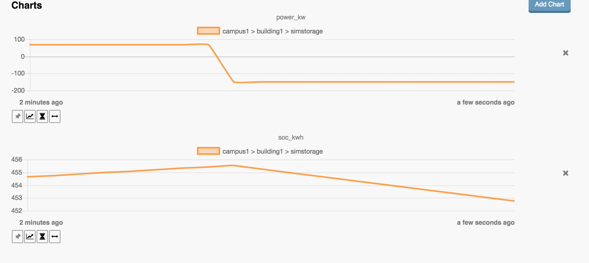
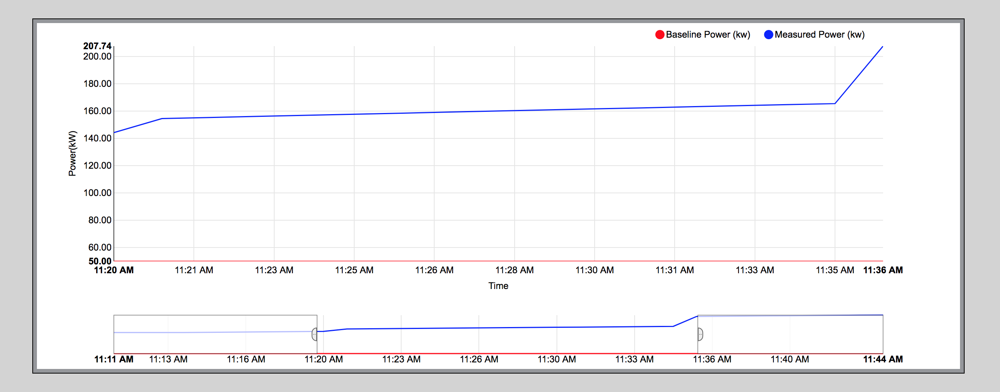
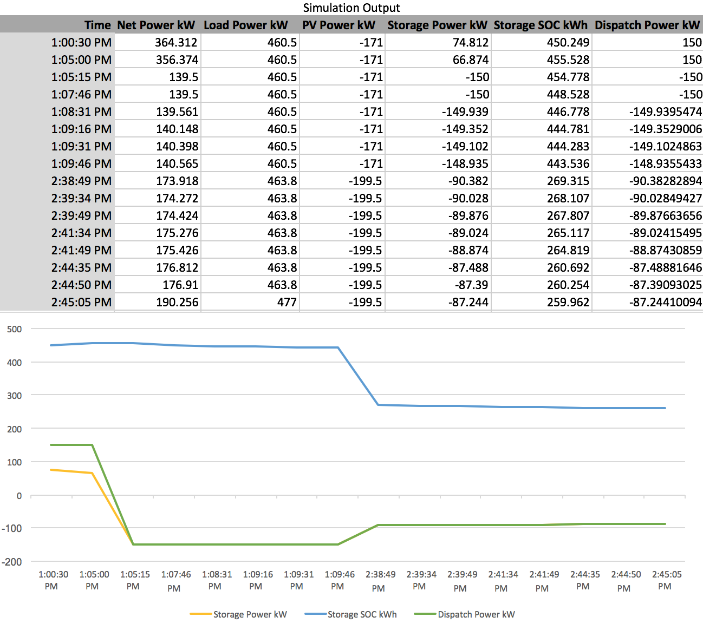

.. _Reference-App:

Reference Application
~~~~~~~~~~~~~~~~~~~~~

This reference application for VOLTTRON's OpenADR Virtual End Node (VEN) and its Simulation
Subsystem demonstrates interactions between the VOLTTRON VEN agent and simulated devices.
It employs a Virtual Top Node (VTN) server, demonstrating the full range of interaction and
communication in a VOLTTRON implementation of the OpenADR (Automated Demand Response) standard.

The simulation subsystem, described in more detail in :ref:`Simulated Subsystem <Simulated-Drivers>`,
includes a set of device simulators and a clock that can run faster (or slower) than
real time (using ReferenceApp's default configuration, the clock runs at normal speed).

Eight VOLTTRON agents work together to run this simulation:

1. **ReferenceAppAgent.** This agent configures, starts, and reports on a simulation.
   It furnishes a variety of configuration parameters to the other simulation agents,
   starts the clock, subscribes to scraped driver points, and generates a CSV output file.
   The ReferenceApp also serves as the mediator between the simulated device drivers and the VEN,
   adjusting driver behavior (particularly the behavior of the "simstorage" battery) while
   an OpenADR event is in progress, and aggregating and relaying relevant driver metrics
   to the VEN for reporting to the VTN.
2. **SimulationClockAgent.** This agent manages the simulation's clock.
   After it has been supplied with a start time, a stop time, and a clock-speed multiplier,
   and it has been asked to start a simulation, it provides the current simulated time
   in response to requests. If no stop time has been provided (this is the default behavior
   while the ReferenceApp is managing the clock), the SimulationClockAgent runs the simulation
   until the agent is stopped. If no clock-speed multiplier has been provided, the simulation
   clock runs at normal wallclock speed.
3. **SimulationDriverAgent.** Like MasterDriverAgent, this agent is a front-end manager for
   device drivers. It handles get_point/set_point requests from other agents, and it
   periodically "scrapes" and publishes each driver's points. If a device driver has been
   built to run under MasterDriverAgent, with a few minor modifications (detailed below)
   it can be adapted to run under SimulationDriverAgent.
4. **ActuatorAgent.** This agent manages write access to device drivers. Another agent
   may request a scheduled time period, called a Task, during which it controls a device.
5. **OpenADRVenAgent.** This agent implements an OpenADR Virtual End Node (VEN). It receives
   demand-response event notifications from a Virtual Top Node (VTN), making the event
   information available to the ReferenceAppAgent and other interested VOLTTRON agents.
   It also reports metrics to the VTN based on information furnished by the ReferenceAppAgent.
6. **SQLHistorian.** This agent, a "platform historian," captures metrics reported by the
   simulated devices, storing them in a SQLite database.
7. **VolttronCentralPlatform.** This agent makes the platform historian's device metrics available
   for reporting by the VolttronCentralAgent.
8. **VolttronCentralAgent.** This agent manages a web user interface that can produce graphical
   displays of the simulated device metrics captured by the SQLHistorian.

Three simulated device drivers are used:

1. **storage (simstorage).**  The storage driver simulates an energy storage device (i.e., a
   battery). When it receives a power dispatch value (positive to charge the battery,
   negative to discharge it), it adjusts the storage unit's charging behavior accordingly. Its reported
   power doesn't necessarily match the dispatch value, since (like an actual battery)
   it stays within configured max-charge/max-discharge limits, and power dwindles as its
   state of charge approaches a full or empty state.
2. **pv (simpv).**  The PV driver simulates a photovoltaic array (solar panels), reporting
   the quantity of solar power produced. Solar power is calculated as a function of (simulated)
   time, using a data file of incident-sunlight metrics. A year's worth of solar data has
   been provided as a sample resource.
3. **load (simload).**  The load driver simulates the behavior of a power consumer such
   as a building, reporting the quantity of power consumed. It gets its power metrics as a
   function of (simulated) time from a data file of power readings. A year's worth of
   building-load data has been provided as a sample resource.

Linux Installation
==================

The following steps describe how to set up and run a simulation. They assume that the
``VOLTTRON / volttron`` and ``VOLTTRON / volttron-applications`` repositories have been
downloaded from github.

Installing and running a simulation is walked through in the Jupyter notebook in
``$VOLTTRON_ROOT/examples/JupyterNotebooks/ReferenceAppAgent.ipynb``.
In order to run this notebook, install Jupyter and start the Jupyter server:
::

    $ cd $VOLTTRON_ROOT
    $ source env/bin/activate
    $ pip install jupyter
    $ jupyter notebook

By default, a browser will open with the Jupyter Notebook dashboard at **\http://localhost:8888**.
Run the notebook by navigating in the Jupyter Notebook dashboard
to **\http://localhost:8888/tree/examples/JupyterNotebooks/ReferenceAppAgent.ipynb**.

ReferenceAppAgent Configuration Parameters
==========================================

This section describes ReferenceAppAgents's configurable parameters. Each of these has a
default value and behavior, allowing the simulation to be run “out of the box” without
configuring any parameters.

========  ============================  ================  =======================================  ==========================================
Type      Param Name                    Data Type         Default                                  Comments
========  ============================  ================  =======================================  ==========================================
General   agent_id                      str               reference_app
General   heartbeat_period              int sec           5
General   sim_driver_list               list of str       [simload, simpv, simstorage]             Allowed keywords are simload, simmeter,
                                                                                                   simpv, simstorage.
General   opt_type                      str               optIn                                    The ReferenceApp will automatically
                                                                                                   "opt in" to each DR events it receives
                                                                                                   from the VEN. Change this to "optOut"
                                                                                                   if the ReferenceApp should opt out of
                                                                                                   events instead.
General   report_interval_secs          int sec           30                                       How often the ReferenceApp will send
                                                                                                   telemetry to the VEN.
General   baseline_power_kw             int kw            500                                      Power consumption (in kw) that will be
                                                                                                   reported to the VTN as the baseline
                                                                                                   power that would have been consumed
                                                                                                   if there were no DR adjustment.
Clock     sim_start                     datetime str      2017-04-30 13:00:00                      Simulated clock time when the simulation
                                                                                                   begins.
Clock     sim_end                       datetime str      None                                     Simulated clock time when the simulation
                                                                                                   stops. If None, the simulation runs
                                                                                                   until the agent is stopped.
Clock     sim_speed                     float sec         1.0                                      Simulation clock speed. This is a
                                                                                                   multiplier. To run a simulation in
                                                                                                   which a minute of simulated time equals
                                                                                                   a second of elapsed time, set this to
                                                                                                   60.0.
Load      load_timestamp_column_header  str               local_date
Load      load_power_column_header      str               load_kw
Load      load_data_frequency_min       int min           15
Load      load_data_year                str               2015
Load      load_csv_file_path            str               ~/repos/volttron-applications/kisensum/  ~ and shell variables in the pathname
                                                          ReferenceAppAgent/data/load_an           will be expanded. The file must exist.
                                                          d_pv.csv
PV        pv_panel_area                 float m2          1000.0
PV        pv_efficiency                 float 0.0-1.0     0.75
PV        pv_data_frequency_min         int min           30
PV        pv_data_year                  str               2015
PV        pv_csv_file_path              str               ~/repos/volttron-applications/kisensum/  ~ and shell variables in the pathname
                                                          ReferenceAppAgent/data/nrel_pv           will be expanded. The file must exist.
                                                          _readings.csv
Storage   storage_soc_kwh               float kWh         450.0
Storage   storage_max_soc_kwh           float kWh         500.0
Storage   storage_max_charge_kw         float kW          150.0
Storage   storage_max_discharge_kw      float kW          150.0
Storage   storage_reduced_charge_soc    float 0.0-1.0     0.80                                     Charging will be reduced when SOC % >
          _threshold                                                                               this value.
Storage   storage_reduced_discharge_s   float 0.0-1.0     0.20                                     Discharging will be reduced when SOC %
          oc_threshold                                                                             < this value.
Dispatch  positive_dispatch_kw          float kW >= 0.0   150.0
Dispatch  negative_dispatch_kw          float kW <= 0.0   -150.0
Dispatch  go_positive_if_below          float 0.0-1.0     0.1
Dispatch  go_negative_if_above          float 0.0-1.0     0.9
Report    report_interval               int seconds       15
Report    report_file_path              str               $VOLTTRON_HOME/run/simulation_out.csv    ~ and shell variables in the pathname
                                                                                                   will be expanded. If the file exists,
                                                                                                   it will be overwritten.
Actuator  actuator_id                   str               simulation.actuator
VEN       venagent_id                   str               venagent
========  ============================  ================  =======================================  ==========================================

Driver Parameters and Points
============================

Load Driver
-----------

The load driver's parameters specify how to look up power metrics in its data file.

===========  =======================  =========  ==========  ========================
Type         Name                     Data Type  Default     Comments
===========  =======================  =========  ==========  ========================
Param/Point  csv_file_path            string                 This parameter must be
                                                             supplied by the agent.
Param/Point  timestamp_column_header  string     local_date
Param/Point  power_column_header      string     load_kw
Param/Point  data_frequency_min       int        15
Param/Point  data_year                string     2015
Point        power_kw                 float      0.0
Point        last_timestamp           datetime
===========  =======================  =========  ==========  ========================

PV Driver
---------

The PV driver's parameters specify how to look up sunlight metrics in its data file,
and how to calculate the power generated from that sunlight.

===========  =======================  =========  ==========  ========================
Type         Name                     Data Type  Default     Comments
===========  =======================  =========  ==========  ========================
Param/Point  csv_file_path            string                 This parameter must be
                                                             supplied by the agent.
Param/Point  max_power_kw             float      10.0
Param/Point  panel_area               float      50.0
Param/Point  efficiency               float      0.75
Param/Point  data_frequency_min       int        30
Param/Point  data_year                string     2015
Point        power_kw                 float      0.0
Point        last_timestamp           datetime
===========  =======================  =========  ==========  ========================

Storage Driver
--------------

The storage driver's parameters describe the device's power and SOC limits, its initial SOC,
and the SOC thresholds at which charging and discharging start to be reduced as its SOC
approaches a full or empty state. This reduced power is calculated as a straight-line
reduction: charging power is reduced in a straight line from ``reduced_charge_soc_threshold`` to
100% SOC, and discharging power is reduced in a straight line from ``reduced_discharge_soc_threshold``
to 0% SOC.

===========  ===============================  =========  =======  =================
Type         Name                             Data Type  Default  Comments
===========  ===============================  =========  =======  =================
Param/Point  max_charge_kw                    float      15.0
Param/Point  max_discharge_kw                 float      15.0
Param/Point  max_soc_kwh                      float      50.0
Param/Point  soc_kwh                          float      25.0
Param/Point  reduced_charge_soc_threshold     float      0.8
Param/Point  reduced_discharge_soc_threshold  float      0.2
Point        dispatch_kw                      float      0.0
Point        power_kw                         float      0.0
Point        last_timestamp                   datetime
===========  ===============================  =========  =======  =================

VEN Configuration
=================

The VEN may be configured according to its documentation :ref:`here <VenAgentConfig>`.

Running the Simulation
======================

There are three main ways to monitor the ReferenceApp simulation's progress.

One way is to look at debug trace in VOLTTRON’s log output, for example:
::

    2018-01-08 17:41:30,333 (referenceappagent-1.0 23842) referenceapp.agent DEBUG: 2018-01-08 17:41:30.333260 Initializing drivers
    2018-01-08 17:41:30,333 (referenceappagent-1.0 23842) referenceapp.agent DEBUG:         Initializing Load: timestamp_column_header=local_date, power_column_header=load_kw, data_frequency_min=15, data_year=2015, csv_file_path=/home/ubuntu/repos/volttron-applications/kisensum/ReferenceAppAgent/data/load_and_pv.csv
    2018-01-08 17:41:30,379 (referenceappagent-1.0 23842) referenceapp.agent DEBUG:         Initializing PV: panel_area=50.0, efficiency=0.75, data_frequency_min=30, data_year=2015, csv_file_path=/home/ubuntu/repos/volttron-applications/kisensum/ReferenceAppAgent/data/nrel_pv_readings.csv
    2018-01-08 17:41:30,423 (referenceappagent-1.0 23842) referenceapp.agent DEBUG:         Initializing Storage: soc_kwh=25.0, max_soc_kwh=50.0, max_charge_kw=15.0, max_discharge_kw=15.0, reduced_charge_soc_threshold = 0.8, reduced_discharge_soc_threshold = 0.2
    2018-01-08 17:41:32,331 (referenceappagent-1.0 23842) referenceapp.agent DEBUG: 2018-01-08 17:41:32.328390 Reporting at sim time 2018-01-08 17:41:31.328388
    2018-01-08 17:41:32,331 (referenceappagent-1.0 23842) referenceapp.agent DEBUG:         net_power_kw = 0
    2018-01-08 17:41:32,331 (referenceappagent-1.0 23842) referenceapp.agent DEBUG:         report_time = 2018-01-08 17:41:31.328388
    2018-01-08 17:41:32,338 (referenceappagent-1.0 23842) referenceapp.agent DEBUG:                 Setting storage dispatch to 15.0 kW
    2018-01-08 17:41:46,577 (referenceappagent-1.0 23842) referenceapp.agent DEBUG: Received event: ID=4, status=far, start=2017-12-01 18:40:55+00:00, end=2017-12-02 18:37:56+00:00, opt_type=none, all params={"status": "far", "signals": "{\"null\": {\"intervals\": {\"0\": {\"duration\": \"PT23H57M1S\", \"uid\": \"0\", \"payloads\": {}}}, \"currentLevel\": null, \"signalID\": null}}", "event_id": "4", "start_time": "2017-12-01 18:40:55+00:00", "creation_time": "2018-01-08 17:41:45.774548", "opt_type": "none", "priority": 1, "end_time": "2017-12-02 18:37:56+00:00"}
    2018-01-08 17:41:46,577 (referenceappagent-1.0 23842) referenceapp.agent DEBUG: Sending an optIn response for event ID 4
    2018-01-08 17:41:46,583 (referenceappagent-1.0 23842) referenceapp.agent DEBUG: 2018-01-08 17:41:46.576130 Reporting at sim time 2018-01-08 17:41:46.328388
    2018-01-08 17:41:46,583 (referenceappagent-1.0 23842) referenceapp.agent DEBUG:         devices/simload/power_kw = 519.3
    2018-01-08 17:41:46,583 (referenceappagent-1.0 23842) referenceapp.agent DEBUG:         devices/simpv/power_kw = -17.175
    2018-01-08 17:41:46,583 (referenceappagent-1.0 23842) referenceapp.agent DEBUG:         devices/simstorage/dispatch_kw = 15.0
    2018-01-08 17:41:46,584 (referenceappagent-1.0 23842) referenceapp.agent DEBUG:         devices/simstorage/power_kw = 15.0
    2018-01-08 17:41:46,584 (referenceappagent-1.0 23842) referenceapp.agent DEBUG:         devices/simstorage/soc_kwh = 25.025
    2018-01-08 17:41:46,584 (referenceappagent-1.0 23842) referenceapp.agent DEBUG:         net_power_kw = 49.755
    2018-01-08 17:41:46,584 (referenceappagent-1.0 23842) referenceapp.agent DEBUG:         report_time = 2018-01-08 17:41:46.328388
    2018-01-08 17:41:46,596 (referenceappagent-1.0 23842) referenceapp.agent DEBUG:                 Setting storage dispatch to 15.0 kW
    2018-01-08 17:41:48,617 (referenceappagent-1.0 23842) referenceapp.agent DEBUG: Received event: ID=4, status=completed, start=2017-12-01 18:40:55+00:00, end=2017-12-02 18:37:56+00:00, opt_type=optIn, all params={"status": "completed", "signals": "{\"null\": {\"intervals\": {\"0\": {\"duration\": \"PT23H57M1S\", \"uid\": \"0\", \"payloads\": {}}}, \"currentLevel\": null, \"signalID\": null}}", "event_id": "4", "start_time": "2017-12-01 18:40:55+00:00", "creation_time": "2018-01-08 17:41:45.774548", "opt_type": "optIn", "priority": 1, "end_time": "2017-12-02 18:37:56+00:00"}
    2018-01-08 17:42:59,563 (referenceappagent-1.0 23842) referenceapp.agent DEBUG: 2018-01-08 17:42:59.559264 Reporting at sim time 2018-01-08 17:42:59.328388
    2018-01-08 17:42:59,563 (referenceappagent-1.0 23842) referenceapp.agent DEBUG:         devices/simload/power_kw = 519.3
    2018-01-08 17:42:59,563 (referenceappagent-1.0 23842) referenceapp.agent DEBUG:         devices/simpv/power_kw = -17.175
    2018-01-08 17:42:59,563 (referenceappagent-1.0 23842) referenceapp.agent DEBUG:         devices/simstorage/dispatch_kw = 15.0
    2018-01-08 17:42:59,563 (referenceappagent-1.0 23842) referenceapp.agent DEBUG:         devices/simstorage/power_kw = 15.0
    2018-01-08 17:42:59,563 (referenceappagent-1.0 23842) referenceapp.agent DEBUG:         devices/simstorage/soc_kwh = 25.238
    2018-01-08 17:42:59,563 (referenceappagent-1.0 23842) referenceapp.agent DEBUG:         net_power_kw = 49.755
    2018-01-08 17:42:59,563 (referenceappagent-1.0 23842) referenceapp.agent DEBUG:         report_time = 2018-01-08 17:42:59.328388
    2018-01-08 17:42:59,578 (referenceappagent-1.0 23842) referenceapp.agent DEBUG:                 Setting storage dispatch to -1.05158333333 kW
    2018-01-08 17:43:01,596 (referenceappagent-1.0 23842) referenceapp.agent DEBUG: 2018-01-08 17:43:01.589877 Reporting at sim time 2018-01-08 17:43:01.328388
    2018-01-08 17:43:01,596 (referenceappagent-1.0 23842) referenceapp.agent DEBUG:         devices/simload/power_kw = 519.3
    2018-01-08 17:43:01,596 (referenceappagent-1.0 23842) referenceapp.agent DEBUG:         devices/simpv/power_kw = -17.175
    2018-01-08 17:43:01,597 (referenceappagent-1.0 23842) referenceapp.agent DEBUG:         devices/simstorage/dispatch_kw = -1.05158333333
    2018-01-08 17:43:01,597 (referenceappagent-1.0 23842) referenceapp.agent DEBUG:         devices/simstorage/power_kw = -1.051
    2018-01-08 17:43:01,597 (referenceappagent-1.0 23842) referenceapp.agent DEBUG:         devices/simstorage/soc_kwh = 25.236
    2018-01-08 17:43:01,597 (referenceappagent-1.0 23842) referenceapp.agent DEBUG:         net_power_kw = 33.704
    2018-01-08 17:43:01,597 (referenceappagent-1.0 23842) referenceapp.agent DEBUG:         report_time = 2018-01-08 17:43:01.328388
    2018-01-08 17:43:01,598 (referenceappagent-1.0 23842) referenceapp.agent DEBUG: Reporting telemetry: {'start_time': '2018-01-08 17:42:31.598889+00:00', 'baseline_power_kw': '50', 'current_power_kw': '33.704', 'end_time': '2018-01-08 17:43:01.598889+00:00'}
    2018-01-08 17:43:01,611 (referenceappagent-1.0 23842) referenceapp.agent DEBUG:                 Setting storage dispatch to -1.0515 kW

Another way to monitor progress is to launch the VolttronCentral web UI, which can be found
at **\http://127.0.0.1:8080/vc/index.html**.
Here, in addition to checking agent status, one can track metrics reported by the simulated device drivers.
For example, these graphs track the simstorage battery's power consumption and state of charge over time. The abrupt
shift from charging to discharging happens because an OpenADR event has just started:

A third way to monitor progress, while there is an active DR event,
is to examine the event's graph in the VTN web UI. This displays the VEN's power consumption,
which is an aggregate of the consumption reported by each simulated device driver:

Report Output
-------------

The ReferenceAppAgent also writes a CSV output file so that simulation results can be reported
in a spreadsheet, for example this graph of the simulated storage device:

For Further Information
=======================

If you have comments or questions about this simulation support,
please contact Rob Calvert or Nate Hill at Kisensum, Inc.:

-  (github) @rob-calvert
-  (email) rob@kisensum.com
-  (github) @hillrnate
-  (github) nate@kisensum.com
