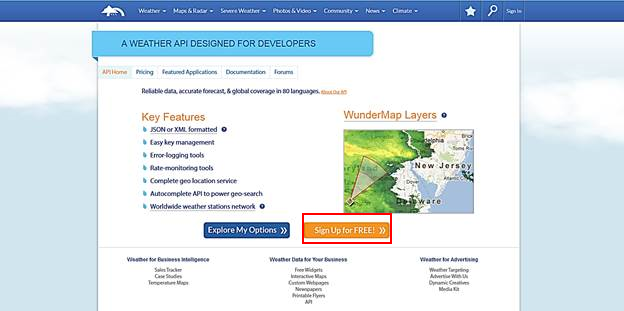
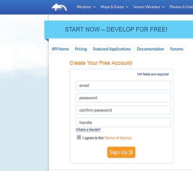
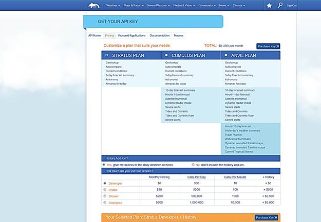
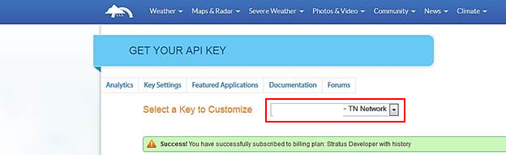
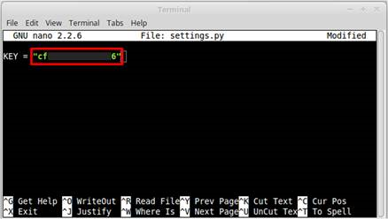
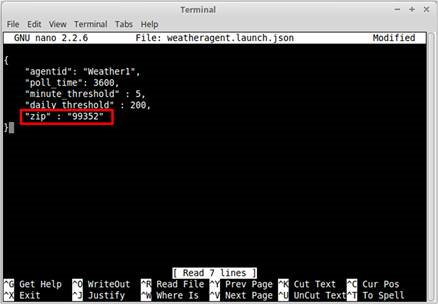
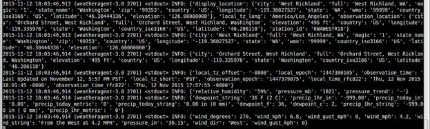

.. _WeatherAgentInstallation:

Weather Agent Installation
==========================

Configuring and Launching the Weather Agent
---------------------------------------------

The Weather agent, another VOLTTRON service agent, retrieves weather information from the Weather Underground site and
shares it with agents running on the platform. The first step to launching the Weather agent is to obtain a developer
key from Weather Underground.

Obtaining a Developer Key from Weather Underground
~~~~~~~~~~~~~~~~~~~~~~~~~~~~~~~~~~~~~~~~~~~~~~~~~~~~

Follow these steps to create a Weather Underground account and obtain a developer key.

- Go to Weather Underground site (Figure 1) the following URL http://www.wunderground.com/weather/api/
- Select, Sign Up for FREE

Figure 1: Weather Underground Website

- The window should now look similar to Figure 2. Enter your information to create an account.

Figure 2: Setting up a developer account

- Select a plan that meets your needs. Login to with your username and password and click on
“Explore my options button.” For most applications, the free plan will be adequate.
The window should appear similar to Figure 3:

Figure 3: Creating a Weather Underground API key

- You now have access to your Weather Underground API key. An example API key is shown in the red box of Figure 4:

Figure 4: Weather Underground API key

Configuring Weather Agent with API Key and Location
~~~~~~~~~~~~~~~~~~~~~~~~~~~~~~~~~~~~~~~~~~~~~~~~~~~~~

The following steps will show how to configure the Weather agent with the developer key from Weather Underground
and how to enter a zip code to get weather data from that zip code.
Edit (<project directory>/services/core/WeatherAgent/weather/settings.py) with your Weather Underground key.
From the base VOLTTRON directory, enter the following terminal commands:

- Open settings.py at with a text editor or nano:

.. code-block:: bash

    $ nano services/core/weather/settings.py

- Enter a Weather Underground Developer key, as shown in Figure 5:

Figure 5: Entering the Weather Underground Developer Key

- Open the Weather agent’s configuration file and edit the “zip” field, as shown in Figure 6:
.. code-block:: bash

    $ nano WeatherAgent/weatheragent.config

Figure 6: Entering Zip Code for Location

Launching the Weather Agent
~~~~~~~~~~~~~~~~~~~~~~~~~~~~~

Create a script modeled on scripts/core/make-listener called make-weather:

.. code-block:: bash

    export SOURCE=services/core/WeatherAgent
    export CONFIG=config/weatheragent.config
    export TAG=weather
    ./scripts/core/make-agent.sh

    # To set the agent to autostart with the platform, pass "enable"
    # to make-agent.sh: ./scripts/core/make-agent.sh enable

Then:

.. code-block:: bash

    chmod +x make-weather

Now you can run ./make-weather to stop, remove, build, and reinstall in one script. To start the agent, run:
vctl start –tag weather

Figure 7: Example Output from the Weather Agent

